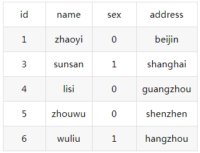
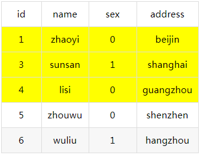

# MySQL共享锁、排他锁、悲观锁、乐观锁

**一、相关名词** 　　|--表级锁（锁定整个表）

|--页级锁（锁定一页）

|--行级锁（锁定一行）

|--共享锁（S锁，MyISAM 叫做读锁）

|--排他锁（X锁，MyISAM 叫做写锁）

|--间隙锁（NEXT-KEY锁）

|--悲观锁（抽象性，不真实存在这个锁）

|--乐观锁（抽象性，不真实存在这个锁） **二、InnoDB与MyISAM** 　　Mysql 在5.5之前默认使用 MyISAM 存储引擎，之后使用 InnoDB 。查看当前存储引擎：

```plaintext
show variables like '%storage_engine%';
```

MyISAM 操作数据都是使用的表锁，你更新一条记录就要锁整个表，导致性能较低，并发不高。当然同时它也不会存在死锁问题。

而 InnoDB 与 MyISAM 的最大不同有两点： **一是 InnoDB 支持事务；二是 InnoDB 采用了行级锁** 。也就是你需要修改哪行，就可以只锁定哪行。

在 Mysql 中，行级锁并不是直接锁记录，而是锁索引。索引分为主键索引和非主键索引两种，如果一条sql 语句操作了主键索引，Mysql 就会锁定这条主键索引；如果一条语句操作了非主键索引，MySQL会先锁定该非主键索引，再锁定相关的主键索引。

InnoDB 行锁是通过给索引项加锁实现的，如果没有索引，InnoDB 会通过隐藏的聚簇索引来对记录加锁。也就是说：如果不通过索引条件检索数据，那么InnoDB将对表中所有数据加锁，实际效果跟表锁一样。因为没有了索引，找到某一条记录就得扫描全表，要扫描全表，就得锁定表。 **三、共享锁与排他锁** 　1.首先说明：数据库的 **增删改** 操作默认都会加 **排他锁** ，而查询不会加任何锁。

mysql InnoDB引擎默认的修改数据语句， **update** , **delete** , **insert** 都会自动给涉及到的数据加上 **排他锁** ， **select** 语句默认不会加任何锁类型，如果加排他锁可以使用select ...for update语句，加共享锁可以使用select ... lock in share mode语句。所以加过排他锁的数据行在其他事务种是不能修改数据的，也不能通过for update和lock in share mode锁的方式查询数据，但可以直接通过select ...from...查询数据，因为普通查询没有任何锁机制。

**|--共享锁** ：对某一资源加共享锁，自身可以读该资源，其他人也可以读该资源（也可以再继续加共享锁，即 共享锁可多个共存），但无法修改。要想修改就必须等所有共享锁都释放完之后。语法为：

```sql
select * from table lock in share mode
```

**|--排他锁** ：对某一资源加排他锁，自身可以进行增删改查，其他人无法进行任何操作。语法为：

```sql
select * from table for update
```

2.下面援引例子说明 （援自：[http://blog.csdn.net/samjustin1/article/details/52210125](http://blog.csdn.net/samjustin1/article/details/52210125)）：

_这里用T1代表一个数据库执行请求，T2代表另一个请求，也可以理解为T1为一个线程，T2 为另一个线程。_

______________________________________________________________________

例1：

T1: _select * from table lock in share mode_（假设查询会花很长时间，下面的例子也都这么假设）

T2: _update table set column1='hello'_

过程：

T1运行（并加共享锁)

T2运行

if T1还没执行完

T2等......

else 锁被释放

T2执行

end if

T2 之所以要等，是因为 T2 在执行 update 前，试图对 table 表加一个排他锁，而数据库规定同一资源上不能同时共存共享锁和排他锁。所以 T2 必须等 T1 执行完，释放了共享锁，才能加上排他锁，然后才能开始执行 update 语句。

______________________________________________________________________

例2：

T1: select * from table lock in share mode

T2: select * from table lock in share mode

这里T2不用等待T1执行完，而是可以马上执行。

分析：

T1运行，则 table 被加锁，比如叫lockA，T2运行，再对 table 加一个共享锁，比如叫lockB，两个锁是可以同时存在于同一资源上的（比如同一个表上）。这被称为共享锁与共享锁兼容。这意味着共享锁不阻止其它人同时读资源，但阻止其它人修改资源。

______________________________________________________________________

例3：

T1: _select * from table lock in share mode_

T2: _select * from table lock in share mode_

T3: _update table set column1='hello'_

T2 不用等 T1 运行完就能运行，T3 却要等 T1 和 T2 都运行完才能运行。因为 T3 必须等 T1 和 T2 的共享锁全部释放才能进行加排他锁然后执行 update 操作。

______________________________________________________________________

例4 （死锁的发生）：

T1:begin tran

```sql
 　　select * from table lock in share mode
 　　update table set column1='hello'
```

T2:begin tran

```sql
 　　select * from table lock in share mode
 　　update table set column1='world'
```

假设 T1 和 T2 同时达到 select，T1 对 table 加共享锁，T2 也对 table 加共享锁，当 T1 的 select 执行完，准备执行 update 时，根据锁机制，T1 的共享锁需要升级到排他锁才能执行接下来的 update。在升级排他锁前，必须等 table 上的其它共享锁（T2）释放，同理，T2 也在等 T1 的共享锁释放。于是死锁产生了。

______________________________________________________________________

例5：

T1:_begin tran_

```sql
 　　*update table set column1='hello' where id=10*
```

T2:_begin tran_

```sql
 　　*update table set column1='world' where id=20*
```

这种语句虽然最为常见，很多人觉得它有机会产生死锁，但实际上要看情况

|--如果id是主键（默认有主键索引），那么T1会一下子找到该条记录(id=10的记录），然后对该条记录加排他锁，T2，同样，一下子通过索引定位到记录，然后对id=20的记录加排他锁，这样T1和T2各更新各的，互不影响。T2也不需要等。

|--如果id是普通的一列，没有索引。那么当T1对id=10这一行加排他锁后，T2为了找到id=20，需要对全表扫描。但因为T1已经为一条记录加了排他锁，导致T2的全表扫描进行不下去（其实是因为T1加了排他锁，数据库默认会为该表加意向锁，T2要扫描全表，就得等该意向锁释放，也就是T1执行完成），就导致T2等待。

死锁怎么解决呢？一种办法是，如下：

______________________________________________________________________

例6：

T1:begin tran

```sql
 　　select * from table for update
 　　update table set column1='hello'
```

T2:begin tran

```sql
 　　select * from table for update
 　　update table set column1='world'
```

这样，当 T1 的 select 执行时，直接对表加上了排他锁，T2 在执行 select 时，就需要等 T1 事物完全执行完才能执行。排除了死锁发生。但当第三个 user 过来想执行一个查询语句时，也因为排他锁的存在而不得不等待，第四个、第五个 user 也会因此而等待。在大并发情况下，让大家等待显得性能就太友好了。

所以，有些数据库这里引入了更新锁（如Mssql，注意：Mysql不存在更新锁）。

______________________________________________________________________

例7：

T1:begin tran

```sql
 select * from table [加更新锁操作]
 update table set column1='hello'
```

T2:begin tran

```sql
 select * from table [加更新锁操作]
 update table set column1='world'
```

更新锁其实就可以看成排他锁的一种变形，只是它也允许其他人读（并且还允许加共享锁）。但不允许其他操作，除非我释放了更新锁。T1 执行 select，加更新锁。T2 运行，准备加更新锁，但发现已经有一个更新锁在那儿了，只好等。当后来有 user3、user4...需要查询 table 表中的数据时，并不会因为 T1 的 select 在执行就被阻塞，照样能查询，相比起例6，这提高了效率。

后面还有意向锁和计划锁：

计划锁，和程序员关系不大，就没去了解。 　　意向锁（innodb特有）分意向共享锁和意向排他锁。 　　意向共享锁：表示事务获取行共享锁时，必须先得获取该表的意向共享锁； 　　意向排他锁：表示事务获取行排他锁时，必须先得获取该表的意向排他锁； 　我们知道，如果要对整个表加锁，需保证该表内目前不存在任何锁。

因此，如果需要对整个表加锁，那么就可以根据：检查意向锁是否被占用，来知道表内目前是否存在共享锁或排他锁了。而不需要再一行行地去检查每一行是否被加锁。

**四、乐观锁与悲观锁**

首先说明，乐观锁和悲观锁都是针对读（select）来说的。

案例：

某商品，用户购买后库存数应-1，而某两个或多个用户同时购买，此时三个执行程序均同时读得库存为“n”，之后进行了一些操作，最后将均执行update table set 库存数=n-1，那么，很显然这是错误的。

解决：

使用悲观锁（其实说白了也就是排他锁）

|-- 程序A在查询库存数时使用排他锁（select * from table where id=10 for update）

|-- 然后进行后续的操作，包括更新库存数，最后提交事务。

|-- 程序B在查询库存数时，如果A还未释放排他锁，它将等待……

|-- 程序C同B…… 　使用乐观锁（靠表设计和代码来实现）

|-- 一般是在该商品表添加version版本字段或者timestamp时间戳字段

|-- 程序A查询后，执行更新变成了： 　　 update table set num=num-1 where id=10 and version=23

这样，保证了修改的数据是和它查询出来的数据是一致的（其他执行程序肯定未进行修改）。当然，如果更新失败，表示在更新操作之前，有其他执行程序已经更新了该库存数，那么就可以尝试重试来保证更新成功。为了尽可能避免更新失败，可以合理调整重试次数（阿里巴巴开发手册规定重试次数不低于三次）。 总结：对于以上，可以看得出来乐观锁和悲观锁的区别：

悲观锁实际使用了排他锁来实现（select **** for update）。文章开头说到，innodb加行锁的前提是：必须是通过索引条件来检索数据，否则会切换为表锁。

因此，悲观锁在未通过索引条件检索数据时，会锁定整张表。导致其他程序不允许“加锁的查询操作”，影响吞吐。故如果在查询居多的情况下，推荐使用乐观锁。

“加锁的查询操作”：加过排他锁的数据行在其他事务中是不能修改的，也不能通过for update或lock in share mode的加锁方式查询，但可以直接通过select ...from...查询数据，因为普通查询没有任何锁机制。 　　乐观锁更新有可能会失败，甚至是更新几次都失败，这是有风险的。所以如果写入居多，对吞吐要求不高，可使用悲观锁。 　　　也就是一句话： **读用乐观锁，写用悲观锁** 。

**间隙锁** 　1.什么叫间隙锁 　　当我们用范围条件而不是相等条件检索数据，并请求共享或排他锁时，InnoDB会给符合条件的已有数据记录的索引项加锁；对于键值在条件范围内但不存在的记录，叫做“间隙(GAP)”，InnoDB也会对这个“间隙”加锁，这种锁机制就是所谓的间隙锁(NEXT-KEY)锁。

2.间隙锁的产生 　　上面的文字很抽象，现在举个栗子，介绍间隙锁是怎么产生的：

假设有以下表t_student：（其中id为PK，name为非唯一索引） 

这个时候我们发出一条这样的加锁sql语句：

select id,name from t_student where id > 0 and id \< 5 for update;

这时候，我们命中的数据为以下着色部分：



细心的朋友可能就会发现，这里缺少了条id为2的记录，我们的重点就在这里。

select ... for update这条语句，是会对数据记录加锁的，这里因为命中了索引，加的是行锁。从数据记录来看，这里排它锁锁住数据是id为1、3和4的这3条数据。

但是，看看前面我们的介绍——对于键值在条件范围内但不存在的记录，叫做“间隙(GAP)”，InnoDB也会对这个“间隙”加锁。

好了，我们这里，键值在条件范围但是不存在的记录，就是id为2的记录，这里会对id为2数据加上间隙锁。假设这时候如果有id=2的记录insert进来了，是要等到这个事务结束以后才会执行的

3.间隙锁的作用 　　　总的来说，有2个作用：防止幻读和防止数据误删/改

**(1)防止幻读** 　　　　关于幻读的概念可以参考这篇文章 <https://blog.csdn.net/mweibiao/article/details/80805031> ，这里就不多做解释了

假设有下面场景 

如果没有间隙锁，事务A在T1和T4读到的结果是不一样的，有了间隙锁，读的就是一样的了

**(2)防止数据误删/改** -----------------

这个作用比较重要，假设以下场景：


这种情况下，如果没有间隙锁，会出现的问题是：id为2的记录，刚加进去，就被删除了，这种情况有时候对业务，是致命性的打击。加了间隙锁之后，由于insert语句要等待事务A执行完之后释放锁，避免了这种情况

4.使用间隙锁的隐患 　最大的隐患就是性能问题

前面提到，假设这时候如果有id=2的记录insert进来了，是要等到这个事务结束以后才会执行的，假设是这种场景 

这种情况，对插入的性能就有很大影响了，必须等到事务结束才能进行插入，性能大打折扣

更有甚者，如果间隙锁出现死锁的情况下，会更隐晦，更难定位 **怎样避免死锁**

1、以固定的顺序访问表和行。比如两个更新数据的事务，事务A 更新数据的顺序 为1，2；事务B更新数据的顺序为2，1。这样更可能会造成死锁。

2、大事务拆小。大事务更倾向于死锁，如果业务允许，将大事务拆小。

3、在同一个事务中，尽可能做到一次锁定所需要的所有资源，减少死锁概率。

4、降低隔离级别。如果业务允许，将隔离级别调低也是较好的选择，比如将隔离级别从RR调整为RC，可以避免掉很多因为gap锁造成的死锁。

5、为表添加合理的索引。可以看到如果不走索引将会为表的每一行记录添加上锁，死锁的概率大大增大。
