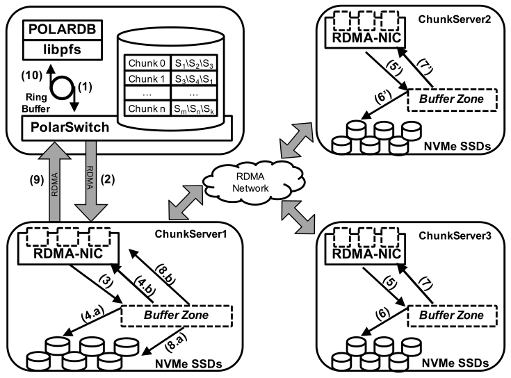
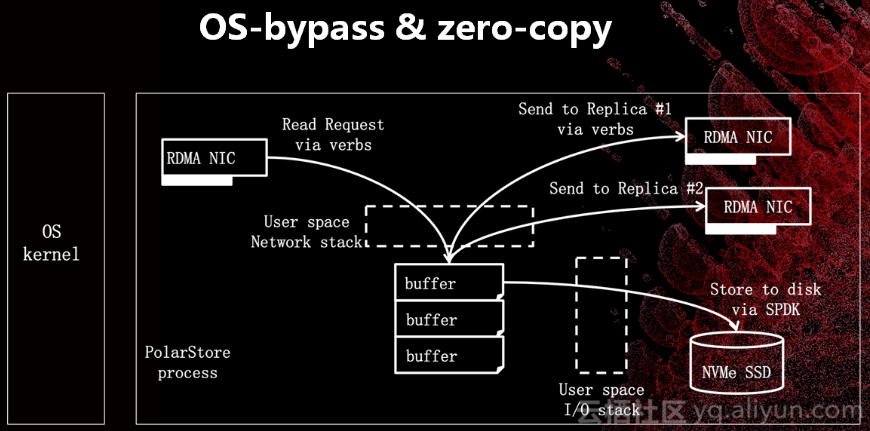
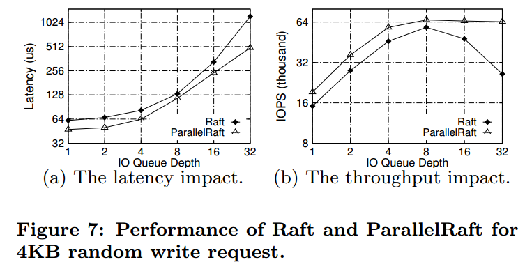
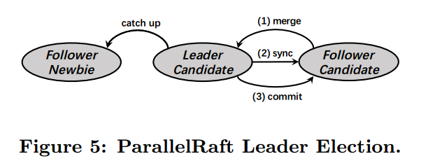
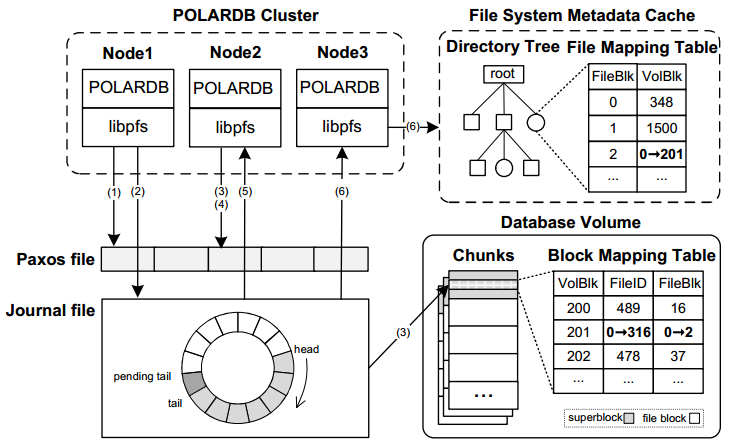
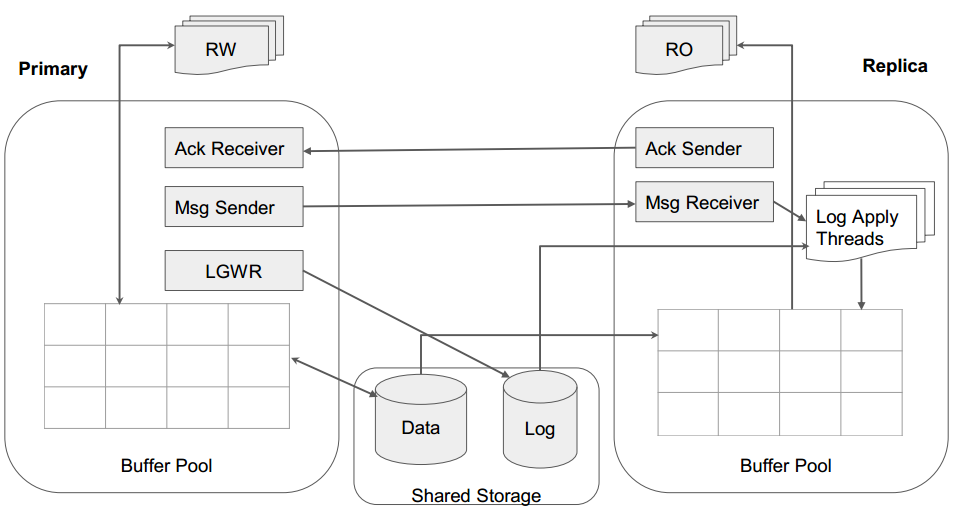
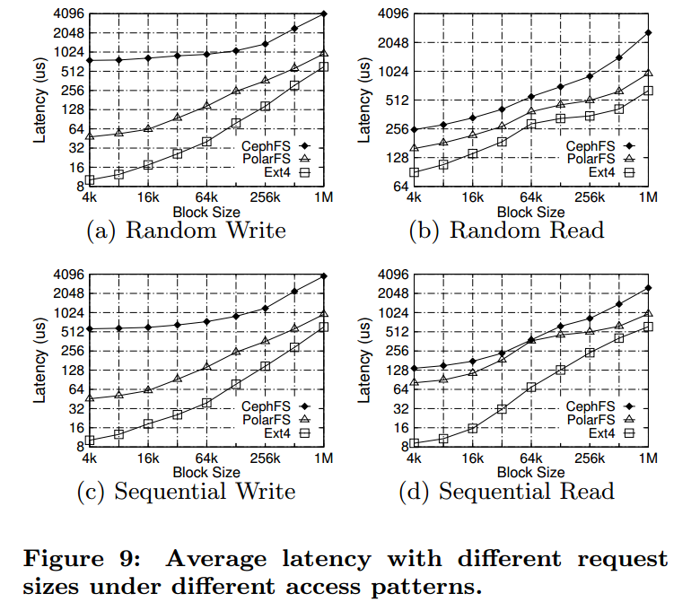
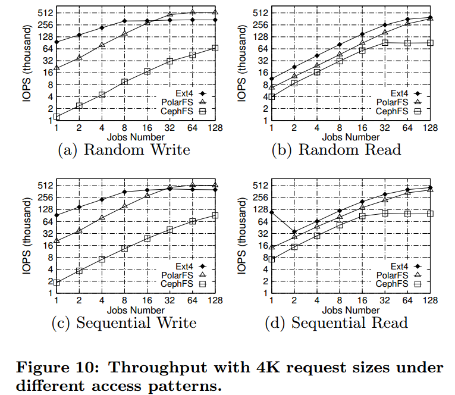
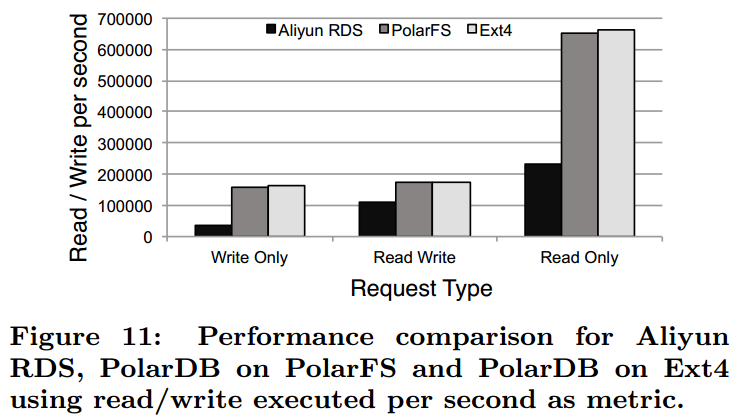
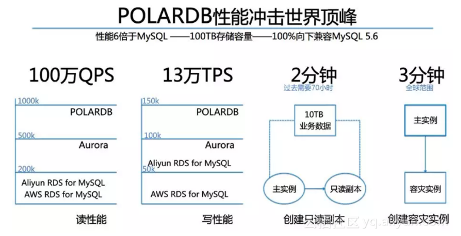

# 阿里云PolarDB及其共享存储PolarFS技术实现分析（下）

上篇介绍了PolarDB数据库及其后端共享存储PolarFS系统的基本架构和组成模块，是最基础的部分。本篇重点分析PolarFS的数据IO流程，元数据更新流程，以及PolarDB数据库节点如何适配PolarFS这样的共享存储系统。

PolarFS的数据IO操作

写操作

一般情况下，写操作不会涉及到卷上文件系统的元数据更新，因为在写之前就已经通过libpfs的pfs_posix_fallocate()这个API将Block预分配给文件，这就避免在读写IO路径上出现代价较高的文件系统元数据同步过程。上图是PolarFS的写操作流程图，每步操作解释如下：

1. POLARDB通过libpfs发送一个写请求Request1，经由ring buffer发送到PolarSwitch；
1. PolarSwitch根据本地缓存的元数据，将Request1发送至对应Chunk的Leader节点（ChunkServer1）；
1. Request1到达ChunkServer1后，节点上的RDMA NIC将Request1放到一个预分配好的内存buffer中，基于Request1构造一个请求对象，并将该对象加到请求队列中。一个IO轮询线程不断轮询这个请求队列，一旦发现有新请求则立即开始处理；
1. IO处理线程通过异步调用将Request1通过SPDK写到Chunk对应的WAL日志块上，同时将请求通过RDMA异步发向给Chunk的Follower节点（ChunkServer2、ChunkServer3）。由于都是异步调用，所以数据传输是并发进行的；
1. 当Request1请求到达ChunkServer2、ChunkServer3后，同样通过RDMA NIC将其放到预分配好的内存buffer并加入到复制队列中；
1. Follower节点上的IO轮询线程被触发，Request1通过SPDK异步地写入该节点的Chunk副本对应的WAL日志块上；
1. 当Follower节点的写请求成功后，会在回调函数中通过RDMA向Leader节点发送一个应答响应；
1. Leader节点收到ChunkServer2、ChunkServer3任一节点成功的应答后，即形成Raft组的majority。主节点通过SPDK将Request1写到请求中指定的数据块上；
1. 随后，Leader节点通过RDMA NIC向PolarSwitch返回请求处理结果；
1. PolarSwitch标记请求成功并通知上层的POLARDB。

读请求无需这么复杂的步骤，lipfs发起的读请求直接通过PolarSwitch路由到数据对应Chunk的Leader节点（ChunkServer1），从其中读取对应的数据返回即可。需要说明的是，在ChunkServer上有个子模块叫IoScheduler，用于保证发生并发读写访问时，读操作能够读到最新的已提交数据。

基于用户态的网络和IO路径

在本地IO处理上，PolarFS基于预分配的内存buffer来处理请求，将buffer中的内容直接使用SPDK写入WAL日志和数据块中。PolarFS读写数据基于SPDK套件直接通过DMA操作硬件设备（SSD卡）而不是操作系统内核IO协议栈，解决了内核IO协议栈慢的问题；通过轮询的方式监听硬件设备IO完成事件，消除了上下文切换和中断的开销。还可以将IO处理线程和CPU进行一一映射，每个IO处理线程独占CPU，相互之间处理不同的IO请求，绑定不同的IO设备硬件队列，一个IO请求生命周期从头到尾都在一个线程一颗CPU上处理，不需要锁进行互斥。这种技术实现最大化的和高速设备进行性能交互，实现一颗CPU达每秒约20万次IO处理的能力，并且保持线性的扩展能力，也就意味着4颗CPU可以达到每秒80万次IO处理的能力，在性能和经济型上远高于内核。

网络也是类似的情况。过去传统的以太网，网卡发一个报文到另一台机器，中间通过一跳交换机，大概需要一百到两百微秒。POLARDB支持ROCE以太网，通过RDMA网络，直接将本机的内存写入另一台机器的内存地址，或者从另一台机器的内存读一块数据到本机，中间的通讯协议编解码、重传机制都由RDMA网卡来完成，不需要CPU参与，使性能获得极大提升，传输一个4K大小报文只需要6、7微秒的时间。

如同内核的IO协议栈跟不上高速存储设备能力，内核的TCP/IP协议栈跟不上高速网络设备能力，也被POLARDB的用户态网络协议栈代替。这样就解决了HDFS和Ceph等目前的分布式文件系统存在的性能差、延迟大的问题。

基于ParallelRaft的数据可靠性保证

在PolarFS中，位于不同ChunkServer上的3个Chunk数据副本使用改进型Raft协议ParallelRaft来保障可靠性，通过快速主从切换和majority机制确保能够容忍少部分Chunk副本离线时仍能够持续提供在线读写服务，即数据的高可用。

在标准的Raft协议中，raft日志是按序被Follower节点确认，按序被Leader节点提交的。这是因为Raft协议不允许出现空洞，一条raft日志被提交，意味着它之前的所有raft日志都已经被提交。在数据库系统中，对不同数据的并发更新是常态，也正因为这点，才有了事务的组提交技术，但如果引入Raft协议，意味着组提交技术在PolarFS数据多副本可靠性保障这一层退化为串行提交，对于性能会产生很大影响。通过将多个事务batch成一个raft日志，通过在一个Raft Group的Leader和Follower间建立多个连接来同时处理多个raft日志这两种方式（batching&pipelining）能够缓解性能退化。但batch会导致额外延迟，batch也不能过大。pipelining由于Raft协议的束缚，仍然需要保证按序确认和提交，如果出现由于网络等原因导致前后pipeline上的raft日志发送往follow或回复leader时乱序，那么就不可避免得出现等待。

为了进一步优化性能，PolarFS对Raft协议进行了改进。核心思想就是解除按序确认，按序提交的束缚。将其变为乱序确认，乱序提交和乱序应用。首先看看这样做的可行性，假设每个raft日志代表一个事务，多个事务能够并行提交说明其不存在冲突，对应到存储层往往意味着没有修改相同的数据，比如事务T1修改File1的Block1，事务T2修改File1的Block2。显然，先修改Block1还是Block2对于存储层还是数据库层都没有影响。这真是能够乱序的基础。下图为优化前后的性能表现：

但T1和T2都修改了同一个表的数据，导致表的统计信息发生了变化，比如T1执行后表中有10条记录，T2执行后变为15条（举例而已，不一定正确）。所以，他们都需要更新存储层的相同BlockX，该更新操作就不能乱序了。

为了解决上述所说的问题，ParallelRaft协议引入look behind buffer（LBB）。每个raft日志都有个LBB，缓存了它之前的N个raft日志所修改的LBA信息。LBA即Logical Block Address，表示该Block在Chunk中的偏移位置，从0到10GB。通过判断不同的raft日志所包含的LBA是否有重合来决定能否进行乱序/并行应用，比如上面的例子，先后修改了BlockX的raft日志就可以通过LBB发现，如果T2对BlockX的更新先完成了确认和提交，在应用前通过LBB发现所依赖的T1对BlockX的修改还没有应用。那么就会进入pending队列，直到T1对BlockX完成应用。

另外，乱序意味着日志会有空洞。因此，Leader选举阶段额外引入了一个Merge阶段，填补Leader中raft日志的空洞，能够有效保障协议的Leader日志的完整性。

PolarFS元数据管理与更新

PolarFS各节点元数据维护

libpfs仅维护文件块（块在文件中的偏移位置）到卷块（块在卷中的偏移位置）的映射关系，并未涉及到卷中Chunk跟ChunkServer间的关系（Chunk的物理位置信息），这样libpfs就跟存储层解耦，为Chunk分配实际物理空间时无需更新libpfs层的元数据。而Chunk到ChunkServer的映射关系，也就是物理存储空间到卷的分配行为由PolarCtrl组件负责，PolarCtrl完成分配后会更新PolarSwitch上的缓存，确保libpfs到ChunkServer的IO路径是正确的。

Chunk中Block的LBA到Block真实物理地址的映射表，以及每块SSD盘的空闲块位图均全部缓存在ChunkServer的内存中，使得用户数据IO访问能够全速推进。

PolarFS元数据更新流程

前面我们介绍过，PolarDB为每个数据库实例创建了一个volume/卷，它是一个文件系统，创建时生成了对应的元数据信息。由于PolarFS是个可多点挂载的共享访问分布式文件系统，需要确保一个挂载点更新的元数据能够及时同步到其他挂载点上。比如一个节点增加/删除了文件，或者文件的大小发生了变化，这些都需要持久化到PolarFS的元数据上并让其他节点感知到。下面我们来讨论PolarFS如何更新元数据并进行同步。

PolarFS的每个卷/文件系统实例都有相应的Journal文件和与之对应的Paxos文件。Journal文件记录了文件系统元数据的修改历史，是该卷各个挂载点之间元数据同步的中心。Journal文件逻辑上是一个固定大小的循环buffer，PolarFS会根据水位来回收Journal。如果一个节点希望在Journal文件中追加项，其必需使用DiskPaxos算法来获取Journal文件控制权。

正常情况下，为了确保文件系统元数据和数据的一致性，PolarFS上的一个卷仅设置一个计算节点进行读写模式挂载，其他计算节点以只读形式挂载文件系统，读写节点锁会在元数据记录持久化后马上释放锁。但是如果该读写节点crash了，该锁就不会被释放，为此加在Journal文件上的锁会有过期时间，在过期后，其他节点可以通过执行DiskPaxos来重新竞争对Journal文件的控制权。当PolarFS的一个挂载节点开始同步其他节点修改的元数据时，它从上次扫描的位置扫描到Journal末尾，将新entry更新到节点的本地缓存中。PolarFS同时使用push和pull方式来进行节点间的元数据同步。

下图展示了文件系统元数据更新和同步的过程：

1. Node 1是读写挂载点，其在pfs_fallocate()调用中将卷的第201个block分配给FileID为316的文件后，通过Paxos文件请求互斥锁，并顺利获得锁。
1. Node 1开始记录事务至journal中。最后写入项标记为pending tail。当所有的项记录之后，pending tail变成journal的有效tail。
1. Node1更新superblock，记录修改的元数据。与此同时，node2尝试获取访问互斥锁，由于此时node1拥有的互斥锁，Node2会失败重试。
1. Node2在Node1释放lock后（可能是锁的租约到期所致）拿到锁，但journal中node1追加的新项决定了node2的本地元数据是过时的。
1. Node2扫描新项后释放lock。然后node2回滚未记录的事务并更新本地metadata。最后Node2进行事务重试。
1. Node3开始自动同步元数据，它只需要load增量项并在它本地重放即可。

PolarFS的元速度更新机制非常适合PolarDB一写多读的典型应用扩展模式。正常情况下一写多读模式没有锁争用开销，只读实例可以通过原子IO无锁获取Journal信息，从而使得PolarDB可以提供近线性的QPS性能扩展。

数据库如何适配PolarFS

大家可能认为，如果读写实例和只读实例共享了底层的数据和日志，只要把只读数据库配置文件中的数据目录换成读写实例的目录，貌似就可以直接工作了。但是这样会遇到很多问题，MySQL适配PolarFS有很多细节问题需要处理，有些问题只有在真正做适配的时候还能想到，下面介绍已知存在的问题并分析数据库层是如何解决的。

数据缓存和数据一致性

从数据库到硬件，存在很多层缓存，对基于共享存储的数据库方案有影响的缓存层包括数据库缓存，文件系统缓存。

数据库缓存主要是InnoDB的Buffer Pool（BP），存在2个问题：

1. 读写节点的数据更改会缓存在bp上，只有完成刷脏页操作后polarfs才能感知，所以如果在刷脏之前只读节点发起读数据操作，读到的数据是旧的；
1. 就算PolarFS感知到了，只读节点的已经在BP中的数据还是旧的。所以需要解决不同节点间的缓存一致性问题。

PolarDB采用的方法是基于redolog复制的节点间数据同步。可能我们会想到Primary节点通过网络将redo日志发送给ReadOnly/Replica节点，但其实并不是，现在采用的方案是redo采用非ring buffer模式，每个文件固定大小，大小达到后Rotate到新的文件，在写模式上走Direct IO模式，确保磁盘上的redo数据是最新的，在此基础上，Primary节点通过网络通知其他节点可以读取的redo文件及偏移位置，让这些节点自主到共享存储上读取所需的redo信息，并进行回放。流程如下图所示：

由于StandBy节点与读写节点不共享底层存储，所以需要走网络发送redo的内容。节点在回放redo时需区分是ReadOnly节点还是StandBy节点，对于ReadOnly节点，其仅回放对应的Page页已在BP中的redo，未在BP中的page不会主动从共享存储上读取，且BP中Apply过的Page也不会回刷到共享存储。但对于StandBy节点，需要全量回放并回刷到底层存储上。

文件系统缓存主要是元数据缓存问题。文件系统缓存包括Page Cache，Inode/Dentry Cache等，对于Page Cache，可以通过Direct IO绕过。但对于VFS（Virtual File System）层的Inode Cache，无法通过Direct IO模式而需采用o_sync的访问模式，但这样导致性能严重下降，没有实际意义。vfs层cache无法通过direct io模式绕过是个很严重的问题，这就意味着读写节点创建的文件，只读节点无法感知，那么针对这个新文件的后续IO操作，只读节点就会报错，如果采用内核文件系统，不好进行改造。

PolarDB通过元数据同步来解决该问题，它是个用户态文件系统，数据的IO流程不走内核态的Page Cache，也不走VFS的Inode/Dentry Cache，完全自己掌控。共享存储上的文件系统元数据通过前述的更新流程实现即可。通过这种方式，解决了最基本的节点间数据同步问题。

事务的数据可见性问题

一、MySQL/InnoDB通过Undo日志来实现事务的MVCC，由于只读节点跟读写节点属于不同的mysqld进程，读写节点在进行Undo日志Purge的时候并不会考虑此时在只读节点上是否还有事务要访问即将被删除的Undo Page，这就会导致记录旧版本被删除后，只读节点上事务读取到的数据是错误的。

针对该问题，PolarDB提供两种解决方式：

- 所有ReadOnly定期向Primary汇报自己的最大能删除的Undo数据页，Primary节点统筹安排；
- 当Primary节点删除Undo数据页时候，ReadOnly接收到日志后，判断即将被删除的Page是否还在被使用，如果在使用则等待，超过一个时间后还未有结束则直接给客户端报错。

二、还有个问题，由于InnoDB BP刷脏页有多种方式，其并不是严格按照oldest modification来的，这就会导致有些事务未提交的页已经写入共享存储，只读节点读到该页后需要通过Undo Page来重建可见的版本，但可能此时Undo Page还未刷盘，这就会出现只读上事务读取数据的另一种错误。

针对该问题，PolarDB解决方法是：

1. 限制读写节点刷脏页机制，如果脏页的redo还没有被只读节点回放，那么该页不能被刷回到存储上。这就确保只读节点读取到的数据，它之前的数据链是完整的，或者说只读节点已经知道其之前的所有redo日志。这样即使该数据的记录版本当前的事务不可见，也可以通过undo构造出来。即使undo对应的page是旧的，可以通过redo构造出所需的undo page。
1. replica需要缓存所有未刷盘的数据变更(即RedoLog)，只有primary节点把脏页刷入盘后，replica缓存的日志才能被释放。这是因为，如果数据未刷盘，那么只读读到的数据就可能是旧的，需要通过redo来重建出来，参考第一点。另外，虽然buffer pool中可能已经缓存了未刷盘的page的数据，但该page可能会被LRU替换出去，当其再次载入所以只读节点必须缓存这些redo。

DDL问题

如果读写节点把一个表删了，反映到存储上就是把文件删了。对于mysqld进程来说，它会确保删除期间和删除后不再有事务访问该表。但是在只读节点上，可能此时还有事务在访问，PolarFS在完成文件系统元数据同步后，就会导致只读节点的事务访问存储出错。

PolarDB目前的解决办法是：如果主库对一个表进行了表结构变更操作（需要拷表），在操作返回成功前，必须通知到所有的ReadOnly节点(有一个最大的超时时间)，告诉他们，这个表已经被删除了，后续的请求都失败。当然这种强同步操作会给性能带来极大的影响，有进一步的优化的空间。

Change Buffer问题

Change Buffer本质上是为了减少二级索引带来的IO开销而产生的一种特殊缓存机制。当对应的二级索引页没有被读入内存时，暂时缓存起来，当数据页后续被读进内存时，再进行应用，这个特性也带来的一些问题，该问题仅存在于StandBy中。例如Primary节点可能因为数据页还未读入内存，相应的操作还缓存在Change Buffer中，但是StandBy节点则因为不同的查询请求导致这个数据页已经读入内存，可以直接将二级索引修改合并到数据页上，无需经过Change Buffer了。但由于复制的是Primary节点的redo，且需要保证StandBy和Primary在存储层的一致性，所以StandBy节点还是会有Change Buffer的数据页和其对应的redo日志，如果该脏页回刷到存储上，就会导致数据不一致。

为了解决这个问题，PolarDB引入shadow page的概念，把未修改的数据页保存到其中，将cChange Buffer记录合并到原来的数据页上，同时关闭该Mtr的redo，这样修改后的Page就不会放到Flush List上。也就是StandBy实例的存储层数据跟Primary节点保持一致。

性能测试

性能评估不是本文重点，官方的性能结果也不一定是靠谱的，只有真实测试过了才算数。在此仅简单列举阿里云自己的性能测试结果，权当一个参考。

PolarFS性能

不同块大小的IO延迟

4KB大小的不同请求类型

PolarDB整体性能

**使用不同底层存储时性能表现**  **对外展示的性能表现**

与Aurora简单对比

阿里云的PolarDB和AWS Aurora虽然同为基于MySQL和共享存储的Cloud-Native Database（云原生数据库）方案，很多原理是相同的，包括基于redo的物理复制和计算节点间状态同步。但在实现上也存在很大的不同，Aurora在存储层采用日志即数据的机制，计算节点无需再将脏页写入到存储节点，大大减少了网络IO量，但这样的机制需要对InnoDB存储引擎层做很大的修改，难度极大。而PolarDB基本上遵从了原有的MySQL IO路径，通过优化网络和IO路径来提高网络和IO能力，相对来说在数据库层面并未有框架性的改动，相对容易些。个人认为Aurora在数据库技术创新上更胜一筹，但PolarDB在数据库系统级架构优化上做得更好，以尽可能小的代价获得了足够好的收益。

另附PolarFS的架构师曹伟在知乎上对PolarDB和Aurora所做的对比：

_在设计方法上，阿里云的PolarDB和Aurora走了不一样的路，归根结底是我们的出发点不同。AWS的RDS一开始就是架设在它的虚拟机产品EC2之上的，使用的存储是云盘EBS。EC2和EBS之间通过网络通讯，因此AWS的团队认为“网络成为数据库的瓶颈”，在Aurora的论文中，他们开篇就提出“Instead, the bottleneck moves to the network between the database tier requesting I/Os and the storage tier that performs these I/Os.” Aurora设计于12到13年之际，当时网络主流是万兆网络，确实容易成为瓶颈。而PolarDB是从15年开始研发的，我们见证了IDC从万兆到25Gb RDMA网络的飞跃。因此我们非常大胆的判断，未来几年主机通过高速网络互联，其传输速率会和本地PCIe总线存储设备带宽打平，网络无论在延迟还是带宽上都会接近总线，因此不再成为高性能服务器的瓶颈。而恰恰是软件，过去基于内核提供的syscall开发的软件代码，才是拖慢系统的一环。Bottleneck resides in the software._

_在架构上Aurora和PolarDB各有特色。我认为PolarDB的架构和技术更胜一筹。_

_1）现代云计算机型的演进和分化，计算机型向高主频，多CPU，大内存的方向演进；存储机型向高密度，低功耗方向发展。机型的分化可以大大提高机器资源的使用率，降低TCO。_

_因此PolarStore中大量采用OS-bypass和zero-copy的技术来节约CPU，降低处理单位I/O吞吐需要消耗的CPU资源，确保存储节点处理I/O请求的效率。而Aurora的存储节点需要大量CPU做redolog到innodb page的转换，存储节点的效率远不如PolarStore。_

_2）Aurora架构的最大亮点是，存储节点具有将redolog转换为innodb page的能力，这个改进看着很吸引眼球，事实上这个优化对关系数据库的性能提升很有限，性能瓶颈真的不在这里：），反而会拖慢关键路径redolog落地的性能。btw，在PolarDB架构下，redolog离线转换为innodb page的能力不难实现，但我们目前不认为这是高优先级要做的。_

_3）Aurora的存储多副本是通过quorum机制来实现的，Aurora是六副本，也就是说，需要计算节点向六个存储节点分别写六次，这里其实计算节点的网络开销又上去了，而且是发生在写redolog这种关键路径上。而PolarDB是采用基于RDMA实现的ParallelRaft技术来复制数据，计算节点只要写一次I/O请求到PolarStore的Leader节点，由Leader节点保证quorum写入其他节点，相当于多副本replication被offload到存储节点上。_

_此外，在最终一致性上Aurora是用gossip协议来兜底的，在完备程度上没有PolarDB使用的ParallelRaft算法有保证。_

_4）Aurora的改动手术切口太大，使得它很难后面持续跟进社区的新版本。这也是AWS几个数据库产品线的通病，例如Redshift，如何吸收PostgrelSQL 10的变更是他们的开发团队很头疼的问题。对新版本做到与时俱进是云数据库的一个朴素需求。怎么设计这个刀口，达到effect和cost之间的平衡，是对架构师的考验。_

总得来说，PolarDB将数据库拆分为计算节点与存储节点2个独立的部分，计算节点在已有的MySQL数据库基础上进行修改，而存储节点基于全新的PolarFS共享存储。PolarDB通过计算和存储分离的方式实现提供了即时生效的可扩展能力和运维能力，同时采用RDMA和SPDK等最新的硬件来优化传统的过时的网络和IO协议栈，极大提升了数据库性能，基本上解决了使用MySQL是会遇到的各种问题，除此之外本文并未展开介绍PolarDB的ParallelRaft，其依托上层数据库逻辑实现IO乱序提交，大大提高多个Chunk数据副本达成一致性的性能。以上这些创新和优化，都成为了未来数据库的发展方向。

参数资料：

- [PolarFS: An Ultra-low Latency and Failure Resilient. Distributed File System for Shared Storage Cloud Database](http://www.vldb.org/pvldb/vol11/p1849-cao.pdf)
- [深入了解阿里云新一代产品 POLARDB](http://mysql.taobao.org/monthly/2017/09/01/)
- [阿里云下一代数据库PolarDB架构设计](http://www.itdks.com/eventlist/detail/1319)
- [PolarDB技术深入剖析](http://ks.netease.com/blog?id=8784)
- [如何评价阿里云新一代关系型数据库 PolarDB？](https://www.zhihu.com/question/63987114)
