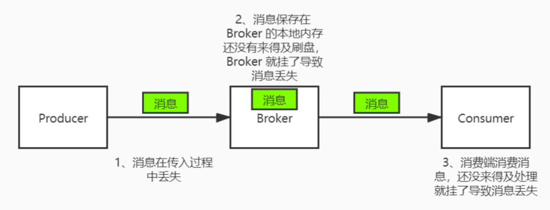
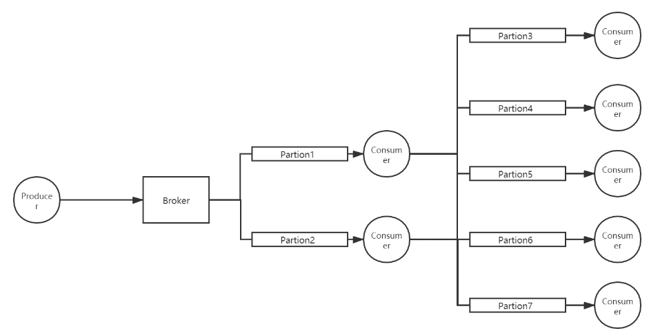
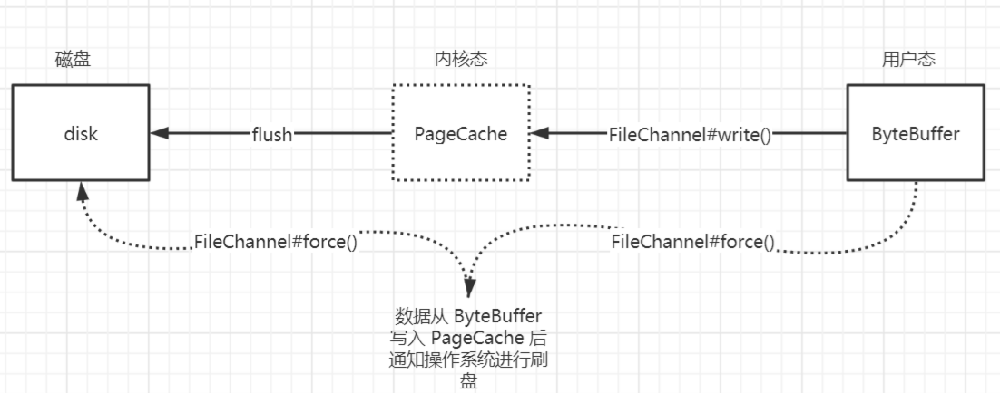
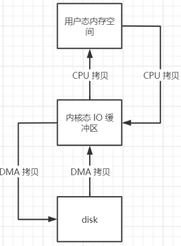
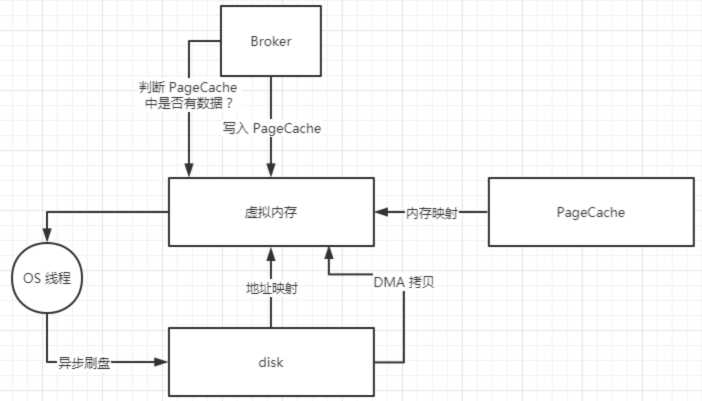
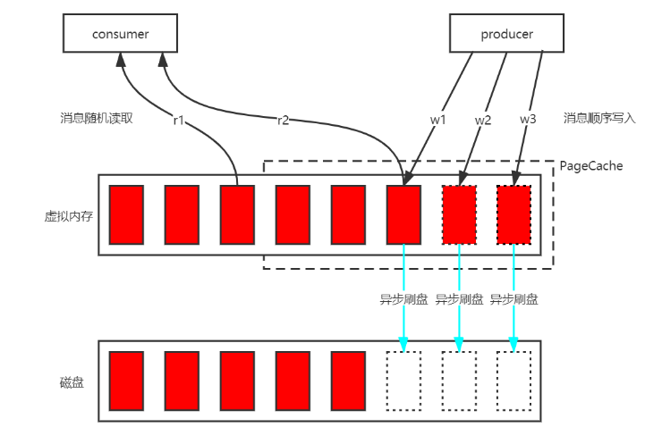
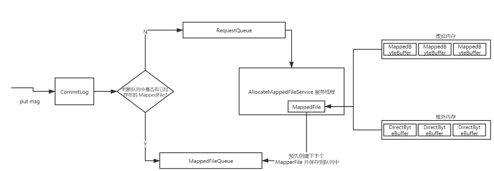

# RocketMQ 面试题集锦

# 前言

最近后端面试越来越难，不仅需要熟练使用算法、数据结构，懂各种开发框架的原理和源码，还需要懂各种中间件的原理和源码；不管在 BATJ 互联网大厂还是小公司都在使用 MQ 中间件，而且有着丰富的应用场景，所以关于 MQ 的原理和源代码的考察也成了资深程序员和架构师必须要掌握的重要技能，本场 Chat 罗列了 RocketMQ 的一些面试题帮助大家更加深入的了解 MQ 的底层设计原理。

# 1. 什么是解耦？

A 系统与 B、C、D 等其他系统严重耦合，不仅需要给其他系统发送数据维护发送数据的代码，还需要考虑其他系统调用自己的接口是否成功/失败/超时等异常情况；但是有了 MQ 之后，A 系统只需要将关键数据发送到 MQ 里，其他系统想要这个关键数据去消费 MQ ，如果不需要就取消消费就可以了。

# 2. 什么是异步？

异步是一种通讯方式，消息接收方不需要知道消息发送方什么时候发送，比如还款处理，用户点击还款后，可以把还款的消息放到消息队列里面，然后马上给用户返回还款中的状态；然后后台有一个还款消息消费的监听程序，最后借款状态更新为还款成功，当用户再次刷新页面会看到借款状态已经更新为还款成功啦。

# 3. 什么是削峰填谷？

如果一个系统的处理能力是每秒 200 个请求，在某一秒突然来了 350 个请求，需要把多余的 150 个请求均摊到之后的时间保证系统负载在系统的处理能力之内，同时让系统尽可能多地处理更多请求，最终起到“削峰填谷”的作用。如果一个系统的处理能力是每秒 200 个请求，在某一秒突然来了 350 个请求，需要把多余的 150 个请求均摊到之后的时间保证系统负载在系统的处理能力之内，同时让系统尽可能多地处理更多请求，最终起到“削峰填谷”的作用。

# 4. RocketMQ 执行流程

1. 先启动 NameServer 服务，起来后监听端口等待 Broker、Producer 和 Consumer，NameServer 是一个路由控制中心类似 ZooKeeper 之于 Kafka，提供服务注册、路由管理等服务。
1. 启动 Broker 跟所有的 NameServer 保持长连接并且定期发送心跳包。
1. 创建 Topic 并且指定其保存在哪些 Broker 里。
1. Producer 向 Master Broker 发送消息并且给消息打 Tag 标签进行分组。
1. Consumer 监听所有的 Master Broker 和 Slave Broker 里面的消息。

# 5. 怎么理解 Producer 的？

1. Producer 启动的时候会从 NameServer 服务集群找一台建立长连接并且定期发送心跳包，然后每隔 30s 从 NameServer 拉取 Topic-Broker 映射关系，缓存到本地内存，然后跟所有的 Master Broker 建立长连接并且每隔 30s 发送一次心跳包。
1. Producer 发送消息的时候有一个负载均衡的策略，当成功发送一次消息后，下一次消息将会换一个 Master Broker，使得消息可以均衡的分布在所有的 Broker 上。

# 6. 怎么理解 Consumer 的？

- 跟 Producer 类似。
- 消费端的负载均衡是由消费者的消费模式决定的。

# 7. 消费者消费模式有哪几种？

集群消费和广播消费。

# 8. 消费者获取消息有几种模式？

**拉模式**

推模式：是一种特殊的拉模式，每隔 15s 向 Broker 发起长轮询，Broker 的 Topic 下如果没有消息那么线程阻塞，超过 5s 就再次发起查询，如果有消息线程被唤醒并且立马把消息返回给消费端。

# 9. 定时消息是什么？怎样实现的？

Producer 在发送消息的时候指定什么时刻发送，然后消息被发送到 Master Broker 并保存起来，在指定时刻的时候 Broker 会把消息推送给消费端。

# 10. RocketMQ 如何保证高可用的？

- 多 Master 模式：该模式下必须设置为异步复制，因为没有 Slave，异步刷盘会丢失部分数据，同步刷盘不会丢失数据；如果有一台 Master Broker 宕机，那么其上的消息在服务恢复前不会推送给消费端，会对消息实时性造成影响。
- 多 Master 多 Slave 模式（异步复制）：异步复制的模式下在 Master 宕机、磁盘损坏等情况下会造成数据部分丢失；但是消费端仍然可以从 Slave 拉取消息，所以消息的实时性不受影响。
- 多 Master 多 Slave 模式（同步双写）：同步复制同步刷盘会导致整体性能比异步模式低一些，发送单个消息的 RT 也会变高，但是服务可用性和数据可用性都很高而且消息实时性不受影响。

# 11. 如何保证消息不被重复消费？或者说如何保证消息消费时的幂等性？

数据库创建一个业务幂等表，第一次消费的时候插入一条幂等数据，把相关的业务 bizId 作为幂等 id，第二次消费的时候如何数据库中已经有幂等记录的话就抛出幂等异常。

# 12. 如何保证消息的可靠性传输？要是消息丢失了怎么办？



- Producer：生产者端默认采用同步阻塞式发送消息，如果状态返回 OK 表示消息一定发送到了 Broker，如果状态返回失败或者超时，会重试两次，重试次数用完后可能发送成功也可能继续失败。
- Broker：发送到 Broker 的消息会通过同步刷盘或者异步刷盘的方式持久化到 CommitLog 里面，即时 Broker 服务宕机，服务恢复后仍然可以找到消息，除非磁盘损坏才会导致消息丢失；另外在多主多从的 Broker 集群模式下，采用同步复制将 Master Broker 中的消息同步到 Slave Broker，就是 Master Broker 宕机甚至磁盘损坏也可以找到该消息。
- Consumer：消费端维护了一个 MessageQueue 的队列，不管消息消费成功或者失败都会将当前消息的消费进度 offset 持久化到 MessageQueue 里面；如果消息消费失败会把消息重新发回到 Broker，如果操作失败或者 Broker 挂掉了会定时重试，成功后更新本地的消费进度 offset；就算 Broker 和 Consumer 都挂掉了由于 Consumer 会定期持久化消费进度，等服务恢复后重新拉取 offset 之前的消息到消费端本地也可以保证消息不丢失；消费端消费失败后会把消息重新发回到 Broker 中的重试队列中，如果消费重试次数超过了最大消费重试次数的话 Broker 会把消息移到死信队列中，然后人工干预处理。

# 13. 如何保证消息的顺序性？

顺序消息在日常的功能场景中很常见，比如点外卖生成外卖订单、付款、送餐的消息需要保证严格的顺序。

**全局顺序消息：** RocketMQ 的一个 Topic 下默认有八个读队列和八个写队列，如果要保证全局顺序消息的话需要在生产端只保留一个读写队列，然后消费端只有一个消费线程，这样会降低 RocketMQ 的高可用和高吞吐量。**分区顺序消息：** 分区顺序消息同样需要生产端和消费端配合，生产端根据同一个订单 ID 把消息路由到同一个 MessageQueue，消费端控制从同一个 MessageQueue 取出的消息不被并发处理。**生成端发送分区顺序消息：** 

```java
SendResult sendResult = Producer.send(msg , new MessageQueueSelector() {
Override
public MessageQueue select(List <MessageQueue> mqs , Message msg ,Object arg) {
// 生成外卖订单、付款、送餐使用同一个 bizId
Integer bizId = (Integer) arg ;
// 根据 bizId 路由这三种消息到同一个分区
int index = bizId%mqs.size();
return mqs.get(index) ;
}
}, orderid);
```

消费端消费分区消息：

```java
consumer.registerMessageListener(new MessageListenerOrderly() {
Override
public ConsumeOrderlyStatus consumeMessage(List<MessageExt> msgs ,ConsumeOrderlyContext context) {
System.out.printf("Receive order msg:" + new String(msgs.get(0).getBody()));
return ConsumeOrderlyStatus.SUCCESS ;
}
});
```

MessageListenerOrderly 底层会将 MessageQueue 锁住保证了同一个 MessageQueue 的消息不会并发消费。
14\. 如何解决消息队列的延时以及过期失效问题？
=========================
当消费端宕机或者消费速度很慢导致 Broker 中消息大量积压，如有积压时长超过阈值就会被清理掉导致数据丢失。
RocketMQ 会把消息持久化到 CommitLog 文件里面，并且在以下的几种情况下会定期清理 CommitLog 文件：
1.  CommitLog 文件里面的消息积压超过了 72 小时，并且到了凌晨 4 点，清理线程会删除该文件；
2.  CommitLog 文件里面的消息积压超过了 72 小时，并且磁盘占用率达到了 75%，清理线程也会删除该文件；
3.  磁盘占用率达到了 85%，不管积压的消息是否过期都会触发线程批量清理文件，直到内存充足；
4.  磁盘占用率达到了 90%，Broker 出于保护自身的目的将会拒绝新发送的消息。
出现消息积压并且过期失效问题，会导致这部分消息丢失，可以写一段程序找到丢失的消息，然后等到凌晨用户都休息的时候，这个时候系统负载比较低，再把丢失的这部分消息重新发送到 Broker 中。
15\. 消息队列满了以后该怎么处理？有几百万消息持续积压几小时，说说怎么解决？
========================================
1.  创建一个 Topic 并且把积压消息的 Topic 下的分区中的消息分发到新建的那个 Topic 中的更多分区中，新建 Topic 的分区数是积压消息的 Topic 的分区的 10 倍（具体多少分区根据具体业务场景决定）。
2.  积压的消息分发完以后停掉旧的消费端实例。
3.  每一个新建 Topic 的分区都对应启动一个消费端实例。
4.  积压的消息都消费完后，再把旧的消费端实例恢复。

16\. 如何解决高性能读写数据的问题？
==================== **普通 IO 和 NIO** *   普通 IO 是基于字节的单向阻塞式传输；
*   NIO 引入 FileChannel 全双工通道和 ByteBuffer 数据容器，ByteBuffer 可以精准的控制写入磁盘的数据大小。
如下图所示 FileChannel#write() 方法会将 ByteBuffer 里面的数据写到 PageCache 中，然后操作系统会定期将 PageCache 中的数据进行刷盘，如果想要立马通知操作系统进行刷盘可以调用 FileChannel#force() 方法。

不管是普通 IO 还是没有使用 MMAP 的 NIO 都会有多次数据拷贝的问题。
*   读磁盘的过程：先把磁盘里面的数据 DMA 拷贝到内核态 IO 缓冲区，然后再把内核态的数据 CPU 拷贝到用户态内存空间；
*   写磁盘的过程：把用户态内存空间的数据 CPU 拷贝到内存态 IO 缓冲区，然后再把内核态的数据 DMA 拷贝到磁盘；
*   不管是读还是写都需要两次数据拷贝，如果采用 MMAP 技术就可以把磁盘里面的文件映射到用户态空间的虚拟内存中，省去了内核态到用户态的 CPU 拷贝。
 **内存映射 MMAP（零拷贝技术）** NIO 可以采用 MappedByteBuffer 数据容器进行读写数据，而 MappedByteBuffer#map() 底层采用了 MMAP 技术进行了文件映射。

```plaintext
```
MappedByteBuffer mappedByteBuffer = fileChannel.map(FileChannel.MapMode.READ_WRITE, position, fileSize)
ize);
```


```plaintext
上文提到了 MMAP 技术就是进行文件映射和内存映射，把磁盘里面的文件映射到用户态的虚拟内存，还有将 PageCache 映射到用户态的虚拟内存，从而减少内核态到用户态的 CPU 拷贝。
MappedByteBuffer#write() 方法会将数据直接写入到 PageCache 中，然后操作系统会异步刷盘将 PageCache 中的数据写入到磁盘。
从磁盘读取数据的时候，首先会从 PageCache 中查看是否有数据，如果有的话就直接从 PageCache 加载数据，如果没有的话就去磁盘加载数据到 PageCache 中，PageCache 技术还会将要加载的数据的附近的其他数据块也一并加载进 PageCache，下文继续分析 PageCache 技术。

MMAP 虽然可以提高磁盘读写的性能，但是仍然有诸多缺陷和限制，比如：
*   MMAP 进行文件映射的时候对文件大小有限制，在 1.5GB~2GB 之间，所以 RocketMQ 设计 CommitLog 单个文件 1GB，ConsumeQueue 单个文件 5.7MB；
*   当不再需要使用 MappedByteBuffer 的时候，需要手动释放占用的虚拟内存。**PageCache 技术** 为了优化磁盘中数据文件的读写性能，PageCache 技术对数据文件进行了缓存。“对磁盘中数据文件的顺序读写性能接近于对内存的读写性能”，其主要原因就是 PageCache 对磁盘中数据文件的读写进行了优化。
* **PageCache 对数据文件的读优化：** 由于读数据文件的时候会先从 PageCache 加载数据，如果 PageCache 没有数据的话，会从磁盘的数据文件中加载数据并且顺序把相邻的数据文件页面预加载到 PageCache 中，这样子如果之后读取的数据文件在 PageCache 中能找到的话就省去了去磁盘加载数据的操作相当于直接读内存。
* **PageCache 对数据文件的写优化：** 往数据文件中写数据的时候同样先写到 PageCache 中，然后操作系统会定期刷盘把 PageCache 中的数据持久化到磁盘中。
那么 RocketMQ 具体是怎么使用 PageCache + Mmap 技术的呢？又做了哪些优化呢？
*   首先将磁盘中的 CommitLog 数据文件映射到虚拟内存中；
*   生成端将消息顺序写到 PageCache 中，然后操作系统定期进行异步刷盘，将 PageCache 中的数据批量持久化到磁盘；
*   消费端随机读取 CommitLog 数据文件，由于程序的局部性热点原理，未来将要加载的数据和正在使用的数据在存储空间上是邻近的，所以要加载的数据基本可以在 PageCache 中找到，避免了缺页中断而去磁盘中加载数据。

虽然 PageCache 技术优化了数据文件的读写性能，但是仍然有一些影响其性能的问题：
操作系统的脏页回写（当空闲内存不足的时候操作系统会将脏页刷到磁盘释放内存空间）、内存回收、内存 SWAP（当内存不足的时候把一部分磁盘空间虚拟成内存使用） 等都会造成消息读写的延迟。
为了解决消息读写的延迟问题，RocketMQ 还引入了其他优化方案，下文继续分析。**预分配 MappedFile（内存预分配）** 为了解决 PageCache 技术带来的消息读写延迟问题，RocketMQ 进行了内存预分配处理。
当往 CommitLog 写入消息的时候，会先判断 MappedFileQueue 队列中是否有对应的 MappedFile，如果没有的话会封装一个 AllocateRequest 请求，参数有：文件路径、下下个文件路径、文件大小等，并把请求放到一个 AllocateRequestQueue 队列里面；
在 Broker 启动的时候会自动创建一个 AllocateMappedFileService 服务线程，该线程不停的运行并从 AllocateRequestQueue 队列消费请求，执行 MappedFile 映射文件的创建和下下个 MappedFile 的预分配逻辑，创建 MappedFile 映射文件的方式有两个：一个是在虚拟内存中通过 MapperByteBuffer 即 Mmap 创建一个 MappedFile 实例，另一个是在堆外内存中通过 DirectByteBuffer 创建一个 MappedFile 实例。创建完当前 MappedFile 实例后还会将下一个 MappedFile 实例创建好并且添加到 MappedFileQueue 队列里面，即预分配 MappedFile。
 **mlock 系统调用** 当内存不足的时候可能发生内存 SWAP，读写消息的进程所使用的内存可能会被交换到 SWAP 空间，为了保证 RocketMQ 的吞吐量和读写消息低延迟，肯定希望尽可能使用物理内存，所以 RocketMQ 采用了 mlock 系统调用将读写消息的进程所使用的部分或者全部内存锁在了物理内存中，防止被交换到 SWAP 空间。**文件预热（内存预热）** mlock 系统调用未必会锁住读写消息进程所使用的物理内存，因为可能会有一些内存分页是写时复制的，所以 RocketMQ 在创建 MapperFile 的过程中，会将 Mmap 映射出的虚拟内存中随机写入一些值，防止内存被交换到 SWAP 空间。
由于 Mmap 技术只是创建了虚拟内存地址至物理内存地址的映射表，并没有将磁盘中的数据文件加载到内存中来，如果内存中没有找到数据就会发生缺页中断，而去磁盘读取数据，所以 RocketMQ 采用了 madvise 系统调用将数据文件尽可能多的加载到内存中达到内存预热的效果。
总结
==
RocketMQ 的底层设计还是很有趣的，大家有空还是要看下其源代码，将其巧妙的设计转化为自己的技能。
```

