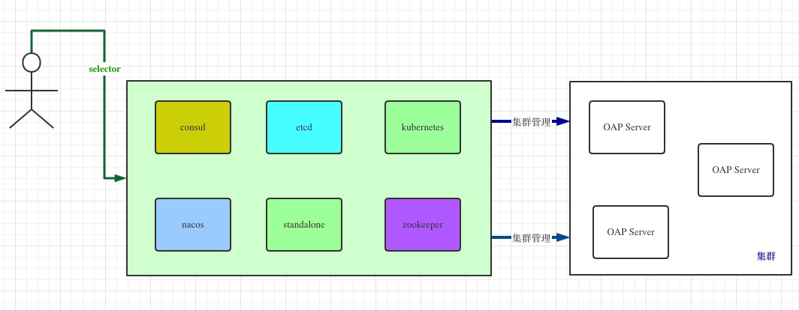

# 分布式链路追踪：集群管理设计

SkyWalking 是一个开源 APM 系统，包括针对 Cloud Native 体系结构中的分布式系统的监视，跟踪，诊断功能。核心功能如下：

- 服务、服务实例、端点指标分析
- 根本原因分析，在运行时分析代码
- 服务拓扑图分析
- 服务，服务实例和端点依赖性分析
- 检测到慢速服务和端点
- 性能优化
- 分布式跟踪和上下文传播
- 数据库访问指标。检测慢速数据库访问语句（包括 SQL 语句）
- 报警

SkyWalking 目前是 Apache 顶级项目，作为这么优秀的开源项目，它的架构设计理念肯定会有很多值得我们借鉴。

本文会包含如下内容：

- 集群管理生态方法论
- SkyWalking 集群管理设计

本篇文章适合人群：架构师、技术专家以及对全链路监控非常感兴趣的高级工程师。

## 集群管理生态方法论

集群管理的方法论有很多，当今社会又是一个信息膨胀的时代，所以会有很多书籍或者文章会去剖析一些方法论，我相信很多都具备很强的收藏价值。

比如我现在需要做一个缓存系统，最开始我们肯定会考虑使用本地单机缓存，因为这样性能高，实现简单，我们只需要使用一个容器来承载这些数据，然后相办法如何保证数据的读写线程安全就行了，于是我们就会考虑单虚拟机下的性能优化，比如如何用多线程操作替代单线程，如何用事件驱动去替换同步，如何转换成异步，其实这些都会是在单机本地缓存上效果最明显，因为没有网络开销。

但是随着服务能力的提升以及运营给力，我们的应用程序单机的流量越来越大，线上单机根本不够用，我们需要主从部署，这样问题就来了，我们需要数据同步，slave 需要从 master 上同步数据，涉及到跨进程的数据同步，也就是这个时候就需要保证数据同步的高可用、高性能、高并发等特性，那么这个时候就需要集群管理了，需要我们去管理这些数据同步的操作。

那么我们首先会想到，我们原先是基于内存的，我们可以改成基于 openAPI 模式，如果一台机器上的内存数据变化了，我就通过 openAPI 实时的同步到其他集群节点上，然后更新对应机器节点的内存数据，这样数据就保证一致性了，只是说这个数据不会持久化，一旦有节点挂掉了，数据就全丢失了。

怎么办？程序员是很聪明的，我们可以持久化啊，把内存中的数据同步到磁盘文件，做备份，如果节点挂掉，再重新启动会去加载已经备份的文件。那么问题又来了，如果每次更新内存都会去持久化文件，如果有大量的请求，这样整个集群抗并发的能力会非常的差，所以又发明了异步刷盘机制以及机器硬盘的缓存机制。

其实上面所说的集群间数据的管理功能，在分布式领域里面属于 AP 模式，只会保证最终一致性。

那么如何保证 CP 的强一致性了，那么程序员的进阶之路，我们肯定需要刨根问底，这个时间基于 Raft 算法的分布式能力，就是 CP 算法，所以现在有很多框架的集群管理都会采用分布式算法 Raft，因为这个算法高效并且稳定。

使用 Raft 算法来保证集群管理能力的有很多优秀的框架，比如：

- Nacos
- Rocket MQ
- 蚂蚁金服的 JRaft

所以上升到集群管理，业界一般都会采用 CP 或者 AP 模式，很少有框架能够同时实现 CAP 模式的。

关于 Nacos 的分布式选举算法，欢迎关注作者的另外一篇 Chat 文章——《调侃面试官，分布式选举算法 Raft 在 Nacos 中的应用 》，关于 Rocket MQ 的集群管理功能，欢迎关注作者的另外一篇 Chat 文章——《你所不知道的 RocketMQ 的集群管理：副本机制 》。

## SkyWalking 集群管理设计

SkyWalking 集群管理支持能力点包括：基于 Consul 的集群管理，基于 etcd 的集群管理，基于 Kubernetes 的集群管理，基于 Nacos 的集群管理，基于 ZooKeeper 的集群管理。SkyWalking 的集群管理又是靠 Selector 来做配置切换的。

```yaml
selector: ${SW_CLUSTER:nacos}
standalone:
```

### 基于 Consul 的集群管理

既然可以用 Consul 做集群管理，肯定是要先加载配置文件，SkyWalking 定义了 ClusterModuleConsulConfig，会加载 Consul 的基础配置信息。

- serviceName：服务名称
- hostPort：IP + 端口
- internalComHost：内部通信 IP
- aclToken：acl 认证 token
- internalComPort：内部通信端口

对 SkyWalking 比较了解的人会知道，它所有的功能都是按照模块来加载的，所以 Consul 也会自定义一个模块 ClusterModuleConsulProvider。

定义模块的名称为 Consul，定义模块的基础类模块为 ClusterModule，绑定模块的配置文件 ClusterModuleConsulConfig，重写 prepare() 方法，方便整个 OAP- SERVER 初始化的时候，完成 Consul 集群的加载。

加载的过程中就会植入集群能力，比如 ConsulCoordinator，集群能力肯定是具备服务注册和服务发现功能，SkyWalking 统一封装了 ClusterRegister 和 ClusterNodesQuery 接口能力，ClusterRegister 具备 registerRemote 能力，ClusterNodesQuery 具备能力。

ConsulCoordinator 初始化 Consul 客户端 client，并获取到 Consul 集群选举出来的 HealthClient，并通过客户端获取到健康的数据节点列表，并将节点列表转换为平台能够识别的远程节点信息列表，并返回。（从 ServiceHealth 转换为 RemoteInstance）

### 基于 etcd 的集群管理

加载集群配置信息 ClusterModuleEtcdConfig 继承 ModuleConfig：

- serviceName：服务名称
- hostPort：IP 加端口
- isSSL：是否开启 SSL 认证
- internalComHost：内部通信 IP 地址
- internalComPort：内部通信端口号

集群能力初始化模块：ClusterModuleEtcdProvider，继承基础模块 ModuleProvider，这点和 Consul 集群管理的原理是一样的。加载配置文件 ClusterModuleEtcdConfig，并初始化 EtcdClient，赋值模块名称为 etcd，并通过 prepare() 方法完成集群能力加载。解析配置文件，并和 EtcdClient 绑定，并通过 EtcdCoordinator 和 EtcdClient 绑定一起完成集群的能力。

EtcdCoordinator 是集群管理的核心能力，通过客户端以及 serviceName 来获取指定服务的节点信息列表，并将 Etcd 集群能够识别的节点信息 EtcdNode 转换为平台能够识别的节点信息 RemoteInstance。

### 基于 Kubernetes 的集群管理

K8s 集群管理配置文件加载：

- watchTimeoutSeconds：监听超时时间
- namespace：命名空间
- labelSelector：标签选择器
- uidEnvName：uid 环境名称

ClusterModuleKubernetesProvider，基于 K8s 的能力加载模块。配置集群模块名称 Kubernetes，绑定集群模块和配置文件 ClusterModule 和 ClusterModuleKubernetesConfig。模块在初始化过程中会初始化 KubernetesCoordinator，基于 K8s 的集群选举核心能力。这里有一个小细节，基于 K8s 的集群管理，是假想 Skywalking 自身本身就是 K8s 里面的一个服务，依托于 K8s 的服务治理能力，所以，集群选举能力，在注册 IP 的过程中，是和 K8s 共用一套 API。

通过 Provider 中的 notifyAfterCompleted 完成 coordinator.start()，开启集群选举，集群选举通过一个 SingleThreadExecutor 并结合定时器去执行监听器方法，实时的维护注册节点缓存，供 Skywalking 节点使用。

### 基于 Nacos 的集群管理

加载 ClusterModuleNacosConfig 配置，配置中会加载如下属性：

- serviceName：服务名称
- hostPort：IP + 端口
- namespace：命名空间

集群模块加载器 ClusterModuleNacosProvider，命名为 Nacos 模块，构建 NamingService 模块，NamingService 这个是分布式集群管理 Nacos 的服务发现的 API，依托这个 API 可以找到对应服务名称所属的集群信息，包含 IP + 端口。

NacosCoordinator 集群选举模块，通过 NamingService 的方法 registerInstance 和 selectInstances 去注册和发现服务元数据信息。

### 基于 ZooKeeper 的集群管理

ZooKeeper 的集群管理，基本原理就是节点信息 + 监听器机制，这里也会加载基础配置信息 ClusterModuleZookeeperConfig：

- nameSpace：命名空间

- hostPort：IP + 端口

- baseSleepTimeMs：休眠时间

- maxRetries：最大重试次数

- internalComHost：内部通信 IP 地址

- internalComPort：内部通信端口号

- enableACL：是否开启 ACL 认证

- schema：数据库 schema

- expression：匹配表达式

  集群选举加载模块 ClusterModuleZookeeperProvider，封装 CuratorFramework 客户端，熟悉 ZooKeeper 的人都知道，这个是 curator 框架针对 ZooKeeper 客户端的封装，也是一个高性能的中间件框架，配置 ZooKeeper 模块。那么模块初始化会加载哪些信息，比如 ACL 认证信息，初始化客户端，初始化 ZookeeperCoordinator 选举 API，绑定配置文件和客户度，完成集群选举能力的初始化。

ZookeeperCoordinator 是 Skywalking 封装的真正的集群选举能力，包括集群信息的适配等。

### Skywalking 集群管理总结

集群管理，我们总得了解 Skywalking 为什么要用集群管理，在它的架构设计理念中，整个 OAP 平台的角色主要分为如下：

- CoreModuleConfig.Role.Mixed
- CoreModuleConfig.Role.Aggregator
- CoreModuleConfig.Role.Receiver

这里简单的解释下，Mixed 是混合模式，既包含 Aggregator 和 Receiver。Aggregator，是聚合器模式，也就是说数据收集到 OAP 平台之后，数据需要做过滤、清晰和聚合然后再存储。Receiver 是收集器模式，也就是原始数据会直接存储，不做任何处理，当然这个肯定会有最核心的链路数据，就不会产生很多通过聚合之后产生的指标数据了。

那么 Skywalking 中的集群管理主要是针对 Aggregator 模式，当然肯定也会包含 Mixed 模式。那么为什么 Aggregator 模式需要分布式集群管理功能，这个我们应该能够理解，因为需要处理数据，那么肯定需要保证 CAP 或者 BASE 理论了，也就是要保证集群节点之间的分布式特性，所以 Skywalking 就针对你所需要的集群功能，然后通过选择器架构模式，来充分满足平台的深度用户可以任意的挑选符合自己业务场景的集群管理能力。比如我们公司的技术栈是 Nacos，那么我们肯定会优先选择它作为集群管理，非常灵活。



再聊聊 Skywalking 集群管理服务的能力有哪些，首先我们聚焦在服务发现，因为用到了集群能力，肯定是要服务发现，找到集群上注册的服务提供者的基础元数据。

ClusterNodesQuery.queryRemoteNodes() 能力，在 Skywalking 中如何被利用，首先我们关注下 RemoteClientManager ，这个类管理 OAP 服务节点集群之间的连接。有一个任务调度会自动查询服务节点列表从集群模块。比如 ZooKeeper 集群模块或 Kubernetes 集群模块。

从集群模块查询 OAP 服务器列表，并为新节点创建一个新连接。创建 OAP 服务器有序，因为每个服务节点会通过哈希码互相发送流数据。通过 queryRemoteNodes 的集群能力，找到集群中的节点信息列表。

由于 OAP 服务器注册由 UUID 与进程号一对一映射，注册信息没有立即删除后，进程关闭，因为总是发生网络故障，不是真的关闭过程。因此，集群模块必须等待几秒钟来确认。然后有多个注册的集群中的信息。

所以在拿到集群信息列表之后，需要去重（distinct）并排序，然后比较目前使用的集群远程客户端列表和当前最新的集群节点信息列表，如果不同就会做同步更新。比较现有客户端和远程实例收集之间的客户端。将客户机移动到新的客户机集合中避免创建新的通道。关闭在集群配置中找不到的客户端。为除自实例外的远程实例创建一个 gRPC 客户端。

Skywalking 集群管理的能力是 gRPC 客户端集群，也就是说节点之间的 RPC 通信通道是 gRPC，其实这点和 Dubbo 的集群管理本质上也是一样的，因为 Dubbo 管理的是 Dubbo 自己的 RPC，比如 Netty。

然后又是怎么植入到 Skywalking 的功能领域的呢，这个就得通过 RemoteSenderService，这个类包装了 RemoteClientManager，首先从它里面获取到 RemoteClient 列表，然后拿到了列表之后，我们只能说知道了集群的能力，还需要考虑负载均衡，这点 Skywalking 就简单的封装了负载的能力，包含如下几种：

- HashCode：通过 HashCodeSelector 完成按照 hash 取模的负载均衡算法。
- Rolling：通过 RollingSelector 完成按照轮询的负载均衡算法
- ForeverFirst：通过 ForeverFirstSelector 完成简单的总是第一个节点的负载均衡算法。

那么问题又来了，这里也是只是封装了集群负载的能力，那么到底是哪部分能力在用集群的功能了，这里有说明如下两个类：MetricsRemoteWorker 和 RegisterRemoteWorker，前者是从 agent 客户端收集到的度量信息，也就是聚合分析产出的数据，后者是本节点能力的分布式注册，比如 MetricsPersistentWorker 等。

关于 Skywalking 的核心 worker 能力，会在后续文章中详细的 Chat。

## 本文总结

本文从集群管理入手，分析了一下它的集群管理功能，之所以会写这篇文章，是因为自己的团队现在在深度的使用 Nacos 以及 Skywalking，这些也都是自己 review 源码之后的一些心得，如果有不对的地方欢迎拍砖。
