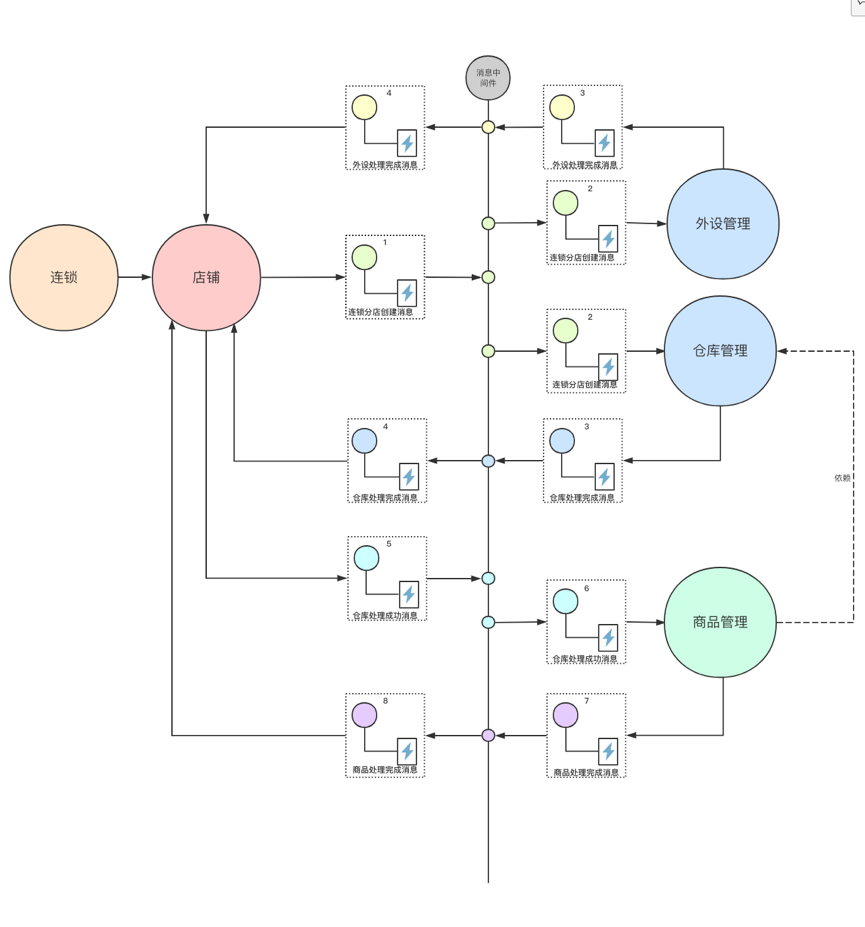
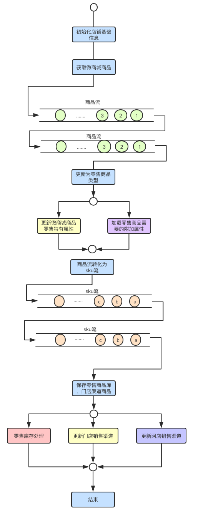
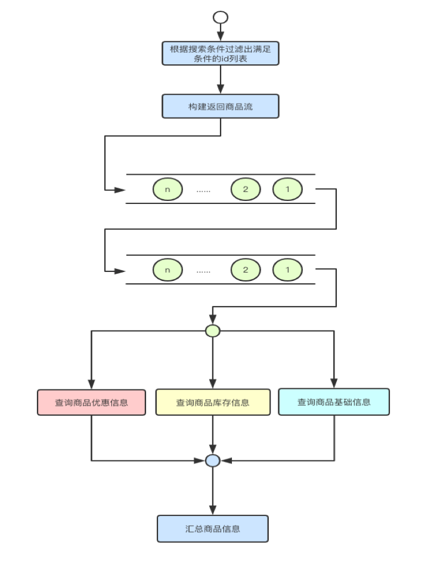

# 响应式架构与 RxJava 在有赞零售的实践

随着有赞零售业务的快速发展，系统和业务复杂度也在不断提升。如何解决系统服务化后，多个系统之间的耦合，提升业务的响应时间与吞吐量，有效保证系统的健壮性和稳定性，是我们面临的主要问题。结合目前技术体系和业务特点的思考，我们在业务中实践了响应式架构以及RxJava框架，来解决系统与业务复杂所带来的问题。

## 实践响应式架构

响应式架构是指业务组件和功能由 **事件驱动**，每个组件异步驱动，可以并行和分布式部署及运行。

响应式架构可以带来以下优势：

- 大幅度降低应用程序内部的耦合性
- 事件传递形式简化了并行程序的开发工作，使开发人员无须与并发编程基础元素打交道，同时可以解决许多并发编程难题，如死锁等。
- 响应式架构能够大幅度提高调用方法的安全性和速度。
- 对复杂业务系统的领域建模，响应式架构可以天然支持。每个系统组件就可以对应到一个业务实体，业务实体之间通过接收事件来完成一次业务操作。

我们使用响应式架构主要是为解决多个系统间的多次远程调用带来的分布式问题，尤其在长任务场景中，响应式架构显得尤其必要。

有赞连锁出现后，随着连锁商家经营规模的扩张，会在系统中创建新的门店。创建新门店会引发一系列业务初始化工作，例如店铺、员工、仓库、商品、库存等业务域，并且各业务域之间存在一定的依赖关系（如图1所示），例如商品依赖仓库初始化完成。


图1 连锁新建分店系统依赖关系

商家新增门店时，在店铺初始化完成后，连锁系统发送店铺初始化成功消息，相应系统对事件进行响应，处理完成（成功／失败）后将回执给连锁系统，连锁系统根据相关业务的反馈，决定是继续通知下游业务，还是结束整个过程。新建门店部分流程如图2所示。

在创建门店业务中，每个系统响应连锁系统发出的消息，处理完成后进行回执。通过这种模式，业务系统本身不关心其他系统是否成功或失败，只需对通知的事件进行处理，整体初始化进度与异常处理由连锁系统来控制。这种设计使得各业务系统之间没有直接耦合并保持相互独立。

图2 连锁体系新增分店消息驱动图

上面的案例介绍了在复杂业务场景下系统间对响应式架构的实践，系统内部同样会遇到复杂业务场景。下面介绍下在系统内部应对复杂业务的实践。

## RxJava在有赞零售实践

Rxjava是用来编写异步和基于消息的程序的类库。RxJava在Android有着广泛的使用，主要应用在用户界面绘制与服务端通讯等场景。RxJava的核心思想是响应式编程以及事件、异步这两个特点。响应式编程是一种通过异步和事件流来构建程序的编程模型。在复杂的业务开发中，最棘手的问题就是如何清晰直观的展现复杂的业务逻辑，并且方便后续的业务维护与扩展。

### 响应式编程使得复杂业务逻辑更清晰

有赞零售的业务场景中有着复杂的业务逻辑，有赞目前提供多种产品供商家选择，商家在不同产品进行切换时，为了商家更好的体验，不同业务的切换会进行数据初始化与处理。例如有赞微商城转换到有赞零售。

这里拿着微商城升级零售的业务场景给大家举例。微商城升级为零售时需要对商品进行转换。首先初始化店铺基础信息。然后读取商品流，将微商城的商品类型转换成零售支持的商品类型。最后读取规格，为规格创建供应链商品库，创建门店商品与添加网店商品的供应链商品关联关系。整体转换流程如图3所示。图中也画出了可以并发处理的场景。



图3 微商城升级有赞零售流程

如果单纯使用设计模式来解决上面这种场景单一、但业务逻辑特别复杂的场景，是很难做到的。也可以看到除了初始化信息那一步，后面的商品模型转化自始至终在业务中流转的事件都是商品，这里就可以使用RxJava来优化业务代码使得处理流程可以并发，加快升级速度。

最终我们按照图3的流程处理升级逻辑，其中的并发场景，比如保存完零售商品后，并发处理库存、和销售渠道，使用rxjava封装的方法帮助我们进行并发操作。如下所示代码结构清晰，对外屏蔽了复杂的并发处理逻辑。

```plaintext
Observable.zip(
    callAsync(()->处理库存相关操作),
    callAsync(()->更新商品库门店销售渠道),
    callAsync(()->创建商品库与网店商品关联关系),
    (sku1,sku2,sku3)-> sku
).blockingFirst();
```

最终我们的整体的代码

```plaintext
UpgradeItem.listItems(manager, shop)
    .flatMap(item-> fromCallable(()->更新为零售商品类型))
    .flatMap(item-> fromCallable(()->并发处理商品操作), true)
    .flatMap(item-> 商品流转化为sku流, true)
    .flatMap(sku-> fromCallable(()->保存零售商品))
    .flatMap(sku-> fromCallable(()->并发处理保存商品后续操作, true)
    .subscribeOn(Schedulers.io());
```

整个商品处理流程就是上面这段代码，一目了然，后面扩展可以自己在中间加入处理流程，也可以在对应业务方法中修改逻辑。

### 多服务、数据源组合

随着微服务架构兴起，我们将不同的业务域拆分成不同的系统。这样方便了系统的维护，提升了系统的扩展性，但是给上层业务系统也带来了很多麻烦。往往我们为了展示一个页面会涉及到2-3个或更多的应用，而多次的分布式调用不但使得系统的rt增加，也使得核心页面的出错风险更高。

**降低rt** ：在假设第三方接口已经达到性能顶点的情况下，并发是解决多次分布式调用降低rt的常用方法。**自动降级** ：传统编程方法中，自动降级处理，意味着我们代码中会出现一大堆try/catch，而使用rxjava，我们可以直接定义当流处理异常时，程序需要怎么做，这样的代码看起来非常简洁。

商品搜索作为商品管理的核心入口，根据不同场景聚合商品、优惠、库存等信息。由于商品列表页展示的信息涉及到多服务数据的整合，一方面需要保证整个接口的rt，另一方面不希望由于一个商品数据或外部服务的异常影响到整个商品列表的加载。因此该场景非常适用于RxJava。



最终我们的代码

1.根据入参获取商品加载器

```plaintext
//只有包含的merger才会加载
List<SkuAttrMerger> validMergers = 
    Observable.fromIterable(skuAttrMergers).filter(loader -> request.getAttributes().contains(loader.supportAttribute().getValue())).toList().blockingGet();
```

2.根据es结果获取商品各个属性详情并加载到SkuAttrContext中（某类属性加载失败则忽略）

```java
//调用load并发加载数据到商品属性上下文中
Observable.fromIterable(商品信息加载器列表)
.flatMap(商品信息加载器-> Observable.fromCallable(() ->异步加载商品信息))
.onErrorResumeNext(Observable.empty())//如果失败则忽略
.subscribeOn(Schedulers.io()),false,线程数(为加载器数 
量)).blockingSubscribe();
```

3.组装搜索结果（如果某个sku组装失败则直接忽略）

```plaintext
//调用merge将数据合并到目标对象
商品搜索返回结果列表 = Observable.fromIterable(商品id列表)
    .map(商品id->初始化商品搜索结果返回对象)
    .flatMap(商品搜索结果返回对象-> {
        val observables=Observable.fromIterable(商品加载器列表)
            .map(loader -> Observable.fromCallable(() ->合并每个sku的不同属性)).toList().blockingGet();
        return Observable.zipIterable(observables, (a) -> sku, false, 线程数)
        .onErrorResumeNext(Observable.empty()); //如果失败则忽略
        }, false, 1)
    .toList()
    .blockingGet();
```

## 后记

本文主要介绍了响应式架构与RxJava在有赞零售的使用场景。目前我们对响应式架构的实践方式是：在系统间使用消息中间件来进行实现，在系统内则使用RxJava实现异步化和响应式编程。对于响应式架构的思想，我们也在探索阶段，并在部分业务场景进行实践。未来面对越来越复杂的零售业务场景，会用响应式架构全面实现系统业务的异步化。总的来说响应式架构思想为提升复杂业务系统健壮性、灵活性提供了强有力的支撑。后面大家如果想更多的讨论响应式架构与编程的实践，欢迎联系我们。
