# 有赞零售中台建设方法的探索与实践

## 一、业务背景

### 1.1 零售SaaS业务架构概览

上图是有赞零售SaaS业务整体业务架构概览，大体上可以分为前台业务、中台业务、后台业务。

前台业务主要是面向前端消费者，包含全渠道销售、各业务单元的商品、订单、会员、营销、进销存、智能导购等业务。前台业务的特点是变化快、差异性大；细节性体验、综合性体验；跨平台、多触点。

中台业务承担承上启下、数据打通、业务单元协同的职责。

后台业务主要是面向企业的业务，包括企业内部成熟、稳定的业务，例如生产制造、供应链管理、财务总账等。

### 1.2 业务复杂度的来源

有赞零售SaaS产品为商家提供一整套的零售解决方案，提供商品管理、进销存管理、门店收银、网店销售、营销推广、客户管理、数据分析等工具，涉及零售经营的方方面面。零售SaaS产品所处复杂的业务需求环境，就像一个黑洞，一不小心就会迷失在其中。所以首先探讨一个问题，零售SaaS业务复杂度究竟来源于哪些方面？下面列举了几个方面：零售企业组织架构复杂；零售业务场景繁多；零售细分行业需求差异化。

#### 1.2.1 零售企业组织架构复杂

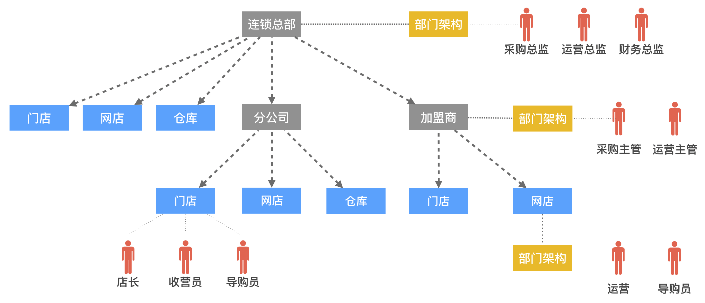

上图描述的是一个中型规模的零售企业的组织架构，是一个多级树状结构，最上层是连锁总部，连锁总部下有直营的门店、网店、仓库，还有下属的其他管理单元：分公司、加盟商。分公司、加盟商下又有自己的门店、网店、仓库。每个节点都可以有独立的部门架构，例如：采购部、运营部、财务部等，部门下会设置不同的岗位角色。例如：采购主管、运营主管等。

#### 1.2.2 零售业务场景繁多

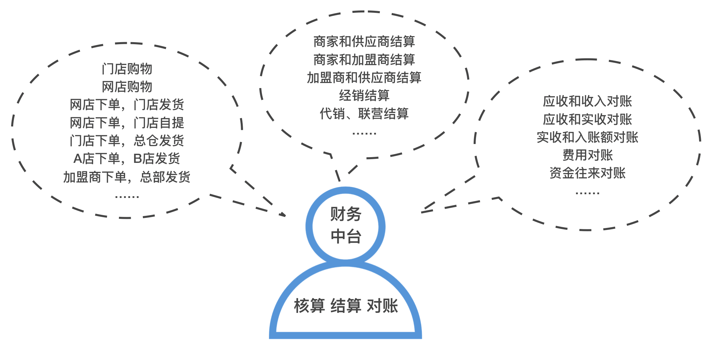

介绍完零售企业的组织架构，再来看下零售业务场景。零售业务场景多而复杂，站在财务中台的视角来看，主要职责是做好3件事：核算、结算、对账。

首先看下核算场景，财务中台需要对各类业务场景进行实时核算，这里只列举了销售场景。销售的场景就有很多，比如：门店购物、网店购物、网店下单，门店发货、网店下单，门店自提、门店下单，总仓发货、A店下单B店发货、加盟商下单总部发货等。

结算场景列举了商家和供应商结算、商家和加盟商结算、加盟商和供应商结算。结算又会受经营方式的影响，分为经销结算、代销结算、联营结算。

对账场景列举了应收和收入对账、应收和实收对账、实收和入账额对账、费用对账、资金往来对账。

可以看到光财务领域的场景就非常多，而且核算、结算、对账相互之前也不是独立的，有着错综复杂的关系。如果要为商家提供一整套的零售解决方案，场景多而繁杂是需要面对的巨大挑战。

#### 1.2.3 零售垂直行业需求差异化

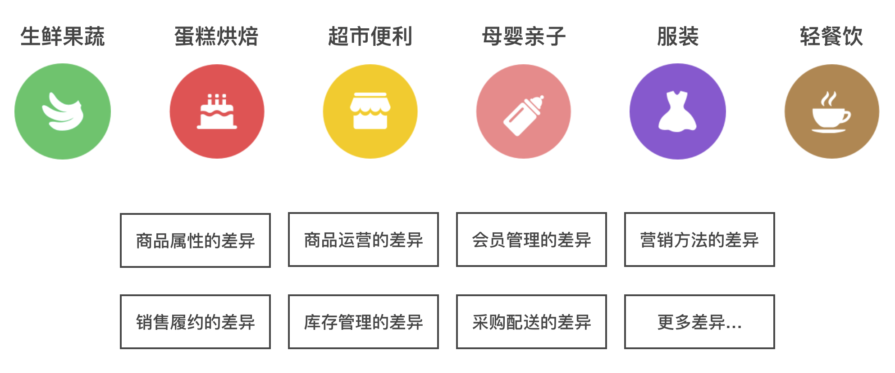

接下来看看零售垂直行业需求差异化的问题，这里列举了6大垂直行业，生鲜果蔬、蛋糕烘焙、超市便利、母婴亲子、服装、轻餐饮，每个垂直行业差异化的需求都非常多，例如商品属性的差异、商品运营的差异、会员管理的差异、营销方法的差异、销售履约的差异等等。具几个例子：

- 生鲜果蔬行业，网店下单门店自提的场景，消费者在网店下单1KG大闸蟹，到门店去自提，服务员按1KG重量去称，但是通常来说，都不会刚刚好1KG，要么多一点，要么少一点。那么少称了，商家需要退钱给消费者；多称了，可能免费送，也可能找消费者补钱。这在其他标品行业是很少见的场景。
- 蛋糕烘焙行业，为了保证蛋糕的新鲜，消费者网店下单后，大多情况下，是没有成品的，需要基于原材料或半成品加工出成品，然后通过同城配送快速送达到消费者手中。在蛋糕烘焙行业，商品的新鲜程度是非常重要的一个卖点。
- 母婴亲子行业，通常都是由父母来做消费决策，儿童年龄比较小，没有独立做决策的能力，而且母婴亲子行业是复购率非常高的行业，因此商家非常重视会员的管理与营销。在维护会员信息时，不仅要维护好父母的信息，还要维护好儿童的信息，例如在儿童生日的时候，可以定向推送一些营销活动。

### 1.3 核心挑战点是什么？

总结一下，零售SaaS产品的核心挑战点究竟是什么？

- 业务复杂度的挑战：业务问题域本身过于庞大而复杂，业务功能间的相互依赖和影响会导致复杂度指数级地增加，团队无法控制新变化对原有系统的影响。
- 技术复杂度的挑战：技术复杂度来源于诸如安全、高性能、高并发、高可用性等非功能性需求，随着SaaS产品的用户量不断增长，会为系统设计带来了极大的挑战，然而开发人员容易将业务复杂度的与技术复杂度耦合在一起，导致系统更加错综复杂。
- 组织上的挑战：由于业务过于复杂，上层的目标又偏概括、抽象，导致业务目标很难拆解落地。当下层发生冲突时，由于业务边界不清晰，很难快速做出有效的决策。

## 二、如何解决高度复杂的业务问题？

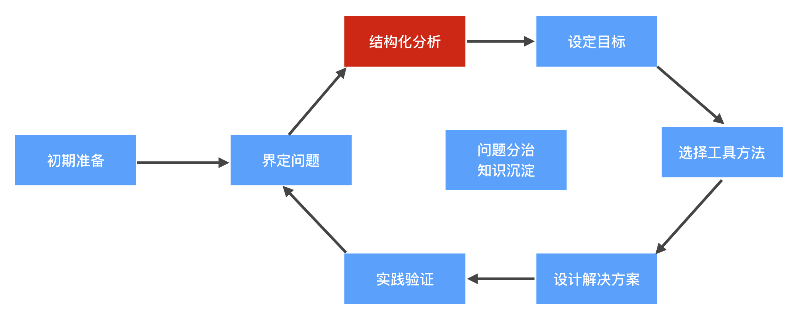

我们先看下，解决一个高度复杂的业务问题，思路是怎样的？

一开始需要做些初期的准备，收集必要的信息，例如：客户是谁，组织结构是怎样的？客户有哪些痛点？客户的业务是如何运作的？

然后要把问题界定清楚，我们需要解决的问题范围是什么？接下来就是结构化的分析、设定阶段性目标、选择工具方法、设计解决方案、实践验证。然后又会有新的需求出现，继续迭代演进。核心围绕2个关键点：问题分治，知识沉淀。

这条链条首先要解决的核心问题是，如何做好结构化分析？因为解决高度复杂的业务问题的关键，是把问题结构化拆解成一个个可解决的小问题，这样我们才能抓住一条主脉络，循序渐进地进行探索和分析，否则只会深陷细节泥潭，迷失在其中。后文会重点讨论一下如何做好结构化分析。

### 2.1结构化分析——架构类型

结构化分析首先会用到的一个工具是架构类型，分为业务架构、应用架构、数据架构、技术架构。

业务架构包括企业的组织架构、业务域划分、业务能力地图、业务流程等内容。业务架构的核心是定义清楚整个企业的业务是如何运作的，在运作过程中有哪些痛点问题，为不同的问题域划分清晰的边界，梳理出每个问题域的业务需求，并最终提炼出产品需求，为后续系统建设提供清晰明确的指导。

应用架构包括系统划分、应用服务划分、应用间交互等内容。应用架构需要定义整个产品需要建设哪些业务系统，系统间如何集成，系统内是否需要划分应用容器，每个应用容器提供哪些服务能力，哪些服务需要下沉为领域服务，哪些服务直接为前端提供业务服务。

数据架构包括领域模型、物理模型等。数据架构是以业务架构为基础，梳理出企业运作过程中需要记录下来的数据，并通过领域建模方法，提炼出领域模型。除此之外，数据架构还需要考虑数据如何存储，综合考虑数据的一致性、安全性、可靠性、通用性等因素，对物理存储模型进行建模。

技术架构就是传统技术人员比较熟悉的领域，主要是解决各类技术需求，包括部署拓扑、网络拓扑、微服务架构、存储架构等。

4种架构的关系是，最上层是业务架构，应用架构和数据架构一方面支撑业务架构，一方面指导开发人员如何应用IT技术，将业务架构落地。技术架构需要关注具体的技术需求，例如技术框架的选型，以及其他非功能性的需求，例如，高可用、高性能、扩展性、安全、简洁性等。

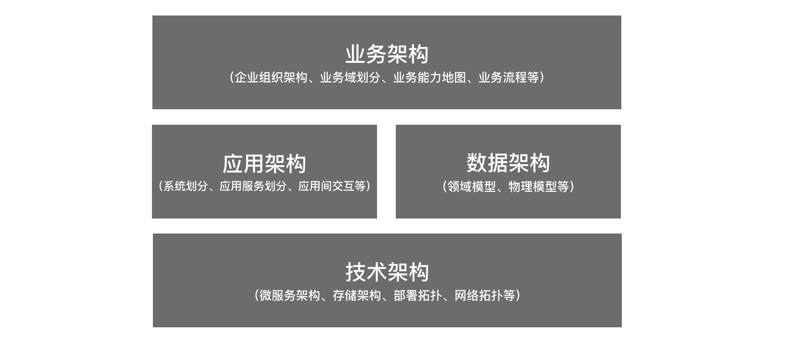

### 2.2结构化分析——抽象分层

结构化分析会用到的另一个重要工具是抽象分层。首先说一下为什么要进行抽象分层？

- 人脑处理信息的能力有限。如果信息量超过了人脑的处理能力，那么人会失去对该事物的理解。零售业务的信息量非常庞大，没有人能够同一时间处理这么庞大的信息量，需要找到一种概括、抽象的方法去理解零售业务。在面对高度复杂的问题时，我们可以通过不断提升抽象层次来解决更为复杂的问题。
- 沟通协作的需要。团队需要基于统一的设计语言来进行沟通，否则在面的大量复杂问题时，沟通经常会不在一个频道上，出现理解偏差、反复沟通的情况。
- 让架构设计思路更加清晰有条理。不管是梳理已有业务，还是梳理创新型业务，如果能基于标准化的抽象层次梳理，整个过程将会更加有条理。
- 有利于领域知识的沉淀和传承。在复杂业务系统的迭代过程中，知识沉淀是尤为重要的，否则业务系统很快就变成一个“大泥球”系统，没有人理得清内部的业务逻辑和业务关系。然而知识沉淀的前提是要有一个知识框架，否则知识没有附着的地方，而标准化的抽象层次就是一个最基础的知识框架。

抽象层次需要结合前文提到的架构类型来梳理，因为不同架构类型的视角不一样，因此抽象层次也不太一样。

#### 业务架构的抽象层次

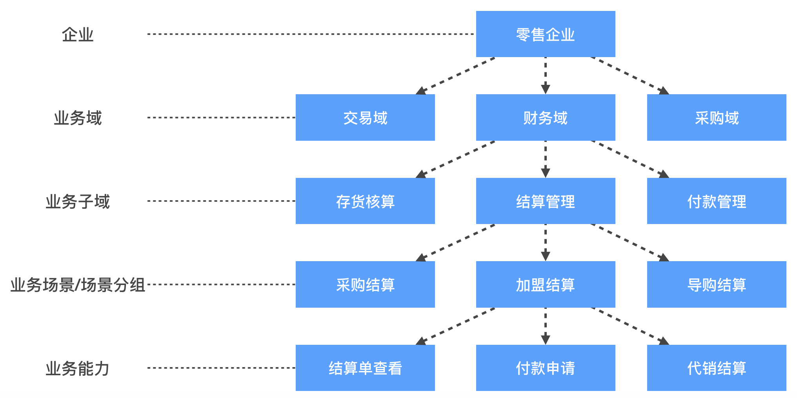

首先介绍一下业务架构的抽象层次，最顶层是零售企业。

第二层是业务域层次，例如，交易域、财务域、采购域等。

第三层是业务子域层次，例如财务域下细分出存货核算、结算管理、付款管理。这里提到的业务域、业务子域和领域驱动设计（DDD）中的领域、子域概念是对应的，即按照一定规则对庞大的问题域进行细分。

第四层是业务场景/场景分组层次，例如采购结算场景、加盟结算场景、导购结算场景。

最底层是业务能力，可以理解为一个个具体的业务功能，例如，结算单查看、付款申请、代销结算。

#### 应用架构的抽象层次

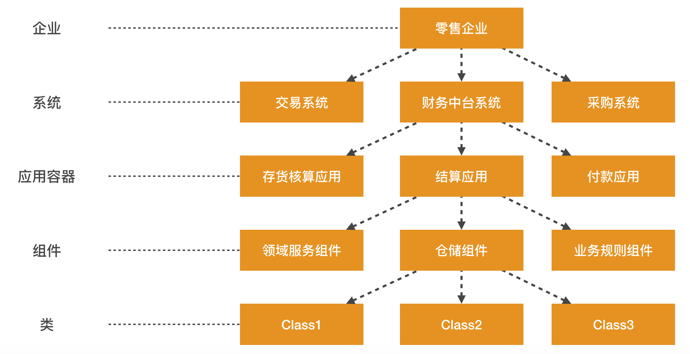

上图描述的是应用架构的抽象层次，最顶层同样是零售企业。

第二层是系统层次，例如：交易系统、财务中台系统、采购系统等。

第三层是应用容器层次，例如：存货核算应用、结算应用、付款应用。

第四层是组件层次，例如领域服务组件、仓储组件、业务规则组件。

最底层是类。

这里参考了西蒙布朗提出的C4模型。技术架构的抽象层级可以参考应用架构，所以在后文中省略。

#### 数据架构的抽象层次

上图描述的是数据架构的抽象层次，最顶层同样是零售企业，然后是业务域模型、业务子域模型。

数据架构的抽象层次不会太多，因为数据模型本身就是高度抽象的、可复用的，本身的抽象级别就很高。

#### 抽象层次之间的关系

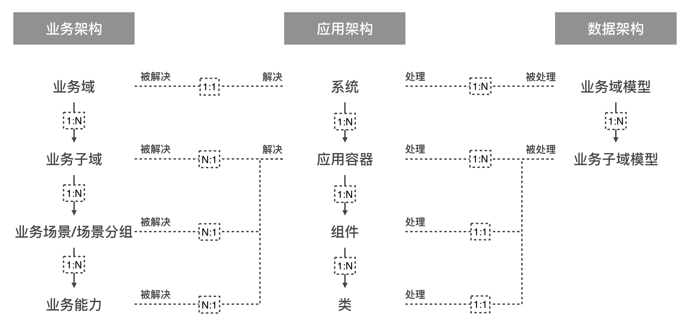

上图描述的是各架构类型的抽象层次之间的关系。从大的逻辑上看，应用架构是负责解决业务架构中各个问题域范围内的问题。数据架构中的模型会被应用架构中的各个单元处理。各层次的关系如上图所示。

## 三、财务中台架构的落地实践

接下来，结合财务中台架构落地的经验，介绍财务中台是如何循序渐进地进行架构设计工作。

### 3.1 业务架构分析

首先是业务架构分析，前文中提到业务架构包括企业的组织架构、业务域划分、业务能力地图、业务流程等内容。业务架构的核心是定义清楚整个企业是如何运作的，在运作过程中有哪些痛点问题，为不同的问题域划分清晰的边界，梳理出每个问题域的业务需求，并最终提炼出产品需求，为后续系统建设提供清晰明确的指导。

#### 3.1.1 企业的组织架构

ToB产品和ToC产品有一个显著的区别是，ToB产品面向的客户是企业，ToC产品面向的客户是个人。企业内部有复杂的组织架构，会设立公司、部门、岗位。各个公司、部门、岗位会有不同的职责和权力，三者相互之间会产生错综复杂的关系。所以在获取用户需求时，首先需要梳理清楚企业的组织架构，然后按照组织架构的脉络循序渐进地进行需求调研。在访谈不同层级的用户时，访谈的要点也要有所侧重。前文中1.2.1列举了一个中型规模的零售企业的组织架构，此处不再详细展开。

#### 3.1.2 业务能力图

其次，是业务能力地图，它要表达的是业务域提供那些业务能力。既然是地图，那会有类似国家、省、市、区的概念，前文提到的抽象层次，和地图中国家、省、市、区的概念是一致的。首先是业务域，代表了整个财务中台的问题域，业务域会包含多个业务子域，接着是核心场景，最后是业务能力。通过业务能力地图，我们可以清楚地看到问题域拆解成了哪些子域，每个子域有哪些场景，在场景中，产品需要提供哪些业务能力。这些领域划分、业务能力划分的逻辑能够进一步指导后续应用架构的设计。

#### 3.1.3 业务流程分析

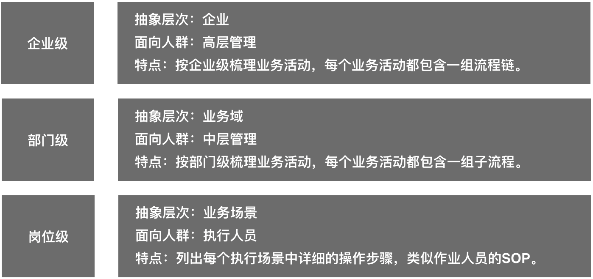

在做ToB业务流程分析的时候，首先要理解业务流程是具备层次性的，从上到下可以分为企业级、部门级、岗位级：

- 企业级流程：抽象层次是企业，面向人群是零售企业的高层管理，按企业级梳理业务活动，每个业务活动都包含一组流程链。例如一个企业级流程可能包括门店开张、供应商管理、采购、物流配送、销售、售后服务、财务管理等环节。
- 部门级流程：抽象层次是业务域，面向人群是中层管理，按部门级梳理业务活动，每个业务活动都包含一组子流程。
- 岗位级流程：抽象层次是业务场景，面向人群是执行人员，列出每个执行场景中详细的操作步骤，类似作业人员的SOP。

梳理业务流程时，需要自顶向下循序渐进地进行，这样才能保证业务流程的梳理工作不重不漏、全面覆盖，进而真实地了解零售企业的业务模式、管理现状，为商家提供直击痛点的解决方案。

### 3.2 数据架构分析

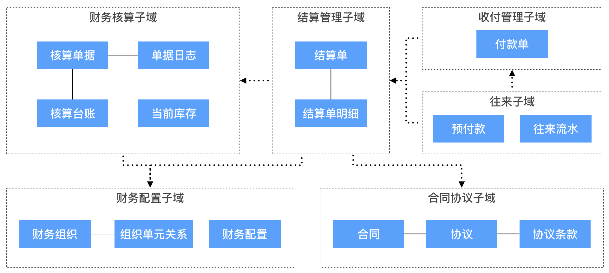

接下来是数据架构分析，这里展示的是一部分财务中台业务域的领域模型图，它所处的抽象层次是业务子域层次，每个虚线框代表一个业务子域，业务子域之间有上下游关系，业务子域内部是领域模型以及模型之间的关系，包含一个个的聚合，每个聚合都有一个聚合根，其他实体都会依附于某一个聚合根存在。

领域模型设计是非常重要的架构设计工作，因为领域模型是每个业务域和业务子域的核心，后续要实现的各种服务能力，都是围绕领域模型来组织的。领域模型没有设计好，对业务发展的影响是非常长远的，一方面会影响团队对业务的理解，导致系统可维护性越来越差；另一方面如果要建设数据中台，也会让数据中台的建设困难重重。

### 3.3 应用架构分析

应用架构需要定义整个产品需要建设哪些业务系统，系统间如何集成，系统内是否需要划分应用容器，每个应用容器提供哪些服务能力，哪些服务需要下沉为领域服务，哪些服务直接为前端提供业务服务。

整个应用架构同样是具备层次性的，分为系统层次、容器层次、组件层次、类层次。

#### 3.3.1系统间关系（系统层次）

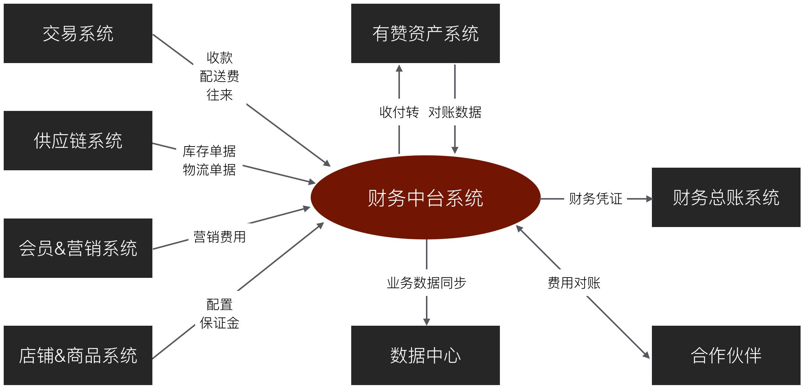

首先是系统层次的系统关系图，该层次重点关注当前设计的系统和其他系统间的关系。系统划分的依据很大程度来源于业务架构中业务域划分的结果。

#### 3.3.2 系统内架构（容器层次）

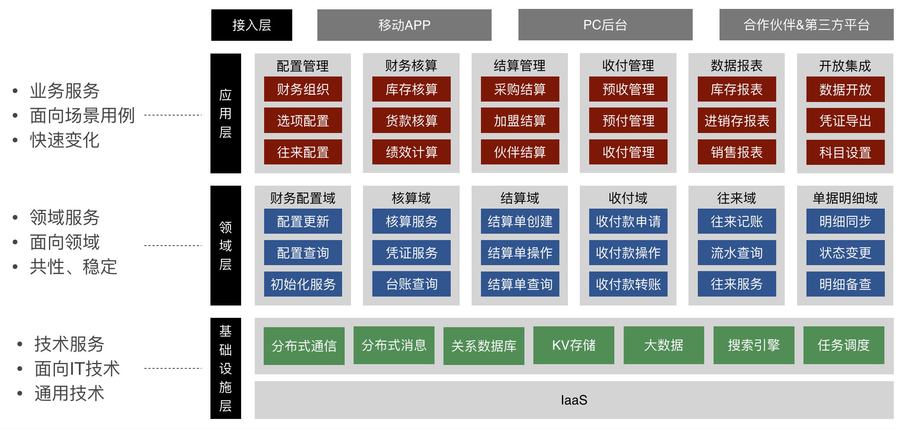

然后是容器层次，该层次会将整个系统放大，这个图是财务中台系统的逻辑架构图，每个方框都是一个逻辑单元。从架构上也是采用分层结构，最上层是接入层，然后是应用层、领域层、基础设施层。

应用层是提供业务服务，面向场景用例，特点是快速变化。业务服务和业务能力是一一对应的，业务服务的职责就是实现某一种业务能力，因为这一层的服务是直接面向用户，所以这一层变动会非常频繁，为了应对快速变化的外部需求，会通过编排领域服务来实现业务流程的快速适配上线。

领域层提供领域服务，面向领域，特点是共性、稳定。领域层是很厚的一层，它是业务系统的核心所在，包含了领域对象、领域服务以及领域逻辑。用户的需求经常变化，但变化总是有规律的，用户体验、操作习惯、市场环境以及操作流程的变化，往往会导致界面逻辑、应用逻辑变化，但核心领域逻辑不会有太大变化，所以会把共性、稳定的业务逻辑沉淀到领域层，为应用层快速适配业务提供弹药，提高业务需求的响应力。

基础设施层向其他层提供通用的技术服务，例如：分布式通信能力、分布式消息、持久化能力、搜索、任务调度能力等。

#### 3.3.3 应用容器架构（组件层次）

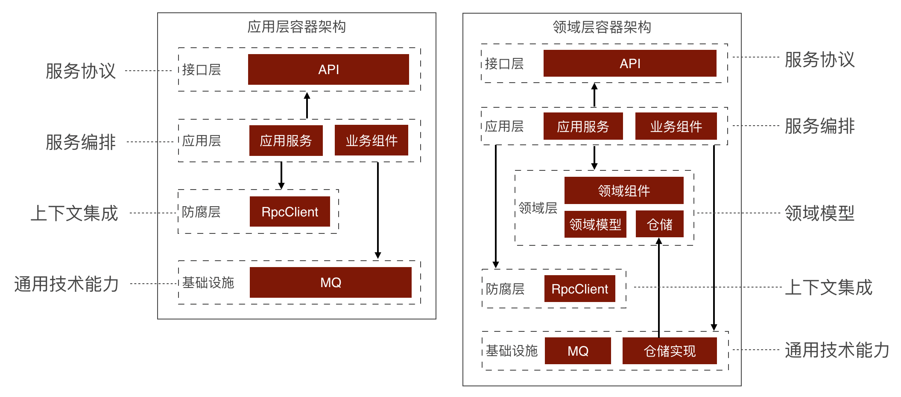

然后是组件层次，该层次会将单个容器放大，组件是由一个或多个类组成的逻辑组，共同完成一类职责。容器类型会分为应用层容器和领域层容器。

应用层容器内部会分接口层、应用层、防腐层、基础设施层，每层都有各自的职责。应用层容器的职责通常是编排领域服务，实现业务用例。应用层容器通常没有领域模型，因此也不需要访问数据库。

领域层容器比应用层容器多了领域层，这里的领域层是战术级别的领域层，内部包含各种领域模型，领域组件、仓储，关键的业务逻辑、业务规则都主要放在这里。

#### 3.3.4 层次间关系

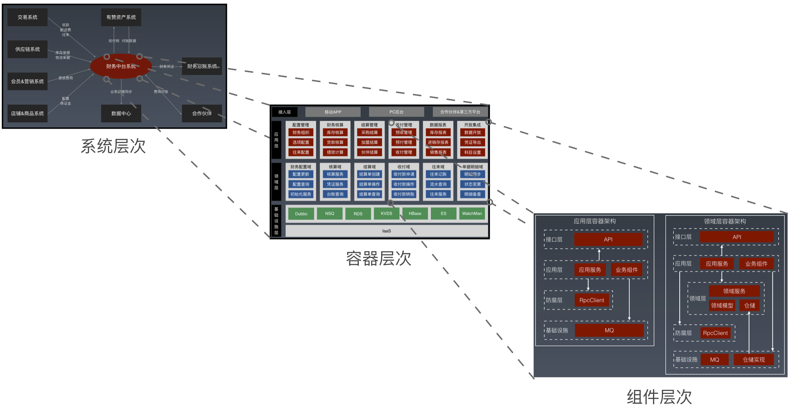

上图是应用架构各个层次之间的关系，最顶层是系统层次，描述的系统之间的关系。然后是容器层次，该层次会将整个系统放大。接着是组件层次，该层次会将单个容器放大。总结来说，每一层次都是对上一层次的放大和细化，把问题层层拆解到可执行的程度。有了应用架构，基本就能指导开发人员设计和编码了。

### 3.4 技术架构：具体问题具体分析

最后是技术架构，技术架构需要关注具体的技术需求。技术架构要解决的问题就比较杂，主要解决高性能、高可用、可扩展、低成本、安全、业务规模，这几类问题，解决方案也五花八门，由于这块内容非常多，也不是本文的重点，这里只探讨一个问题：如何进行微服务拆分？

#### 3.4.1 如何进行微服务拆分？

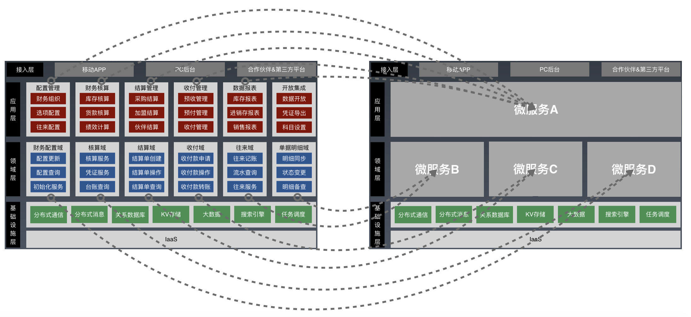

微服务拆分的依据是什么？其中一个重要的依据是应用架构中的系统内逻辑架构，需要把哪些代码模块部署到一个微服务中，需要参考逻辑单元是如何划分的，把相关的服务部署在一起，关联性不大的可以分开部署，应用层服务和领域层服务根据重要程度不同，也可以分开部署。另外，还需要考虑是否真的有业务痛点，业务真正遇到了迭代速度慢或高并发等问题，如果不拆分，将对于业务发展带来较大影响。不能为了拆分而拆分，因为每次拆分都会带来运维成本的增加。上图简单示意了一个微服务拆分的案例，只是示意，真实情况会更加复杂一些。

### 3.5 架构与团队间的关系

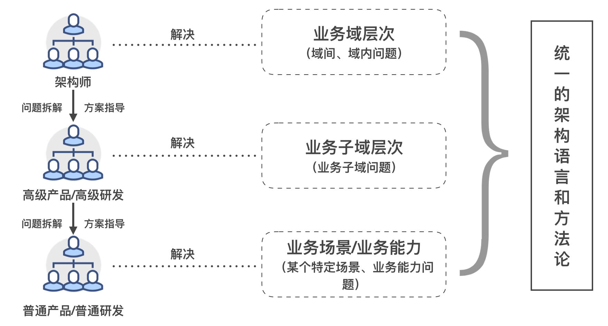

最后探讨一下架构与团队间的关系，架构产出物为产研团队提供了非常有效的帮助和指导。团队也是分梯队的，如何将团队梯队和架构有效得结合起来呢？这里介绍了架构与组织间的对应关系，最上层是架构师，负责解决域间和域内的问题，中间是高级产品、高级研发，负责解决业务子域的问题，下层是普通产品、普通研发，负责解决某个特定场景或业务能力的问题。上层对下层提供问题拆解、方案指导的服务。然而整个框架有个重要的基础，就是整个团队要基于统一的架构语言和方法论进行协作，如果没有统一，势必会导致反复的沟通和低效的协作。

## 四、中台建设的一些思考

### 4.1 中台是什么？

中台是一套先进的架构理念，通过持续提炼可复用的能力，达到快速响应客户需求的目的。

中台概念来源于阿里的中台战略，但是，中台不能简单地照搬照抄，需要结合企业的业务特点，沉淀一套自身的架构方法论。

### 4.2 中台建设的基础

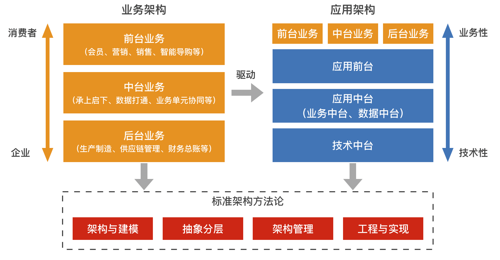

前文提到零售SaaS业务架构分为前台业务、中台业务、后台业务。业务架构会驱动应用架构的设计与建设，应用架构最上层是业务架构的内容，应用前台负责支撑整个业务架构，应用中台主要包括业务中台、数据中台，应用中台为应用前台提可复用的业务能力，帮助应用前台快速支撑业务发展，技术中台为应用前台、中台提供可复用的技术能力。但是整个架构需要建立在一套标准的架构方法论之上，在建设中台的过程中，它为团队提供统一的原则和标准，帮助团队更好的理解整个架构体系，进而持续迭代和演进整体架构。没有这套方法论，中台建设只是空中楼阁，无法顺利落地。

### 4.3 业务中台与架构方法间的关系

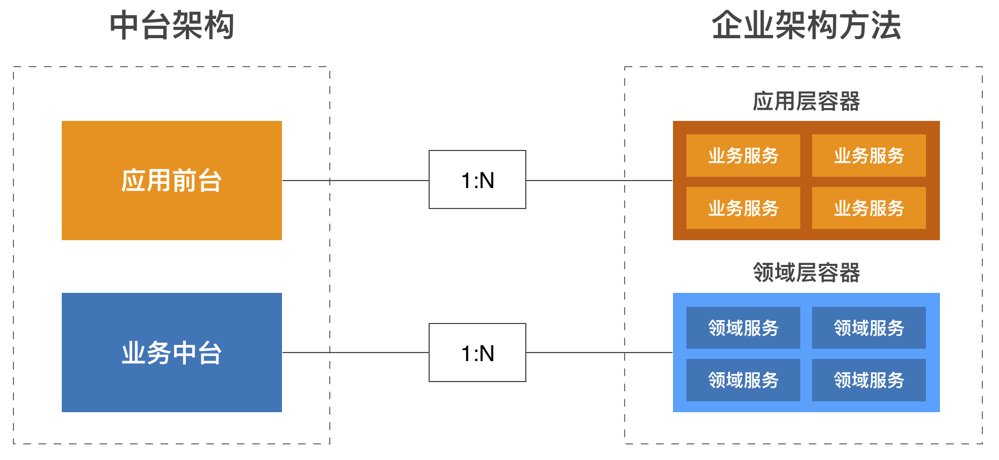

前文提到的分析方法和架构方法，都属于企业架构方法论的范畴。中台架构实际上是企业架构方法落地实践后，自然而然的一个结果。应用前台最终表现为多个应用层的容器，为接入端提供一个个具体的业务服务。业务中台最终表现为一个个领域层容器，为应用层容器提供领域服务，支撑应用前台快速响应客户需求。企业架构方法总结到位，并执行到位，中台架构就会成为最终的表现形式。

### 4.4 中台思考：几点实践体会

中台建设的基础是建立一套标准的架构方法论，并持续优化。

关注高质量的领域能力建设，避免低质量的重复建设。提高效率、降低成本非常有效的手段。

中台建设是一场持久战，团队共识是关键。

中台建设是手段，不是目的，目的始终是快速响应客户需求，帮助客户成功。不能为了建中台而建中台，如果能助力业务更好发展，那就吸纳进来，如果不行，那中台概念再热门也只能放弃。

## 五、总结

本文首先介绍了有赞零售的业务背景，讨论零售SaaS业务复杂度的来源，然后引出了3个核心挑战点。接着，探讨了如何解决高度复杂的业务问题，核心是做好结构化分析，重点介绍了2种分析工具，架构类型和抽象分层。然后，结合财务中台架构落地的经验，讲述财务中台是如何循序渐进地进行架构设计工作。最后介绍了中台建设过程中的一些思考。希望通过这篇文章，能为读者在架构设计上提供一些参考价值。
