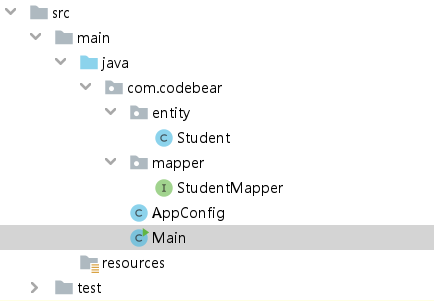
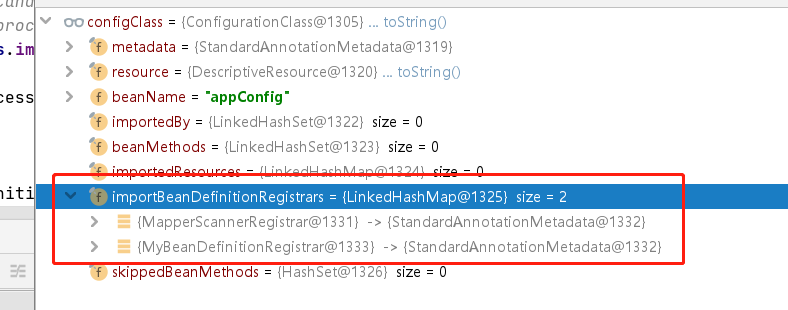

# Spring MyBatis和Spring整合的奥秘

_本篇博客源码分析基于Spring 5.1.16.RELEASE，mybatis-spring 2.0.0，较高版本的mybatis-spring源码有较大区别。_

Spring之所以是目前Java最受欢迎的框架，几乎所有的Java项目都在使用，就是因为它良好的生态，很多技术可以与之整合，为什么其他技术可以和Spring相整合，就是因为Spring拥有很多扩展点，阅读Spring源码，有一部分原因就是有必要清楚的知道Spring提供了哪些扩展点，而怎么合理的利用这些扩展点，就需要了解其他技术是如何利用这些扩展点的。

今天我就来带着大家看下，国内最流行的数据库框架MyBatis是如何利用Spring的扩展点的，从而双剑合璧，让Spring+MyBatis成为国内最流行的技术搭配。

### 前置知识

为了后面的故事可以顺利展开，很有必要先给大家介绍下，阅读mybatis-spring源码的前置知识，没有这些前置知识阅读mybatis-spring源码是寸步难行。

#### mybatis-spring使用

因为现在有了SpringBoot，所以Mybatis和Spring的整合变得非常简单，但是如果没有SpringBoot，该怎么整合呢？我翻阅了百度的前几页，不知道是不是搜索关键词问题，几乎全是用XML的方式去整合Mybatis和Spring的，零XML配置，它不香吗？

代码结构： 

具体实现：

```java
 <dependencies>
        <dependency>
            <groupId>org.mybatis</groupId>
            <artifactId>mybatis-spring</artifactId>
            <version>2.0.0</version>
        </dependency>
        <!-- https://mvnrepository.com/artifact/org.springframework/spring-context -->
        <dependency>
        <groupId>org.springframework</groupId>
            <artifactId>spring-context</artifactId>
            <version>5.1.16.RELEASE</version>
        </dependency>
        <!-- https://mvnrepository.com/artifact/org.mybatis/mybatis -->
        <dependency>
            <groupId>org.mybatis</groupId>
            <artifactId>mybatis</artifactId>
            <version>3.4.0</version>
        </dependency>
        <!-- https://mvnrepository.com/artifact/org.springframework/spring-jdbc -->
        <dependency>
            <groupId>org.springframework</groupId>
            <artifactId>spring-jdbc</artifactId>
            <version>5.1.10.RELEASE</version>
        </dependency>
        <!-- https://mvnrepository.com/artifact/mysql/mysql-connector-java -->
        <dependency>
            <groupId>mysql</groupId>
            <artifactId>mysql-connector-java</artifactId>
            <version>6.0.5</version>
        </dependency>
    </dependencies>
@MapperScan("com.codebear.mapper")
@ComponentScan
public class AppConfig {
    @Bean
    public SqlSessionFactory sqlSessionFactory() throws Exception {
        DriverManagerDataSource dataSource = new DriverManagerDataSource();
        dataSource.setDriverClassName("com.mysql.jdbc.Driver");
        dataSource.setUrl("jdbc:mysql://localhost:3306/test?useUnicode=true&characterEncoding=UTF-8&serverTimezone=UTC");
        dataSource.setUsername("root");
        dataSource.setPassword("123456");
        SqlSessionFactoryBean factoryBean = new SqlSessionFactoryBean();
        factoryBean.setDataSource(dataSource);
        return factoryBean.getObject();
    }
}
@Repository
public interface StudentMapper {
    @Select("select * from student")
    List<Student> getList();
}
public class Main {
    public static void main(String[] args) {
        ApplicationContext applicationContext = new AnnotationConfigApplicationContext(AppConfig.class);
        System.out.println(applicationContext.getBean(StudentMapper.class).getList());
    }
}
```

运行结果：

```plaintext
[Student{id=1, name='疫苗王', age=20}, Student{id=2, name='阿修罗独角仙', age=18}, Student{id=3, name='地底王', age=18}]
```

#### Import注解

如果我们想把一个类注册到Spring容器中，可以采用的方法有很多，其中一种是利用Import注解，Import注解有三种用法，mybatis-spring利用的是其中一种用法，Import了ImportBeanDefinitionRegistrar类，所以我们这里只看Import ImportBeanDefinitionRegistrar。

##### 如何使用

```java
public class MyBeanDefinitionRegistrar implements ImportBeanDefinitionRegistrar {
    public void registerBeanDefinitions(AnnotationMetadata annotationMetadata, BeanDefinitionRegistry beanDefinitionRegistry) {
        System.out.println(annotationMetadata.getAnnotationTypes());
    }
}
```

写一个类实现ImportBeanDefinitionRegistrar ，重写其中的registerBeanDefinitions方法。

```java
@Import(MyBeanDefinitionRegistrar.class)
@ComponentScan
@MapperScan("com.codebear.mapper")
public class AppConfig {
    @Bean
    public SqlSessionFactory sqlSessionFactory() throws Exception {
        DriverManagerDataSource dataSource = new DriverManagerDataSource();
        dataSource.setDriverClassName("com.mysql.jdbc.Driver");
        dataSource.setUrl("jdbc:mysql://localhost:3306/test?useUnicode=true&characterEncoding=UTF-8&serverTimezone=UTC");
        dataSource.setUsername("root");
        dataSource.setPassword("123456");
        SqlSessionFactoryBean factoryBean = new SqlSessionFactoryBean();
        factoryBean.setDataSource(dataSource);
        return factoryBean.getObject();
    }
}
```

在配置上加上@Import注解，写上刚才写的MyBeanDefinitionRegistrar类。

运行结果：

```plaintext
[org.springframework.context.annotation.Import, org.springframework.context.annotation.ComponentScan, org.mybatis.spring.annotation.MapperScan]
```

从registerBeanDefinitions两个入参的命名来看，第一个参数，Spring把注解元数据给你了，而第二个参数，Spring是直接把beanDefinition的注册器给你了。

##### 追本溯源

下面我们来看看Spring在什么时候处理@Import注解的，又是什么时候调用registerBeanDefinitions方法的，当然这里不是Spring源码分析，我不会详细一行行翻译，而是简单的找到源头。

```plaintext
//AnnotationConfigApplicationContext#AnnotationConfigApplicationContext(Class<?>... componentClasses)
 public AnnotationConfigApplicationContext(Class<?>... componentClasses) {
  this();
  register(componentClasses);
  refresh();
 }
```

进入第三行的refresh()方法。

refresh方法做了很多事情，我们只需要关心invokeBeanFactoryPostProcessors方法：

```plaintext
//AbstractApplicationContext#refresh
invokeBeanFactoryPostProcessors(beanFactory);
```

执行invokeBeanFactoryPostProcessors方法，顾名思义，这个方法是执行BeanFactoryPostProcessor的。什么，你不知道什么是BeanFactoryPostProcessor？你可以简单的理解为Spring遵循插件化式的开发，其中有一个插件叫ConfigurationClassPostProcessor，实现了BeanDefinitionRegistryPostProcessor，同时BeanDefinitionRegistryPostProcessor又实现了BeanFactoryPostProcessor，通过ConfigurationClassPostProcessor的postProcessBeanDefinitionRegistry的方法，Spring完成了扫描。

```plaintext
//PostProcessorRegistrationDelegate#invokeBeanFactoryPostProcessors
invokeBeanDefinitionRegistryPostProcessors(currentRegistryProcessors, registry);
```

这一步传入了BeanDefinitionRegistryPostProcessor的集合，要执行BeanDefinitionRegistryPostProcessor的postProcessBeanDefinitionRegistry方法，集合有一个元素是我们关心的，就是上面提到的ConfigurationClassPostProcessor。

```plaintext
//PostProcessorRegistrationDelegate#invokeBeanDefinitionRegistryPostProcessors
for (BeanDefinitionRegistryPostProcessor postProcessor : postProcessors) {
   postProcessor.postProcessBeanDefinitionRegistry(registry);
}
```

循环传入的BeanDefinitionRegistryPostProcessor集合，调用postProcessBeanDefinitionRegistry方法，我们直接进入到ConfigurationClassPostProcessor的processConfigBeanDefinitions方法，找到关键解析代码：

```plaintext
//ConfigurationClassPostProcessor#processConfigBeanDefinitions
parser.parse(candidates);
//ConfigurationClassParser#parse
parse(((AnnotatedBeanDefinition) bd).getMetadata(), holder.getBeanName());
//ConfigurationClassParser#processConfigurationClass
doProcessConfigurationClass(configClass, sourceClass);
//ConfigurationClassParser#doProcessConfigurationClass
processImports(configClass, sourceClass, getImports(sourceClass), true);
```

重点来了，终于找到了我们的目标：处理@Import注解。

```plaintext
//ConfigurationClassParser#processImports
configClass.addImportBeanDefinitionRegistrar(registrar, currentSourceClass.getMetadata());
//ConfigurationClass#addImportBeanDefinitionRegistrar
this.importBeanDefinitionRegistrars.put(registrar, importingClassMetadata);
```

这个importBeanDefinitionRegistrars就是一个Map：

```java
//ConfigurationClass
private final Map<ImportBeanDefinitionRegistrar, AnnotationMetadata> importBeanDefinitionRegistrars = new LinkedHashMap<>();
```

让我们就监视下configClass：  可以看到我们写的MyBeanDefinitionRegistrar被放入了importBeanDefinitionRegistrars ，我们需要记住这个集合，至于还有一个什么，这里不用关心，当然，聪明的小伙伴肯定知道这是什么了。

我们写的MyBeanDefinitionRegistrar只是被放入了一个Map，并没有执行，下面我们要找找它是在哪里执行的。

我们需要回到ConfigurationClassPostProcessor的processConfigBeanDefinitions方法：

```plaintext
//ConfigurationClassPostProcessor#processConfigBeanDefinitions
this.reader.loadBeanDefinitions(configClasses);
//ConfigurationClassBeanDefinitionReader#loadBeanDefinitions
loadBeanDefinitionsForConfigurationClass(configClass, trackedConditionEvaluator);
//ConfigurationClassBeanDefinitionReader#loadBeanDefinitionsForConfigurationClass
loadBeanDefinitionsFromRegistrars(configClass.getImportBeanDefinitionRegistrars());
```

这个集合是不是有点眼熟，就是我在上面让大家记住的集合，这个集合就存放着我们的写的MyBeanDefinitionRegistrar类，让我们继续点进去：

```plaintext
//ConfigurationClassBeanDefinitionReader#loadBeanDefinitionsFromRegistrars
 private void loadBeanDefinitionsFromRegistrars(Map<ImportBeanDefinitionRegistrar, AnnotationMetadata> registrars) {
  registrars.forEach((registrar, metadata) ->
    registrar.registerBeanDefinitions(metadata, this.registry));
 }
```

循环传入的ImportBeanDefinitionRegistrar集合，调用registerBeanDefinitions方法，我的天，终于找到执行方法了。

#### FactoryBean

Spring就像是一个魔术师的袋子，而FactoryBean就是被魔术师装进袋子的香蕉，当魔术师打开袋子，发现香蕉变成鸽子了。

##### 如何使用

```java
@Component
public class MyFactoryBean implements FactoryBean<Teacher> {
    public Teacher getObject() {
        Teacher teacher = new Teacher();
        teacher.setName("琦玉老师");
        return teacher;
    }
    public Class<?> getObjectType() {
        return Teacher.class;
    }
}
public class Main {
    public static void main(String[] args) {
        ApplicationContext applicationContext = new AnnotationConfigApplicationContext(AppConfig.class);
        System.out.println(applicationContext.getBean(MyFactoryBean.class));
        System.out.println(applicationContext.getBean(Teacher.class));
        System.out.println(applicationContext.getBean("&myFactoryBean"));
        System.out.println(applicationContext.getBean("myFactoryBean"));
        System.out.println(applicationContext.getBean("myFactoryBean").hashCode());
        System.out.println(applicationContext.getBean("myFactoryBean").hashCode());
    }
}
```

运行结果：

```plaintext
[email protected]
Teacher{name='琦玉老师'}
[email protected]
Teacher{name='琦玉老师'}
442125849
442125849
```

可以很清楚的看到从FactoryBean里面又生产出了一个Bean，生产出来的Bean就是FactoryBean中getObject方法返回的。

##### 追本溯源

和上面一样，我们也要看看FactoryBean中的getObject是在哪里执行的，我们先来做个试验：

我们在getObject里面加上一句打印的代码：

```java
@Component
public class MyFactoryBean implements FactoryBean<Teacher> {
    public Teacher getObject() {
        System.out.println("getObject");
        Teacher teacher = new Teacher();
        teacher.setName("琦玉老师");
        return teacher;
    }
    public Class<?> getObjectType() {
        return Teacher.class;
    }
}
```

然后只保留main方法中的创建ApplicationContext方法：

```java
public class Main {
    public static void main(String[] args) {
        ApplicationContext applicationContext = new AnnotationConfigApplicationContext(AppConfig.class);
    }
}
```

运行后，你会发现，控制台没有任何输出，我们大胆的猜想，FactoryBean生产出来的Bean并不是预先加载的，而是采用懒加载的机制，也就是只有需要，才会去加载。

我们继续改下main方法：

```java
    public static void main(String[] args) {
        ApplicationContext applicationContext = new AnnotationConfigApplicationContext(AppConfig.class);
        System.out.println(applicationContext.getBean(Teacher.class));
    }
```

运行结果：

```getObject
Teacher{name='琦玉老师'}
```

所以我们的猜想是正确的，这次入口是getBean。

下面还是枯燥无味的寻找，这次的寻找之旅更复杂：

```java
//org.springframework.beans.factory.support.DefaultListableBeanFactory#getBean(java.lang.Class<T>)
public <T> T getBean(Class<T> requiredType) throws BeansException {
  return getBean(requiredType, (Object[]) null);
}
// org.springframework.beans.factory.support.DefaultListableBeanFactory#getBean(java.lang.Class<T>, java.lang.Object...)
Object resolved = resolveBean(ResolvableType.forRawClass(requiredType), args, false);
//org.springframework.beans.factory.support.DefaultListableBeanFactory#resolveBean
NamedBeanHolder<T> namedBean = resolveNamedBean(requiredType, args, nonUniqueAsNull);
//org.springframework.beans.factory.support.DefaultListableBeanFactory#resolveNamedBean(org.springframework.core.ResolvableType, java.lang.Object[], boolean)
String[] candidateNames = getBeanNamesForType(requiredType);
//org.springframework.beans.factory.support.DefaultListableBeanFactory#getBeanNamesForType(org.springframework.core.ResolvableType)
return getBeanNamesForType(resolved, true, true);
//org.springframework.beans.factory.support.DefaultListableBeanFactory#getBeanNamesForType(java.lang.Class<?>, boolean, boolean)
resolvedBeanNames = doGetBeanNamesForType(ResolvableType.forRawClass(type), includeNonSingletons, true);
```

这个方法里面有一步是循环beanDefinitionNames，当循环到myFactoryBean的时候，判断这是一个FactoryBean：

```plaintext
boolean isFactoryBean = isFactoryBean(beanName, mbd);
```

随后执行isTypeMatch(beanName, type)方法：

```java
//org.springframework.beans.factory.support.AbstractBeanFactory#isTypeMatch(java.lang.String, org.springframework.core.ResolvableType)
Class<?> type = getTypeForFactoryBean((FactoryBean<?>) beanInstance);
//org.springframework.beans.factory.support.FactoryBeanRegistrySupport#getTypeForFactoryBean
return factoryBean.getObjectType();
```

当执行到这里，我们写的MyFactoryBean的getObjectType方法被调用了，返回Teacher.class，而我们现在要找的也是Teacher.class，所以匹配。

随后回到DefaultListableBeanFactory#doGetBeanNamesForType，把beanName放入一个集合中：

```plaintext
if (matchFound) {
 result.add(beanName);
}
```

随后返回集合。

再回到DefaultListableBeanFactory#resolveNamedBean，会判断返回出来的集合的元素的个数，显然只返回一个，执行

```java
//org.springframework.beans.factory.support.DefaultListableBeanFactory#resolveNamedBean
  if (candidateNames.length == 1) {
   String beanName = candidateNames[0];
   return new NamedBeanHolder<>(beanName, (T) getBean(beanName, requiredType.toClass(), args));
  }
```

继续点开getBean方法：

```java
//org.springframework.beans.factory.support.AbstractBeanFactory#getBean(java.lang.String, java.lang.Class<T>, java.lang.Object...)
return doGetBean(name, requiredType, args, false);
//org.springframework.beans.factory.support.AbstractBeanFactory#doGetBean
bean = getObjectForBeanInstance(sharedInstance, name, beanName, null);
//org.springframework.beans.factory.support.AbstractBeanFactory#getObjectForBeanInstance
object = getObjectFromFactoryBean(factory, beanName, !synthetic);
//org.springframework.beans.factory.support.FactoryBeanRegistrySupport#getObjectFromFactoryBean
doGetObjectFromFactoryBean(factory, beanName);
//org.springframework.beans.factory.support.FactoryBeanRegistrySupport#doGetObjectFromFactoryBean
object = factory.getObject();
```

直到这里，才执行了我们写的MyFactoryBean的getObject方法，拿到了我们返回的Teacher对象后。

因为有缓存机制如果我们再去拿，就不会再次调用getObject方法了，这个缓存机制就不再继续分析了，比较复杂，就算不了解也不影响我们今天的主题。

#### JDK动态代理

我以前写过JDK动态代理的博客，大家可以找来看一看 ，这里就不阐述了。

### mybatis-spring源码分析

前置知识介绍完成，有了上面的前置知识，我们就可以一探MyBatis和Spring整合的奥秘。

Mybatis和Spring整合的入口很好找，就是我们再配置上添加的@MapperScan注解，当我们点开@MapperScan：

```plaintext
@Retention(RetentionPolicy.RUNTIME)
@Target(ElementType.TYPE)
@Documented
@Import(MapperScannerRegistrar.class)
@Repeatable(MapperScans.class)
public @interface MapperScan {
}
```

你会发现一个很熟悉的注解，就是我们上面讲的Import注解，Import了MapperScannerRegistrar。

通过上面的源码分析明白，Spring会执行到registerBeanDefinitions方法：

```java
@Override
  public void registerBeanDefinitions(AnnotationMetadata importingClassMetadata, BeanDefinitionRegistry registry) {
   // 拿到我们写的MapperScan注解上带的东西，我们写的，只有一个Value字段。
    AnnotationAttributes mapperScanAttrs = AnnotationAttributes
        .fromMap(importingClassMetadata.getAnnotationAttributes(MapperScan.class.getName()));
    if (mapperScanAttrs != null) {
      registerBeanDefinitions(mapperScanAttrs, registry);
    }
  }
```

继续深入registerBeanDefinitions方法：

```cpp
// 创建了一个扫描器，这个扫描器继承了Spring定义的扫描器：ClassPathBeanDefinitionScanner，
// 扫描的主要是主要作用就是扫描，把bean放到map中去
ClassPathMapperScanner scanner = new ClassPathMapperScanner(registry);
//省略
    basePackages.addAll(
        Arrays.stream(annoAttrs.getStringArray("value"))
            .filter(StringUtils::hasText)
            .collect(Collectors.toList()));
//省略
    scanner.registerFilters();
    scanner.doScan(StringUtils.toStringArray(basePackages));
```

这里主要是创建了一个扫描器，传入了一些规则。

scanner.registerFilters()中有一行代码，比较重要：

```plaintext
// mybatis定义的扫描器最终的扫描任务是交给Spring的扫描器执行的，
// Spring的扫描器中定义了includeFilters，只有符合规则的最终才可以被扫描出来，
// 这里意味着mybatis告诉spring，任何东西你都要给我扫描出来。
  addIncludeFilter((metadataReader, metadataReaderFactory) -> true);
```

让我们看下 scanner.doScan(StringUtils.toStringArray(basePackages))方法：

```java
 @Override
  public Set<BeanDefinitionHolder> doScan(String... basePackages) {
    //交给Spring执行扫描任务，返回beanDefinition、beanName的包装对象，这里就把我们 
    //@MapperScan注解中给定的com.codebear.mapper包中所有的内容都扫描
    //并且返回出来了。
    Set<BeanDefinitionHolder> beanDefinitions = super.doScan(basePackages);
    if (beanDefinitions.isEmpty()) {
      LOGGER.warn(() -> "No MyBatis mapper was found in '" + Arrays.toString(basePackages) + "' package. Please check your configuration.");
    } else {
      processBeanDefinitions(beanDefinitions);
    }
    return beanDefinitions;
  }
```

继续看processBeanDefinitions方法：

```plaintext
// 省略
 for (BeanDefinitionHolder holder : beanDefinitions) {
  definition.setBeanClass(this.mapperFactoryBean.getClass());
}
//省略
```

这个循环中，有一行代码很是重要，把扫描出来的bean的BeanClass都设置成了mapperFactoryBean，这个mapperFactoryBean是何方神圣呢？没错，它就是我们上面分析过的FactoryBean，通过实验和分析，我们知道了最终产生的bean对象是FactoryBean中的getObject返回的对象。

```java
  public T getObject() throws Exception {
    return getSqlSession().getMapper(this.mapperInterface);
  }
 public SqlSession getSqlSession() {
    return this.sqlSessionTemplate;
  }
//org.mybatis.spring.SqlSessionTemplate#getMapper
  public <T> T getMapper(Class<T> type) {
    return getConfiguration().getMapper(type, this);
  }
//org.apache.ibatis.binding.MapperRegistry#getMapper
    public <T> T getMapper(Class<T> type, SqlSession sqlSession) {
        MapperProxyFactory<T> mapperProxyFactory = (MapperProxyFactory)this.knownMappers.get(type);
        if (mapperProxyFactory == null) {
            throw new BindingException("Type " + type + " is not known to the MapperRegistry.");
        } else {
            try {
                return mapperProxyFactory.newInstance(sqlSession);
            } catch (Exception var5) {
                throw new BindingException("Error getting mapper instance. Cause: " + var5, var5);
            }
        }
    }
//org.apache.ibatis.binding.MapperProxyFactory#newInstance(org.apache.ibatis.session.SqlSession)
//sqlSession是SqlSessionTemplate
    public T newInstance(SqlSession sqlSession) {
// 这里需要用到JDK动态代理的知识，传入了SqlSessionTemplate，Mapper类（接口）
        MapperProxy<T> mapperProxy = new MapperProxy(sqlSession, this.mapperInterface, this.methodCache);
        return this.newInstance(mapperProxy);
    }
// 生成了代理对象
    protected T newInstance(MapperProxy<T> mapperProxy) {
        return Proxy.newProxyInstance(this.mapperInterface.getClassLoader(), new Class[]{this.mapperInterface}, mapperProxy);
    }
```

最终我们调用代理对象的方法，会执行到MapperProxy的invoke方法：

```plaintext
 public Object invoke(Object proxy, Method method, Object[] args) throws Throwable {
    if (Object.class.equals(method.getDeclaringClass())) {
      try {
        return method.invoke(this, args);
      } catch (Throwable t) {
        throw ExceptionUtil.unwrapThrowable(t);
      }
    }
    final MapperMethod mapperMethod = cachedMapperMethod(method);
    return mapperMethod.execute(sqlSession, args);
  }
```

当我们点开mapperMethod.execute方法，你会觉得一切是那么的熟悉。
