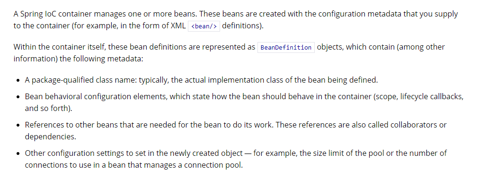
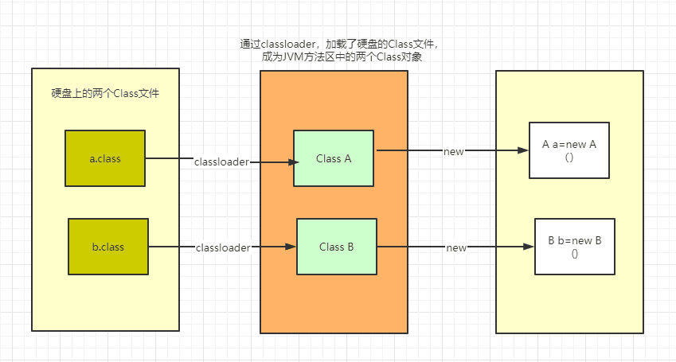
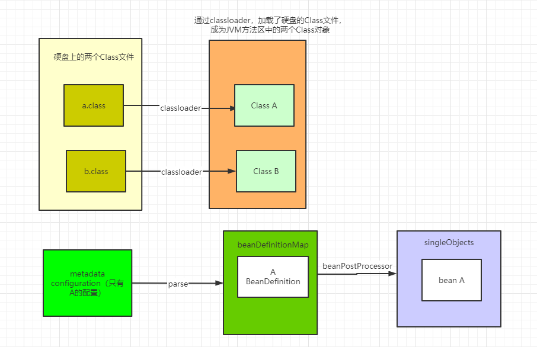
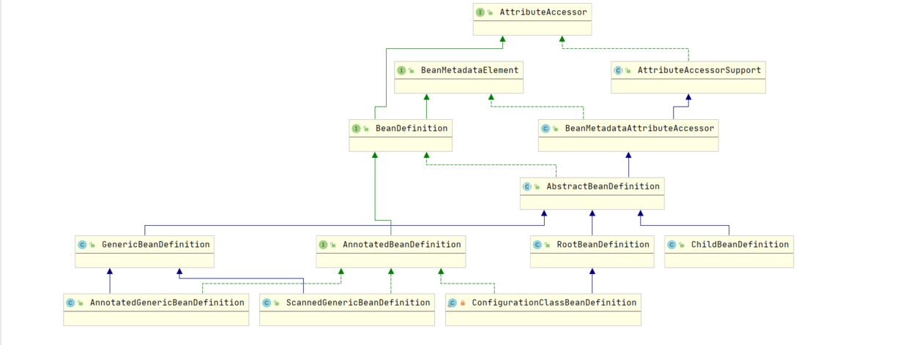
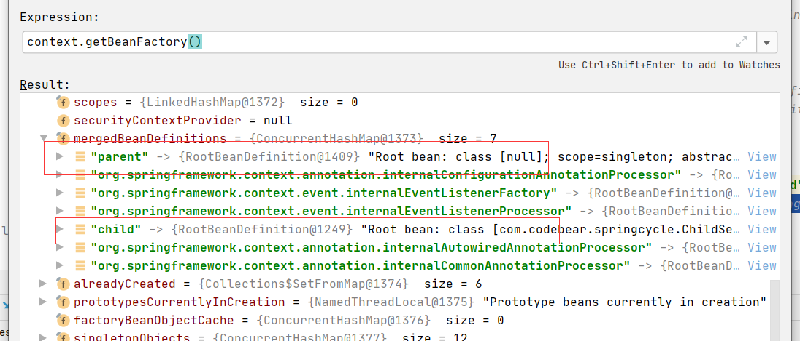
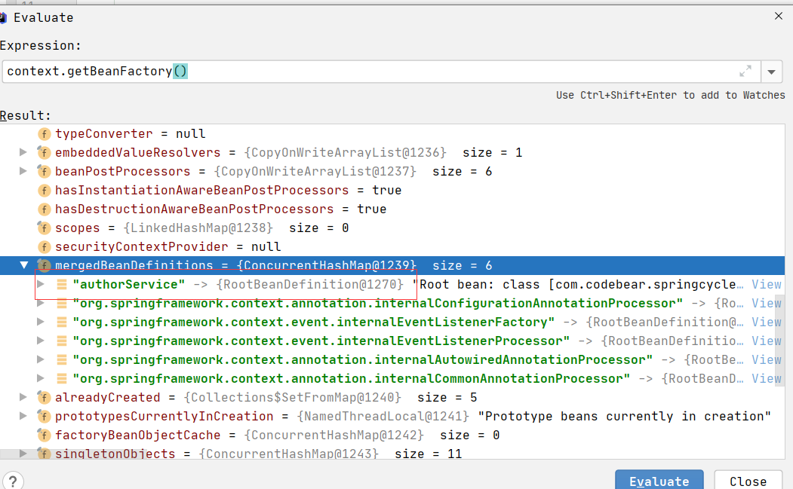

# Spring中眼花缭乱的BeanDefinition

#### 引入主题

为什么要读Spring源码，有的人为了学习Spring中的先进思想，也有的人是为了更好的理解设计模式，当然也有很大一部分小伙伴是为了应付面试，Spring Bean的生命周期啦，Spring AOP的原理啦，Spring IoC的原理啦，应付面试，看几篇博客，对照着看看源码，应该就没什么问题了，但是如果想真正的玩懂Spring，需要花的时间真的很多，需要你沉下心，从最基础的看起，今天我们就来看看Spring中的基础——BeanDefinition。

#### 什么是BeanDefinition

 Spring官网中有详细的说明，我们来翻译下： SpringIoc容器管理一个Bean或多个Bean，这些Bean通过我们提供给容器的配置元数据被创建出来（例如，在xml中的定义） 在容器中，这些Bean的定义用BeanDefinition对象来表示，包含以下元数据：

- 全限定类名， 通常是Bean的实际实现类；
- Bean行为配置元素，它们说明Bean在容器中的行为（作用域、生命周期回调等等）；
- Bean执行工作所需要的的其他Bean的引用，这些Bean也称为协作者或依赖项；
- 其他配置信息，例如，管理连接池的bean中，限制池的大小或者使用的连接的数量。

Spring官网中对BeanDefinition的解释还是很详细的，但是不是那么通俗易懂，其实BeanDefinition是比较容易解释的：BeanDefinition就是用来描述一个Bean或者BeanDefinition就是Bean的定义。

创建一个Java Bean，大概是下面这个酱紫：  我们写的Java文件，会编译为Class文件，运行程序，类加载器会加载Class文件，放入JVM的方法区，我们就可以愉快的new对象了。

创建一个Spring Bean，大概是下面这个酱紫：  我们写的Java文件，会编译为Class文件，运行程序，类加载器会加载Class文件，放入JVM的方法区，这一步还是保持不变（当然这个也没办法变。。。） 下面就是Spring的事情了，Spring会解析我们的配置类（配置文件），假设现在只配置了A，解析后，Spring会把A的BeanDefinition放到一个map中去，随后，由一个一个的BeanPostProcessor进行加工，最终把经历了完整的Spring生命周期的Bean放入了singleObjects。

#### BeanDefinition类图鸟瞰

 大家可以看到，Spring中BeanDefinition的类图还是相当复杂的，我刚开始读Spring源码的时候，觉得BeanDefinition应该是一个特别简单的东西，但是后面发觉并不是那么回事。

下面我将对涉及到的类逐个进行解读。

#### AttributeAccessor

AttributeAccessor是一个接口：

```python
/**
 * Interface defining a generic contract for attaching and accessing metadata
 * to/from arbitrary objects.
 *
 * @author Rob Harrop
 * @since 2.0
 */
public interface AttributeAccessor {
 void setAttribute(String name, @Nullable Object value);
 Object getAttribute(String name);
 Object removeAttribute(String name);
 boolean hasAttribute(String name);
 String[] attributeNames();
}
```

我们来看下类上面的注释：接口定义了通用的方法来保存或者读取元数据。既然是接口，那么一定会有实现类，我们先把这个放一边。

#### BeanMetadataElement

BeanMetadataElement也是一个接口，里面只定义了一个方法：

```plaintext
/**
 * Interface to be implemented by bean metadata elements
 * that carry a configuration source object.
 *
 * @author Juergen Hoeller
 * @since 2.0
 */
public interface BeanMetadataElement {
 @Nullable
 Object getSource();
}
```

我们还是来看下类上的注释：接口提供了一个方法来获取Bean的源对象，这个源对象就是源文件，怎么样，是不是不太好理解，没关系，我们马上写个代码来看下：

```java
@Configuration
@ComponentScan
public class AppConfig {
}
@Service
public class BookService {
}
public class Main {
    public static void main(String[] args) {
        AnnotationConfigApplicationContext context = new AnnotationConfigApplicationContext(AppConfig.class);
        System.out.println(context.getBeanDefinition("bookService").getSource());
    }
}
file [D:\cycleinject\target\classes\com\codebear\springcycle\BookService.class]
```

怎么样，现在理解了把。

#### AttributeAccessorSupport

AttributeAccessorSupport类是一个抽象类，实现了AttributeAccessor接口，这个AttributeAccessor还记得吧，里面定义了通用的方法来保存或者读取元数据的虚方法，AttributeAccessorSupport便实现了这个虚方法，AttributeAccessorSupport定义了一个map容器，元数据就被保存在这个map里面。

##### 为什么要有这个map

初次读Spring源码，看到这个map的时候，觉得有点奇怪，元数据不应该是保存在BeanDefinition的beanClass、scope、lazyInit这些字段里面吗？这个map不是多次一举吗？

后面才知道，Spring是为了方便扩展，不然BeanDefinition有新的特性，就要新增字段，这是其一；其二，如果程序员要扩展Spring，而BeanDefinition中定义的字段已经无法满足扩展了呢？

那Spring自己有使用这个map吗，答案是有的，我们来看下，Spring在这个map中放了什么数据：

```java
    public static void main(String[] args) {
        AnnotationConfigApplicationContext context = new AnnotationConfigApplicationContext(AppConfig.class);
        BeanDefinition appConfig = context.getBeanDefinition("appConfig");
        for (String item : appConfig.attributeNames()) {
            System.out.println(item + ":" + appConfig.getAttribute(item));
        }
    }
org.springframework.context.annotation.ConfigurationClassPostProcessor.configurationClass:full
org.springframework.aop.framework.autoproxy.AutoProxyUtils.preserveTargetClass:true
```

可以看到，Spring在里面放了两个item：

- 第一个item保存着这个配置类是否是一个Full配置类，关于Full配置类，我在先前的博客有简单的介绍过：[Spring中你可能不知道的事（二）](https://juejin.im/user/3544481219222488/posts)
- 第二个item，从名字上就可以知道和AOP相关。

### BeanDefinition

BeanDefinition是一个接口，继承了AttributeAccessor、BeanMetadataElement，这两个类上面已经介绍过了。

BeanDefinition定义了很多方法，比如setBeanClassName、getBeanClassName、setScope、getScope、setLazyInit、isLazyInit等等，这些方法一眼就知道是什么意思了，这里就不解释了。

### BeanMetadataAttributeAccessor

BeanMetadataAttributeAccessor继承了AttributeAccessorSupport，对保存或者读取元数据的方法进行了进一步的封装。

### AbstractBeanDefinition

AbstractBeanDefinition是一个抽象类，继承了BeanMetadataAttributeAccessor，实现了BeanDefinition。

BeanDefinition实现了BeanDefinition定义的大部分虚方法，同时定义了很多常量和默认值。

AbstractBeanDefinition有三个子类，下面我们来看看这三个子类。

#### ChildBeanDefinition

从Spring2.5开始，ChildBeanDefinition已经不再使用，取而代之的是GenericBeanDefinition。

#### GenericBeanDefinition

GenericBeanDefinition替代了ChildBeanDefinition，ChildBeanDefinition从字面上，就可以看出有“子BeanDefinition”的意思，难道BeanDefinition还有“父子关系”吗？当然有。

```java
public class ChildService {
    private int id;
    private String name;
    public ChildService(int id, String name) {
        this.id = id;
        this.name = name;
    }
    public int getId() {
        return id;
    }
    public void setId(int id) {
        this.id = id;
    }
    public String getName() {
        return name;
    }
    public void setName(String name) {
        this.name = name;
    }
}
public class ParentService {
    private int id;
    private String name;
    public int getId() {
        return id;
    }
    public void setId(int id) {
        this.id = id;
    }
    public String getName() {
        return name;
    }
    public void setName(String name) {
        this.name = name;
    }
    public ParentService(int id, String name) {
        this.id = id;
        this.name = name;
    }
}
 public static void main(String[] args) {
        AnnotationConfigApplicationContext context = new AnnotationConfigApplicationContext();
        GenericBeanDefinition parentBeanDefinition = new GenericBeanDefinition();
        parentBeanDefinition.setScope(BeanDefinition.SCOPE_SINGLETON);
        parentBeanDefinition.setAttribute("name", "codebear");
        parentBeanDefinition.setAbstract(true);
        parentBeanDefinition.getConstructorArgumentValues().addGenericArgumentValue(1);
        parentBeanDefinition.getConstructorArgumentValues().addGenericArgumentValue("CodeBear");
        GenericBeanDefinition childBeanDefinition = new GenericBeanDefinition();
        childBeanDefinition.setParentName("parent");
        childBeanDefinition.setBeanClass(ChildService.class);
        context.registerBeanDefinition("parent", parentBeanDefinition);
        context.registerBeanDefinition("child", childBeanDefinition);
        context.refresh();
        BeanDefinition child = context.getBeanFactory().getMergedBeanDefinition("child");
        for (String s : child.attributeNames()) {
            System.out.println(s + ":" + child.getAttribute(s));
        }
        System.out.println("scope:" + child.getScope());
        System.out.println("-------------------");
        ChildService service = context.getBean(ChildService.class);
        System.out.println(service.getName());
        System.out.println(service.getId());
    }
```

运行结果：

```plaintext
name:codebear
scope:singleton
-------------------
CodeBear
1
```

来分析下代码：

1. 创建了GenericBeanDefinition对象parentBeanDefinition，设置为了单例模式，设置了Attribute，声明了构造方法的两个参数值；
1. 创建了GenericBeanDefinition对象childBeanDefinition，设置parentName为parent，BeanClass为ChildService；
1. 注册parentBeanDefinition，beanName为parent，childBeanDefinition，beanName为child；
1. 刷新容器；
1. 从mergedBeanDefinitions取出了child，mergedBeanDefinitions存放的是合并后的BeanDefinition；
1. 打印出child的attribute、scope、构造方法的两个参数值。

大家可以看到，childBeanDefinition继承了parentBeanDefinition。

如果没有父子关系，单独作为BeanDefinition，也可以用GenericBeanDefinition来表示：

```java
       AnnotationConfigApplicationContext context = new AnnotationConfigApplicationContext();
        GenericBeanDefinition genericBeanDefinition = new GenericBeanDefinition();
        genericBeanDefinition.setBeanClass(AuthorService.class);
        genericBeanDefinition.setScope(BeanDefinition.SCOPE_PROTOTYPE);
        context.registerBeanDefinition("authorService", genericBeanDefinition);
        context.refresh();
        BeanDefinition mergedBeanDefinition = context.getBeanFactory().getMergedBeanDefinition("authorService");
        BeanDefinition beanDefinition = context.getBeanFactory().getMergedBeanDefinition("authorService");
        System.out.println(mergedBeanDefinition);
        System.out.println(beanDefinition);
```

运行结果：

```plaintext
Root bean: class [com.codebear.springcycle.AuthorService]; scope=prototype; abstract=false; lazyInit=false; autowireMode=0; dependencyCheck=0; autowireCandidate=true; primary=false; factoryBeanName=null; factoryMethodName=null; initMethodName=null; destroyMethodName=null
Root bean: class [com.codebear.springcycle.AuthorService]; scope=prototype; abstract=false; lazyInit=false; autowireMode=0; dependencyCheck=0; autowireCandidate=true; primary=false; factoryBeanName=null; factoryMethodName=null; initMethodName=null; destroyMethodName=null
```

可以看到，当没有父子关系，beanDefinition依旧会被保存在mergedBeanDefinitions中，只是存储的内容和beanDefinitions中所存储的内容是一模一样的。

##### GenericBeanDefinition总结

GenericBeanDefinition替代了低版本Spring的ChildBeanDefinition，GenericBeanDefinition比ChildBeanDefinition、RootBeanDefinition更加灵活，既可以单独作为BeanDefinition，也可以作为父BeanDefinition，还可以作为子GenericBeanDefinition。

#### RootBeanDefinition

在介绍GenericBeanDefinition的时候，写了两段代码。

给第一个代码打上断点，观察下mergedBeanDefinitions，会发现parentBeanDefinition和 childBeanDefinition在mergedBeanDefinitions都变为了RootBeanDefinition： 

给第二个代码打上断点，也观察下mergedBeanDefinitions，会发现authorService在mergedBeanDefinitions也变为了RootBeanDefinition： 

可以看到在mergedBeanDefinitions存放的都是RootBeanDefinition。

RootBeanDefinition也可以用来充当父BeanDefinition，就像下面的酱紫：

```java
 public static void main(String[] args) {
        AnnotationConfigApplicationContext context = new AnnotationConfigApplicationContext();
        RootBeanDefinition genericBeanDefinition = new RootBeanDefinition();
        genericBeanDefinition.setBeanClass(ParentService.class);
        genericBeanDefinition.setScope(BeanDefinition.SCOPE_PROTOTYPE);
        context.registerBeanDefinition("parent", genericBeanDefinition);
        GenericBeanDefinition rootBeanDefinition = new GenericBeanDefinition();
        rootBeanDefinition.setBeanClass(ChildService.class);
        rootBeanDefinition.setParentName("parent");
        context.refresh();
    }
```

但是RootBeanDefinition不可以充当子BeanDefinition：

```java
  public static void main(String[] args) {
        AnnotationConfigApplicationContext context = new AnnotationConfigApplicationContext();
        RootBeanDefinition genericBeanDefinition = new RootBeanDefinition();
        genericBeanDefinition.setBeanClass(ParentService.class);
        genericBeanDefinition.setScope(BeanDefinition.SCOPE_PROTOTYPE);
        context.registerBeanDefinition("parent", genericBeanDefinition);
        RootBeanDefinition rootBeanDefinition = new RootBeanDefinition();
        rootBeanDefinition.setBeanClass(ChildService.class);
        rootBeanDefinition.setParentName("parent");
        context.refresh();
    }
```

运行结果：

```java
Exception in thread "main" java.lang.IllegalArgumentException: Root bean cannot be changed into a child bean with parent reference
 at org.springframework.beans.factory.support.RootBeanDefinition.setParentName(RootBeanDefinition.java:260)
 at com.codebear.springcycle.Main.main(Main.java:20)
```

抛出了异常。

查询源码：

```java
 @Override
 public void setParentName(@Nullable String parentName) {
  if (parentName != null) {
   throw new IllegalArgumentException("Root bean cannot be changed into a child bean with parent reference");
  }
 }
```

发现调用RootBeanDefinition的setParentName方法，直接抛出了异常。

##### RootBeanDefinition总结

RootBeanDefinition可以作为其他BeanDefinition的父BeanDefinition，也可以单独作为BeanDefinition，但是不能作为其他BeanDefinition的子BeanDefinition，在mergedBeanDefinitions存储的都是RootBeanDefinition。

### ScannedGenericBeanDefinition

```java
@Configuration
@ComponentScan
public class AppConfig {
}
@Service
public class AuthorService {
}
public class Main {
    public static void main(String[] args) {
        AnnotationConfigApplicationContext context = new AnnotationConfigApplicationContext(AppConfig.class);
        System.out.println(context.getBeanDefinition("authorService").getClass());
    }
}
```

运行结果：

```plaintext
class org.springframework.context.annotation.ScannedGenericBeanDefinition
```

通过注解扫描出来的Bean的BeanDefinition用ScannedGenericBeanDefinition来表示。

### AnnotatedGenericBeanDefinition

```java
 public static void main(String[] args) {
        AnnotationConfigApplicationContext context = new AnnotationConfigApplicationContext(AppConfig.class);
        System.out.println(context.getBeanDefinition("appConfig").getClass());
    }
```

运行结果：

```plaintext
class org.springframework.beans.factory.annotation.AnnotatedGenericBeanDefinition
```

配置类的BeanDefinition用AnnotatedGenericBeanDefinition来表示。

### ConfigurationClassBeanDefinition

```java
public class AuthorService {
}
@Configuration
@ComponentScan
public class AppConfig {
    @Bean
    public AuthorService authorService() {
        return null;
    }
}
    public static void main(String[] args) {
        AnnotationConfigApplicationContext context = new AnnotationConfigApplicationContext(AppConfig.class);
 System.out.println(context.getBeanDefinition("authorService").getClass());
    }
```

运行结果：

```plaintext
  class org.springframework.context.annotation.ConfigurationClassBeanDefinitionReader$ConfigurationClassBeanDefinition
```

用@Bean声明的Bean的BeanDefinition用ConfigurationClassBeanDefinition来表示。

是不是完全没想到，一个BeanDefinition可以牵涉到这么多的内容，这些内容说没用，确实没什么用；说有用，也有用。不明白这些内容，阅读Spring源码会比较懵逼，为什么会有那么多的BeanDefinition。这个时候，你就会卡壳，拼命的想弄懂这些BeanDefinition都是用来干嘛的，但是网上关于BeanDefinition的博客不算太多，比较好的博客就更少了，希望此篇文章可以填充这块空白。
