# 从SpringCloud开始，聊微服务架构

## 背景

随着公司业务量的飞速发展，平台面临的挑战已经远远大于业务，需求量不断增加，技术人员数量增加，面临的复杂度也大大增加。在这个背景下，平台的技术架构也完成了从传统的单体应用到微服务化的演进。


## 系统架构的演进过程

### 单一应用架构（第一代架构）

这是平台最开始的情况，当时流量小，为了节约成本,并将所有应用都打包放到一个应用里面，采用的架构为.net+sqlserver:

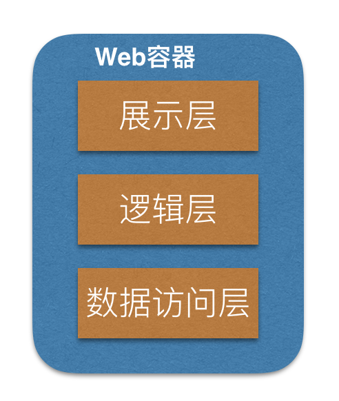

> **表示层** 位于最外层（最上层），最接近用户。用于显示数据和接收用户输入的数 据，为用户提供一种交互式操作的界面，平台所使用的是基于.net的web形式。
>
> **业务逻辑层** 业务逻辑层（Business Logic Layer）无疑是系统架构中体现核心价值的部分。它的关注点主要集中在业务规则的制定、业务流程的实现等与业务需求有关的系统设计，也即是说它是与系统所应对的领域（Domain）逻辑有关，很多时候，也将业务逻辑层称为领域层。 业务逻辑层在体系架构中的位置很关键，它处于数据访问层与表示层中间，起到了数据交换中承上启下的作用。由于层是一种弱耦合结构，层与层之间的依赖是向下的，底层对于上层而言是“无知”的，改变上层的设计对于其调用的底层而言没有任何影响。如果在分层设计时，遵循了面向接口设计的思想，那么这种向下的依赖也应该是一种弱依赖关系。对于数据访问层而言，它是调用者；对于表示层而言，它却是被调用者。
>
> **数据层** 数据访问层：有时候也称为是持久层，其功能主要是负责数据库的访问，可以访问数据库系统、二进制文件、文本文档或是XML文档，平台在这个阶段使用的是hibernate.net+sqlserver。

第一代架构看似很简单，却支撑了平台的早期业务发展，满足了网站用户访问量在几万规模的处理需求。但是当用户访问量呈现大规模增长，问题就暴露出来了：

- 维护成本不断增高：当出现故障时，有可能引起故障的原因组合就会比较多，这也会导致分析故障、定位故障、修复故障的成本相应增高，故障的平均修复周期会花费很多时间，并且任何一个模块出现故障将会影响其它应用模块；在开发人员对全局功能缺乏深度理解的情况下，修复一个故障，经常引入其他的故障，导致该过程陷入“修复越多，故障越多”的恶性循环。
- 可伸缩性差：应用程序的所有功能代码都运行在同一个服务器上，将会导致应用程序的水平扩展非常困难，只能使用垂直扩展。
- 交付周期变长：应用程序做任何细微的修改以及代码提交，都会触发对整个应用程序进行代码编译、运行单元测试、代码检查、构建并生成部署包、验证功能等，这也就版本的反馈周期变长，单位时间内构建的效率变得很低。
- 新人培养周期变长：随着应用程序的功能越来越多，代码变得越来越复杂的同时，对于新加入团队的成员而言，了解业务背景、熟悉应用程序、配置本地开发环境，这些看似简单的任务，却会花费了更长的时间。

## 垂直应用架构（第二代架构）

为了解决第一代架构面临的问题，团队制定了如下的策略，并形成了第二代应用架构(垂直应用架构)

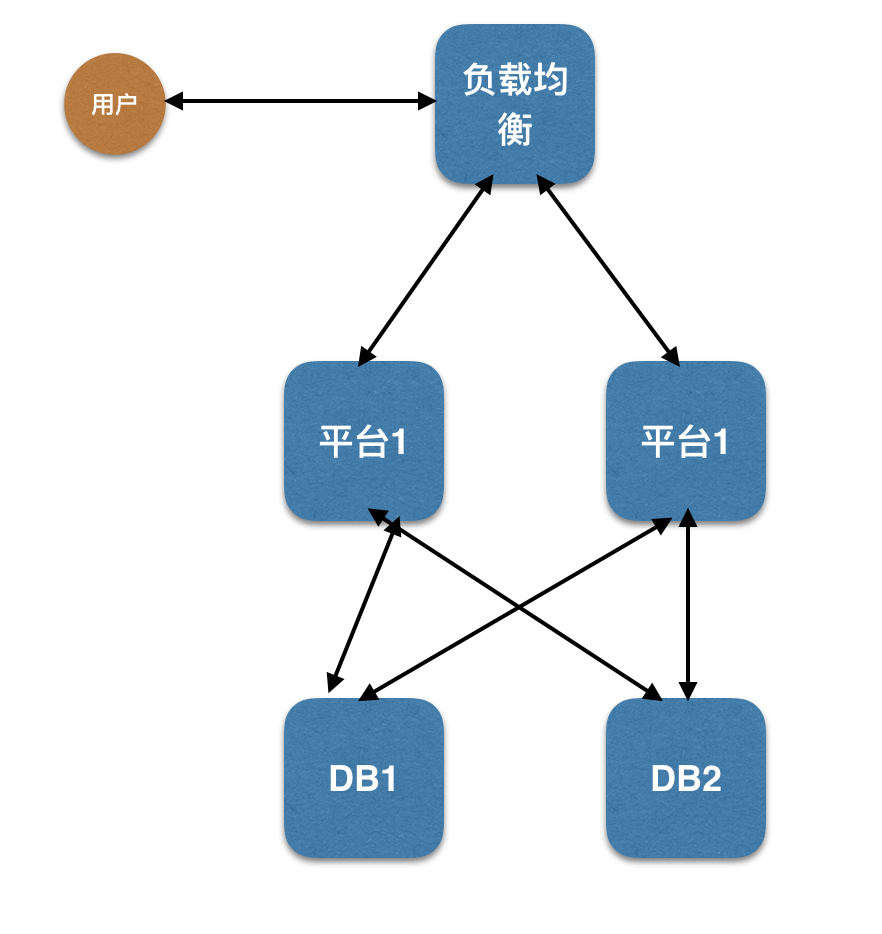

- 应用拆成独立的应用模块。
- 各个应用模块独立部署，并在负载均衡通过session保持解决应用模块的水平扩展问题。

> Sticky就是基于cookie的一种负载均衡解决方案，通过cookie实现客户端与后端服务器的会话保持, 在一定条件下可以保证同一个客户端访问的都是同一个后端服务器。请求来了，服务器发个cookie，并说：下次来带上，直接来找我!。在项目中，我们使用了taobao开源的tengine中的[session_sticky模块](http://tengine.taobao.org/document/http_upstream_session_sticky.html)。

- 数据库拆分成不同数据库，由对应应用访问。
- 域名拆分。
- 动静分离。

可以看到第二代架构解决应用级别的水平扩展扩展，经过优化后，该架构支撑了几十万用户的访问需求，在这一阶段有部分应用已经使用java 完成了mvc架构的重写。当然也存在一些问题。

- 应用之间耦合度高，相互依赖严重。
- 应用模块之间交互复杂，有时直接访问对方模块数据库。
- 数据库涉及过多的关联查询与慢查询，数据库优化困难。
- 数据库单点访问严重，出现故障无法恢复。
- 数据复制问题严重，造成大量数据不一致。

> 我们曾经尝试使用sql server AlwaysOn 解决扩展问题，但是实验发现在复制过程中出现至少10s的延迟，因此放弃了这个方案。

- 系统扩展困难。
- 各个开发团队各自为战，开发效率低下。
- 测试工作量巨大，发布困难。

## 微服务化架构（平台现状：第三代架构）

为了解决第一代与第二代架构存在的问题，我们对平台进行了梳理优化。根据平台业务需要以及对第一二代架构的总结，我们确定了第三代架构的核心需求：

- 核心业务抽取出来，作为独立的服务对外服务。
- 服务模块持续独立部署，减少版本交付周期。
- 数据库按服务分库分表。
- 大量使用缓存，提高访问。
- 系统间交互使用轻量级的rest协议，摒弃rpc协议。
- 去.net化，开发语言使用java来实现。

并以此为基础进行了平台的第三代架构的重构工作。

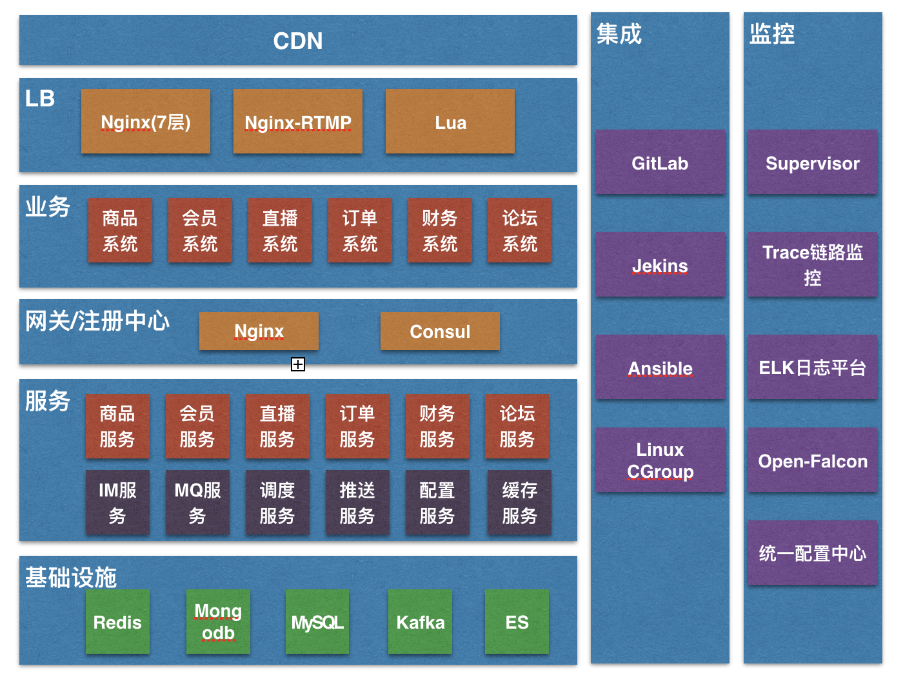

看第三代架构里面的组成，主要分为八个部分：

- CDN：CDN系统负责实时地根据网络流量和各节点的连接、负载状况以及到用户的距离和响应时间等综合信息将用户的请求重新导向离用户最近的服务节点上。其目的是使用户可就近取得所需内容，解决 Internet网络拥挤的状况，提高用户访问网站的响应速度。

  平台在选择CDN厂商时，需要考虑经营时间长短，是否有可扩充的带宽资源、灵活的流量和带宽选择、稳定的节点、性价比；综合前面几个因素平台采用了七牛的CDN服务。

- LB层：平台包括很多个业务域，不同的业务域有不同的集群，LB层（Load Balancer）是对多台业务服务器进行流量分发的负载均衡服务，通过流量分发扩展应用系统对外的服务能力，并消除单点故障提升了应用系统的可用性。

  选择哪种负载，需要综合考虑各种因素（是否满足高并发高性能，Session保持如何解决，负载均衡的算法如何，支持压缩，缓存的内存消耗），主要分为以下两种：

  LVS：工作在4层，Linux实现的高性能高并发、可伸缩性、可靠的的负载均衡器，支持多种转发方式(NAT、DR、IP Tunneling)，其中DR模式支持通过广域网进行负载均衡。支持双机热备(Keepalived或者Heartbeat)。对网络环境的依赖性比较高。

  Nginx：工作在7层，事件驱动的、异步非阻塞的架构、支持多进程的高并发的负载均衡器/反向代理软件。可以针对域名、目录结构、正则规则针对http做一些分流。通过端口检测到服务器内部的故障，比如根据服务器处理网页返回的状态码、超时等等，并且会把返回错误的请求重新提交到另一个节点，不过其中缺点就是不支持url来检测。对于session sticky，我们通过基于cookie的扩展nginx-sticky-module来实现。这种也是平台目前所采用的方案。

- 业务层：代表平台某一领域的业务提供的服务，对于平台而言，有商品、会员、直播、订单、财务、论坛等系统，不同的系统提供不同的领域服务。

- 网关与注册中心：提供了统一的底层微服务api 入口与注册管理。封装了内部的系统架构并向每个客户端提供Rest API，同时实现了监控、负载均衡、缓存、服务降级、限流等职责。目前平台采用nginx+consul来实现。

- 服务层：该层为一些协同工作的小而自治的服务，平台根据业务的边界来确定了服务的边界，每个服务只专注自己边界之内。该层基于spring cloud来构建。

- 基础设施层：该层为上层服务提供基础设施服务，主要为以下几类：

  redis 集群：以高响应速度、内存操作为上层提供缓存服务。

  mongodb集群：由于mongodb具有灵活文档模型 、高可用复制集 、可扩展分片集群等特性，平台基于此为上层提供如文章、帖子、链路日志等存储服务。mongodb集群采用了复制+分片的架构解决可用性与扩展性问题。

  MySQL集群：存储会员、商品、订单等具有事务性要求的数据。

  Kafka:支撑了平台的所有的消息服务。

  ES（elasticsearch）：提供了平台的商品、会员、订单、日志等搜索服务。

- 集成层：这个特点是整个平台中的最大亮点，包括实践持续集成CI、持续交付CD、DevOps文化，让每个人都参与交付，在规范的流程和标准的交付下，完成一个服务的自动部署发布，进而提高了版本交付链路的整体效率。

- 监控层：将系统拆分为更小的、细粒度的微服务给平台带来了很多好处，但是，它也增加了平台系统的运维复杂性。给最终用户提供的任务服务都是有大量的微服务配合完成，一个初始调用最终会触发多个下游的服务调用，如何才能重建请求流，以重现与解决这个问题？为此部署开源的open-falcon平台提供应用级以上监控、使用ELK提供应用日志的分析、使用自建服务提供链路日志跟踪以及基于spring config server实践统一配置服务。

## 微服务团队的工作方式

> [康威定律](https://en.wikipedia.org/wiki/Conway's_law)：任何组织在设计一套系统时，所交付的设计方案在结构上都与该组织的沟通结构保持一致。

### 工作方式

在实践第三代架构时，我们对团队组织做了几个调整：

- 按照业务边界进行了划分，在一个团队内全栈，让团队自治，按照这样的方式组建，将沟通的成本维持在系统内部，每个子系统就会更加内聚，彼此的依赖耦合能变弱，跨系统的沟通成本也就能降低

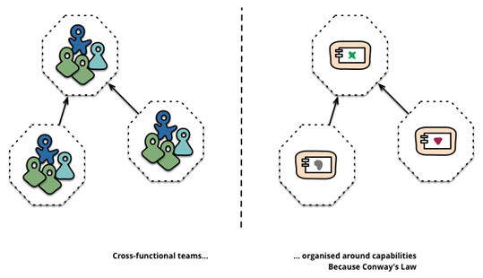

- 专门建立了一个架构师部门来负责第三代架构的推行工作。通常对于一个的架构师团队有系统架构、应用架构、运维、DBA、敏捷专家五个角色组成是一个比较合理的结构。那么又如何控制好架构组的产出，保证架构工作的顺利推行呢？
- 首先：打造持续改进的自组织文化是实施微服务的关键基石。只有持续改进，持续学习和反馈，持续打造这样一个文化氛围和团队，微服务架构才能持续发展下去，保持新鲜的生命力，从而实现我们的初衷。
- 其次：架构组的产品要经过严格的流程，因为架构组推行的是通用的解决方案，为了保证方案的质量，我们从方案调研到评审再到实施都有一个严格的闭环。

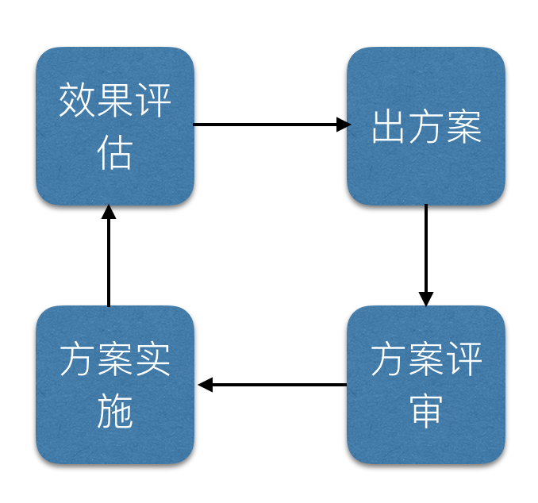

再谈谈整个团队的交付流程与开发模式，如果没有预先定义好，则很难让微服务架构发挥出真正的价值，下面我们先来看看微服务架构的交付流程。


使用微服务架构开发应用程序，我们实际上是针对一个个微服务进行设计、开发、测试、部署，因为每个服务之间是没有彼此依赖的，大概的交付流程就像上图这样。

**设计阶段：** 架构组将产品功能拆分为若干微服务，为每个微服务设计 API 接口（例如 REST API），需要给出 API 文档，包括 API 的名称、版本、请求参数、响应结果、错误代码等信息。

在开发阶段，开发工程师去实现 API 接口，也包括完成 API 的单元测试工作，在此期间，前端工程师会并行开发 Web UI 部分，可根据 API 文档造出一些假数据（我们称为“mock 数据”），这样一来，前端工程师就不必等待后端 API 全部开发完毕，才能开始自己的工作了，实现了前后端并行开发。**测试阶段：**

这一阶段过程全自动化过程，开发人员提交代码到代码服务器，代码服务器触发持续集成构建、测试，如果测试通过则会自动通过Ansible脚本推送到模拟环境；在实践中对于线上环境则是先要走审核流程，通过之后才能推送到生产环境。提高工作效率，并且控制了部分可能因为测试不充分而导致的线上不稳定。

### 开发模式

在以上交付流程中，开发、测试、部署这三个阶段可能都会涉及到对代码行为的控制，我们还需要制定相关开发模式，以确保多人能够良好地协作。

- 实践"绞杀者模式"：


由于第三代架构跨度较大，并且面临了无法修改的.net遗留系统，我们采用绞杀者模式，在遗留系统外面增加新的Proxy代理微服务，并且在LB控制upstream的方式，而不是直接修改原有系统，逐步的实现对老系统的替换。

- 开发规范

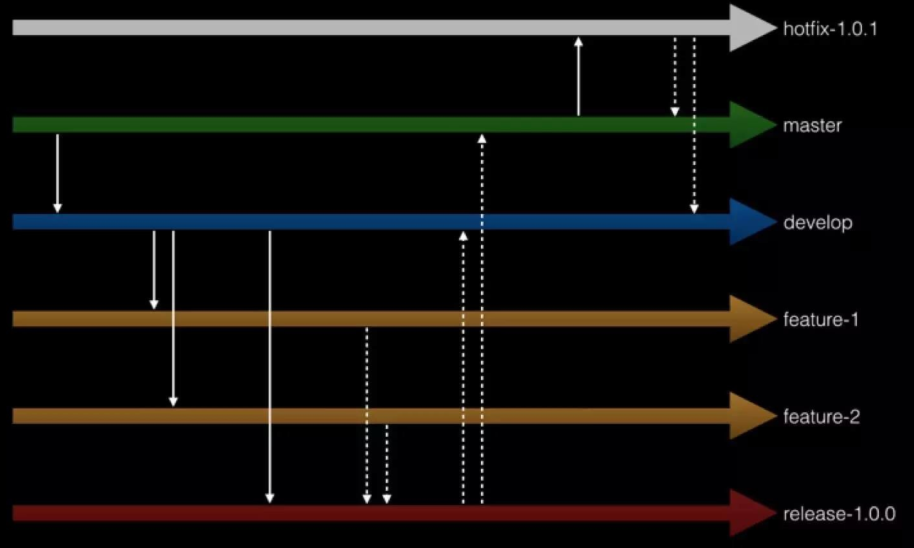

经验表明，我们需要善用代码版本控制系统，我曾经遇到一个开发团队，由于分支没有规范，最后一个小版本上线合代码居然化了几个小时，最后开发人员自己都不知道合到哪个分支。拿 Gitlab 来说，它很好地支持了多分支代码版本，我们需要利用这个特性来提高开发效率，上图就是我们目前的分支管理规范。

最稳定的代码放在 master 分支上，我们不要直接在 master 分支上提交代码，只能在该分支上进行代码合并操作，例如将其它分支的代码合并到 master 分支上。

我们日常开发中的代码需要从 master 分支拉一条 develop 分支出来，该分支所有人都能访问，但一般情况下，我们也不会直接在该分支上提交代码，代码同样是从其它分支合并到 develop 分支上去。

当我们需要开发某个特性时，需要从 develop 分支拉出一条 feature 分支，例如 feature-1 与 feature-2，在这些分支上并行地开发具体特性。

当特性开发完毕后，我们决定需要发布某个版本了，此时需要从 develop 分支上拉出一条 release 分支，例如 release-1.0.0，并将需要发布的特性从相关 feature 分支一同合并到 release 分支上，随后将针对 release 分支推送到测试环境，测试工程师在该分支上做功能测试，开发工程师在该分支上修改 bug。待测试工程师无法找到任何 bug 时，我们可将该 release 分支部署到预发环境，再次验证以后，均无任何 bug，此时可将 release 分支部署到生产环境。待上线完成后，将 release 分支上的代码同时合并到 develop 分支与 master 分支，并在 master 分支上打一个 tag，例如 v1.0.0。

当生产环境发现 bug 时，我们需要从对应的 tag 上（例如 v1.0.0）拉出一条 hotfix 分支（例如 hotfix-1.0.1），并在该分支上做 bug 修复。待 bug 完全修复后，需将 hotfix 分支上的代码同时合并到 develop 分支与 master 分支。

对于版本号我们也有要求，格式为：x.y.z，其中，x 用于有重大重构时才会升级，y 用于有新的特性发布时才会升级，z 用于修改了某个 bug 后才会升级。针对每个微服务，我们都需要严格按照以上开发模式来执行。

## 微服务开发体系

我们已经对微服务团队的架构、交付流程、开发模式进行了描述，下面我们聊聊归纳一下微服务开发体系。

## 什么是微服务架构

> Martin Flower的定义：
>
> In short, the microservice architectural style \[1\] is an approach to developing a single application as a suite of small services, each running in its own process and communicating with lightweight mechanisms, often an HTTP resource API. These services are built around business capabilities and independently deployable by fully automated deployment machinery. There is a bare minimum of centralized management of these services, which may be written in different programming languages and use different data storage technologies

简单的说，微服务是软件系统架构上的一个设计风格，它倡导将一个原本独立的系统分成多个小型服务，这些小型服务都在各自独立的进程中运行，服务之间通过基于HTTP的RESTful 轻量级API进行通信协作。被拆分的每个微服务围绕系统中的某项或一些耦合度较高的业务进行构建，并且每个服务都维护着自身的数据存储、业务开发、自动化测试案例以及独立部署机制。由于有了轻量级通信机制，这些微服务间可以使用不通的语言来编写。

## 微服务的拆分粒度

微服务到底拆分到一个多大的粒度，更多时候是需要在粒度与团队之间找到一个平衡点，微服务越小，微服务独立性带来的好处就越多。但是管理大量微服务也会越复杂。基本上拆分需要遵循以下几个原则：

- 单一职责原则：即"把因相同原因而变化的东西聚合到一起，把因不同原因而变化的东西分离开来"。通过这个原则确定微服务边界。
- 团队自主原则：团队越大，沟通与协助成本就会越高，我们在实践中一个团队不会超过8人，团队内全栈，是一个全功能团队。
- 先分数据库、后分服务：数据模型能否彻底分开，决定了微服务的边界功能是否彻底划清，实践中我们先讨论数据模型边界，数据模型的边界映射了业务的边界，进而从底向上完成服务拆分。

## 如何搭建微服务架构

为了搭建好微服务架构，技术选型是一个非常重要的阶段，只有选择合适的"演员"，才能把这台戏演好。

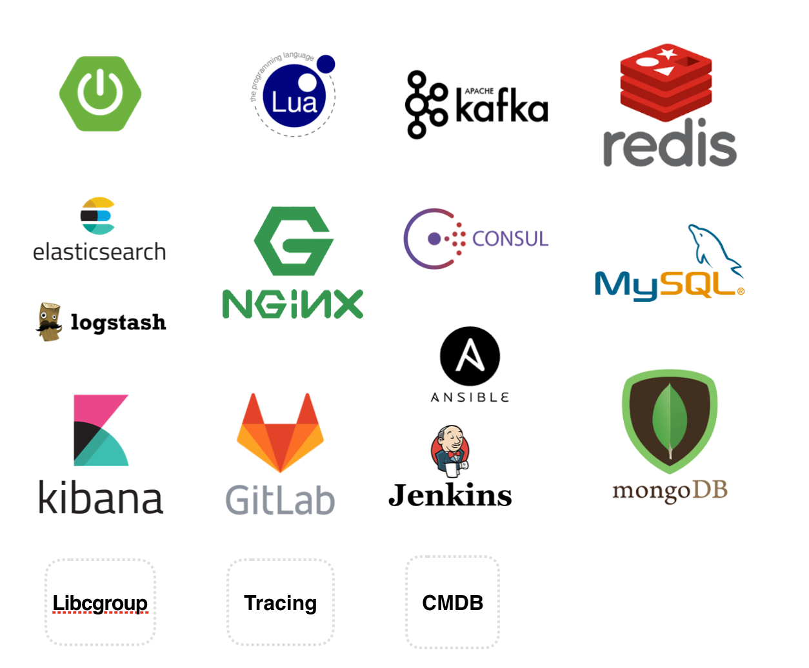

我们使用 Spring Cloud 作为微服务开发框架，Spring Boot 拥有嵌入式 Tomcat，可直接运行一个 jar 包来发布微服务，此外它还提供了一系列“开箱即用”的插件,例如：配置中心，服务注册与发现，熔断器，路由，代理，控制总线，一次性令牌，全局锁，leader选举，分布式 会话，集群状态等，可大量提高我们的开发效率。

功能

Spring Cloud

路由与负载均衡

Ribbon

注册中心

Eureka

网关

Zuul

断路器

Hystrix

分布式配置

Config

服务调用跟踪

sleuth

日志输出

elk

认证集成

oauth2

消息总线

Bus

批量任务

Task

**工程结构规范**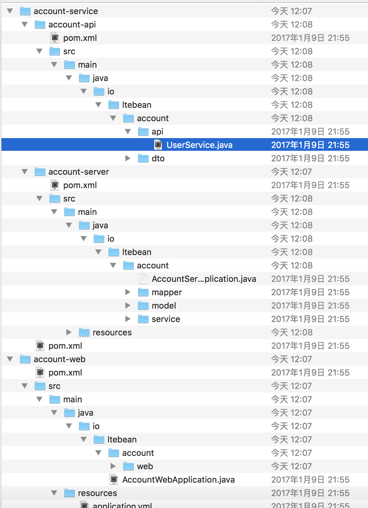

上图是我们实践中每个服务应该具有的项目组成结构。

其中：

1. 微服务名+service：

   为对内其它微服务提供服务调用。服务名+api模块为服务间定义的接口规范，使用swagger+rest接口定义。服务名+server模块包含了能直接启动该服务的应用与配置。

1. 微服务名+web：

   供上层web应用请求的入口，该服务中一般会调用底层微服务完成请求。**API 网关实践**


API网关作为后端所有微服务和API的访问入口， 对微服务和API进行审计，流控， 监控，计费等。常用的API网关解决方案有：

- 应用层方案

  最有名的当然是Netflix的zuul， 但这不意味着这种方案就最适合你， 比如Netfilx是因为使用AWS，对基础设施把控有限， 所以才不得不在应用层做了zuul这样的方案，如果通盘考虑， 这种方案不是最合适或者说最有的方案。

  但如果自己的团队对整体技术设施把控有限，且团队结构不完善，应用层方案也可能是最适合你的最佳方案。

- nginx + lua方案

  也是我们采用并认为最合适的方案，OpenResty和Kong是比较成熟的可选方案， 不过Kong使用Postgres或者Cassandra， 国内公司估计选择这俩货的不多，但Kong的HTTP API设计还是很不错的。

- 我们的方案

  使用nginx+lua+consul组合方案，虽然我们团队大多是java，选择zookeeper会是更加自然的选择，但作为新锐派，对压测结果进行了分析， 我们最终选择使用consul。

  良好的HTTP API支持， 可以动态管理upstreams， 这也意味着我们可以通过发布平台或者胶水系统无缝的实现服务注册和发现， 对服务的访问方透明。

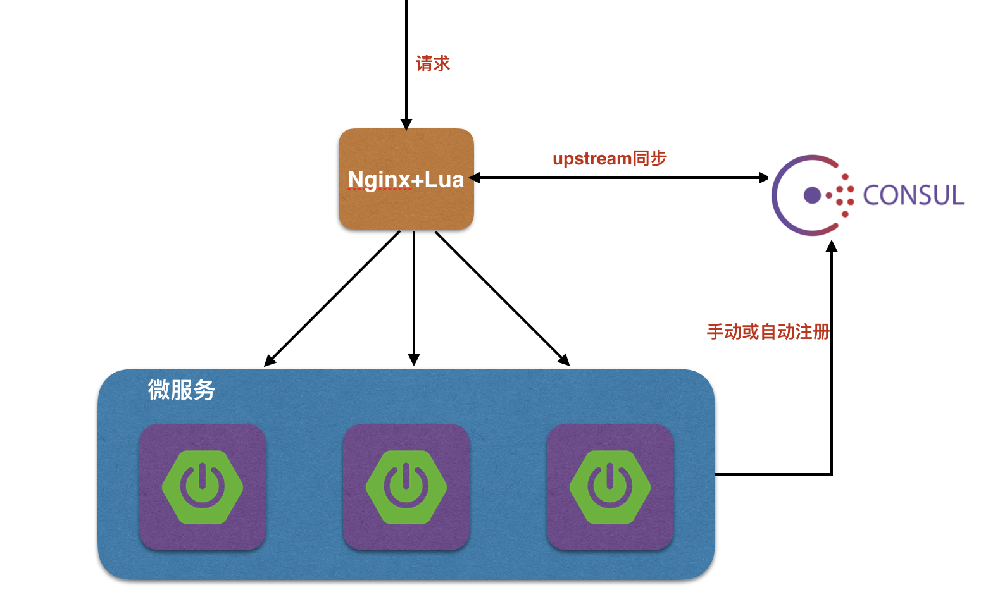

在以上的方案里：

consul作为状态存储或者说配置中心（主要使用consul的KV存储功能）；nginx作为API网关， 根据consul中upstreams的相关配置，动态分发流量到配置的upstreams结点；

nginx根据配置项， 连接到consul集群；

启动的API或者微服务实例， 通过手工/命令行/发布部署平台， 将实例信息注册/写入consul;

nginx获取到相应的upstreams信息更新， 则动态变更nginx内部的upstreams分发配置，从而将流量路由和分发到对应的API和微服务实例结点；

将以上注册和发现逻辑通过脚本或者统一的发布部署平台固化后，就可以实现透明的服务访问和扩展。

- **链路监控实践**

我们发现，以前在单应用下的日志监控很简单，在微服务架构下却成为了一个大问题，如果无法跟踪业务流，无法定位问题，我们将耗费大量的时间来查找和定位问题，在复杂的微服务交互关系中，我们就会非常被动，此时分布式链路监控应运而生，其核心就是调用链。通过一个全局的ID将分布在各个服务节点上的同一次请求串联起来，还原原有的调用关系、追踪系统问题、分析调用数据、统计系统指标。

> 分布式链路跟踪最早见于2010年Google发表的一篇论文《[dapper](https://bigbully.github.io/Dapper-translation/)》。

那么我们先来看一下什么是调用链，调用链其实就是将一次分布式请求还原成调用链路。显式的在后端查看一次分布式请求的调用情况，比如各个节点上的耗时、请求具体打到了哪台机器上、每个服务节点的请求状态，等等。它能反映出一次请求中经历了多少个服务以及服务层级等信息（比如你的系统A调用B，B调用C，那么这次请求的层级就是3），如果你发现有些请求层级大于10，那这个服务很有可能需要优化了 常见的解决方案有：

- Pinpoint

> github地址：GitHub - [naver/pinpoint: Pinpoint is an open source APM (Application Performance Management) tool for large-scale distributed systems written in Java.](https://github.com/naver/pinpoint)

对APM有兴趣的朋友都应该看看这个开源项目，这个是一个韩国团队开源出来的，通过JavaAgent的机制来做字节码代码植入（探针），实现加入traceid和抓取性能数据的目的。 NewRelic、Oneapm之类的工具在java平台上的性能分析也是类似的机制。

- Zipkin

> 官网：[OpenZipkin](http://zipkin.io/) · A distributed tracing system
>
> github地址：GitHub - [openzipkin/zipkin](https://github.com/openzipkin/zipkin/): Zipkin is a distributed tracing system

这个是twitter开源出来的，也是参考Dapper的体系来做的。

Zipkin的java应用端是通过一个叫Brave的组件来实现对应用内部的性能分析数据采集。

> Brave的github地址：<https://github.com/openzipkin/brave>

这个组件通过实现一系列的java拦截器，来做到对http/servlet请求、数据库访问的调用过程跟踪。然后通过在spring之类的配置文件里加入这些拦截器，完成对java应用的性能数据采集。

- CAT

> github地址：[GitHub - dianping/cat: Central Application Tracking](https://github.com/dianping/cat)

这个是大众点评开源出来的，实现的功能也还是蛮丰富的，国内也有一些公司在用了。不过CAT实现跟踪的手段，是要在代码里硬编码写一些“埋点”，也就是侵入式的。

这样做有利有弊，好处是可以在自己需要的地方加埋点，比较有针对性；坏处是必须改动现有系统，很多开发团队不愿意。

前面三个工具里面，如果不想重复造轮子，我推荐的顺序依次是Pinpoint—>Zipkin—>CAT。原因很简单，就是这三个工具对于程序源代码和配置文件的侵入性，是依次递增的。

- 我们的解决方案

  针对于微服务，我们在spring cloud基础上，对微服务架构进行了扩展，基于Google Dapper的概念，设计了一套基于微服务架构的分布式跟踪系统(WeAPM)。


如上图所示，我们可以通过服务名、时间、日志类型、方法名、异常级别、接口耗时等参数查询响应的日志。在得到的TrackID可以查询到该请求的整个链路日志，为重现问题、分析日志提供了极大方便。

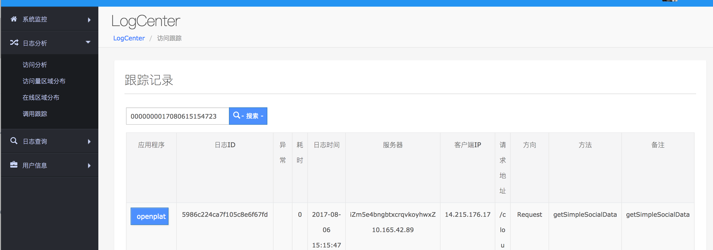

- **断路器实践**

在微服务架构中，我们将系统拆分成了一个个的微服务，这样就有可能因为网络原因或是依赖服务自身问题出现调用故障或延迟，而这些问题会直接导致调用方的对外服务也出现延迟，若此时调用方的请求不断增加，最后就会出现因等待出现故障的依赖方响应而形成任务积压，最终导致自身服务的瘫痪。为了解决这样的问题，因此产生了[断路器模式](http://microservices.io/patterns/reliability/circuit-breaker.html)


我们在实践中使用了Hystrix 来实现断路器的功能。Hystrix是Netflix开源的微服务框架套件之一，该框架目标在于通过控制那些访问远程系统、服务和第三方库的节点，从而对延迟和故障提供更强大的容错能力。Hystrix具备拥有回退机制和断路器功能的线程和信号隔离，请求缓存和请求打包，以及监控和配置等功能。

断路器的使用流程如下：

启用断路器

```java
    @SpringBootApplication
    @EnableCircuitBreaker
    public class Application {
    public static void main(String[] args) {
        SpringApplication.run(DVoiceWebApplication.class, args);
        }
    }
```

代用使用方式

```java
    @Component
    public class StoreIntegration {
    @HystrixCommand(fallbackMethod = "defaultStores")
    public Object getStores(Map<String, Object> parameters) {
        //do stuff that might fail
    }
    public Object defaultStores(Map<String, Object> parameters) {
        return /* something useful */;
        }
    }
```

配置文件

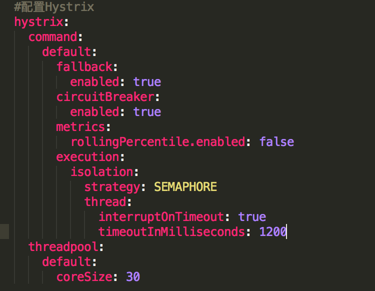

- **资源控制实践**

聊到资源控制，估计很多小伙伴会联系到docker，docker确实是一个实现资源控制很不错的解决方案，我们前期做调研时也对是否使用docker进行了评审，但是最终选择放弃，而使用linux 的libcgroup脚本控制，原因如下：

- docker 更适合大内存做资源控制、容器化，但是我们线上服务器一般都是32G左右，使用docker会有资源浪费。
- 使用docker会使运维复杂、来自业务的压力会很大。

为什么要有cgroup?

Linux系统中经常有个需求就是希望能限制某个或者某些进程的分配资源。也就是能完成一组容器的概念，在这个容器中，有分配好的特定比例的cpu时间，IO时间，可用内存大小等。于是就出现了cgroup的概念，cgroup就是controller group，最初由google的工程师提出，后来被整合进Linux内核中，docker也是基于此来实现。

libcgroup使用流程：

安装

```bash
  yum install libcgroup
```

启动服务

```bash
  service cgconfig start
```

配置文件模板（以memory为例）：

```bash
    cat /etc/cgconfig.conf
```


看到memory子系统是挂载在目录/sys/fs/cgroup/memory下，进入这个目录创建一个文件夹，就创建了一个control group了。

```bash
    mkdir test
    echo "服务进程号">>  tasks(tasks是test目录下的一个文件)
```

这样就将当前这个终端进程加入到了内存限制的cgroup中了。

## 总结

总结一下，本文从我们微服务实践的背景聊起，介绍了微服务实践的工作方式，技术选型，以及相关的一些微服务技术。包括：API网关、注册中心、断路器等。相信这些技术会给大家在实践中带来一些新的思路。当然整个微服务实践之路内容繁多，一篇文章不可能全部包括，大家有兴趣可以在chat中提出来，我们chat见！
