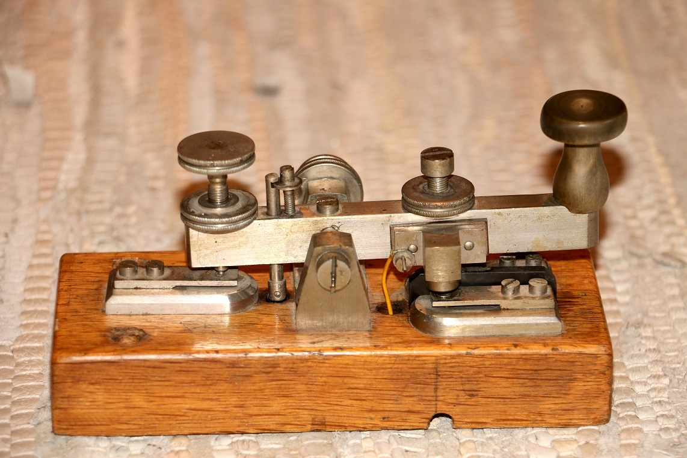
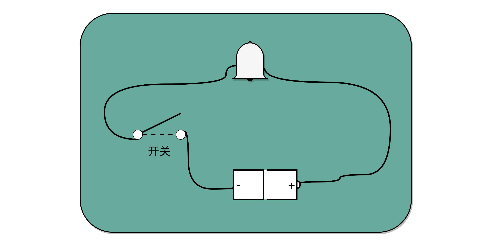
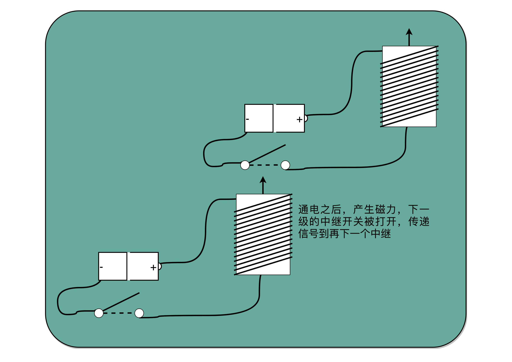
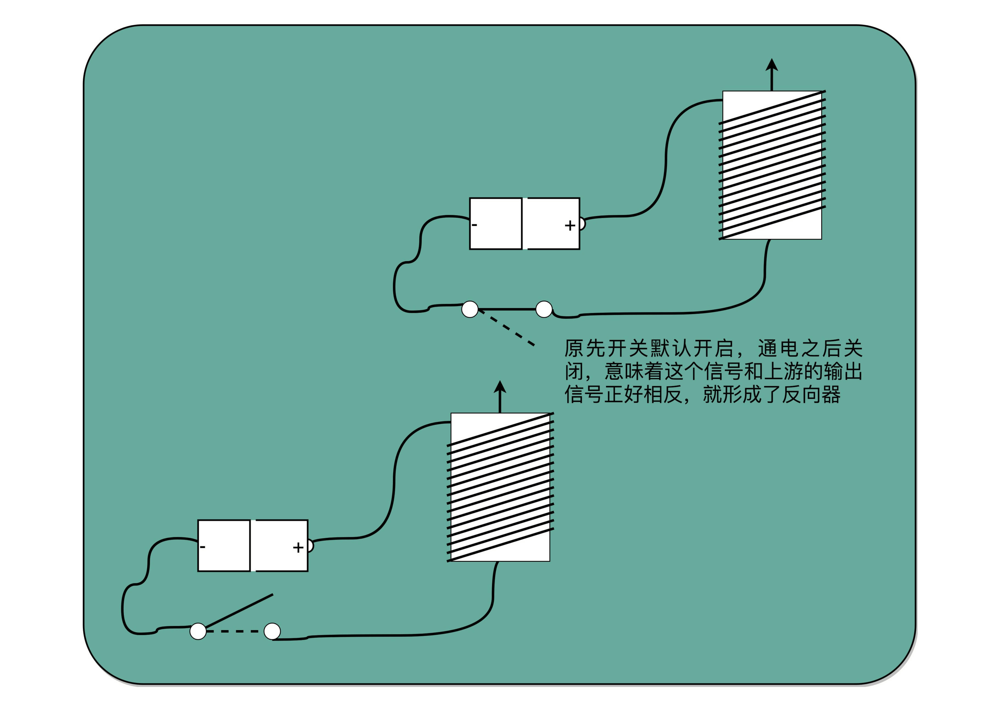

# 12 理解电路：从电报机到门电路，我们如何做到“千里传信”？

我们前面讲过机器指令，你应该知道，所有最终执行的程序其实都是使用“0”和“1”这样的二进制代码来表示的。上一讲里，我也向你展示了，对应的整数和字符串，其实也是用“0”和“1”这样的二进制代码来表示的。

那么你可能要问了，我知道了这个有什么用呢？毕竟我们人用纸和笔来做运算，都是用十进制，直接用十进制和我们最熟悉的符号不是最简单么？为什么计算机里我们最终要选择二进制呢？

这一讲，我和你一起来看看，计算机在硬件层面究竟是怎么表示二进制的，以此你就会明白，为什么计算机会选择二进制。

## 从信使到电报，我们怎么做到“千里传书”？

马拉松的故事相信你听说过。公元前 490 年，在雅典附近的马拉松海边，发生了波斯和希腊之间的希波战争。雅典和斯巴达领导的希腊联军胜利之后，雅典飞毛腿菲迪皮德斯跑了历史上第一个马拉松，回雅典报喜。这个时候，人们在远距离报信的时候，采用的是派人跑腿，传口信或者送信的方式。

但是，这样靠人传口信或者送信的方式，实在是太慢了。在军事用途中，信息能否更早更准确地传递出去经常是事关成败的大事。所以我们看到中国古代的军队有“击鼓进军”和“鸣金收兵”，通过打鼓和敲钲发出不同的声音，来传递军队的号令。

如果我们把军队当成一台计算机，那“金”和“鼓”就是这台计算机的“1”和“0”。我们可以通过不同的编码方式，来指挥这支军队前进、后退、转向、追击等等。

“金”和“鼓”比起跑腿传口信，固然效率更高了，但是能够传递的范围还是非常有限，超出个几公里恐怕就听不见了。于是，人们发明了更多能够往更远距离传信的方式，比如海上的灯塔、长城上的烽火台。因为光速比声速更快，传的距离也可以更远。

[图片来源](https://commons.wikimedia.org/wiki/File:PHAROS2006.jpg)

亚历山大港外的法罗斯灯塔，位列世界七大奇迹之一，可惜现在只剩下遗迹了。可见人类社会很早就学会使用类似二进制信号的方式来传输信息

但是，这些传递信息的方式都面临一个问题，就是受限于只有“1”和“0”这两种信号，不能传递太复杂的信息，那电报的发明就解决了这个问题。

从信息编码的角度来说，金、鼓、灯塔、烽火台类似电报的二进制编码。电报传输的信号有两种，一种是短促的 **点信号** （dot 信号），一种是长一点的 **划信号** （dash 信号）。我们把“点”当成“1”，把“划”当成“0”。这样一来，我们的电报信号就是另一种特殊的二进制编码了。电影里最常见的电报信号是“SOS”，这个信号表示出来就是 “点点点划划划点点点”。

比起灯塔和烽火台这样的设备，电报信号有两个明显的优势。第一，信号的传输距离迅速增加。因为电报本质上是通过电信号来进行传播的，所以从输入信号到输出信号基本上没有延时。第二，输入信号的速度加快了很多。电报机只有一个按钮，按下就是输入信号，按的时间短一点，就是发出了一个“点”信号；按的时间长一些，就是一个“划”信号。只要一个手指，就能快速发送电报。

[图片来源](https://commons.wikimedia.org/wiki/File:Morsetaste.jpg)

一个摩尔斯电码的电报机

而且，制造一台电报机也非常容易。电报机本质上就是一个“ **蜂鸣器 + 长长的电线 + 按钮开关** ”。蜂鸣器装在接收方手里，开关留在发送方手里。双方用长长的电线连在一起。当按钮开关按下的时候，电线的电路接通了，蜂鸣器就会响。短促地按下，就是一个短促的点信号；按的时间稍微长一些，就是一个稍长的划信号。

有了电池开关和铃铛，你就有了最简单的摩尔斯电码发报机

## 理解继电器，给跑不动的信号续一秒

有了电报机，只要铺设好电报线路，就可以传输我们需要的讯息了。但是这里面又出现了一个新的挑战，就是随着电线的线路越长，电线的电阻就越大。当电阻很大，而电压不够的时候，即使你按下开关，蜂鸣器也不会响。

你可能要说了，我们可以提高电压或者用更粗的电线，使得电阻更小，这样就可以让整个线路铺得更长一些。但是这个再长，也没办法从北京铺设到上海吧。要想从北京把电报发到上海，我们还得想些别的办法。

对于电报来说，电线太长了，使得线路接通也没有办法让蜂鸣器响起来。那么，我们就不要一次铺太长的线路，而把一小段距离当成一个线路，也和驿站建立一个小电报站。我们在小电报站里面安排一个电报员，他听到上一个小电报站发来的信息，然后原样输入，发到下一个电报站去。这样，我们的信号就可以一段段传输下去，而不会因为距离太长，导致电阻太大，没有办法成功传输信号。为了能够实现这样 **接力传输信号** ，在电路里面，工程师们造了一个叫作 **继电器** （Relay）的设备。

中继，其实就是不断地通过新的电源重新放大已经开始衰减的原有信号

事实上，这个过程中，我们需要在每一阶段 **原样传输信号** ，所以你可以想想，我们是不是可以设计一个设备来代替这个电报员？相比使用人工听蜂鸣器的声音，来重复输入信号，利用电磁效应和磁铁，来实现这个事情会更容易。

我们把原先用来输出声音的蜂鸣器，换成一段环形的螺旋线圈，让电路封闭通上电。因为电磁效应，这段螺旋线圈会产生一个带有磁性的电磁场。我们原本需要输入的按钮开关，就可以用一块磁力稍弱的磁铁把它设在“关”的状态。这样，按下上一个电报站的开关，螺旋线圈通电产生了磁场之后，磁力就会把开关“吸”下来，接通到下一个电报站的电路。

如果我们在中间所有小电报站都用这个“ **螺旋线圈 + 磁性开关** ”的方式，来替代蜂鸣器和普通开关，而只在电报的始发和终点用普通的开关和蜂鸣器，我们就有了一个拆成一段一段的电报线路，接力传输电报信号。这样，我们就不需要中间安排人力来听打电报内容，也不需要解决因为线缆太长导致的电阻太大或者电压不足的问题了。我们只要在终点站安排电报员，听写最终的电报内容就可以了。这样是不是比之前更省事了？

事实上，继电器还有一个名字就叫作 **电驿** ，这个“驿”就是驿站的驿，可以说非常形象了。这个接力的策略不仅可以用在电报中，在通信类的科技产品中其实都可以用到。

比如说，你在家里用 WiFi，如果你的屋子比较大，可能某些房间的信号就不好。你可以选用支持“中继”的 WiFi 路由器，在信号衰减的地方，增加一个 WiFi 设备，接收原来的 WiFi 信号，再重新从当前节点传输出去。这种中继对应的英文名词和继电器是一样的，也叫 Relay。

再比如说，我们现在互联网使用的光缆，是用光信号来传输数据。随着距离的增长、反射次数的增加，信号也会有所衰减，我们同样要每隔一段距离，来增加一个用来重新放大信号的中继。

有了继电器之后，我们不仅有了一个能够接力传输信号的方式，更重要的是，和输入端通过开关的“开”和“关”来表示“1”和“0”一样，我们在输出端也能表示“1”和“0”了。

输出端的作用，不仅仅是通过一个蜂鸣器或者灯泡，提供一个供人观察的输出信号，通过“螺旋线圈 + 磁性开关”，使得我们有“开”和“关”这两种状态，这个“开”和“关”表示的“1”和“0”，还可以作为后续线路的输入信号，让我们开始可以通过最简单的电路，来组合形成我们需要的逻辑。

通过这些线圈和开关，我们也可以很容易地创建出 “与（AND）”“或（OR）”“非（NOT）”这样的逻辑。我们在输入端的电路上，提供串联的两个开关，只有两个开关都打开，电路才接通，输出的开关也才能接通，这其实就是模拟了计算机里面的“与”操作。

我们在输入端的电路，提供两条独立的线路到输出端，两条线路上各有一个开关，那么任何一个开关打开了，到输出端的电路都是接通的，这其实就是模拟了计算机中的“或”操作。

当我们把输出端的“螺旋线圈 + 磁性开关”的组合，从默认关掉，只有通电有了磁场之后打开，换成默认是打开通电的，只有通电之后才关闭，我们就得到了一个计算机中的“非”操作。输出端开和关正好和输入端相反。这个在数字电路中，也叫作 **反向器** （Inverter）。

反向器的电路，其实就是开关从默认关闭变成默认开启而已

与、或、非的电路都非常简单，要想做稍微复杂一点的工作，我们需要很多电路的组合。不过，这也彰显了现代计算机体系中一个重要的思想，就是通过分层和组合，逐步搭建起更加强大的功能。

回到我们前面看的电报机原型，虽然一个按钮开关的电报机很“容易”操作，但是却不“方便”操作。因为电报员要熟记每一个字母对应的摩尔斯电码，并且需要快速按键来进行输入。一旦输错很难纠正。但是，因为电路之间可以通过与、或、非组合完成更复杂的功能，我们完全可以设计一个和打字机一样的电报机，每按下一个字母按钮，就会接通一部分电路，然后把这个字母的摩尔斯电码输出出去。

虽然在电报机时代，我们没有这么做，但是在计算机时代，我们其实就是这样做的。我们不再是给计算机“0”和“1”，而是通过千万个晶体管组合在一起，最终使得我们可以用“高级语言”，指挥计算机去干什么。

## 总结延伸

可以说，电报是现代计算机的一个最简单的原型。它和我们现在使用的现代计算机有很多相似之处。我们通过电路的“开”和“关”，来表示“1”和“0”。就像晶体管在不同的情况下，表现为导电的“1”和绝缘的“0”的状态。

我们通过电报机这个设备，看到了如何通过“螺旋线圈 + 开关”，来构造基本的逻辑电路，我们也叫门电路。一方面，我们可以通过继电器或者中继，进行长距离的信号传输。另一方面，我们也可以通过设置不同的线路和开关状态，实现更多不同的信号表示和处理方式，这些线路的连接方式其实就是我们在数字电路中所说的门电路。而这些门电路，也是我们创建 CPU 和内存的基本逻辑单元。我们的各种对于计算机二进制的“0”和“1”的操作，其实就是来自于门电路，叫作组合逻辑电路。

## 推荐阅读

《编码：隐匿在计算机软硬件背后的语言》的第 6～11 章，是一个很好的入门材料，可以帮助你深入理解数字电路，值得你花时间好好读一读。
