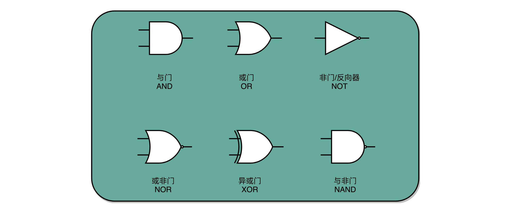
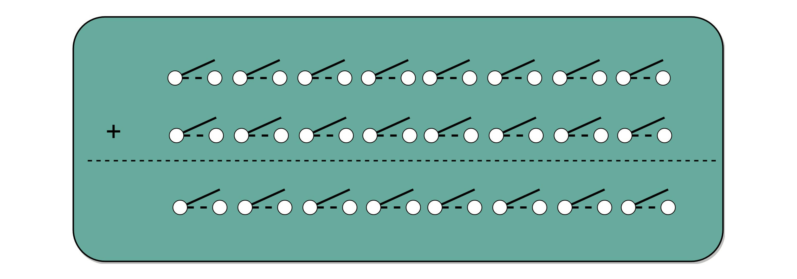
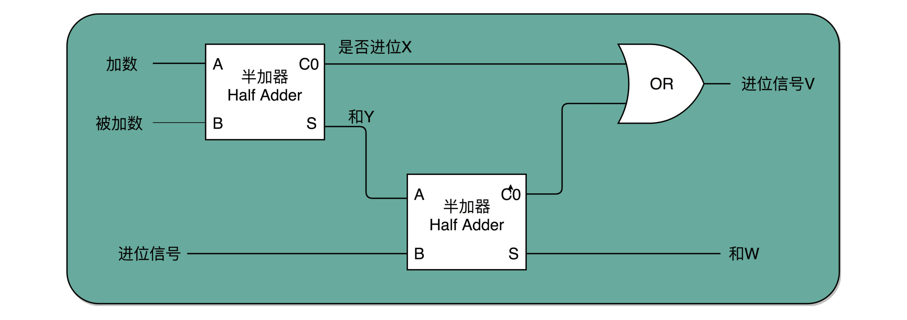
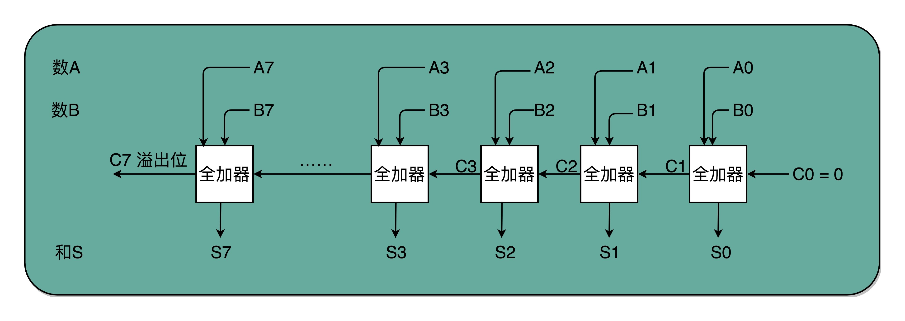

# 13 加法器：如何像搭乐高一样搭电路（上）？

上一讲，我们看到了如何通过电路，在计算机硬件层面设计最基本的单元，门电路。我给你看的门电路非常简单，只能做简单的 “与（AND）”“或（OR）”“NOT（非）”和“异或（XOR）”，这样最基本的单比特逻辑运算。下面这些门电路的标识，你需要非常熟悉，后续的电路都是由这些门电路组合起来的。

这些基本的门电路，是我们计算机硬件端的最基本的“积木”，就好像乐高积木里面最简单的小方块。看似不起眼，但是把它们组合起来，最终可以搭出一个星球大战里面千年隼这样的大玩意儿。我们今天包含十亿级别晶体管的现代 CPU，都是由这样一个一个的门电路组合而成的。

[图片来源](https://www.flickr.com/photos/stickkim/7053151615/in/photolist-bKgffk-ogjPUr-bK5EB2-9KVuH1-cTubW1-fmT46W-fmCXpM-q4xNPg-ASbuvs-cTubiG-dzY1Ge-i9gZiN-cTuciQ-ijVpAw-aAnA68-fmCZvg-yfnA5X-zobNFw-jt28Zq-afa117-Av96ec-ntmgkW-rMD4KE-CgYrKU-L6YMgi-KgSyBJ-81yeEt-2s3w16-ReD2-VWSj-46LiG-cgy2zY-hLG2X1-aZZ6Rc-ac5vyy-21LNDAq-21vQ14P-46KYN-22NLSaf-q6QoLS-4BNrBP-4jY2Bj-nD232N-aYaGWX-XwJrFZ-569dUN-wYEBV5-cpHkWN-bazBbP-4BSGGJ)

## 异或门和半加器

我们看到的基础门电路，输入都是两个单独的 bit，输出是一个单独的 bit。如果我们要对 2 个 8 位（bit）的数，计算与、或、非这样的简单逻辑运算，其实很容易。只要连续摆放 8 个开关，来代表一个 8 位数。这样的两组开关，从左到右，上下单个的位开关之间，都统一用“与门”或者“或门”连起来，就是两个 8 位数的 AND 或者 OR 的运算了。

比起 AND 或者 OR 这样的电路外，要想实现整数的加法，就需要组建稍微复杂一点儿的电路了。

我们先回归一个最简单的 8 位的无符号整数的加法。这里的“无符号”，表示我们并不需要使用补码来表示负数。无论高位是“0”还是“1”，这个整数都是一个正数。

我们很直观就可以想到，要表示一个 8 位数的整数，简单地用 8 个 bit，也就是 8 个像上一讲的电路开关就好了。那 2 个 8 位整数的加法，就是 2 排 8 个开关。加法得到的结果也是一个 8 位的整数，所以又需要 1 排 8 位的开关。要想实现加法，我们就要看一下，通过什么样的门电路，能够连接起加数和被加数，得到最后期望的和。

其实加法器就是想一个办法把这三排开关电路连起来

要做到这一点，我们先来看看，我们人在计算加法的时候一般会怎么操作。二进制的加法和十进制没什么区别，所以我们一样可以用 **列竖式** 来计算。我们仍然是从左到右，一位一位进行计算，只是把从逢 10 进 1 变成逢 2 进 1。

你会发现，其实计算一位数的加法很简单。我们先就看最简单的个位数。输入一共是 4 种组合，00、01、10、11。得到的结果，也不复杂。

一方面，我们需要知道，加法计算之后的个位是什么，在输入的两位是 00 和 11 的情况下，对应的输出都应该是 0；在输入的两位是 10 和 01 的情况下，输出都是 1。结果你会发现，这个输入和输出的对应关系，其实就是我在上一讲留给你的思考题里面的“异或门（XOR）”。

讲与、或、非门的时候，我们很容易就能和程序里面的“AND（通常是 & 符号）”“ OR（通常是 | 符号）”和“ NOT（通常是 ! 符号）”对应起来。可能你没有想过，为什么我们会需要“异或（XOR）”，这样一个在逻辑运算里面没有出现的形式，作为一个基本电路。 **其实，异或门就是一个最简单的整数加法，所需要使用的基本门电路** 。

算完个位的输出还不算完，输入的两位都是 11 的时候，我们还需要向更左侧的一位进行进位。那这个就对应一个与门，也就是有且只有在加数和被加数都是 1 的时候，我们的进位才会是 1。

所以，通过一个异或门计算出个位，通过一个与门计算出是否进位，我们就通过电路算出了一个一位数的加法。于是， **我们把两个门电路打包，给它取一个名字，就叫作半加器** （Half Adder）。

半加器的电路演示

## 全加器

你肯定很奇怪，为什么我们给这样的电路组合，取名叫半加器（Half Adder）？莫非还有一个全加器（Full Adder）么？你猜得没错。半加器可以解决个位的加法问题，但是如果放到二位上来说，就不够用了。我们这里的竖式是个二进制的加法，所以如果从右往左数，第二列不是十位，我称之为“二位”。对应的再往左，就应该分别是四位、八位。

二位用一个半加器不能计算完成的原因也很简单。因为二位除了一个加数和被加数之外，还需要加上来自个位的进位信号，一共需要三个数进行相加，才能得到结果。但是我们目前用到的，无论是最简单的门电路，还是用两个门电路组合而成的半加器，输入都只能是两个 bit，也就是两个开关。那我们该怎么办呢？

实际上，解决方案也并不复杂。 **我们用两个半加器和一个或门，就能组合成一个全加器** 。第一个半加器，我们用和个位的加法一样的方式，得到是否进位 X 和对应的二个数加和后的结果 Y，这样两个输出。然后，我们把这个加和后的结果 Y，和个位数相加后输出的进位信息 U，再连接到一个半加器上，就会再拿到一个是否进位的信号 V 和对应的加和后的结果 W。

全加器就是两个半加器加上一个或门

这个 W 就是我们在二位上留下的结果。我们把两个半加器的进位输出，作为一个或门的输入连接起来，只要两次加法中任何一次需要进位，那么在二位上，我们就会向左侧的四位进一位。因为一共只有三个 bit 相加，即使 3 个 bit 都是 1，也最多会进一位。

这样，通过两个半加器和一个或门，我们就得到了一个，能够接受进位信号、加数和被加数，这样三个数组成的加法。这就是我们需要的全加器。

有了全加器，我们要进行对应的两个 8 bit 数的加法就很容易了。我们只要把 8 个全加器串联起来就好了。个位的全加器的进位信号作为二位全加器的输入信号，二位全加器的进位信号再作为四位的全加器的进位信号。这样一层层串接八层，我们就得到了一个支持 8 位数加法的算术单元。如果要扩展到 16 位、32 位，乃至 64 位，都只需要多串联几个输入位和全加器就好了。

8 位加法器可以由 8 个全加器串联而成

唯一需要注意的是，对于这个全加器，在个位，我们只需要用一个半加器，或者让全加器的进位输入始终是 0。因为个位没有来自更右侧的进位。而最左侧的一位输出的进位信号，表示的并不是再进一位，而是表示我们的加法是否溢出了。

这也是很有意思的一点。以前我自己在了解二进制加法的时候，一直有这么个疑问，既然 int 这样的 16 位的整数加法，结果也是 16 位数，那我们怎么知道加法最终是否溢出了呢？因为结果也只存得下加法结果的 16 位数。我们并没有留下一个第 17 位，来记录这个加法的结果是否溢出。

看到全加器的电路设计，相信你应该明白，在整个加法器的结果中，我们其实有一个电路的信号，会标识出加法的结果是否溢出。我们可以把这个对应的信号，输出给到硬件中其他标志位里，让我们的计算机知道计算的结果是否溢出。而现代计算机也正是这样做的。这就是为什么你在撰写程序的时候，能够知道你的计算结果是否溢出在硬件层面得到的支持。

## 总结延伸

相信到这里，你应该已经体会到了，通过门电路来搭建算术计算的一个小功能，就好像搭乐高积木一样。

我们用两个门电路，搭出一个半加器，就好像我们拿两块乐高，叠在一起，变成一个长方形的乐高，这样我们就有了一个新的积木组件，柱子。我们再用两个柱子和一个长条的积木组合一下，就变成一个积木桥。然后几个积木桥串接在一起，又成了积木楼梯。

当我们想要搭建一个摩天大楼，我们需要很多很多楼梯。但是这个时候，我们已经不再关注最基础的一节楼梯是怎么用一块块积木搭建起来的。这其实就是计算机中，无论软件还是硬件中一个很重要的设计思想， **分层** 。

从简单到复杂，我们一层层搭出了拥有更强能力的功能组件。在上面的一层，我们只需要考虑怎么用下一层的组件搭建出自己的功能，而不需要下沉到更低层的其他组件。就像你之前并没有深入学习过计算机组成原理，一样可以直接通过高级语言撰写代码，实现功能。

在硬件层面，我们通过门电路、半加器、全加器一层层搭出了加法器这样的功能组件。我们把这些用来做算术逻辑计算的组件叫作 ALU，也就是算术逻辑单元。当进一步打造强大的 CPU 时，我们不会再去关注最细颗粒的门电路，只需要把门电路组合而成的 ALU，当成一个能够完成基础计算的黑盒子就可以了。

以此类推，后面我们讲解 CPU 的设计和数据通路的时候，我们以 ALU 为一个基础单元来解释问题，也就够了。

## 补充阅读

出于性能考虑，实际 CPU 里面使用的加法器，比起我们今天讲解的电路还有些差别，会更复杂一些。真实的加法器，使用的是一种叫作 **超前进位加法器** 的东西。你可以找到北京大学在 Coursera 上开设的《计算机组成》课程中的 Video-306 “加法器优化”一节，了解一下超前进位加法器的实现原理，以及我们为什么要使用它。
