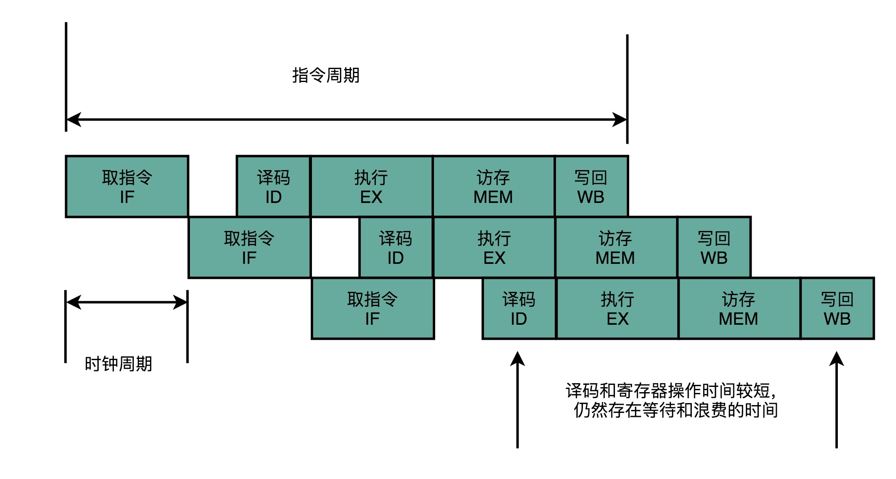
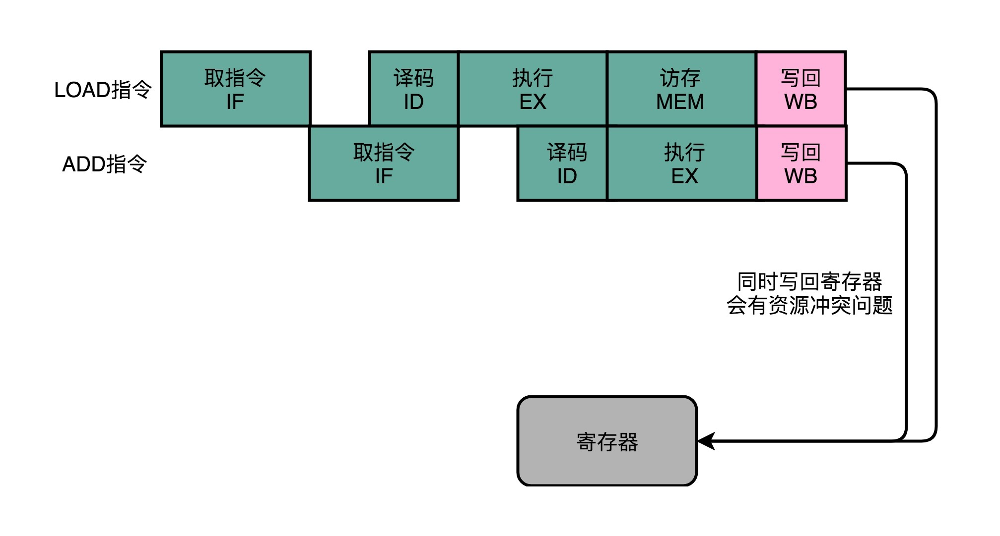
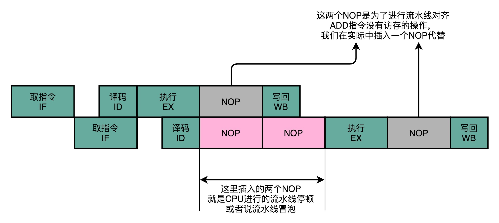

# 23 冒险和预测（二）：流水线里的接力赛

上一讲，我为你讲解了结构冒险和数据冒险，以及应对这两种冒险的两个解决方案。一种方案是增加资源，通过添加指令缓存和数据缓存，让我们对于指令和数据的访问可以同时进行。这个办法帮助 CPU 解决了取指令和访问数据之间的资源冲突。另一种方案是直接进行等待。通过插入 NOP 这样的无效指令，等待之前的指令完成。这样我们就能解决不同指令之间的数据依赖问题。

着急的人，看完上一讲的这两种方案，可能已经要跳起来问了：“这也能算解决方案么？”的确，这两种方案都有点儿笨。

第一种解决方案，好比是在软件开发的过程中，发现效率不够，于是研发负责人说：“我们需要双倍的人手和研发资源。”而第二种解决方案，好比你在提需求的时候，研发负责人告诉你说：“来不及做，你只能等我们需求排期。” 你应该很清楚地知道，“堆资源”和“等排期”这样的解决方案，并不会真的提高我们的效率，只是避免冲突的无奈之举。

那针对流水线冒险的问题，我们有没有更高级或者更高效的解决方案呢？既不用简单花钱加硬件电路这样“堆资源”，也不是纯粹等待之前的任务完成这样“等排期”。

答案当然是有的。这一讲，我们就来看看计算机组成原理中，一个更加精巧的解决方案， **操作数前推** 。

## NOP 操作和指令对齐

要想理解操作数前推技术，我们先来回顾一下，[第 5 讲](https://time.geekbang.org/column/article/93359)讲过的，MIPS 体系结构下的 R、I、J 三类指令，以及[第 20 讲](https://time.geekbang.org/column/article/99523)里的五级流水线“取指令（IF）- 指令译码（ID）- 指令执行（EX）- 内存访问（MEM）- 数据写回（WB） ”。

我把对应的图片放进来了，你可以看一下。如果印象不深，建议你先回到这两节去复习一下，再来看今天的内容。




在 MIPS 的体系结构下，不同类型的指令，会在流水线的不同阶段进行不同的操作。

我们以 MIPS 的 LOAD，这样从内存里读取数据到寄存器的指令为例，来仔细看看，它需要经历的 5 个完整的流水线。STORE 这样从寄存器往内存里写数据的指令，不需要有写回寄存器的操作，也就是没有数据写回的流水线阶段。至于像 ADD 和 SUB 这样的加减法指令，所有操作都在寄存器完成，所以没有实际的内存访问（MEM）操作。


有些指令没有对应的流水线阶段，但是我们并不能跳过对应的阶段直接执行下一阶段。不然，如果我们先后执行一条 LOAD 指令和一条 ADD 指令，就会发生 LOAD 指令的 WB 阶段和 ADD 指令的 WB 阶段，在同一个时钟周期发生。这样，相当于触发了一个结构冒险事件，产生了资源竞争。



所以，在实践当中，各个指令不需要的阶段，并不会直接跳过，而是会运行一次 NOP 操作。通过插入一个 NOP 操作，我们可以使后一条指令的每一个 Stage，一定不和前一条指令的同 Stage 在一个时钟周期执行。这样，就不会发生先后两个指令，在同一时钟周期竞争相同的资源，产生结构冒险了。


## 流水线里的接力赛：操作数前推

通过 NOP 操作进行对齐，我们在流水线里，就不会遇到资源竞争产生的结构冒险问题了。除了可以解决结构冒险之外，这个 NOP 操作，也是我们之前讲的流水线停顿插入的对应操作。

但是，插入过多的 NOP 操作，意味着我们的 CPU 总是在空转，干吃饭不干活。那么，我们有没有什么办法，尽量少插入一些 NOP 操作呢？不要着急，下面我们就以两条先后发生的 ADD 指令作为例子，看看能不能找到一些好的解决方案。

```plaintext
add $t0, $s2,$s1
add $s2, $s1,$t0
```

这两条指令很简单。

1. 第一条指令，把 s1 和 s2 寄存器里面的数据相加，存入到 t0 这个寄存器里面。
1. 第二条指令，把 s1 和 t0 寄存器里面的数据相加，存入到 s2 这个寄存器里面。

因为后一条的 add 指令，依赖寄存器 t0 里的值。而 t0 里面的值，又来自于前一条指令的计算结果。所以后一条指令，需要等待前一条指令的数据写回阶段完成之后，才能执行。就像上一讲里讲的那样，我们遇到了一个数据依赖类型的冒险。于是，我们就不得不通过流水线停顿来解决这个冒险问题。我们要在第二条指令的译码阶段之后，插入对应的 NOP 指令，直到前一天指令的数据写回完成之后，才能继续执行。

这样的方案，虽然解决了数据冒险的问题，但是也浪费了两个时钟周期。我们的第 2 条指令，其实就是多花了 2 个时钟周期，运行了两次空转的 NOP 操作。



不过，其实我们第二条指令的执行，未必要等待第一条指令写回完成，才能进行。如果我们第一条指令的执行结果，能够直接传输给第二条指令的执行阶段，作为输入，那我们的第二条指令，就不用再从寄存器里面，把数据再单独读出来一次，才来执行代码。

我们完全可以在第一条指令的执行阶段完成之后，直接将结果数据传输给到下一条指令的 ALU。然后，下一条指令不需要再插入两个 NOP 阶段，就可以继续正常走到执行阶段。


这样的解决方案，我们就叫作 **操作数前推** （Operand Forwarding），或者操作数旁路（Operand Bypassing）。其实我觉得，更合适的名字应该叫 **操作数转发** 。这里的 Forward，其实就是我们写 Email 时的“转发”（Forward）的意思。不过现有的经典教材的中文翻译一般都叫“前推”，我们也就不去纠正这个说法了，你明白这个意思就好。

转发，其实是这个技术的 **逻辑含义** ，也就是在第 1 条指令的执行结果，直接“转发”给了第 2 条指令的 ALU 作为输入。另外一个名字，旁路（Bypassing），则是这个技术的 **硬件含义** 。为了能够实现这里的“转发”，我们在 CPU 的硬件里面，需要再单独拉一根信号传输的线路出来，使得 ALU 的计算结果，能够重新回到 ALU 的输入里来。这样的一条线路，就是我们的“旁路”。它越过（Bypass）了写入寄存器，再从寄存器读出的过程，也为我们节省了 2 个时钟周期。

操作数前推的解决方案不但可以单独使用，还可以和流水线冒泡一起使用。有的时候，虽然我们可以把操作数转发到下一条指令，但是下一条指令仍然需要停顿一个时钟周期。

比如说，我们先去执行一条 LOAD 指令，再去执行 ADD 指令。LOAD 指令在访存阶段才能把数据读取出来，所以下一条指令的执行阶段，需要在访存阶段完成之后，才能进行。


总的来说，操作数前推的解决方案，比流水线停顿更进了一步。流水线停顿的方案，有点儿像游泳比赛的接力方式。下一名运动员，需要在前一个运动员游玩了全程之后，触碰到了游泳池壁才能出发。而操作数前推，就好像短跑接力赛。后一个运动员可以提前抢跑，而前一个运动员会多跑一段主动把交接棒传递给他。

## 总结延伸

这一讲，我给你介绍了一个更加高级，也更加复杂的解决数据冒险问题方案，就是操作数前推，或者叫操作数旁路。

操作数前推，就是通过在硬件层面制造一条旁路，让一条指令的计算结果，可以直接传输给下一条指令，而不再需要“指令 1 写回寄存器，指令 2 再读取寄存器“这样多此一举的操作。这样直接传输带来的好处就是，后面的指令可以减少，甚至消除原本需要通过流水线停顿，才能解决的数据冒险问题。

这个前推的解决方案，不仅可以单独使用，还可以和前面讲解过的流水线冒泡结合在一起使用。因为有些时候，我们的操作数前推并不能减少所有“冒泡”，只能去掉其中的一部分。我们仍然需要通过插入一些“气泡”来解决冒险问题。

通过操作数前推，我们进一步提升了 CPU 的运行效率。那么，我们是不是还能找到别的办法，进一步地减少浪费呢？毕竟，看到现在，我们仍然少不了要插入很多 NOP 的“气泡”。那就请你继续坚持学习下去。下一讲，我们来看看，CPU 是怎么通过乱序执行，进一步减少“气泡”的。

## 推荐阅读

想要深入了解操作数前推相关的内容，推荐你读一下《计算机组成与设计：硬件 / 软件接口》的 4.5～4.7 章节。
