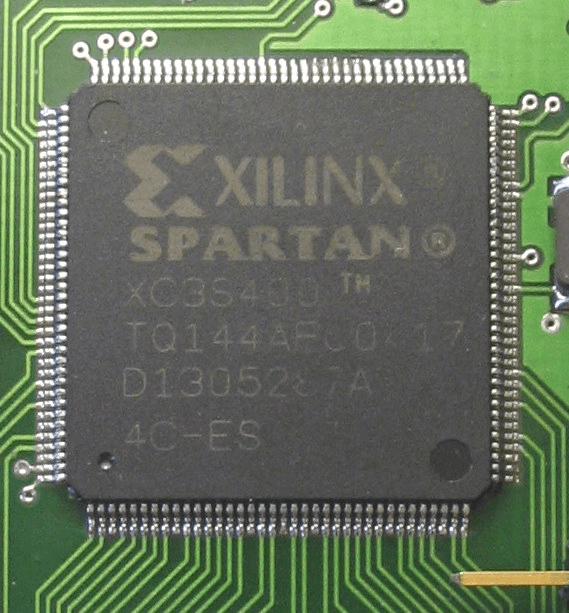
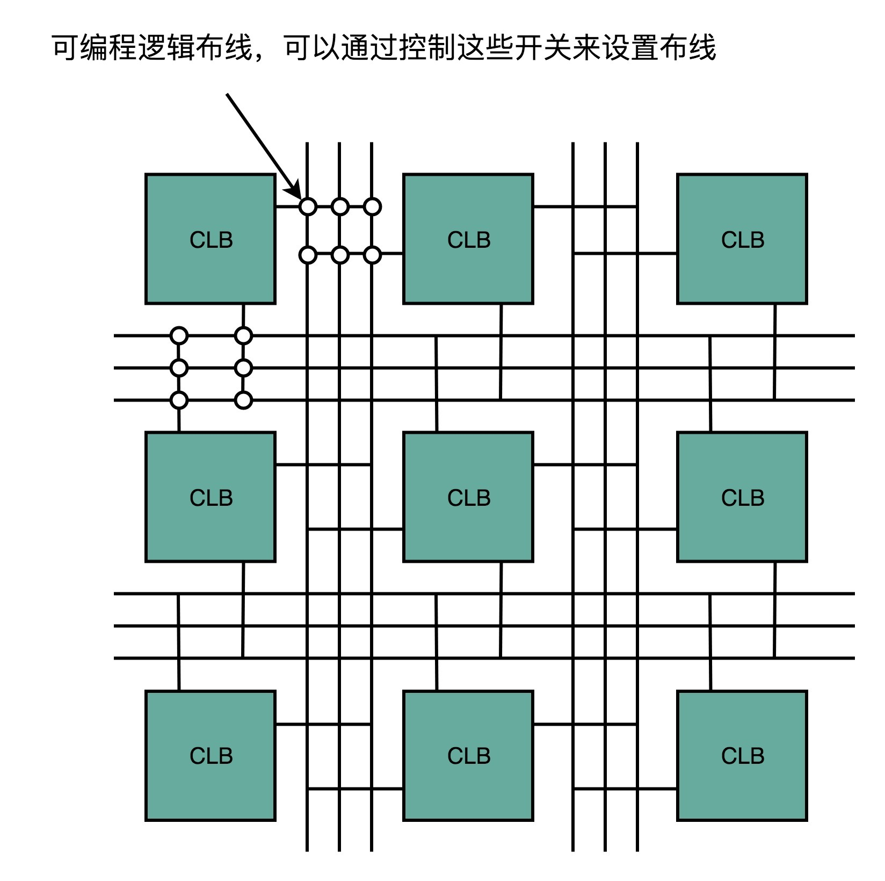
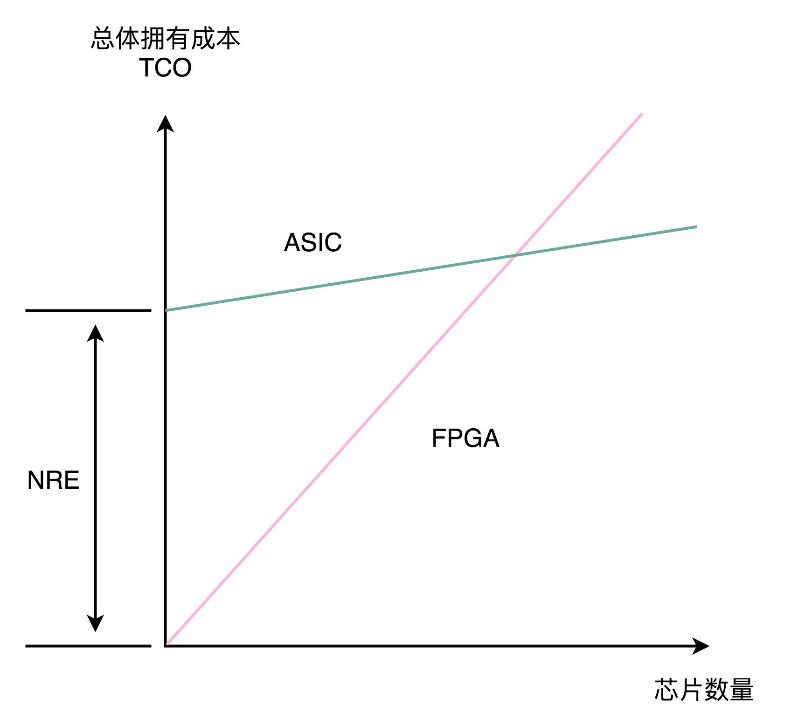

# 32 FPGA、ASIC和TPU（上）：计算机体系结构的黄金时代

过去很长一段时间里，大家在讲到高科技、互联网、信息技术的时候，谈的其实都是“软件”。从 1995 年微软发布 Windows 95 开始，高科技似乎就等同于软件业和互联网。著名的风险投资基金 Andreessen Horowitz 的合伙人 Marc Andreessen，在 2011 年发表了[一篇博客](https://a16z.com/2011/08/20/why-software-is-eating-the-world/)，声称“Software is Eating the World”。Marc Andreessen，不仅是投资人，更是 Netscape 的创始人之一。他当时的搭档就是我们在前两讲提过的 SGI 创始人 Jim Clark。

的确，过去 20 年计算机工业界的中心都在软件上。似乎硬件对大家来说，慢慢变成了一个黑盒子。虽然必要，但却显得有点无关紧要。

不过，在上世纪 70～80 年代，计算机的世界可不是这样的。那个时候，计算机工业届最激动人心的，是层出不穷的硬件。无论是 Intel 的 8086，还是摩托罗拉的 68000，这样用于个人电脑的 CPU，还是直到今天大家还会提起的 Macintosh，还有史上最畅销的计算机 Commodore 64，都是在那个时代被创造出来的。

电视剧 Halt and Catch Fire，灵感应该就是来自第一台笔记本电脑 Compaq Portable 的诞生

不过，随着计算机主频提升越来越困难。这几年，计算机硬件又进入了一个新的、快速发展的时期。

从树莓派基金会这样的非盈利组织开发 35 美元的单片机，到 Google 这样的巨头为了深度学习专门开发出来的 TPU，新的硬件层出不穷，也无怪乎 David Patterson 老爷爷，去年在拿图灵奖之后专门发表[讲话](https://eecs.berkeley.edu/turing-colloquium/schedule/patterson)，说计算机体系结构又进入了一个黄金时代。那今天我就带你一起来看看，FPGA 和 ASIC 这两个最近比较时髦的硬件发展。

## FPGA

之前我们讲解 CPU 的硬件实现的时候说过，其实 CPU 其实就是一些简单的门电路像搭积木一样搭出来的。从最简单的门电路，搭建成半加器、全加器，然后再搭建成完整功能的 ALU。这些电路里呢，有完成各种实际计算功能的组合逻辑电路，也有用来控制数据访问，创建出寄存器和内存的时序逻辑电路。如果你对这块儿内容印象不深，可以回顾一下第 12 讲到第 14 讲的内容，以及第 17 讲的内容。

好了，那现在我问你一个问题，在我们现代 CPU 里面，有多少个晶体管这样的电路开关呢？这个答案说出来有点儿吓人。一个四核 i7 的 Intel CPU，上面的晶体管数量差不多有 20 亿个。那接着问题就来了，我们要想设计一个 CPU，就要想办法连接这 20 亿个晶体管。

这已经够难了，后面还有更难的。就像我们写程序一样，连接晶体管不是一次就能完事儿了的。设计更简单一点儿的专用于特定功能的芯片，少不了要几个月。而设计一个 CPU，往往要以“年”来计。在这个过程中，硬件工程师们要设计、验证各种各样的技术方案，可能会遇到各种各样的 Bug。如果我们每次验证一个方案，都要单独设计生产一块芯片，那这个代价也太高了。

我们有没有什么办法，不用单独制造一块专门的芯片来验证硬件设计呢？能不能设计一个硬件，通过不同的程序代码，来操作这个硬件之前的电路连线，通过“编程”让这个硬件变成我们设计的电路连线的芯片呢？

[图片来源](https://commons.wikimedia.org/wiki/File:Fpga_xilinx_spartan.jpg)

XILINX 的 FPGA 芯片

这个，就是我们接下来要说的 FPGA，也就是 **现场可编程门阵列** （Field-Programmable Gate Array）。看到这个名字，你可能要说了，这里面每个单词单独我都认识，放到一起就不知道是什么意思了。

没关系，我们就从 FPGA 里面的每一个字符，一个一个来看看它到底是什么意思。

- P 代表 Programmable，这个很容易理解。也就是说这是一个可以通过编程来控制的硬件。
- G 代表 Gate 也很容易理解，它就代表芯片里面的门电路。我们能够去进行编程组合的就是这样一个一个门电路。
- A 代表的 Array，叫作阵列，说的是在一块 FPGA 上，密密麻麻列了大量 Gate 这样的门电路。
- 最后一个 F，不太容易理解。它其实是说，一块 FPGA 这样的板子，可以进行在“现场”多次地进行编程。它不像 PAL（Programmable Array Logic，可编程阵列逻辑）这样更古老的硬件设备，只能“编程”一次，把预先写好的程序一次性烧录到硬件里面，之后就不能再修改了。

这么看来，其实“FPGA”这样的组合，基本上解决了我们前面说的想要设计硬件的问题。我们可以像软件一样对硬件编程，可以反复烧录，还有海量的门电路，可以组合实现复杂的芯片功能。

不过，相信你和我一样好奇，我们究竟怎么对硬件进行编程呢？我们之前说过，CPU 其实就是通过晶体管，来实现各种组合逻辑或者时序逻辑。那么，我们怎么去“编程”连接这些线路呢？

FPGA 的解决方案很精巧，我把它总结为这样三个步骤。

**第一，用存储换功能实现组合逻辑。** 在实现 CPU 的功能的时候，我们需要完成各种各样的电路逻辑。在 FPGA 里，这些基本的电路逻辑，不是采用布线连接的方式进行的，而是预先根据我们在软件里面设计的逻辑电路，算出对应的真值表，然后直接存到一个叫作 LUT（Look-Up Table，查找表）的电路里面。这个 LUT 呢，其实就是一块存储空间，里面存储了“特定的输入信号下，对应输出 0 还是 1”。

如果还没理解，你可以想一下这个问题。假如现在我们要实现一个函数，这个函数需要返回斐波那契数列的第 N 项，并且限制这个 N 不会超过 100。该怎么解决这个问题呢？

斐波那契数列的通项公式是 f(N) = f(N-1) + f(N-2) 。所以，我们的第一种办法，自然是写一个程序，从第 1 项开始算。但其实还有一种办法，就是我们预先用程序算好斐波那契数量前 100 项，然后把它预先放到一个数组里面。这个数组就像 \[1, 1, 2, 3, 5…\] 这样。当要计算第 N 项的时候呢，我们并不是去计算得到结果，而是直接查找这个数组里面的第 N 项。

这里面的关键就在于，这个查表的办法，不只能够提供斐波那契数列。如果我们要有一个获得 N 的 5 次方的函数，一样可以先计算好，放在表里面进行查询。这个“查表”的方法，其实就是 FPGA 通过 LUT 来实现各种组合逻辑的办法。

**第二，对于需要实现的时序逻辑电路，我们可以在 FPGA 里面直接放上 D 触发器，作为寄存器。** 这个和 CPU 里的触发器没有什么本质不同。不过，我们会把很多个 LUT 的电路和寄存器组合在一起，变成一个叫作逻辑簇（Logic Cluster）的东西。在 FPGA 里，这样组合了多个 LUT 和寄存器的设备，也被叫做 CLB（Configurable Logic Block，可配置逻辑块）。

我们通过配置 CLB 实现的功能有点儿像我们前面讲过的全加器。它已经在最基础的门电路上做了组合，能够提供更复杂一点的功能。更复杂的芯片功能，我们不用再从门电路搭起，可以通过 CLB 组合搭建出来。

**第三，FPGA 是通过可编程逻辑布线，来连接各个不同的 CLB，最终实现我们想要实现的芯片功能。** 这个可编程逻辑布线，你可以把它当成我们的铁路网。整个铁路系统已经铺好了，但是整个铁路网里面，设计了很多个道岔。我们可以通过控制道岔，来确定不同的列车线路。在可编程逻辑布线里面，“编程”在做的，就是拨动像道岔一样的各个电路开关，最终实现不同 CLB 之间的连接，完成我们想要的芯片功能。

于是，通过 LUT 和寄存器，我们能够组合出很多 CLB，而通过连接不同的 CLB，最终有了我们想要的芯片功能。最关键的是，这个组合过程是可以“编程”控制的。而且这个编程出来的软件，还可以后续改写，重新写入到硬件里。让同一个硬件实现不同的芯片功能。从这个角度来说，FPGA 也是“软件吞噬世界”的一个很好的例子。

## ASIC

除了 CPU、GPU，以及刚刚的 FPGA，我们其实还需要用到很多其他芯片。比如，现在手机里就有专门用在摄像头里的芯片；录音笔里会有专门处理音频的芯片。尽管一个 CPU 能够处理好手机拍照的功能，也能处理好录音的功能，但是在我们直接在手机或者录音笔里塞上一个 Intel CPU，显然比较浪费。

于是，我们就考虑为这些有专门用途的场景，单独设计一个芯片。这些专门设计的芯片呢，我们称之为 **ASIC** （Application-Specific Integrated Circuit），也就是 **专用集成电路** 。事实上，过去几年，ASIC 发展得仍旧特别快。因为 ASIC 是针对专门用途设计的，所以它的电路更精简，单片的制造成本也比 CPU 更低。而且，因为电路精简，所以通常能耗要比用来做通用计算的 CPU 更低。而我们上一讲所说的早期的图形加速卡，其实就可以看作是一种 ASIC。

因为 ASIC 的生产制造成本，以及能耗上的优势，过去几年里，有不少公司设计和开发 ASIC 用来“挖矿”。这个“挖矿”，说的其实就是设计专门的数值计算芯片，用来“挖”比特币、ETH 这样的数字货币。

那么，我们能不能用刚才说的 FPGA 来做 ASIC 的事情呢？当然是可以的。我们对 FPGA 进行“编程”，其实就是把 FPGA 的电路变成了一个 ASIC。这样的芯片，往往在成本和功耗上优于需要做通用计算的 CPU 和 GPU。

那你可能又要问了，那为什么我们干脆不要用 ASIC 了，全都用 FPGA 不就好了么？你要知道，其实 FPGA 一样有缺点，那就是它的硬件上有点儿“浪费”。这个很容易理解，我一说你就明白了。

每一个 LUT 电路，其实都是一个小小的“浪费”。一个 LUT 电路设计出来之后，既可以实现与门，又可以实现或门，自然用到的晶体管数量，比单纯连死的与门或者或门的要多得多。同时，因为用的晶体管多，它的能耗也比单纯连死的电路要大，单片 FPGA 的生产制造的成本也比 ASIC 要高不少。

当然，有缺点就有优点，FPGA 的优点在于，它没有硬件研发成本。ASIC 的电路设计，需要仿真、验证，还需要经过流片（Tape out），变成一个印刷的电路版，最终变成芯片。这整个从研发到上市的过程，最低花费也要几万美元，高的话，会在几千万乃至数亿美元。更何况，整个设计还有失败的可能。所以，如果我们设计的专用芯片，只是要制造几千片，那买几千片现成的 FPGA，可能远比花上几百万美元，来设计、制造 ASIC 要经济得多。

实际上，到底使用 ASIC 这样的专用芯片，还是采用 FPGA 这样可编程的通用硬件，核心的决策因素还是成本。不过这个成本，不只是单个芯片的生产制造成本，还要考虑 **总体拥有成本** （Total Cost of Ownership），也就是说，除了生产成本之外，我们要把研发成本也算进去。如果我们只制造了一片芯片，那么成本就是“这枚芯片的成本 + 为了这枚芯片建的生产线的成本 + 芯片的研发成本”，而不只是“芯片的原材料沙子的成本 + 生产的电费”。

单个 ASIC 的生产制造成本比 FPGA 低，ASIC 的能耗也比能实现同样功能的 FPGA 要低。能耗低，意味着长时间运行这些芯片，所用的电力成本也更低。

但是，ASIC 有一笔很高的 NRE（Non-Recuring Engineering Cost，一次性工程费用）成本。这个成本，就是 ASIC 实际“研发”的成本。只有需要大量生产 ASIC 芯片的时候，我们才能摊薄这份研发成本。

其实，在我们的日常软件开发过程中，也需要做同样的决策。很多我们需要的功能，可能在市面上已经有开源的软件可以实现。我们可以在开源的软件之上做配置或者开发插件，也可以选择自己从头开始写代码。

在开源软件或者是买来的商业软件上启动，往往能很快让产品上线。如果从头开始写代码，往往会有一笔不地的 NRE 成本，也就是研发成本。但是通常我们自己写的代码，能够 100% 贴近我们的业务需求，后续随着业务需求的改造成本会更低。如果要大规模部署很多服务器的话，服务器的成本会更低。学会从 TCO 和 NRE 的成本去衡量做决策，也是每一个架构师的必修课。

## 总结延伸

好了，这一讲里，我为你介绍了 FPGA 和 ASIC 这两种近年来非常时髦的芯片。

FPGA 本质上是一个可以通过编程，来控制硬件电路的芯片。我们通过用 LUT 这样的存储设备，来代替需要的硬连线的电路，有了可编程的逻辑门，然后把很多 LUT 和寄存器放在一起，变成一个更复杂的逻辑电路，也就是 CLB，然后通过控制可编程布线中的很多开关，最终设计出属于我们自己的芯片功能。FPGA，常常被我们用来进行芯片的设计和验证工作，也可以直接拿来当成专用的芯片，替换掉 CPU 或者 GPU，以节约成本。

相比 FPGA，ASIC 在“专用”上更进一步。它是针对特定的使用场景设计出来的芯片，比如，摄像头、音频、“挖矿”或者深度学习。虽然 ASIC 的研发成本高昂，但是生产制造成本和能耗都很低。所以，对于有大量需求的专用芯片，用 ASIC 是很划得来的。而在 FPGA 和 ASIC 之间进行取舍，就要看两者的整体拥有成本哪一个更低了。

专用芯片的故事我们还没有讲完，下一讲，我们来看看 Google 开发的 TPU，这个近两年最知名的 ASIC 芯片的故事。

## 推荐阅读

既然用了 David Patterson 老爷爷的“黄金时代”作为这一讲的标题，那么他的这篇讲话不可不读。我在文稿里留下了对应的[文章链接](https://cacm.acm.org/magazines/2019/2/234352-a-new-golden-age-for-computer-architecture/fulltext)，你也可以在网络上看对应的[讲话视频和 PPT。](https://eecs.berkeley.edu/turing-colloquium/schedule/patterson)
