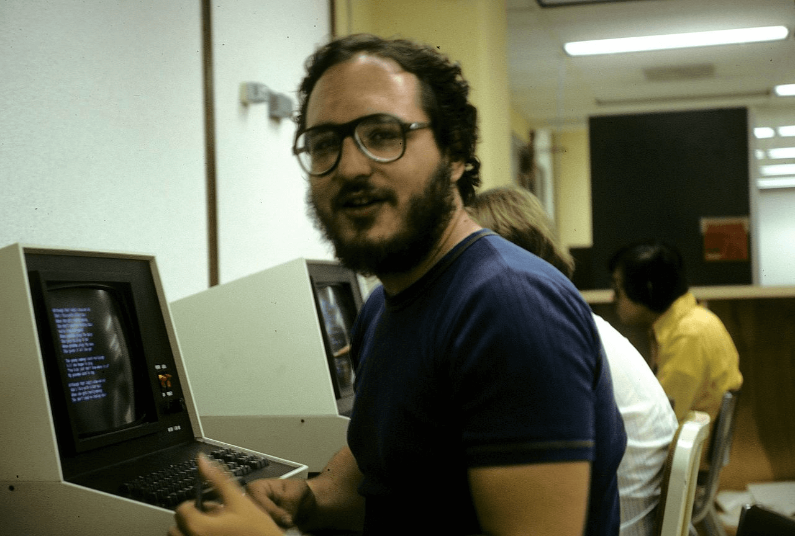
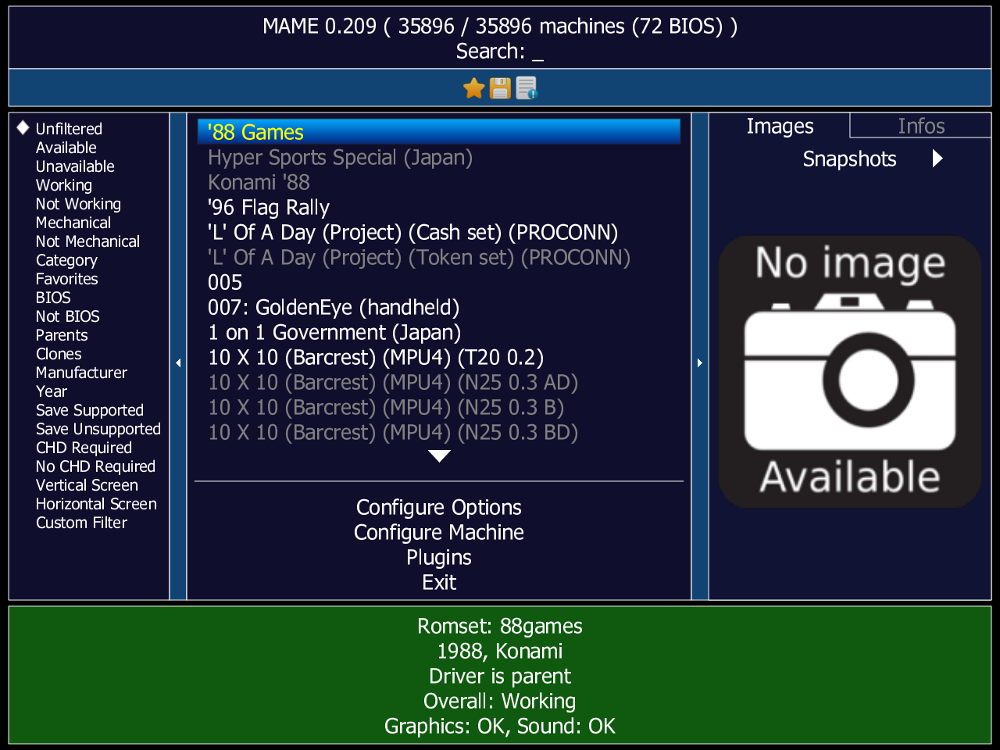
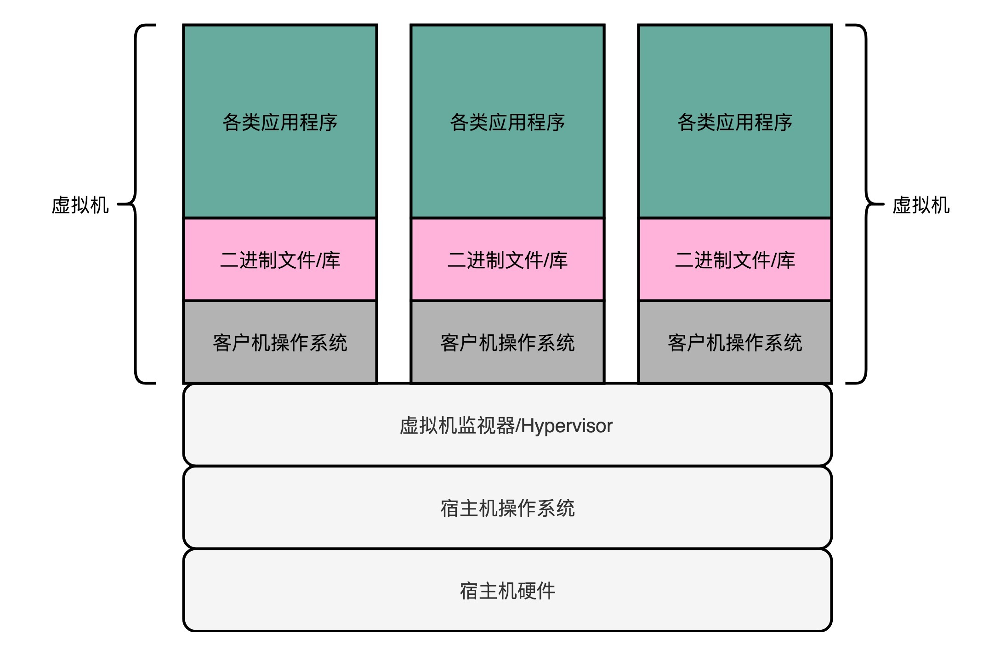
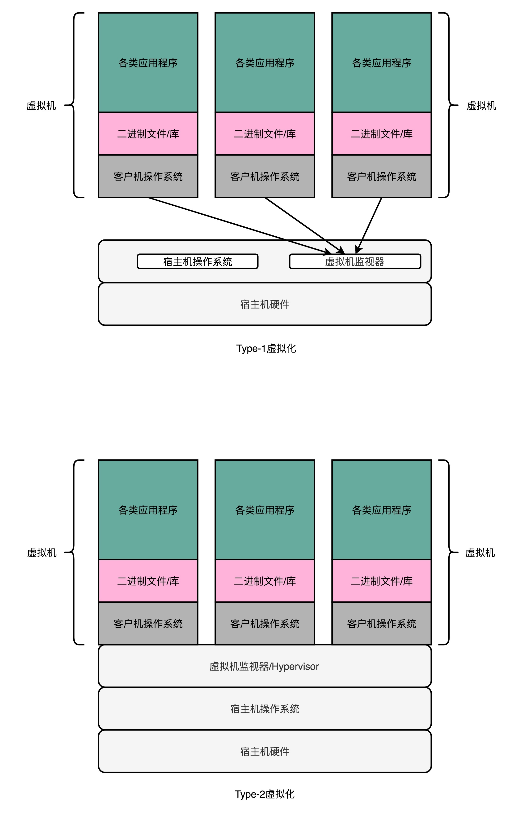
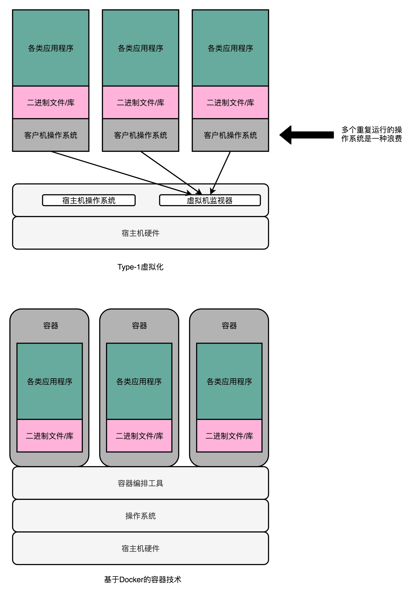

# 34 理解虚拟机：你在云上拿到的计算机是什么样的？

上世纪 60 年代，计算机还是异常昂贵的设备，实际的计算机使用需求要面临两个挑战。第一，计算机特别昂贵，我们要尽可能地让计算机忙起来，一直不断地去处理一些计算任务。第二，很多工程师想要用上计算机，但是没有能力自己花钱买一台，所以呢，我们要让很多人可以共用一台计算机。

## 缘起分时系统

为了应对这两个问题，[分时系统](https://en.wikipedia.org/wiki/Time-sharing)的计算机就应运而生了。

无论是个人用户，还是一个小公司或者小机构，你都不需要花大价钱自己去买一台电脑。你只需要买一个输入输出的终端，就好像一套鼠标、键盘、显示器这样的设备，然后通过电话线，连到放在大公司机房里面的计算机就好了。这台计算机，会自动给程序或任务分配计算时间。你只需要为你花费的“计算时间”和使用的电话线路付费就可以了。比方说，比尔·盖茨中学时候用的学校的计算机，就是 GE 的分时系统。

[图片来源](https://commons.wikimedia.org/wiki/File:Unix_Timesharing_UW-Madison_1978.jpeg)

图片里面的“计算机”其实只是一个终端而已，并没有计算能力，要通过电话线连接到实际的计算机上，才能完成运算

## 从“黑色星期五”到公有云

现代公有云上的系统级虚拟机能够快速发展，其实和分时系统的设计思路是一脉相承的，这其实就是来自于电商巨头亚马逊大量富余的计算能力。

和国内有“双十一”一样，美国会有感恩节的“[黑色星期五](<https://en.wikipedia.org/wiki/Black_Friday_(shopping)>)（Black Friday）”和“[网络星期一](https://en.wikipedia.org/wiki/Cyber_Monday)（Cyber Monday）”，这样一年一度的大型电商促销活动。几天的活动期间，会有大量的用户进入亚马逊这样的网站，看商品、下订单、买东西。这个时候，整个亚马逊需要的服务器计算资源可能是平时的数十倍。

于是，亚马逊会按照“黑色星期五”和“网络星期一”的用户访问量，来准备服务器资源。这个就带来了一个问题，那就是在一年的 365 天里，有 360 天这些服务器资源是大量空闲的。要知道，这个空闲的服务器数量不是一台两台，也不是几十几百台。根据媒体的估算，亚马逊的云服务器 AWS 在 2014 年就已经超过了 150 万台，到了 2019 年的今天，估计已经有超过千万台的服务器。

平时有这么多闲着的服务器实在是太浪费了，所以，亚马逊就想把这些服务器给租出去。出租物理服务器当然是可行的，但是却不太容易自动化，也不太容易面向中小客户。

直接出租物理服务器，意味着亚马逊只能进行服务器的“整租”，这样大部分中小客户就不愿意了。为了节约数据中心的空间，亚马逊实际用的物理服务器，大部分多半是强劲的高端 8 核乃至 12 核的服务器。想要租用这些服务器的中小公司，起步往往只需要 1 个 CPU 核心乃至更少资源的服务器。一次性要他们去租一整台服务器，就好像刚毕业想要租个单间，结果你非要整租个别墅给他。

这个“整租”的问题，还发生在“时间”层面。物理服务器里面装好的系统和应用，不租了而要再给其他人使用，就必须清空里面已经装好的程序和数据，得做一次“重装”。如果我们只是暂时不用这个服务器了，过一段时间又要租这个服务器，数据中心服务商就不得不先重装整个系统，然后租给别人。等别人不用了，再重装系统租给你，特别地麻烦。

其实，对于想要租用服务器的用户来说，最好的体验不是租房子，而是住酒店。我住一天，我就付一天的钱。这次是全家出门，一次多定几间酒店房间就好啦。

而这样的需求，用虚拟机技术来实现，再好不过了。虚拟机技术，使得我们可以在一台物理服务器上，同时运行多个虚拟服务器，并且可以动态去分配，每个虚拟服务器占用的资源。对于不运行的虚拟服务器，我们也可以把这个虚拟服务器“关闭”。这个“关闭”了的服务器，就和一个被关掉的物理服务器一样，它不会再占用实际的服务器资源。但是，当我们重新打开这个虚拟服务器的时候，里面的数据和应用都在，不需要再重新安装一次。

## 虚拟机的技术变迁

那虚拟机技术到底是怎么一回事呢？下面我带你具体来看一看，它的技术变迁过程，好让你能更加了解虚拟机，从而更好地使用它。

**虚拟机** （Virtual Machine）技术，其实就是指在现有硬件的操作系统上，能够 **模拟** 一个计算机系统的技术。而模拟一个计算机系统，最简单的办法，其实不能算是虚拟机技术，而是一个模拟器（Emulator）。

### 解释型虚拟机

要模拟一个计算机系统，最简单的办法，就是兼容这个计算机系统的指令集。我们可以开发一个应用程序，跑在我们的操作系统上。这个应用程序呢，可以识别我们想要模拟的、计算机系统的程序格式和指令，然后一条条去解释执行。

在这个过程中，我们把原先的操作系统叫作 **宿主机** （Host），把能够有能力去模拟指令执行的软件，叫作 **模拟器** （Emulator），而实际运行在模拟器上被“虚拟”出来的系统呢，我们叫 **客户机** （Guest VM）。

这个方式，其实和运行 Java 程序的 Java 虚拟机很像。只不过，Java 虚拟机运行的是 Java 自己定义发明的中间代码，而不是一个特定的计算机系统的指令。

这种解释执行另一个系统的方式，有没有真实的应用案例呢？当然是有的，如果你是一个 Android 开发人员，你在开发机上跑的 Android 模拟器，其实就是这种方式。如果你喜欢玩一些老游戏，可以注意研究一下，很多能在 Windows 下运行的游戏机模拟器，用的也是类似的方式。

**这种解释执行方式的最大的优势就是，模拟的系统可以跨硬件。** 比如，Android 手机用的 CPU 是 ARM 的，而我们的开发机用的是 Intel X86 的，两边的 CPU 指令集都不一样，但是一样可以正常运行。如果你想玩的街机游戏，里面的硬件早就已经停产了，那你自然只能选择 MAME 这样的模拟器。

[图片来源](https://commons.wikimedia.org/wiki/File:NewMAME.png)

MAME 模拟器的界面

不过这个方式也有两个明显的缺陷。第一个是，我们做不到精确的“模拟”。很多的老旧的硬件的程序运行，要依赖特定的电路乃至电路特有的时钟频率，想要通过软件达到 100% 模拟是很难做到的。第二个缺陷就更麻烦了，那就是这种解释执行的方式，性能实在太差了。因为我们并不是直接把指令交给 CPU 去执行的，而是要经过各种解释和翻译工作。

所以，虽然模拟器这样的形式有它的实际用途。甚至为了解决性能问题，也有类似于 Java 当中的 JIT 这样的“编译优化”的办法，把本来解释执行的指令，编译成 Host 可以直接运行的指令。但是，这个性能还是不能让人满意。毕竟，我们本来是想要把空余的计算资源租用出去的。如果我们空出来的计算能力算是个大平层，结果经过模拟器之后能够租出去的计算能力就变成了一个格子间，那我们就划不来了。

### Type-1 和 Type-2：虚拟机的性能提升

所以，我们希望我们的虚拟化技术，能够克服上面的模拟器方式的两个缺陷。同时，我们可以放弃掉模拟器方式能做到的跨硬件平台的这个能力。因为毕竟对于我们想要做的云服务里的“服务器租赁”业务来说，中小客户想要租的也是一个 x86 的服务器。而另外一方面，他们希望这个租用的服务器用起来，和直接买一台或者租一台物理服务器没有区别。作为出租方的我们，也希望服务器不要因为用了虚拟化技术，而在中间损耗掉太多的性能。

所以，首先我们需要一个“全虚拟化”的技术，也就是说，我们可以在现有的物理服务器的硬件和操作系统上，去跑一个完整的、不需要做任何修改的客户机操作系统（Guest OS）。那么，我们怎么在一个操作系统上，再去跑多个完整的操作系统呢？答案就是，我们自己做软件开发中很常用的一个解决方案，就是加入一个中间层。在虚拟机技术里面，这个中间层就叫作 **虚拟机监视器** ，英文叫 VMM（Virtual Machine Manager）或者 Hypervisor。

如果说我们宿主机的 OS 是房东的话，这个虚拟机监视器呢，就好像一个二房东。我们运行的虚拟机，都不是直接和房东打交道，而是要和这个二房东打交道。我们跑在上面的虚拟机呢，会把整个的硬件特征都映射到虚拟机环境里，这包括整个完整的 CPU 指令集、I/O 操作、中断等等。

既然要通过虚拟机监视器这个二房东，我们实际的指令是怎么落到硬件上去实际执行的呢？这里有两种办法，也就是 Type-1 和 Type-2 这两种类型的虚拟机。

我们先来看 Type-2 类型的虚拟机。在 Type-2 虚拟机里，我们上面说的虚拟机监视器好像一个运行在操作系统上的软件。你的客户机的操作系统呢，把最终到硬件的所有指令，都发送给虚拟机监视器。而虚拟机监视器，又会把这些指令再交给宿主机的操作系统去执行。

那这时候你就会问了，这和上面的模拟器看起来没有那么大分别啊？看起来，我们只是把在模拟器里的指令翻译工作，挪到了虚拟机监视器里。没错，Type-2 型的虚拟机，更多是用在我们日常的个人电脑里，而不是用在数据中心里。

在数据中心里面用的虚拟机，我们通常叫作 Type-1 型的虚拟机。这个时候，客户机的指令交给虚拟机监视器之后呢，不再需要通过宿主机的操作系统，才能调用硬件，而是可以直接由虚拟机监视器去调用硬件。

另外，在数据中心里面，我们并不需要在 Intel x86 上面去跑一个 ARM 的程序，而是直接在 x86 上虚拟一个 x86 硬件的计算机和操作系统。所以，我们的指令不需要做什么翻译工作，可以直接往下传递执行就好了，所以指令的执行效率也会很高。

所以，在 Type-1 型的虚拟机里，我们的虚拟机监视器其实并不是一个操作系统之上的应用层程序，而是一个嵌入在操作系统内核里面的一部分。无论是 KVM、XEN 还是微软自家的 Hyper-V，其实都是系统级的程序。

因为虚拟机监视器需要直接和硬件打交道，所以它也需要包含能够直接操作硬件的驱动程序。所以 Type-1 的虚拟机监视器更大一些，同时兼容性也不能像 Type-2 型那么好。不过，因为它一般都是部署在我们的数据中心里面，硬件完全是统一可控的，这倒不是一个问题了。

### Docker：新时代的最佳选择？

虽然，Type-1 型的虚拟机看起来已经没有什么硬件损耗。但是，这里面还是有一个浪费的资源。在我们实际的物理机上，我们可能同时运行了多个的虚拟机，而这每一个虚拟机，都运行了一个属于自己的单独的操作系统。

多运行一个操作系统，意味着我们要多消耗一些资源在 CPU、内存乃至磁盘空间上。那我们能不能不要多运行的这个操作系统呢？

其实是可以的。因为我们想要的未必是一个完整的、独立的、全虚拟化的虚拟机。我们很多时候想要租用的不是“独立服务器”，而是独立的计算资源。在服务器领域，我们开发的程序都是跑在 Linux 上的。其实我们并不需要一个独立的操作系统，只要一个能够进行资源和环境隔离的“独立空间”就好了。那么，能够满足这个需求的解决方案，就是过去几年特别火热的 Docker 技术。使用 Docker 来搭建微服务，可以说是过去两年大型互联网公司的必经之路了。

在实践的服务器端的开发中，虽然我们的应用环境需要各种各样不同的依赖，可能是不同的 PHP 或者 Python 的版本，可能是操作系统里面不同的系统库，但是通常来说，我们其实都是跑在 Linux 内核上的。通过 Docker，我们不再需要在操作系统上再跑一个操作系统，而只需要通过容器编排工具，比如 Kubernetes 或者 Docker Swarm，能够进行各个应用之间的环境和资源隔离就好了。

这种隔离资源的方式呢，也有人称之为“操作系统级虚拟机”，好和上面的全虚拟化虚拟机对应起来。不过严格来说，Docker 并不能算是一种虚拟机技术，而只能算是一种资源隔离的技术而已。

## 总结延伸

这一讲，我从最古老的分时系统讲起，介绍了虚拟机的相关技术。我们现在的云服务平台上，你能够租到的服务器其实都是虚拟机，而不是物理机。而正是虚拟机技术的出现，使得整个云服务生态得以出现。

虚拟机是模拟一个计算机系统的技术，而其中最简单的办法叫模拟器。我们日常在 PC 上进行 Android 开发，其实就是在使用这样的模拟器技术。不过模拟器技术在性能上实在不行，所以我们才有了虚拟化这样的技术。

在宿主机的操作系统上，运行一个虚拟机监视器，然后再在虚拟机监视器上运行客户机的操作系统，这就是现代的虚拟化技术。这里的虚拟化技术可以分成 Type-1 和 Type-2 这两种类型。

Type-1 类型的虚拟化机，实际的指令不需要再通过宿主机的操作系统，而可以直接通过虚拟机监视器访问硬件，所以性能比 Type-2 要好。而 Type-2 类型的虚拟机，所有的指令需要经历客户机操作系统、虚拟机监视器、宿主机操作系统，所以性能上要慢上不少。不过因为经历了宿主机操作系统的一次“翻译”过程，它的硬件兼容性往往会更好一些。

今天，即使是 Type-1 型的虚拟机技术，我们也会觉得有一些性能浪费。我们常常在同一个物理机上，跑上 8 个、10 个的虚拟机。而且这些虚拟机的操作系统，其实都是同一个 Linux Kernel 的版本。于是，轻量级的 Docker 技术就进入了我们的视野。Docker 也被很多人称之为“操作系统级”的虚拟机技术。不过 Docker 并没有再单独运行一个客户机的操作系统，而是直接运行在宿主机操作系统的内核之上。所以，Docker 也是现在流行的微服务架构底层的基础设施。

## 推荐阅读

又到了阅读英文文章的时间了。想要更多了解虚拟机、Docker 这些相关技术的概念和知识，特别是进一步理解 Docker 的细节，你可以去读一读 FreeCodeCamp 里的[A Beginner-Friendly Introduction to Containers, VMs and Docker](https://www.freecodecamp.org/news/a-beginner-friendly-introduction-to-containers-vms-and-docker-79a9e3e119b/)这篇文章。
