# 01 从计数开始，程序员必知必会的数制转换法

以前看过一个幽默段子，老师说：“世界上有 10 种人，一种懂二进制，另一种不懂二进制。”小琳问：“那另外 8 种人呢？” 显然小琳同学是不懂二进制的那类人。二进制的 10，代表的是十进制的 2。替换到老师的话中就是，世界上有两种人，一种懂二进制，另一种不懂二进制。

当我们还是个孩童时，幼儿园的阿姨便用火柴棍教我们如何数数。这是最早期的数学教育，这也是在某个数制下的计数问题。

作为第一节课，我还是想和你回归最基本的“数制转换”主题。我将以图文结合的方式，与你一起回顾温习数制，详解不同数制之间的巧妙联系，并重新思考数制与编程、计算机的关联。例如，如何利用二进制的位运算，对一个查找问题的代码进行优化等内容。

### 数制

**数制是一种计算数量大小的制度** ，也是计数法。用大白话来说， **就是数数的方法** 。

数制中，最重要的因素是 **基数** 。假设我们设置基数为 10 来数数，那就是在用十进制计数法；如果设置基数为 2，就是在用二进制计数法。

不同的数制中，使用最广泛的就是十进制，这与人类有 10 个手指头是密不可分的。人类在学习计数和四则运算时，会通过手指头辅助计算。

- 在我国的古代，也曾经使用过十六进制。例如，成语半斤八两的含义是彼此不相上下，实力相当。即半斤就是 8 两，1 斤就是 16 两。
- 在时间的计数场景时，我们也用过二十四进制和六十进制。例如，1 天等于 24 小时，1 小时等于 60 分钟，1 分钟等于 60 秒。

### 不同数制的表达

有了不同的数制，就需要对数制下的数字进行区分，否则就会造成混淆。例如，象征考试得了满分的 100，在十进制下依旧是 100；而在二进制下，它就是十进制下的 4；在八进制，则表示十进制下的 64；在十六进制，则表示十进制下的 256。

> 至于为什么如此计算转换，下文的数制转换方法会详细讲解。

所以如果对数字不加以说明，你会发现很难判断这到底是哪个数制下的数字，毕竟同一数字在不同数制下其意义是完全不同的。为了避免混淆，我们对不同数制下的数字做了区分。

十进制使用的数字符号是 \[0,1,2,3,4,5,6,7,8,9\]；对于二进制和八进制，它们仍然沿用十进制的数字符号。在十六进制中，由于数字符号不够用，这就需要额外补充。一般用 \[A,B,C,D,E,F\]（一般不会特别区分字母的大小写），分别代表十进制下的 \[10,11,12,13,14,15\]。

- 一般而言，没有额外说明的数字都是十进制下的数字；
- 表示二进制时，会用 0b 作为数字的前缀；
- 表示八进制时，会用 0o 或者 0 作为数字的前缀；
- 表示十六进制时，会用 0x 作为数字的前缀。

这里 b、o、x 三个英文字母的选择均来自数制的英文单词。

综上，我们对这几个数制的信息整理如下表：

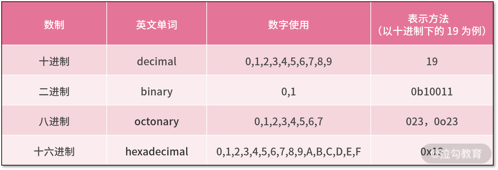

### 数制转换的方法

人们在使用数制进行计算时，都习惯性地把原问题映射到十进制中；计算完成后，再映射回去。这里就牵涉数制的转换啦。

我举一个生活中最常见的数制转换的例子。

> 例如，上午 8:40 开始考试，考试时长是 40 分钟，问考试结束的时间是多少？

计算过程是：考试时长的 **40 分钟** 加上 8 点过 40 分的 **40 分钟** 就是 80 分钟，也即是 1 小时 20 分钟，再加上 8 点本身，结束时间就是上午 9:20。

“40分钟+40分钟=80分钟”就是十进制的算术过程，可见为了完成其他数制的运算，我们依旧更喜欢用十进制做桥梁，毕竟我们对十进制的运算是最熟悉的。

#### 1. 换基法（换向十进制）

我们给出数制转换的定量方法，也就是对于任意一个基数 N 进制下的数字 X，它转换为十进制的方法。如下图的公式所示：原进制若是 N 进制，转换时的基数便取 N。例如，将二进制的 X 转化为十进制时，运算时的转换基数便取为 2。


- 我们举个例子，十进制下的 2020。

它是十进制，所以我们基数便取 10；2020有 4 位数，根据上图公式，我们分别取(4-1)次方、(4-2)次方、(4-3)次方、(4-4)次方，再分别与每位数相乘，再相加取和。

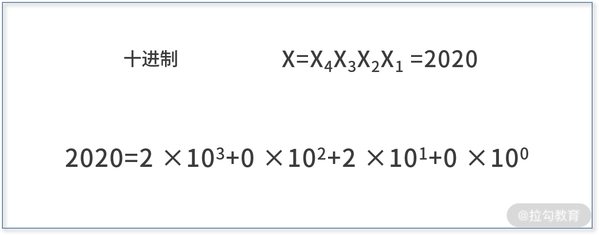

- 再举个例子，二进制下的 10110，利用换基法转换为十进制。

它原是二进制，所以我们基数便取 2；10110 有 5 位数，根据上图公式，我们分别取(5-1)次方、(5-2)次方、(5-3)次方、(5-4)次方、(5-5)次方，再分别与每位数相乘，再相加取和。

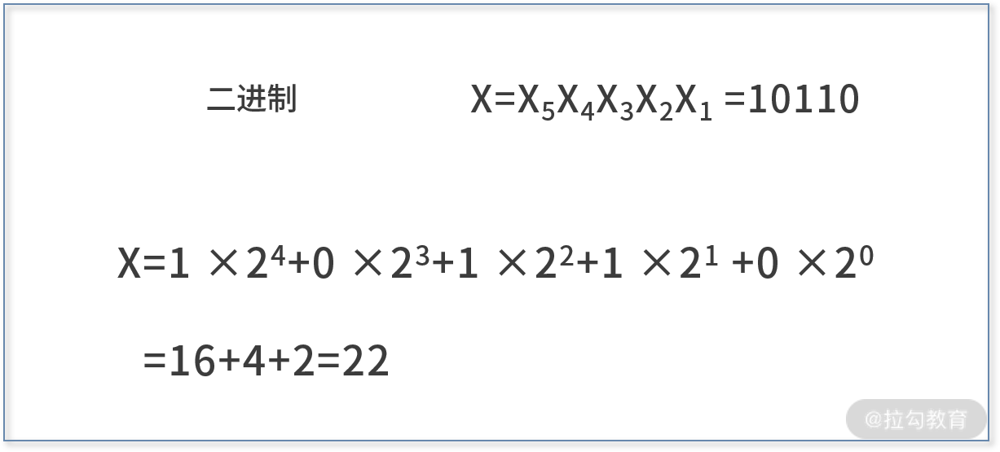

#### 2. 除余法（十进制向其他进制转换）

转向的目标进制为 N 进制，则以 N 为除数不断地做除法，将最后的商和之前的余数 **逆序** 串联在一起，就是最终的结果。

例如，十进制的 19 转换为二进制的过程如下图所示：

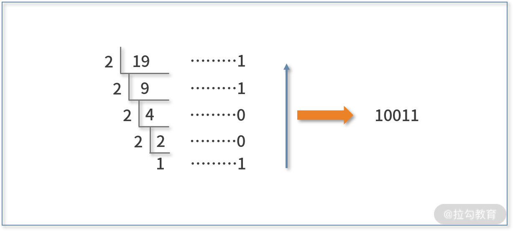

用 19 对 2 做除法得到余数 1，再用商对 2 做除法得到余数 1，再用商对 2 做除法得到余数 0...直到商为 1 结束。最终，用最后的商（也就是1），和过程中所有的余数 **逆序** 串联在一起，就是最终的结果 10011。

值得一提的是，除余法除了适用于十进制向二进制的转换，也 **适用于十进制向任何数制的转换** 。例如，用除余法将十进制的 100，转换为八进制和十六进制的计算过程如下，得到结果分别是 0144 和 0x64。

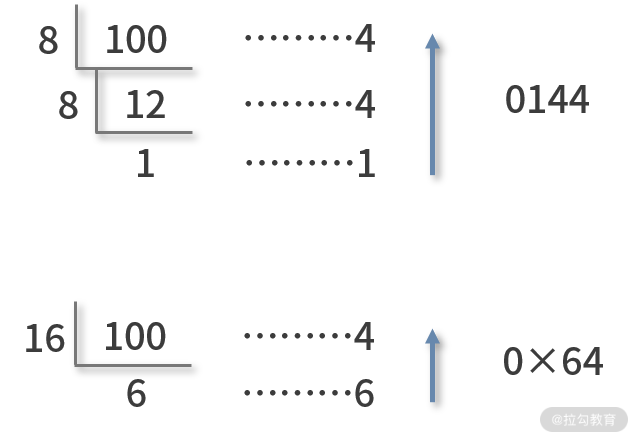

我们可以给出个简单的证明，根据换基法我们知道某个数制 N 下的数字的十进制表示为：


其中，Xm、Xm-1、...、X1 分别为数字 X 在 N 进制下的每一位数字，也是我们要求解的目标。接着，我们可以计算 X 除以 N。

这样可以得到，当我们第一次对 N 做除法时，就可以得到商为 N 进制下的 XmXm-1Xm-2...X2，余数就是 X1，即： 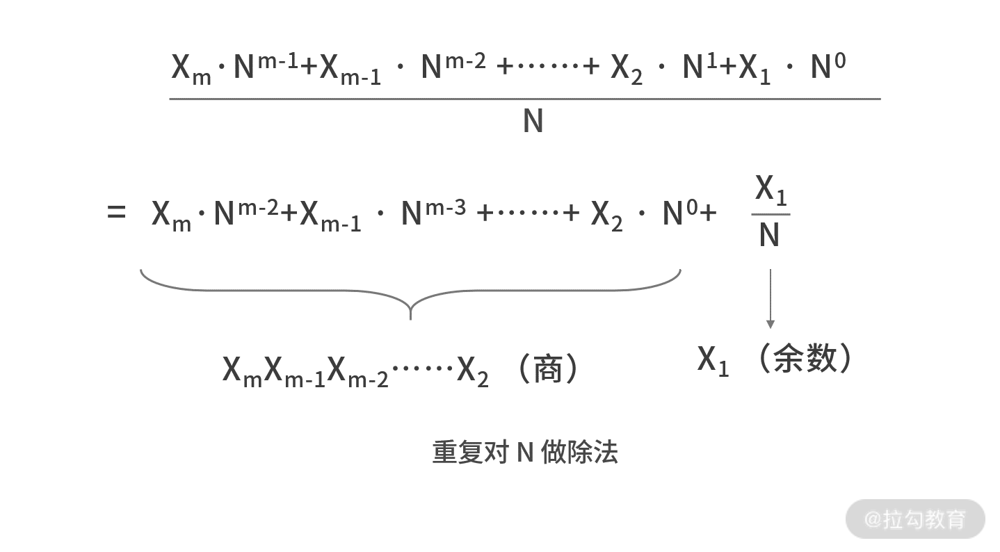 那么第一次除以 N，是如何得到商为 N 进制下的 XmXm-1Xm-2...X2，余数就是 X1 的呢？你可以通过下图这个 16 进制下的 5321 这个例子理解。 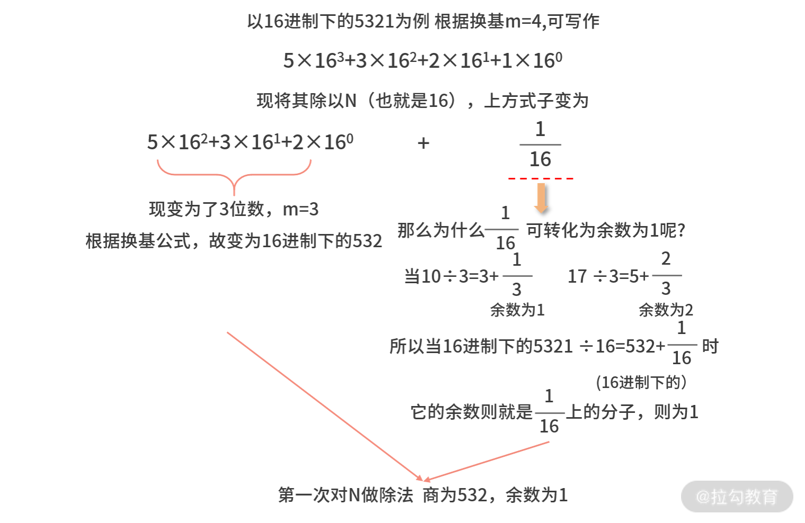 这里以 16 进制下的 5321 为例，可以更好地理解这一过程。如果不带入具体数制下的数字，你也可以通过公式推导出来，只是不那么容易理解，不过你自己也可以尝试。

接着同理，我们再用上一步的商 XmXm-1Xm-2...X2 重复对 N 做除法的过程，就会得到新的商为 N 进制下的 XmXm-1Xm-2...X3 ，余数为 X2 。再同理，重复上面的过程，你会发现得到的余数分别是 X1X2X3...Xm。

最后，我们把所有的余数做个逆序，就得到了 N 进制下的 X 的每一位，最终就能得到 XmXm-1Xm-2...X1 了。

#### 3. 按位拆分法和按位合并法

对于八进制和二进制之间的转换，你可以利用十进制做个跳板。

**除此之外，还有一个简单的按位拆分法，可以将八进制转为二进制。** 你只需要把原来八进制中的每个数字符号，直接拆分为 **3 位的二进制** 数字符号（必须保证是 3 位），再按 **顺序** 串联起来，就是最终结果。

我们以八进制下的 023 为例进行讲解：

- 由于十进制的 2 的二进制表示是 010；
- 十进制的 3 的二进制表示是 011；
- 最后，别忘加上二进制的符号 0b，并去掉首位 0。

则八进制的 023 的二进制表示就是 0b10011，如下图：

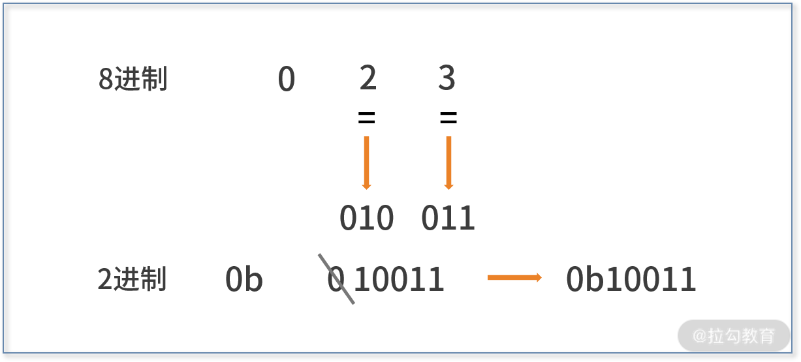

**同理，二进制转换为八进制，可以采用每 3 位合并的按位合并法。** 如下图，二进制的 0b10011 转换为八进制，则 **从后往前** 每 3 位合并：

- 最后 3 位是 011，它是十进制的 3，在八进制也用 3 表示；
- 从后往前的两位是 10（不够三位时补“0”则为 10），它是十进制的 2，在八进制也用 2 来表示；
- 别忘加上八进制的符号 0o。

则最终八进制的结果就是 0o23 或 023。

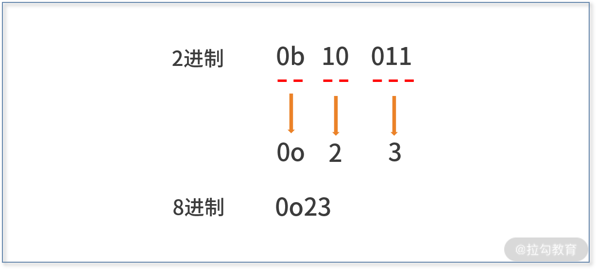

对于 **十六进制和二进制之间的转换** ，也可以采用按位合并和按位拆分的方法，区别只是在于需要按 **4 位** 进行合并或拆分。

例如下图，十六进制的 0x1a 转换为二进制，由于 1 为 0001，a 为 1010，串联在一起之后，二进制的结果就是 0b11010。

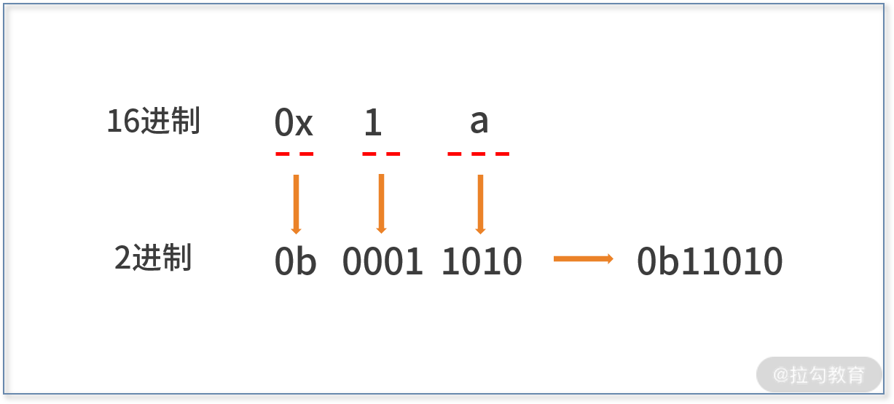

同样地，二进制的 0b1011101 转换为十六进制，从后往前每 4 位合并：

- 最后 4 位是 1101，它是十进制的 13，在十六进制表示为 d；
- 往前的几位是 101，十进制和十六进制都用 5 来表示；
- 别忘加上十六进制的符号 0x。

则最终十六进制的结果就是 0x5d。 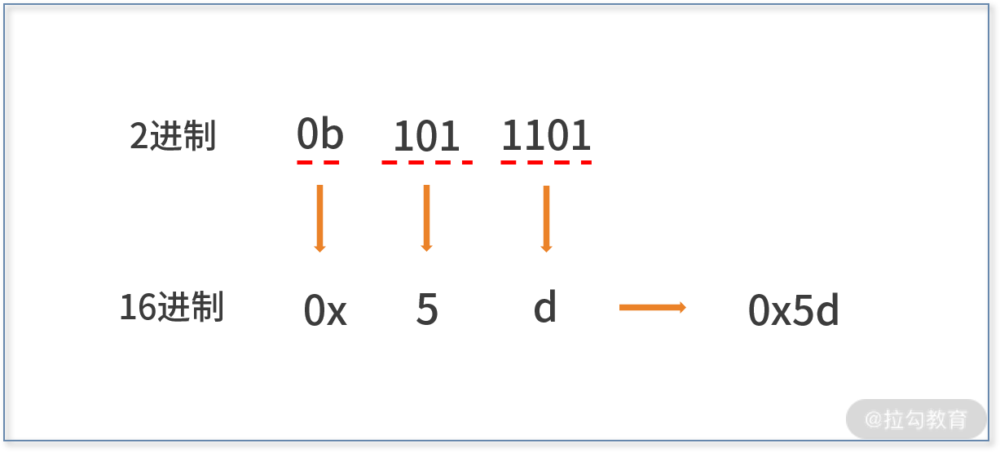

为何八进制与二进制的转换是按照 3 位数合并、拆分，而十六进制与二进制之间则是 4 位数呢？本质原因是在于 2³=8 和 2⁴=16。根据这表达式可以看出，二进制中的 3 个 bit（位），恰好可以表示 0～7 这 8 个数字。因此，按照 3 位合并，就可以从二进制转化到八进制了。同理，按照 4 位合并，就可以从二进制转化到十六进制了。

而八进制与十六进制之间的转换，就不适用按位合并和按位拆分的方法了，你可以以二进制或十进制为跳板，进行两者之间的转换。

#### 4. 数制转换图

我们总结一下，对于一般的数制之间转换，我们喜欢以十进制来作为跳板。

其他数制向十进制的转换方法是 **换基法** ，而十进制向其他数制转换的方法是 **除余法** 。

特别地，对于程序员经常关注的二进制、八进制和十六进制之间，它们又有一些特殊的转换方法。二进制向八进制或十六进制的转换，可以采用 **按位合并法** ；八进制或十六进制向二进制的转换，可以采用 **按位拆分法** 。

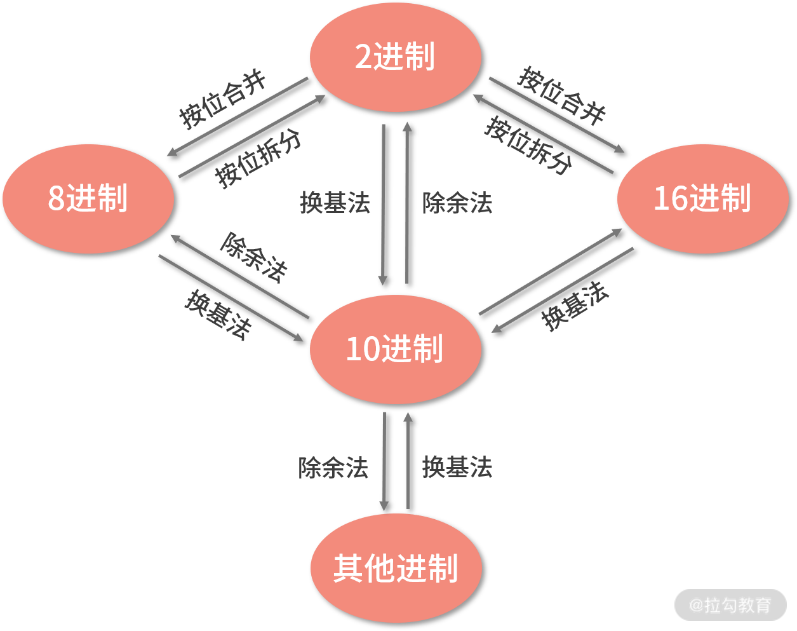

数制转换方法图

### 数制转换与编程

在编程的时候，利用对不同数制及其转换的性质，往往能让很多复杂问题迎刃而解。最常见的就是二进制下的运算，看下下面的例题。

#### 【例题】判断一个整数 a，是否是 2 的整数次幂

解析：如果是十进制，判断一个数是否是 10 的整数次幂，只需要看这个数字的形式是否为一个“1”和若干个“0”构成。例如，一个“1”和两个“0”构成“100”，它是 10 的 2 次幂；一个“1”和 4 个“0”构成“10000”，它是 10 的 4 次幂。

因此这个题目的解法就是，把 a 转换为二进制，看看 bin(a) 的形式是否为一个“1”和若干个“0”构成，代码如下：

```plaintext
a = 8
b = str(bin(a))
total = 0
for i in range(2,len(b)):
    total += int(b[i])
if total == 1 and b[2] == '1':
    print 'yes'
else:
    print 'no'
```

我们对代码进行解读。

- 第 1～2 行，变量 a 为待判断的整数；变量 b 是 a 的二进制形式，并且被我们强制转化为 string 类型，这样 b 的值就是 0b1000。
- 如果形式为一个“1”和若干个“0”，则需要满足以下两个性质：第一，首位为“1”；第二，所有位加和为“1”。
- 在代码中，第 4～6 行，我们计算了所有位数的加和，并保存在 total 变量中。
- 在第 8～11 行，我们根据两个性质，对结果进行判断，并打印 yes 或者 no。

我们还可以利用 **位运算的“与”** ，来判断二进制数字 x 的形式是否为一个“1”和若干个“0”。判断的方法是，计算 x & (x-1)，如果结果为 0 则是，如果结果非 0 则不是。这样我们可以得到更简单的实现代码，代码如下：

```plaintext
a = 80
if a & (a-1) == 0:
    print 'yes'
else:
    print 'no'
```

其中涉及关于位运算的知识，我会在下一个课时进行详细剖析。

### 小结

数制是数字的基础，也是计算机的基础。信息时代的到来，让二进制被广泛应用，这主要是因为电路中的开关只有接通和切断两种状态，二进制的运算也称为位运算。

计算机的数据存储单位便体现了数制的应用，计算机中的数据存储单位常常用 Byte（字节）或 bit（位）。

bit 是表示信息的最小单位，叫作二进制位，一个 bit 等于一个二进制数。一个十进制的数的比特要换成二进制看，比如十进制 31 换二进制是 11111 是 5 个 bit，32 换二进制是 100000 是 6 个 bit。而 Byte 叫作字节，用于表示计算机中的一个字符，是计算机文件大小的基本计算单位，1 Byte = 8 bit（也写作 1B = 8b），它采用了 8 个 2 进制位。

在本课时中，我们学习不同数制之间的转换方法，包括换基法、除余法、按位拆分法和按位合并法。其中的换基法和除余法，是关于十进制的转换；而按位拆分法和按位合并法，则是关于二进制的转换。

在学习过程中，你会发现八进制和十六进制采用的按位合并法，更像是对二进制的压缩表示。八进制或十六进制的一个位，可以表示出 3 或 4 位的二进制数字。因此，用八进制或十六进制来表示二进制会更为方便。
