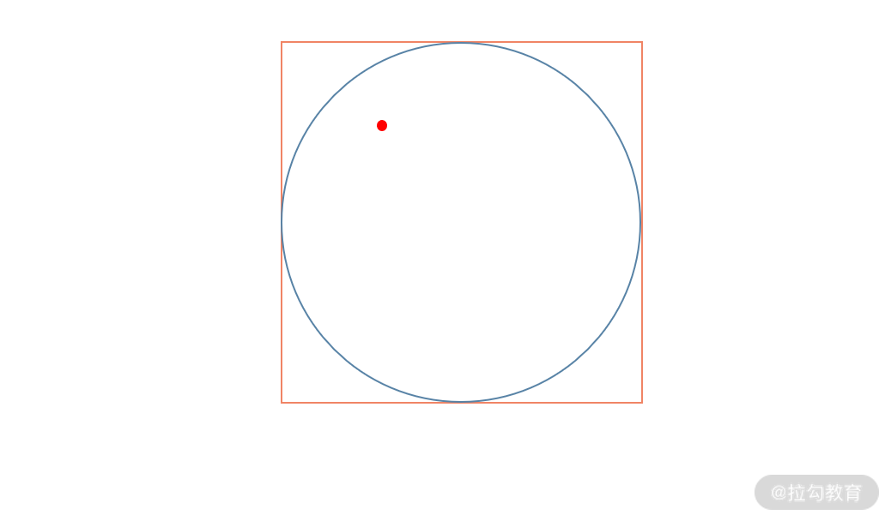
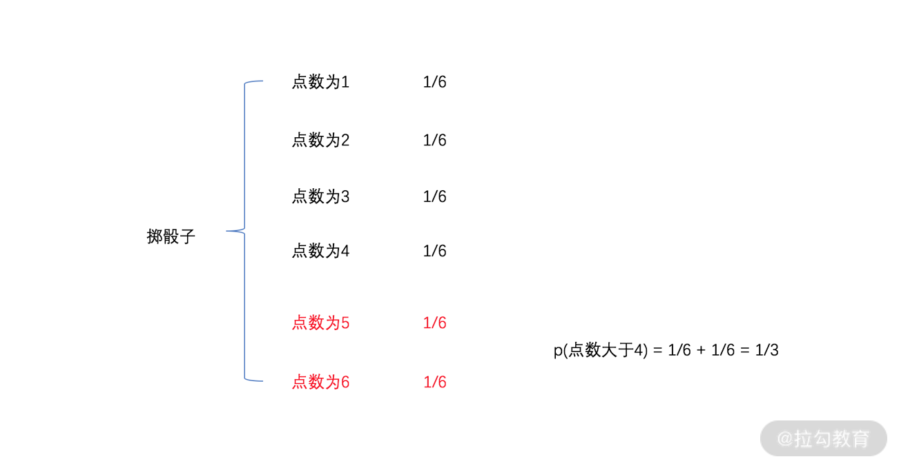
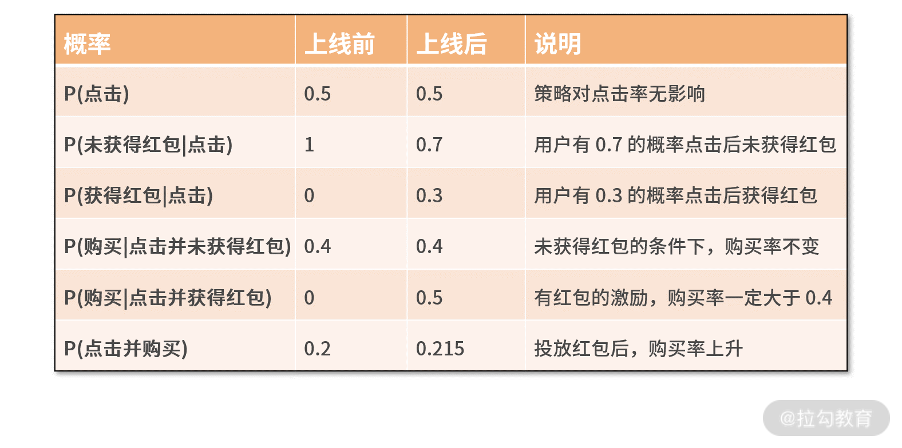

# 08 加乘法则：如何计算复杂事件发生的概率？

在我们的工作和生活中少不了对概率的计算，对概率的准确计算会帮助我们做出更加合理高效的决策。

例如，早上出门之前，你需要对是否携带雨伞进行决策。如果没有任何依据而随机决策，那么就会遇到下雨没带伞或者晴天带伞的麻烦；而如果有依据，你知道今天下雨的概率超过 80%，那么你就会做出带雨伞的决策，来规避下雨带来不便的风险。

那么问题来了，对于一个事件而言，其发生的概率该如何计算呢？这一讲我们就来解答。

### 概率来自统计

还记得我们最开始接触概率时的定义吗？概率用来描述一个事件发生的可能性，它是个 0 到 1 的数字。概率的定义式就是 m/n，含义为假设某个现象重复执行 n 次（n 较大），其中目标事件发生了 m 次，则目标事件发生的概率就是 m/n。

> 举个例子，一枚硬币重复抛 100 次，其中正面朝上 49 次，反面朝上 51 次，则硬币正面朝上的概率就是 0.49。

概率的定义式非常重要，如果你能灵活运用，并结合一定的代码开发，有时候可以快速解决一个复杂的数学问题。

我们举个例子，在一个正方形内有一个内切圆，在正方形内随机选取一点，问该点也在圆内的概率是多少？  这是个数学问题，但你可以借助概率的定义式完成计算，代码如下：

```python
import random
def main():
 m = 0
 n = 1000
 for _ in range(n):
  x = random.random()
  y = random.random()
  if x*x + y*y < 1:
   m += 1
 print 1.0*m/n
if __name__ == '__main__':
 main()
```

我们对代码进行走读：

- 第 4、5 行定义了 m 和 n 两个变量。其中，n 赋值为 1000，意味着我们要重复执行这个动作 1000 次，m 表示坐标点落入圆内的次数；
- 接下来，就是第 6～10 行的 1000 次实验的循环了。每次实验，我们随机生成一个坐标点 (x,y)，其中 x 和 y 的取值范围都是 0～1 的浮点数；
- 这样，在第 9 行中，如果点 (x,y) 与原点的距离小于 1，则表示该点在圆内，m 自动加 1；
- 最后，打印出 m 和 n 的比值。

我们运行程序的结果如下： 

这个题目如果从数学的视角来计算，结果就是 P =πr2÷4r2= π÷4 = 0.785，这与我们的计算结果是一样的。

未来，如果你遇到复杂的概率计算时，不妨试着用这种统计法来求解。

### 用加乘法则来计算复杂事件的概率

统计法是一种用程序思想解决数学问题的范例，但这并不意味着你不需要学习数学中概率计算的原理。原因在于，有些场景下重复试验的条件并不成立；或者是事件极其复杂，重复试验的代价太大。这就需要我们掌握一些基本的概率计算法则。

在这一课时，我们重点介绍加法原理和乘法原理。

#### 1.加法原理

加法原理可以理解为，一个事件有多个可能的发生路径，那么这个事件发生的概率，就是所有路径发生的概率之和。

例如，在掷骰子的游戏中，掷出的点数大于 4 的概率是多少？

掷骰子的 6 个可能的点数是 6 个路径，每个路径发生的概率是 1/6，其中满足条件中点数大于 4 的只有最后两条路径。利用加法原理则有，点数大于 4 的概率为 1/6 + 1/6 = 1/3，如下图： 

#### 2.乘法原理

如果将加法原理理解为是串行的逻辑，那么乘法原理就是个并行的逻辑。乘法原理可以理解为，某个事件的发生，依赖多个事件的同时发生。那么原事件发生的概率，就是所有这必须发生的多个事件的乘积。

例如，你与大迷糊一起玩掷骰子的游戏，求大迷糊掷出 4 点的同时，你最终获胜的概率是多少？

这时候，计算的概率就必须两个条件同时发生。这两个条件分别是，大迷糊掷出 4 点和你的点数大于 4。根据前面的计算，我们知道掷骰子点数大于 4 的概率为 1/3。因此，这两个条件发生概率的乘积就是最终的结果，即 P (大迷糊掷出 4 点的同时，你最终获胜) = 1/6×1/3 = 1/18 = 0.0556。

对于这个例子，我们可以用统计法进行仿真，代码如下：

```plaintext
import random
obj = 0.0
for _ in range(10000): 
 you = random.randint(1,6)
 damihu = random.randint(1,6)
 if damihu == 4 and you > damihu:
  obj += 1
print obj/10000
```

我们对代码进行走读：

- 第 3 行的 obj，就是最终事件发生的频次；
- 我们对现象观察 10000 次，这样就形成了第 4～8 行的 for 循环；
- 每次循环，在第 5 和 6 行，随机生成你的点数和大迷糊的点数；
- 第 7 行进行判断，大迷糊为 4 点且你的点数大于大迷糊的点数；
- 如果满足条件，则在第 8 行执行 obj 加 1；
- 最终，打印出 obj 除以 10000。

这段代码运行的结果如下图，跟我们计算的结果几乎一致。 

### 条件概率

刚刚的加乘法则，适用于独立事件的概率求解。独立事件的含义，就是上面所提到的原子事件。也就是，拆解出的子事件之间没有任何的先后或互相影响结果的因素。例如，大迷糊爱喝咖啡，和大漂亮爱穿高跟鞋，就是两个毫无关系的独立事件。对于独立事件，应用加乘法则可以很快得到整体的概率。

那么，如果我们无法得到独立的事件，而都是耦合在一起的事件，又该如何计算概率呢？这就需要用到条件概率的知识了。

**条件概率** ，指事件 A 在另外一个事件 B 已经发生条件下的发生概率，记作 P(A|B)，读作“B 条件下 A 的概率”。条件概率的定义式为 P(A|B) = P(AB) / P(B)，将其变换一下就是 P(AB) = P(A|B) × P(B)。

> 条件概率的特殊性，在于事件 A 和事件 B 有千丝万缕的联系。如果二者为毫无关联的独立事件的话，事件 A 的发生则与 B 毫无关系，则有 P(A|B) = P(A)。

我们给一个例子辅助理解。假设有一对夫妻，他们有两个孩子。求他们在有女儿的条件下，两个孩子性别相同的概率是多少？

这个概率看似难求，但只要定义好事件并套用定义式，就能完成计算。我们把事件 B 定义为，这对夫妻有女儿，事件 A 为两个孩子性别相同。因此，计算的目标就是 P(A|B)，也就是计算 P(A|B) = P(AB) / P(B)。

- 事件 AB 的含义是这对夫妻有女儿，且两个孩子性别相同。也就是说，这对夫妻的孩子都是女儿，即第一胎是女儿，第二胎还是女儿。此时根据乘法原理，得到 P(AB) = (1/2)×(1/2) = 1/4。
- 事件 B 为这对夫妻有女儿，不管第几胎，甚至是两胎都是女儿。这样就有了 3 种可能的情况：分别是第一胎女儿、第二胎儿子；第一胎儿子、第二胎女儿；第一胎女儿、第二胎女儿。这样根据加法原理和乘法原理，得到 P(B) = (1/2)×(1/2)+(1/2)×(1/2)+(1/2)×(1/2) = 3/4。因此 P(A|B) = P(AB) / P(B) = (1/4) / (3/4) = 1/3。

对于这个例子，我们用如下代码进行仿真：

```plaintext
import random
fenzi = 0
fenmu = 0
for _ in range(1000):
 #0 is girl; 1 is boy
 first = random.randint(0,1)
 second = random.randint(0,1)
 if first == 1 and second == 1:
  continue
 else:
  fenmu += 1
  if first == second:
   fenzi += 1
print 1.0*fenzi/fenmu
```

我们对代码进行走读。

- 第 6 行开始，重复循环 1000 次。
- 第 8～9 行，随机生成两个孩子的性别。用 0 代表女儿，用 1 代表儿子。如果两个孩子都是儿子，则进行下一轮迭代。因为，这并不满足至少有一个女儿的假设条件。
- 第 12 行开始，如果有女儿，则分母加 1，如果两个孩子的性别一致，则分子也加 1。
- 最终打印出分子和分母的比值。

程序执行的效果如下图所示，结果与我们计算的近似相等：  当你遇到一个复杂事件的时候，一定要通过串行或并行的两重逻辑进行拆解。再基于加乘法则，利用每个原子粒度事件的概率，合成最终复杂事件发生的概率。

接下来，我们看一些更复杂的问题。

### 一个概率计算的案例

假设大漂亮在某电商公司，负责实时的红包券投放策略。大漂亮设计的投放策略是，如果用户在商品的详情页停留了 1 分钟以上，则认为该用户正在纠结是否购买此商品。此时，给用户实时投放一定金额的红包，来增加用户的购买可能性。

试着分析一下，这里的事件之间的概率关系，以及投放红包到底产生了怎样的概率刺激效果？

可以想象，用户购买某个商品的动作顺序是，点击商品详情页，再付款购买。很显然“点击详情页”和“付款购买”并不是独立的事件，原因在于不点击详情页是无法完成购买动作的，二者存在先后关系。因此 **P(点击并购买) = P(购买|点击) × P(点击)** ，这个公式对所有的用户都生效。

接下来，大漂亮的红包投放条件是，用户在商品的详情页停留了 1 分钟以上。此时，产生购买行为的用户就有两部分，分别是使用红包的购买用户和未使用红包的购买用户。很显然，使用红包和不使用红包是两个并行的逻辑，可以采用加法原理进行概率计算，因此有 **P(点击并购买) = P(点击并使用红包购买) + P(点击并未使用红包购买)** 。

再分别拆解两部分概率，根据乘法原理和条件概率，则有 **P(点击并购买) = P(购买|点击并获得红包) × P(获得红包|点击) × P(点击) + P(购买|点击并未获得红包) × P(未获得红包|点击) × P(点击)** 。

假设策略上线后，大漂亮根据上线前后的数据，统计得到了每个环节的概率如下表所示：



从表中数据可以发现以下几个结论：

- 投放红包是在点击之后，因此对点击率无影响；
- 用户点击商品详情页的条件下，获得红包的概率是 0.3，未获得红包的概率是 0.7；
- 对于未获得红包的用户，其购买率与实验前一致，都是 0.4。对于获得红包的用户，其购买率会上升，达到 0.5。

最终，根据公式计算下来，点击并购买的概率由 0.2 提升到了 0.215，这就是红包投放的收益。

### 小结

最后，我们对这一讲进行总结。概率的计算是高中和大学数学中有趣又让人头疼的内容，为了学好概率的知识，你不妨牢牢记住下面几个关键点。

- 概率来自统计。当你束手无策时，不妨从多次的重复试验中，统计目标事件出现的频次，来估算概率。
- 加乘法则是计算概率的有力手腕。对复杂事件按照并行或串行来拆解，再利用加乘法则就可以完成复杂事件的概率计算。
- 条件概率是处理有关联事件的方法。虽然条件概率有些晦涩，但牢牢记住定义式 P(A|B) = P(AB) / P(B)，就能让条件概率转换为普通事件的概率。在实际应用中，一定要耐着性子，仔细琢磨事件背后的相关关系，再利用这些方法，就能把概率计算清楚。
