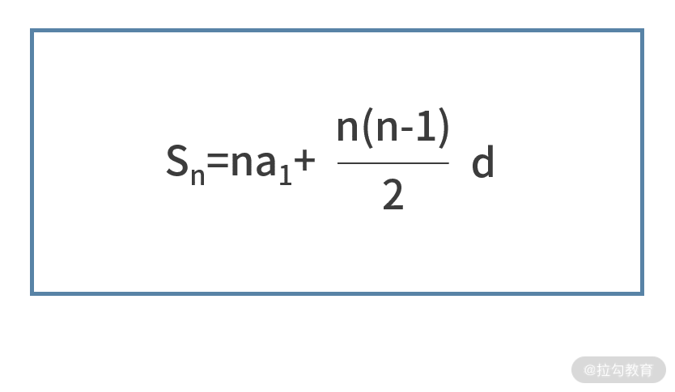

# 13 复杂度：如何利用数学推导对程序进行优化？

这一讲开始，我们进入到这个专栏“模块三 数据结构与算法”的学习，在这个模块，我们会重点学习数学与算法、代码之间的关系。

在一个程序开发的过程中，常常需要我们去关注程序的复杂度。这一讲，我们就先从复杂度出发，来看看数学的思想是如何应用在程序复杂度优化的。

### 程序的时间损耗

**程序** 就是计算机执行运算动作的指令， **运算** 就是对数据进行的处理。

例如，1+2 这样的加法运算，就是对两个数据 1 和 2 执行加法的处理。同样地，加法运算还可以针对更多的数据，比如 1+2+3+...+50，这就是对 1～50 这 50 个数据，执行加法运算的处理。

当我们用计算机指令，也就是程序，执行 1+2 这样的运算时，可能在毫秒，甚至更短的时间内就能得到结果。然而，当数据量变大时，执行的时间就会越来越长。

我们看一个例子，下面一段代码的任务，是给定一个正整数 n，计算从 1～n 之间所有整数之和。

```plaintext
import time
import sys
t1 = int(time.time()*1000000)
n = int(sys.argv[1])
result = 0
for i in range(n):
 result += i
t2 = int(time.time()*1000000)
print t2 - t1
```

我们对代码进行走读：

- 第 4 行，记录了程序开始执行的毫秒级时间戳；
- 第 5 行，得到输入参数 n；
- 第 7～8 行，执行 1 加到 n 的循环求和；
- 第 9 行，记录了程序结束计算的毫秒级时间戳；
- 最后，第 10 行打印出程序执行的时间损耗。

当输入分别是 100、1000 和 10000 时，程序的执行结果如下图所示：


由图可见，数据量越大，程序的时间损耗也就越大。

### 程序的复杂度

开发者在编写代码时，除了实际的时间损耗外，还有个重要概念就是 **复杂度** 。复杂度是衡量程序效率的重要指标，也是工程师的必备技能。

> 在实际工作中，通常会重点关注时间方面的复杂度，也叫时间复杂度。这一讲，我们为了简便行文，就把时间复杂度简称为复杂度。

从本质上来看， **复杂度描述的是程序时间损耗和数据总量之间的变化关系** 。

【例 1】我们先举一个例子说明，看下面这段代码：

```plaintext
a = [1,2,2,3,4,5]
result = 0
for i in range(len(a)):
 result += a[i]
print result
```

这段代码执行的内容是采用了一个 for 循环，来求 a 数组所有元素之和。

根据代码执行的顺序可知，第 1～2 行分别执行 1 次后，进入了第 3～4 行的 for 循环；这个 for 循环需要被反复执行 len(a) 次，也就是 6 次；最后，再执行 1 次第 5 行的代码。

可以估算出，程序执行的时间损耗为 t(总时间) = t(第1,2,5行) + 6t(第3,4行)，更泛化的写法是 t=c+n×b。

> 其中 t 代表代码执行损耗的时间，c 和 b 分别是两个常数，而 n 是决定循环次数的数据量的大小。可见，随着 n 的变大，t 以线性的关系变大。

【例 2】我们再看一个例子，代码如下：

```plaintext
a = [1,2,2,3,4,5]
result = 0
result = a[0] + a[-1]
print result
```

这段代码计算的是数组 a 第一个元素与最后一个元素之和。

具体来看，第 1 行定义数组 a，第 2 行定义变量 result；第 3 行，直接取出数组的第一个元素和最后一个元素，并且求和；最后，第 4 行打印结果。

可以估算出，程序执行的时间损耗为 t(总时间) = t(第1,2,3,4行)，更泛化的写法是 t = c。

> 其中 t 代表代码执行的时间损耗，c 是个与数组 a 大小无关的常数。可见，无论数组 a 的长度很大还是很小，执行的时间损耗都不会受到影响。

从上面的两个例子，我们就能对复杂度有更深入的理解了。

#### 【深入理解复杂度】

复杂度是程序时间损耗和数据总量之间的变化关系，通常用 O(f(n)) 来表示，其中 f(n) 就是复杂度函数。

如果程序的时间损耗和数据量的关系是 t=c+n×b，也就是说复杂度函数为 f(n)=c+n×b。复杂度通常不关注常数，因为它是个固定的时间损耗，与输入的数据总量没有任何的关系。因此，复杂度函数 c+n×b 可以忽略常数 c 和 b，直接缩写为 f(n) = n，即第一个例子的复杂度为 O(n)。

如果程序的时间损耗和数据量没有关系，即 t=c，我们依然会忽略这个常数，直接用 O(1) 来表示。

### 复杂度的性质和代码结构

有时候，复杂度函数会非常复杂，例如下面的代码：

```plaintext
a = [1,2,2,3,4,5]
index_max = 0
times_max = -1
for i in range(len(a)):
 times_temp = 0
 for j in range(len(a)):
  if a[i] == a[j]:
   times_temp += 1
 if times_temp > times_max:
  times_max = times_temp
  index_max = i
result = a[index_max]
for k in range(len(a)):
 result += a[k]
print result
```

这段代码的任务是寻找出数组 a 中出现次数最多的元素 a\[index_max\]，再计算出 a\[index_max\] 与数组 a 中所有元素的求和。

我们对代码进行走读。

- 第 4～11 行，有两层 for 循环。我们具体算一下时间损耗，t(4～11行) = 6×\[t(第4,5行)+t(6～8行)+t(9～11行)\]。
- 而程序的第 6～8 行，又是一个 for 循环，则有 t(6～8行) = 6×t(第6,7,8行)
- 因此，整体的时间损耗为 t(4～11 行)= 6×\[t(第4,5行) + 6×t(第6,7,8行)+ t(9～11行)\] = n×n×b + n×c + n×d。

> 其中，n 为数组 a 的长度，即数据量；b、c、d 分别是第 6、7、8 行执行的时间，第 4、5 行执行的时间，以及第 9～11 行执行的时间，并且它们与输入的数据量无关，可以视作常数。
>
> 利用忽略常数的原则，则有 t = n2 + n + n = n2 + 2n；还可以继续忽略常数“2”，则有 t =n2+ n；根据数学中的平方公式，还有 t =n2 + n = (n + 1/2)2 - 1/4。此时，仍然可以把与 n 无关的系数“1/2”和“1/4”忽略掉，则有 t = n2。因此，程序的第 4～11 行是 O(n2) 的时间复杂度。

- 而第 14～15 行，根据前面所学是 O(n) 的时间复杂度。所以，整个代码的时间复杂度就是 O(n2+n)。仍然可以继续使用刚刚平方公式的化简方法，得到最终的时间复杂度是 O(n2)。

从这个例子，我们可以发现， **多项式级的复杂度相加时，可以选择高者作为结果。** 例如，O(n2+n) 的时间复杂度，可以直接写为 O(n2)。

复杂度的性质都来自数学的推导，与此同时，复杂度的计算还与程序的结构有着密切关系。通常而言，一个 **顺序结构** 或 **选择结构** 的代码的执行时间与数据量无关，复杂度就是 O(1)；而对于 **循环结构** 而言，如果循环的次数与输入数据量的多少有关，就会产生复杂度了。

> 程序的三大基本结构是顺序结构、选择结构和循环结构，如果忘了，可以复习一下 C 语言。

通常，一层循环的时间复杂度是 O(n)；如果是两个循环的嵌套，时间复杂度是 O(n2)；如果是三个循环的嵌套，则是 O(n3)；依次类推。

### 利用数学来优化时间复杂度

设想一下，如果一段线上代码在输入变量很多的时候就会“卡死”，那么这一定是一款无法上线的系统。因此，时间复杂度的优化，是每个开发者必须具备的技能。

其实，时间复杂度的优化有很多办法。除了优化数据结构、优化代码结构、减少程序中不必要的计算等通用方法以外，还可以利用强大的数学知识来进行时间复杂度的优化。

我们来举几个例子。

我们在开篇词中讲了一个异或的案例。在一个无序的数组中，只有一个数字 obj 出现了一次，其他数字都出现了两次，尝试去查找出这个出现了一次的 obj。绝大多数程序员的代码逻辑，应该都是设计两层 for 循环：一层遍历每个数字，一层计算每个数字出现的次数，直到找到 obj。

代码如下：

```plaintext
a = [2,1,4,3,4,2,3]
for i in range(0,len(a)):
 times = 0
 for j in range(0,len(a)):
  if a[i] == a[j]:
   times += 1
 if times == 1:
  print a[i]
  break
```

我们对代码进行走读：

- 第 2 行，开始 for 循环，并把计数的变量 times 置为 0；
- 第 4 行，嵌套了一个 for 循环；
- 第 5 行开始，判断里外两层循环的值是否相等。如果相等，则 times 加 1；
- 第 7 行，判断 times 是否为 1，如果为 1 说明 a\[i\] 在数组中只出现了一次，则打印并 break 跳出循环结束。

根据我们前面的结论，这段代码的复杂度是 O(n2)，而且单独借助数据结构等思想已经很难再进行程序的优化了。

然而，如果从数学视角来看，这段代码就可以进行如下优化：

```plaintext
a = [2,1,4,3,4,2,3]
result = a[0]
for i in range(1,len(a)):
    result = result ^ a[i]
print result
```

在这里，利用了异或运算的性质：

- 第一，满足交换律和结合律；
- 第二，可以把相同元素计算为 0；
- 第三，0 异或任何数字都是其本身。

这样，只要把数组 a 中所有元素都异或在一起，就得到了 obj。此时，只需要一层 for 循环，复杂度是 O(n)。

我们再看下面一个例子。输入一个正整数 n，求不大于 n 的所有偶数之和。例如输入 6，则输出 2、4、6 之和，为 12；输入5，则输出 2、4 之和，为 6。

这个题目的常规解法，是采用 for 循环，让 i 从 1 遍历到 n。如果 i 为奇数，则 continue；如果为偶数，则加到 result 变量中。不难发现，复杂度是 O(n)，代码如下：

```plaintext
import sys
n = int(sys.argv[1])
result = 0
for i in range(n+1):
 if i % 2 == 0:
  result += i
print result
```

我们再从数学的视角来看待这个问题，你就会发现这是个等差数列求和的问题，等差数列求和的公式为 

> 其中 a1 为首项，n 为项数，d 为公差，前 n 项和为 Sn。

利用这个公式，我们可以直接写出下面的代码：

```plaintext
import sys
n = int(sys.argv[1])
a1 = 0
d = 2
nn = n/2 + 1
print nn * a1 + 2 * nn * (nn - 1) / d
```

我们对代码进行走读。

- 第 2 行，获得输入变量 n。
- 第 3 行，求和的第一项，直接赋值为 0。
- 第 4 行，公差 d 为 2。
- 第 5 行，求项数。例如，输入 6，则项数为 0、2、4、6，6/3+1 = 4 项；输入 5，则项数为 0、2、4，5/2+1 = 3 项。
- 最后第 6 行，调用等差数列求和公式，直接得到结果，运行截图如下：


这段代码的执行与输入数据量 n 毫无关系，因此复杂度是 O(1)。

同样的道理，等比数列求和的代码，如果用计算机程序开发的思想，是需要一个 for 循环在 O(n) 复杂度下完成计算的。但借助等比数列求和公式，你只需要 O(1) 的复杂度就能得到结果。在这里，我们作为课后习题不再赘述。

### 小结

复杂度是程序开发中老生常谈的话题了。时间复杂度衡量的是程序执行时间与数据量之间的关系。在计算复杂度的时候，通常常数是可以被忽略掉的。如果是多项式的求和，通常只保留最高次幂一项，其他都可以省略。

复杂度与代码结构息息相关。for 循环嵌套的越多，复杂度就会越高。如果你的数学知识非常渊博，从数学的角度来降低代码复杂度也是一个不错的选择。

最后，我们留一个练习题：输入一个正整数 n，求不大于 n 的所有 2 的正整数次幂的数字之和。例如，输入 17，则输出 1+2+4+8+16 = 31；输入 8，则输出 1+2+4+8 = 15。你可以尝试两种方法来开发，分别是 O(n) 复杂度的 for 循环，和 O(1) 复杂度的等比数列求和公式。
