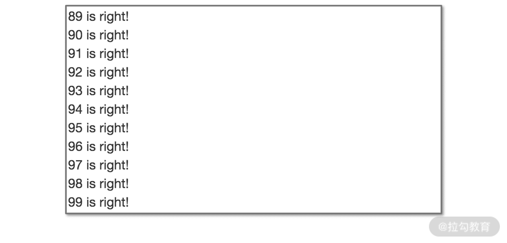

# 14 程序的循环：如何利用数学归纳法进行程序开发？

我们在上一讲提到程序有 **顺序、选择、循环** 这三大基本结构，而在这其中，循环是处理复杂运算最有效的一种结构。

**循环结构** 可以用短短几行代码，执行成千上万次的运算。从计算机编程的视角来看，循环结构又有三种实现方法，分别是 for 循环、while 循环和 do while 循环；而从数学视角来看，循环结构很像是 **数学归纳法** 。

所以这一讲，我们就从数学的视角来重新看待循环结构。

### 从“多米诺骨牌”看循环归纳思想

在多米诺骨牌的游戏中，游戏者手动推倒第一个骨牌，接着第一个骨牌就会撞倒第二个骨牌，第二个骨牌还会撞倒第三个骨牌。以此类推，即使骨牌数量再多，也会逐一被放倒。

我们对多米诺骨牌全部放倒的结果进行剖析，你会发现它成立的条件有以下两个：

- 第一，对于任意第 **i** 个骨牌而言，它的倒下能带动第 **i+1** 个骨牌倒下；
- 第二，有一个参与游戏的人手动推倒第一个骨牌。

只要这两个条件都满足，就能让全部的骨牌都倒下。

“循环”的思想也存在我们的古文化中，《愚公移山》的“虽我之死，有子存焉。子又生孙，孙又生子；子又有子，子又有孙；子子孙孙无穷匮也。”简而言之就是，我有儿子，我儿子也有儿子，我儿子的儿子也会有儿子。以此类推，子子孙孙无穷尽。

在这其中不难发现，子子孙孙无穷匮的条件也有两个：

- 第一，任意一代男子（或者说是儿子），都要再生至少一个儿子；
- 第二，愚公有个儿子。

只要这两个条件都满足，就可以做到子子孙孙无穷匮也。

### 数学归纳法

对这两个例子的两个条件进行抽象，你会发现这就是高中学习的数学归纳法，下面我们用数学语言描述一下。

最简单常见的数学归纳法是，用来证明当 n 等于任意一个自然数时某个命题成立，其证明步骤可以分下面两步：

- 第一，当 n=1 时，命题成立；
- 第二，假设对于任意一个数字 i 命题成立，可以推导出在对于 **i+1** ，命题依然成立。

只要这两个条件都满足，命题就得证。

例如，要证明所有的多米诺骨牌能倒下，也就是要证明游戏者手动推倒第一个骨牌，且任意一个骨牌倒下能带动下一个骨牌倒下。又比如，要证明愚公子孙无穷匮，也就是要证明愚公有儿子，愚公任意一代后代，至少有一个儿子。

接下来，我们利用数学归纳法来处理两个真实的数学问题。

【例 1】证明对于任意一个正整数 n，它的 2n 是偶数。

- 第一步，当 n=1 时，2n = 2×1 = 2 是偶数。
- 第二步，假设对于某个正整数 i 而言，2i 是偶数，则 2(i+1)=2i+2。其中 2i 为偶数，2 为偶数，两个偶数之和也是偶数，因此 2( **i+1** ) 也是偶数。

根据数学归纳法可以知道，对于任意一个正整数 n，2n 是偶数，原命题得证。

【例 2】求证 1+3+5+...+(2k-1) = k2，我们依然可以用数学归纳法的思路来证明。

- 第一步，当 k=1 时，1=12 成立。
- 第二步，假设对于任意一个正整数 i 而言，1+3+5+...+(2i-1) = i2，则 1+3+5+...+(2i-1)+\[2(i+1)-1\] = i2+\[2(i+1)-1\] = i2+2i+2-1 = i2+2i+1 = ( **i+1** )2 原命题依然成立。

因此 1+3+5+...+(2k-1) = k2 这一原命题成立。

综上这两个例子，你会发现它们都是要证明“下一张多米诺骨牌”能够倒下，也就是在证明“i 推进到 i+1 的过程”。具体而言，这两个例子的第二步都分别在求证 2( **i+1** ) 是偶数，以及 ( **i+1** )2 成立，这种数学归纳的思想在循环结构中可以得以体现。

### 循环结构

程序中的循环结构完全可以用来表达数学归纳法，利用数学归纳法来处理的数学问题，可以被无缝迁移到一个循环结构的程序中。

我们在大学 C 语言的课程中曾经学过，循环结构的实现方法有三种，分别是 for 循环、while 循环和 do-while 循环。为了简洁，下面我们定义 s1 是初始表达式，s2 是条件表达式，s3 叫作末尾循环体，s4 是中间循环体，并将其代入这三个循环结构中，对比学习它们之间的联系与不同。

#### 1.for 循环

for 循环的代码结构如下：

```plaintext
for(s1;s2;s3)
{
  s4;
}
```

如刚刚所定义的，s1 是初始表达式，s2 是条件表达式，s3 叫作末尾循环体，s4 是中间循环体。 for 循环的执行顺序是 s1、(s2,s4,s3)、(s2,s4,s3)、...、(s2,s4,s3)、s2。

例如，求解 1 到 50 所有整数之和，可以用 for 循环这样编写代码：

```plaintext
int result = 0;
for(int i= 1; i <= 50; i++)
{
  result += i;
}
```

这段代码的 i=1 对应的是 s1 初始表达式，i≤50 对应的是 s2 条件表达式，i++对应的是 s3 末尾循环体，最后第 4 行运算对应的是 s4 中间循环体。 这段代码的执行顺序如下：

- 先执行 i=1，再判断 i≤50 与否，如果为真，则执行第 4 行的运算，最后执行 i++；
- 接着循环，再判断 i≤50 与否，如果为真，则执行第 4 行的运算，最后执行 i++；
- 经过多次循环后，再判断 i≤50 与否，直到结果为假，跳出循环结束。

for 循环还有很多变种，具体而言就是 s1、s2 和 s4 都可以被省略或部分省略。围绕上面的例子，s1 的定义可以单独抽出来放在第 2 行；而 for 循环语句中，可以空出 s1 的部分，这样新的代码可以写作：

```plaintext
int result = 0;
int i= 1;
for(; i <= 50; i++)
{
  result += i;
}
```

根据代码执行的顺序，可以发现 s3 的执行永远是在 s4 之后。因此，可以把 s3 和 s4 写在一起，再把 s4 的位置空出来，这样新的代码可以写作：

```plaintext
int result = 0;
int i= 1;
for(; i <= 50; )
{
  result += i;
  i++;
}
```

同样，s2 的执行永远在 s4 之前，也就意味着s2 可以被放在循环体中的 s4 之前，而把 for 语句中 s2 的位置空闲出来。但最后一次的 s2 执行，还肩负着结束循环的任务，因此需要结合 if 条件判断语句和 break 语句，完成最后跳出循环的实现，这样新的代码可以写作：

```plaintext
int result = 0;
int i= 1;
for(; ; )
{
  if (i > 50){
   break;
  }
  result += i;
  i++;
}
```

#### 2.while 循环

循环的另外一个实现方式是 while 循环，while 循环的代码结构如下：

```plaintext
while (s2)
{
  s4;
}
```

如刚刚所定义的，s2 是条件表达式，s4 是中间循环体。

while 循环的执行顺序是 (s2,s4)、(s2,s4)...(s2,s4)、s2。具体而言，是首先判断 s2 是否成立，如果为真，则执行 s4；继续循环判断 s2 是否成立，如果为真，则执行 s4；如此循环多次后，直到 s2 不再成立，跳出循环结束。

我们继续使用 while 循环来实现 1～50 所有整数求和，代码如下：

```plaintext
int i = 0;
int result = 0;
while (i < =50)
{
  result += i;
}
```

同样地，如 for 循环一样，while 循环也有一些变种。具体而言，s2 也是可以被省略而用其他方法实现。从循环执行的顺序可以发现，s2 的执行总是在 s4 之前；而最后一次 s2 的执行，需要肩负起跳出循环的任务。

这就需要 if 条件语句和 break 语句了，这样变形之后的代码为：

```plaintext
int i = 0;
int result = 0;
while (1)
{
  if (i > 50){
    break;
  }
  result += i;
}
```

#### 3.do while 循环

最后一种循环实现的方法是 do while 循环，do while 循环的基本结构如下：

```plaintext
do {
  s4;
}while(s2);
```

如刚刚所定义的，s2 是条件表达式，s4 是中间循环体。

do while 循环与 while 循环相比，区别就是执行顺序的调整。do while 循环中，无论 s2 是真是假，都会至少执行一次 s4。这样它的执行顺序就是 (s4,s2)、(s4,s2)...(s4,s2)。

具体而言就是：先执行s4，再来判断 s2 是真是假，如果为真，则执行 s4；再来判断 s2 是真是假，如果为真，则执行 s4；再来判断 s2 是真是假……如此循环多次之后，直到 s2 为假，跳出循环结束。

我们仍以 1～50 所有整数求和为例，看一下 do while 语句实现的代码：

```plaintext
int i = 1;
int result = 0;
do {
  result += i;
}while(i <= 49);
```

do while 循环也有一些变种，其 s2 语句也可以被调整到其循环体中，可以考虑用 if 条件语句和 break 语句实现：

```plaintext
int i = 1;
int result = 0;
do {
  result += i;
  if (i > 49){
    break;
  }
}while(1);
```

#### 4.三种循环结构的区别

这三个循环的基本代码结构如下图所示，我们总结一下这三种循环结构的本质不同。


从代码执行的顺序来看，while 循环与 for 循环都是先判断条件，再执行循环体。在极端情况下，第一次判断条件就不成功，循环体就有可能一次也不被执行；而 do while 循环则相反，它先执行循环体，再判断条件，因此循环体至少会被执行一次。

从编码的视角来看，while 循环和 do while 循环，在条件判断的括号中只需要写循环条件；而 for 循环则循环变量赋初值、循环条件、循环变量改变方式都写在一起。

最后，从功能上来看，这三个循环结构完全一致，是可以彼此切换的。你可能会有这样的困惑：do while 循环至少会执行一次循环体，它如何能被其他循环结构替代呢？这就要借助 break 语句提前跳出循环体了，具体如何切换，我接下来就要讲解。

### 三种循环实现的切换

在不考虑代码结构的美观时，这三种循环语句可以在功能上实现彼此之间的切换，我们以 for 向 while 和 do while 的切换为例。

如下是任意一个 **for 循环** 语句：

```plaintext
for(s1;s2;s3)
{
  s4;
}
```

其执行顺序为 s1、(s2,s4,s3)、(s2,s4,s3)...(s2,s4,s3)、s2。

它可以用下面的 **while 循环** 语句来实现其功能：

```plaintext
s1;
while(s2)
{
  s4;
  s3;
}
```

根据 while 语句的执行顺序可知，这段代码的执行顺序为 s1、(s2,s4,s3)、(s2,s4,s3)...(s2,s4,s3)、s2，因此可以得知，两段代码的功能结果完全一致。

而如果非要采用 **do while 循环** ，可以按照如下方式实现：

```plaintext
s1;
do {
  if(!s2)
  {
    break;
  }
  s4;
  s3;
}while(1);
```

在这里，我们补充一下 break 语句的知识。break 语句的作用是，终止并跳出循环，继续执行循环语句后续的代码。

以上面的代码为例，一旦第 3 行的条件判断通过，则需要执行 break 语句。break 语句会帮助程序跳出当前循环，这样程序就会从第 4 行跳转至第 10 行继续执行。基于 break 语句，再根据 do while 语句的执行顺序可知，这段代码的执行顺序为 s1、(s2,s4,s3)、(s2,s4,s3)...(s2,s4,s3)、s2，因此可以得知两段代码的功能结果完全一致。

这里要给大家提个醒：如果是在技术面试时， **千万不要说某某功能的开发，只能用 for 循环、while 循环或 do while 循环，这一定是错的** 。因为，功能上这三种循环的实现是完全可以实现互换的；只不过，三者在代码美观上可能是有所区别。

### **数学归纳法与循环结构** 数学归纳法和循环结构有很多相似之处，它们都是 **从某个起点开始，不断地重复执行某个或某组相似的动作集合**

不过，二者也有一些区别：

- 数学归纳法 **不关注归纳过程的结束** ，它就是用一种重复动作，由有穷尽朝着无穷尽的方向去前进；
- 而循环结构作为一种程序开发逻辑，则 **必须要关注循环过程的结束** ，否则就会造成系统陷入死循环或死机。

接下来，我们试着把一个数学归纳法的计算过程，用循环结构改写。为了让二者没有区别，我们对数学归纳法的问题增加一个截止条件的限制，那就是 k 小于 100 时。

这道例题是：证明在 k\<100 时，1+3+5+... +(2k-1) = k2 成立。

我们说过，用数学归纳法来证明这个问题需要两个步骤，分别是：

- 证明 k=1 时等式成立；
- 假设 k=i 时等式成立后，k=i+1 等式依然成立。

我们把这两个步骤进行拆解。

令 s1 为 k=1，s4 为等式成立，s3 为 k=i 或 k=i+1，再补充题目的终止条件 k\<100 为 s2。这样，根据 for 循环执行的逻辑，把这些动作按照 s1、(s2,s4,s3)、(s2,s4,s3)...(s2,s4,s3)、s2 串联起来，就得到了基本的 for 循环代码框架。

- 在这个框架中，最开始的 s1、s2、s4，即为当 k=1 时等式成立，对应数学归纳法的第一步。
- 在这个框架中，任意相邻的两组(s2,s4,s3)、(s2,s4,s3)，就是假设 k=i 时等式成立后，k=i+1 等式依然成立，对应数学归纳法的第二步。

也就是说，此时的数学归纳法证明和 for 循环实现，在功能上是等价的，我们给出 for 循环的代码如下：

```plaintext
int left = 0;
int left_temp = 0;
int right = 0;
for (int k = 1; k < 100; k++) // s1;s2;s3
{
    //s4
    left_temp = 2 * k - 1;
    left += left_temp;
    right = k * k;
    if (left == right)
    {
        printf("%d is right!\n",k);
    }
}
```

我们对代码进行走读：

- 代码的前三行定义了 3 个变量，分别是 left、left_temp 和 right，其中 left 和 right 分别用来存储等式两边的结果，left_temp 用来存储公式中每轮增加的一项；
- 第 4 行，进入 for 循环，得到对应的 s1、s2 和 s3；
- 第 6 行，计算出当前一轮的 left_temp 值；
- 第 7 行，把 left_temp 作为增量，增加到 left 的值中；
- 第 8 行，计算等式右侧的 k2 的值；
- 第 9 行，对等式左边和等式右边是否相等做出判断；
- 第 10～12 行进行判断，如果等式相等，打印结果，代码的部分执行结果如下图。



可见原命题得到证明。

### 小结

这一讲我们学习了数学归纳法的理论知识，以及循环结构的代码开发知识。然后我们从原理上分析了数学归纳法和循环结构的异同，介绍了 for 循环、while 循环和 do while 循环这三种循环结构的实现方法。

最后我们留一个练习题：本讲最后一个例题用 for 循环实现了等式的证明，请你试着分别用 while 和 do while 循环再次实现这段代码的功能。
