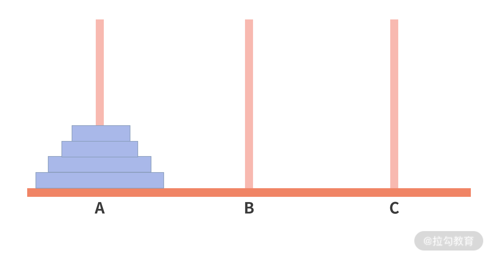
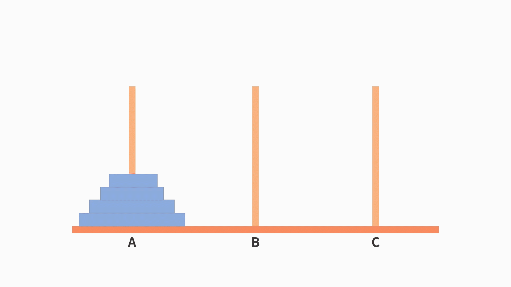
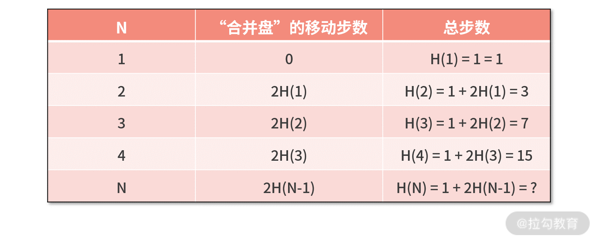
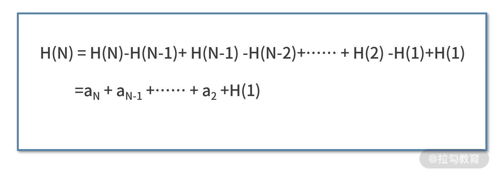
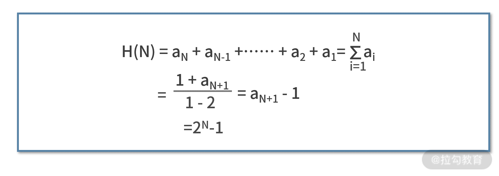
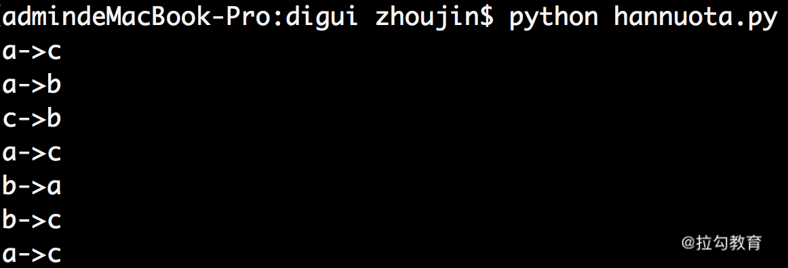
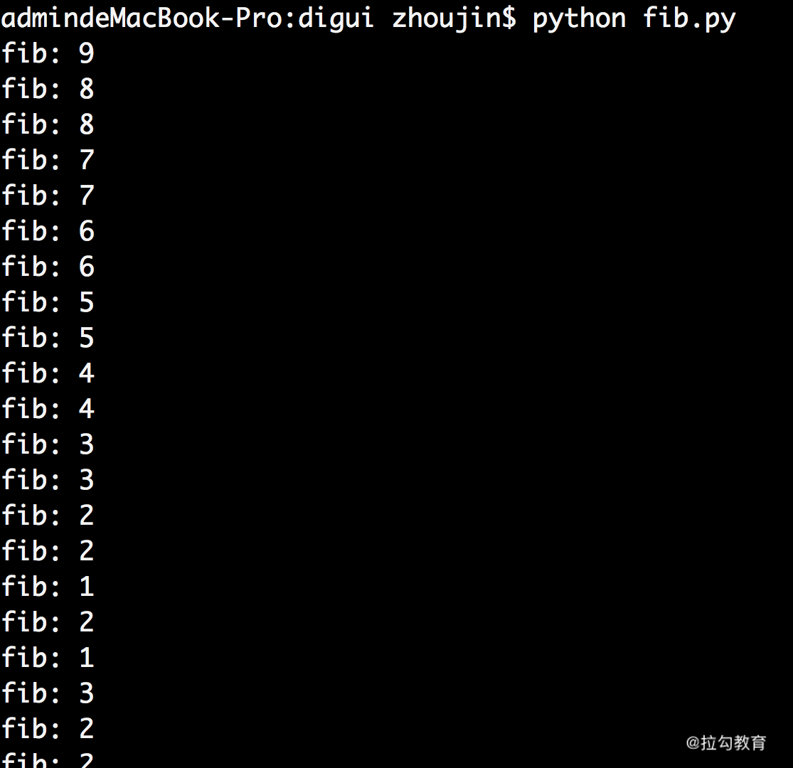

# 15 递归：如何计算汉诺塔问题的移动步数？

递归是重要的程序开发思想，比如程序源代码缩进、树形数据结构、XML 语法、快速排序法等都有递归的影子。

那么，递归思维的本质到底是什么呢？递归的理念看似隐讳，实则非常清晰明了。

为了让你由浅入深地理解它，这一讲我会先从“汉诺塔问题”入手，带你找出“递归思维”，然后将其应用在两个经典问题中，让你感受递归的作用及其缺点。

最后，你便会发现递归与上一讲所学的循环有相似之处，我便会在这两者的对比辨析中，带你探讨它们的本质差异。

### 汉诺塔问题及其代码实现

我们先来看下汉诺塔问题的规则。

> 假设有 A、B、C 三根柱子。其中在 A 柱子上，从下往上有 N 个从大到小叠放的盘子。我们的目标是，希望用尽可能少的移动次数，把所有的盘子由 A 柱移动到 C 柱。过程中，每次只能移动一个盘子，且在任何时候，大盘子都不可以在小盘子上面。



#### 1.汉诺塔问题解密

这个题目需要一定的窍门，否则只能碰运气去乱走了。

我们先脑补这样一个画面：假设 A 柱子上除了最后一个大盘子（代号“大盘子”）以外，其他的 N-1 个小盘子都合并起来，成为一个新的盘子（代号为“合并盘”）。那这个问题就简单了，只需要把“合并盘”移动到 B 柱，再把“大盘子”移动到 C 柱，最后把“合并盘”移动到 C 柱。

上述过程如下图所示：



在这个过程中，问题由全部 N 个盘子由 A 移动到 C，转变为 N-1 个“合并盘”从 A 移动到 B 再移动 C。新的问题和原问题是完全一致的，但盘子数量由 N 个减少为 N-1 个。如果继续用上面的思想，就能把 N-1 个“合并盘”再度减少为 N-2 个，直到只剩一个。

我们用数学重写上面的过程：令 H(x) 表示把某个柱子上的全部 x 个盘子移动到另一个柱子上需要的步数，那么原问题 N 个盘子由 A 柱子移动到 C 柱子的数学表示就是 H(N)。

根据我们第一次的分解可知 **H(N)=H(N-1)+1+H(N-1)** 。

> 也就是，把 N 个盘子从 A 移动到 C=把合并盘从 A 移动到 B + 把大盘子从 A 移动到 C + 把合并盘从 B 移动到 C。

再继续分析，你还会得到 H(N-1)=H(N-2)+1+H(N-2)。

……

直到最终 H(2)=H(1)+1+H(1)=1+1+1=3。

我们把这个问题的计算过程整理到下面的表中，并尝试求解 H(n) 的表达式。 

因为 H(N)=1+2H(N-1)，所以可以得到 H(N-1)=1+2H(N-2)，把这两个等式两边分别进行相减，则可以得到 H(N)-H(N-1)=2(H(N-1)-H(N-2))。

令 aN=H(N)-H(N-1)，则有 aN=2aN-1，可见 {aN} 是个首项为 1、公比为 2 的等比数列，通项公式为 aN = 2N-1。

接着利用这些信息，我们尝试去推导 H(N)，则有 

别忘了 H(1)=1，a1=1，所以 H(1)=a1，则有  因此如果盘子的数量是 5 个，将 5 代入这个 2N-1，则最少需要 31 步完成移动。

#### 2.汉诺塔问题的代码实现

我们尝试用程序代码来实现汉诺塔问题。不难发现，这里最高频使用的是，把 n 个盘子从某个柱子 x，移动到另一个柱子 z。因此，考虑对这个功能进行函数化的封装，代码如下：

```python
def hanoi(N,x,y,z):
    if N == 1:
        print x + '->' + z
    else:
        hanoi(N - 1, x, z, y)
        print x + '->' + z
        hanoi(N - 1, y, x, z)
```

我们对代码进行走读。

第 2、3 行，如果盘子数量为 1，则直接把盘子从 x 柱子移动到 z 柱子即可；若不为 1，则进行第 4～7 行的处理。

> 此时盘子数量超过了 1，则拆分为“合并盘”和“大盘子”两部分。

- 首先，函数调用自己，把“合并盘”从 x 移动到 y；
- 然后，把“大盘子”从 x 移动到 z；
- 最后，函数再调用自己，把“合并盘”从 y 移动到 z。

想象着会很复杂的代码，实际上非常简单，在主函数中只要执行

```plaintext
hanoi(3, 'a', 'b', 'c')
```

就能打印出把 3 个盘子从 a 柱子移动到 c 柱子的详细步骤。

每一步的移动结果如下图，执行后需要 7 步，这和我们数学上的计算完全一致。



### 递归——自己调用自己的程序开发思想

汉诺塔问题解法的核心步骤就是：移动全部盘子，等价于移动“合并盘”，加上移动“大盘子”，加上再移动“合并盘”，然后你需要重复执行这个步骤。

**用函数表达这个过程，就是 f(全部盘子) = f(合并盘) + f(大盘子) + f(合并盘)。** 为了代码实现这个功能，我们定义这个函数为 **hanoi(N,x,y,z)，** 并且在这个函数中，需要调用自己才能完成“合并盘”的移动，**这种会调用自己的编码方式在程序开发中，就叫作递归** 。**严格意义来说，递归并不是个算法，它是一种重要的程序开发思想，是某个算法的实现方式。**

在使用递归进行程序开发时，需要注意下面两个关键问题。

- 第一个问题，递归必须要有 **终止条件**，否则程序就会进入不停调用自己的死循环。

> 有这样一个故事：从前有座山，山里有个庙，庙里有个和尚讲故事；故事是，从前有座山，山里有个庙，庙里有个和尚讲故事；故事是...

这就是一个典型的没有终止条件的递归。在汉诺塔问题中，我们的终止条件，就是当盘子数量为 1 时，直接从 x 移动到 z，而不用再递归调用自身。

- 第二个问题，写代码之前需要先写出 **递归公式** 。 在汉诺塔问题中，递归公式是 **H(N)=H(N-1)+1+H(N-1)**，这也是递归函数代码中除了终止条件以外的部分。

> 对应于“循环结构”中的循环体，这部分代码对于“递归”而言，偶尔也被人称作“ **递归体** ”。

递归代码的基本结构如下：

```python
def fun(N,x):
 if condition(N):
  xxx
 else:
  fun(N1,x)
```

我们对这个代码结构进行解析。 对某个函数 fun(N,x) 而言，如果要用递归实现它，代码中至少包括 **终止条件** 和 **递归体** 两部分。

- 终止条件的判断基于某个入参 N，如果满足，则函数不再调用自己，终止递归；如果还不满足，则进入到递归体。
- 在递归体中，终止条件判断的入参 N 一定会发生改变。通常而言，是变成比 N 小的一个数值N1。只有这样，递归才能慢慢向终止条件靠近。在递归体中，基于新的参数 N1，再调用函数自身 fun(N1,x)，完成一次递归操作。

接着我们带着递归思维，去看一下“阶乘问题”和“斐波那契序列问题”。

### 递归思维的应用

#### 1.阶乘问题

数学中，阶乘的定义公式为 n!=1×2×...×(n-2)×(n-1)×n。现在请你用递归来写一个函数，输入是某个 **正整数** n，输出是 n 的阶乘。

利用递归写代码时，需要优先处理递归的两个关键问题，那就是终止条件和递归体。

- 对于终止条件而言，当 n=1 时，返回的值为 1!=1。
- 对于递归体而言，需要先写出递归公式。根据阶乘公式的定义可知，当 n>1 时，H(n)=n!=1×2×...×(n-2)×(n-1)×n= \[1×2×...×(n-2)×(n-1)\]×n=n×(n-1)!= n×H(n-1)。

有了这些信息后，我们可以尝试写出下面的代码：

```python
def jiecheng(n):
 if n == 1:
  return 1
 else:
  return n * jiecheng(n-1)
```

我们对代码进行走读。这段代码的代码量非常少，第 2、3 行判断 n 是否为 1。如果是，则返回1；否则，则跳转到第 5 行，根据递归公式返回 n×(n-1)!，即 n×jiecheng(n-1)。

题目中限定了输入参数 n 为正整数，所以一些异常判断可以被忽略。但如果你追求代码的工程完备性，还可以补充 n 为 0、n 为负数、甚至 n 为小数的一些异常判断。

> 在这里，我们就不展开了。

#### 2.斐波那契序列问题

在数学上，斐波那契数列定义为 1、1、2、3、5、8、13、21、34…… 。简而言之，在斐波那契数列中，除了前两项以外，后续的每一项都是前面两项之和，而前两项的值都定义为 1。

我们用 F(n) 表示斐波那契数列中的第 n 项的值，例如：

F(1)=1

F(2)=1

F(3)=1+1=2

F(4)=1+2=3

现在希望你用递归来写代码，实现的功能是，输入某个正整数 n，输出斐波那契数列中第 n 项的值。

> 你可以假设输入的 n 都是合法的，不用做异常判断。

围绕递归的开发逻辑，关键问题仍然是终止条件和递归体：

- 斐波那契数列的 **终止条件** 很显然，就是当 n 为 1 或 2 时，返回值就是 1；
- 而它的 **递归体** 可以根据斐波那契数列的定义得到，也就是 F(n)=F(n-1)+F(n-2)。

我们把以上定义直接翻译成代码，则有

```python
def fib(n):
 if n == 1 or n == 2:
  return 1
 else:
  return fib(n-1) + fib(n-2)
```

我们对代码进行走读：

- 在第 2 行，判断 n 是否为 1 或 2。
- 如果是，则第 3 行返回 1；
- 反之，则跳转到第 5 行，返回前两项之和，即 fib(n-1)+fib(n-2)。

基于这段代码，主函数中执行 print fib(10)，即计算斐波那契数列的第 10 位，如下图所示，运行结果为 55。 

而我们手动计算斐波那契数列的前 10 位发现，结果也是 55，说明我们刚刚的代码实现是正确的。 

### 递归的优缺点

讲完了递归思维在“阶乘问题”和“斐波那契序列问题”中的应用后，我们总结以下递归的优缺点。

递归有很多优势，例如代码结构简单、代码量少、阅读方便、维护简单等；然而递归也有一些缺陷和不足，一个明显的问题就是，递归的计算量非常大，而且存在重复计算的可能性。

我们以斐波那契数列问题为例，把代码进行如下修改：

```python
def fib(n):
 if n == 1 or n == 2:
  return 1
 else:
  print "fib: " + str(n-1)
  print "fib: " + str(n-2)
  return fib(n-1) + fib(n-2)
```

其中，在第 5、6 行插入两个打印的动作。它们的功能，是每次执行递归体之前，打印出要递归计算的内容。

这样，在主函数运行 fib(10) 时，你会看到下面的部分运行结果： 

很简单，在执行 fib(9) 时，需要递归计算 fib(8) 和 fib(7)；而 fib(8) 的计算，又需要递归计算 fib(7) 和 fib(6)。很可惜，在得到 fib(7) 的时候，结果并不会进行保存；而另一边，也要计算 fib(7)，这只能再整体进行一次递归计算。

所以，上图中我们能看到计算 fib(10) 的过程中，存在大量重复的递归计算。

重复计算是递归的一个问题，但也并不是绝对会发生，这就需要程序员去综合分析你遇到的具体问题了。

> 在后面的《17 | 动态规划：如何利用最优子结构解决问题？》我会采用“设置全局变量来缓存中间结果”的方式来避免重复计算，减少计算量。

### 小结——递归与循环

学完这一讲，你可能会发现，递归和循环比较 **相像** 。确实，递归和循环都是通过解决若干个简单问题来解决复杂问题的，它们也都有自己的终止条件和循环体/递归体，都是重复进行某个步骤。

然而，它们也有很多 **差异性**，主要体现在以下两方面。

**迭代次数**

- **循环** 对于迭代的次数更敏感，绝大多数场景会定义一个用来计数的变量 i，来控制循环的次数；
- 而 **递归** 对于迭代次数不敏感，取决于什么时候满足终止条件。

**问题复杂性** 不管是循环还是递归，每一轮迭代处理的问题类型都是非常趋同的，但 **问题的复杂性** 却不一样。

- 对于 **循环** 而言，每一轮处理的问题难度几乎是一样的；
- 而 **递归** 则是缩小搜索范围（例如二分查找）的思路，一般而言，每轮处理的问题相对上一轮而言是更简单的。
