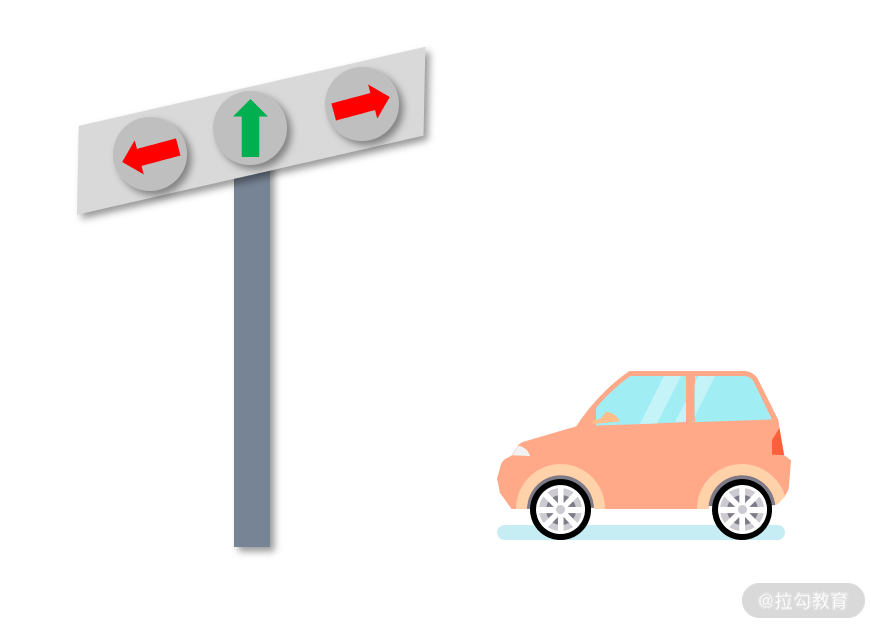
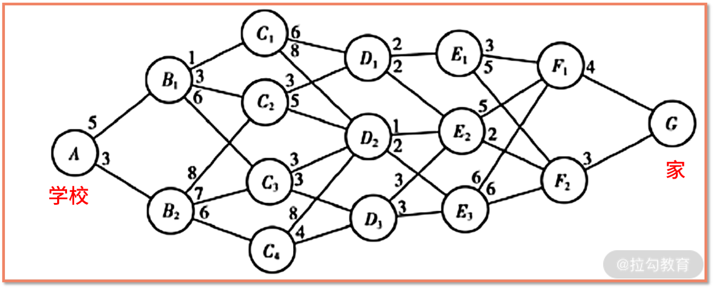
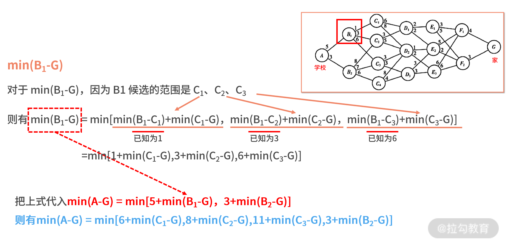
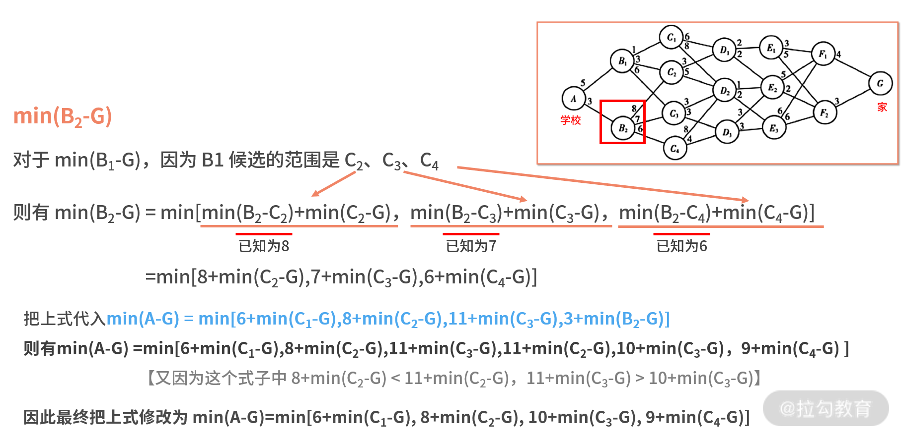
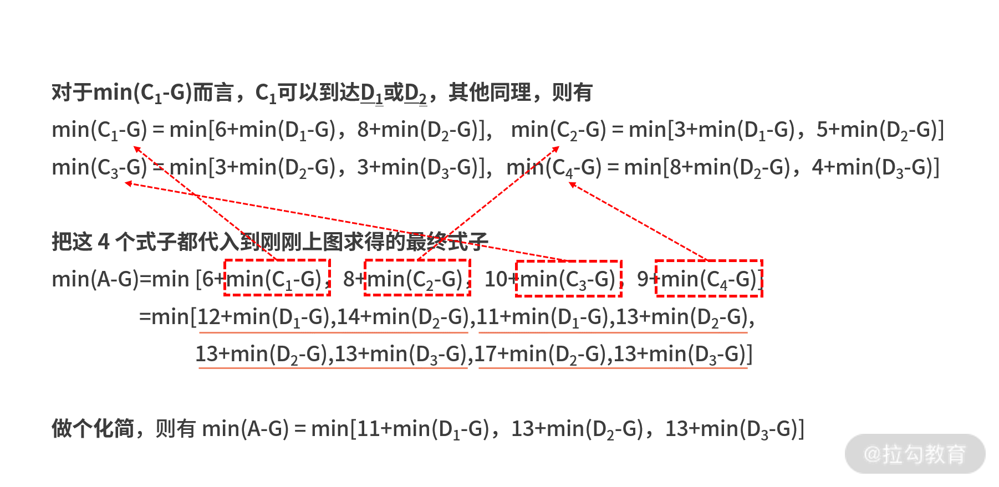
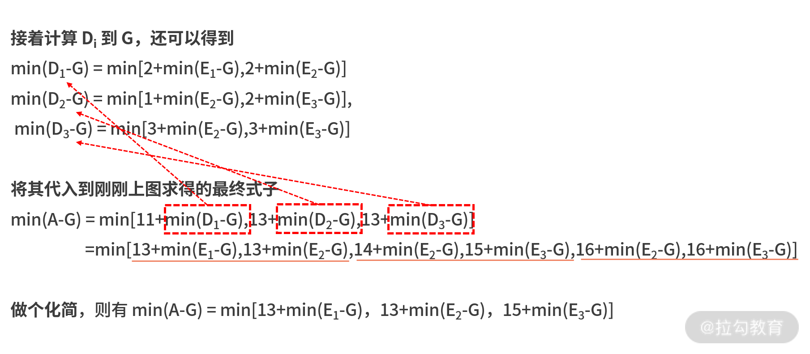
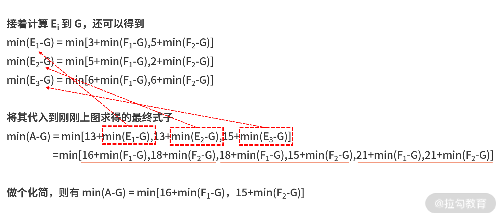
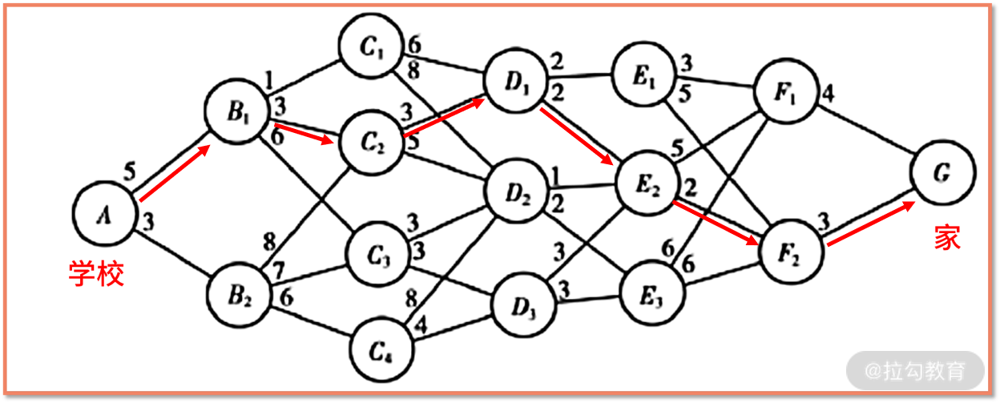

# 17 动态规划：如何利用最优子结构解决问题？

动态规划是运筹学问题，运筹学又是数学的一个分支，与“运筹帷幄、决胜千里”的含义很接近；同时，动态规划也是计算机技术的问题，对于程序员而言，能灵活运用动态规划解决复杂问题是一项进阶的能力。 **在一线互联网公司的程序员面试中，动态规划的考核绝对是一大难点。**

这一讲，我们就从数学的视角学习动态规划，并通过代码完成动态规划问题的开发。

### 从路线规划，看动态规划问题

动态规划是动态地解决某类复杂问题的方法。

- 规划，也可以理解为是计划，是对于某个复杂问题解决方案的计划或方法；
- 动态，是说这个复杂问题会随着执行动作的不同而产生变化，并非一成不变的。

我们举个例子，假设大聪明要自己开车从学校回家，他有很多条路线可以走，那么他的目标是走哪条路能让他最快到家。

大聪明从学校出发后，到达了一个路口，这时他选择左转或者直行都是可以到家的。如果此时左转是红灯，直行是绿灯，这是否意味着大聪明应该选择直行的路线回家呢？  显然并不是。如果直行后的路线是极其拥堵的，而左转虽然需要等待几分钟的红灯，但随后的路线却畅通无阻。那么对于最快到家的目标而言，等一会左转的红灯，也许是更好的选择。

> 其实，这里对于回家路线的规划，就是很多导航软件要解决的问题。

从动态规划的视角来看，动态规划的目标是希望从很多可选方案中，用最小的代价找到最优的方案，动态规划处理的问题一般是动态变化的。

- 一方面，原始问题包含了多个阶段的子问题。例如大聪明回家的路线需要经过 5 个路口，这就意味着大聪明需要做 5 次决策，也就是回家的大问题包含了 5 个子问题。
- 另一方面，每个阶段做出的决策结果，都会对后面的阶段产生影响；例如大聪明第一个路口选择了左转，这就导致直行道路的后续路口已经不在决策范围内了。

### 动态规划问题的特点

动态规划问题具备很多特点。例如上面提到的“多阶段”“动态变化”，除此之外还有“最优子结构”“子问题重叠”和“无后效性”。

> 很多教材对这些概念的介绍特别难以理解，我们仍然以大聪明回家的例子，来试着说明这3个特点的含义。

- **最优子结构**

最优子结构特点是动态规划问题求解的关键。子结构，就是子问题的解。最优子结构的含义是说，如果某个解是最优的，那么这个解的子集也是对应子问题的最优解。

例如，在大聪明从学校回家的最优路线中，需要经过某个商场。那么最优的路线就可以拆分为，学校到商场（标记为 Path 1）和商场到家（标记为 Path 2）这两段路程。在其他所有学校到商场的可能路线中，Path 1 就是最近的；在其他所有商场到家的可能路线中，Path 2 就是最近的。也就是从整体看，这个长路线是最优的，那么这个长路线之下的分路线对应到其他长路线的平行分路线中也是最优的。

- **子问题重叠**

子问题重叠，是指原问题的若干子问题之间并不是独立的，而是彼此存在着重叠的，这是动态规划区别于“分治法”的关键所在。

如果子问题是不重叠的，那么就可以用《16 | 二分法：如何利用指数爆炸优化程序？》中讲过的“分治法”来解决；而如果子问题是重叠的，可重叠的问题根本就分不开，也就无法应用分治法了。

例如，大聪明从学校回家会途径商场，第一个子问题是第一个路口是向左转还是直行，而不管是左转还是直行，都会有途径商场的可能，这也就是说左转或直行的结果是存在重叠的。

- **无后效性** 无后效性，指的是未来只取决于现在，与过去无关。

例如，大聪明从学校回家，他左拐右拐到了商场。之后需要决策的就是如何从商场尽快回家。这个决策，与大聪明之前是如何到达商场的，没有任何关系。

### 动态规划问题的切入点——最优子结构

我们先前学的分治法，无法处理具有子问题重叠性质的问题。

但“最优子结构”的特点，能让我们分阶段去求解最优子问题，因此求解动态规划问题的切入点就是最优子结构。

具体而言，我们可以先找到某个阶段的全部可行解集合，例如左转、直行、右转，这就是个集合。对于任意一个可行解，假设是直行，则可以把从学校到家的行程，分解为学校到第一个路口后直行，以及直行后再到家，这样就形成了一个最优子结构。

接下来，我们要找到全局损耗最少的回家路线，那么就只要在所有的最优子结构中，找到损耗最少的那个就完成了一次的迭代。

由于动态规划的“无后效性”，我们只需要不断往前迭代下一个阶段，直到最终到家就找到了问题的答案。

上面的描述可能会很抽象，我们结合上述大聪明回家的最短路线问题为例展开实战，来试着更深层次理解动态规划的解决方案。

#### 【最短路线问题的求解】

最短路线问题定义如下：给定一个网络，以及网络中可通行两点之间的消耗，求起点到终点的最少消耗。在“大聪明”问题中，每个结点就是大聪明回家可能遇到的路口，消耗就是时间，起点是学校，终点是家。

例如在下面的图中，A 是学校，G 是家，Bi、Ci、Di、Ei、Fi 是所有可能的路口，每条边是路口到路口需要消耗的时间。最短路径问题，就是希望用动态规划的办法，找到从起点到终点，最小消耗的路径所对应的时间。

我们在下面的过程结点图中，按照从 A 需要几条，归类为 B、C、D、E、F 这 5 类。例如，C 类的结点 Ci，都是从 A 经过两条到达的结点。这样的标记方法，可以将 A 到 G 的复杂问题，拆分为 A 到 B、B 到 C......直到 F 到 G 的 6 个子问题。每个阶段的起点是一个状态，终点是另一个状态。因此，总共有 7 个可能的状态，分别对应 A、B、C、D、E、F、G。 

过程结点图

接着就是最关键的内容了。我们提到过 **最优子结构特点** ，含义是假设 A 到 G 的最优路线要经过 B1，最优路线就可以以 B1 为分割点，前后分解为 Path 1 和 Path 2。

- Path 1 是 A 到 B1 的最优路线；
- Path 2 也是 B1 到 G 的最优路线。

根据图中，我们还可以发现，A 到 G 的路线要么经过 B1、要么经过 B2，肯定是无法同时绕过 B1 和 B2 的，因此 A 到 G 的最优路线，就是在经过 B1 还是经过 B2 中选择。

用数学语言来描述上面的逻辑就是 min(A-G) = min\[min(A-B1)+min(B1-G),min(A-B2)+min(B2-G)\]，又因为已知 min(A-B1) = 5，min(A-B2) = 3，则 **min(A-G) = min [5+min(B1-G)，3+min(B2-G)]** 。

到这里，你有没有发现，问题已经被我们简化了，由原来的求解 min(A-G)，转化为求解 min(B1-G) 和 min(B2-G)。

此时你应该已经觉察到，这就是 **递归问题** 。一个复杂 A 到 G 的最短路径问题，被悄悄转化为相对简单的 Bi 到 G 的最短路径问题，这不就是递归适用的条件吗？我们先把递归的念想放在心中，继续用数学推导的方式求解最短路径问题。

接下来，我们需要分别求解 min(B1-G) 和 min(B2-G)。  

再根据无后效性，到这里我们已经不需要关注 B 阶段发生了什么事情，只需要继续计算刚刚最终求出的 min(C1-G)、min(C2-G)、min(C3-G)、min(C4-G) 就可以了，我们耐着性子继续计算吧。 

只需要继续计算刚刚最终求出的 min(D1-G)、min(D2-G)、min(D3-G) 就可以了，我们耐着性子继续计算吧。 

只需要继续计算刚刚最终求出的 min(E1-G)、min(E2-G)、min(E3-G) 就可以了，我们耐着性子继续计算吧。 

最后我们直接把图中已知 Fi 到 G 距离的值代入，则有 min(A-G) = min\[16+4，15+3\] = 18。

我们把最优的路径还原就会发现，18 的最小损耗来自 15+min(F2-G)；15 又来自 13+min(E2-G)；13 又来自 11+min(D1-G)；11 又来自 8+min(C2-G)；8 又来自 5+min(B1-G)；5 就是 A 到 B1，因此最短路径为 A-B1-C2-D1-E2-F2-G。



### 动态规划的代码实现

说起代码实现，刚才解题过程中我们就提到了递归，这显然是一种实现方法。我们用一个二维数组的矩阵来保存输入的网络，这个矩阵 m 是 15×16 的，分别对应于如下图中的每一个结点，顺序为 A、B1、B2、C1、C2、C3、C4……

> 之所以不是 16×16 是因为，G 是终点，它哪里也去不了，我们可以把这一行给忽略掉了；如果要定义为 16×16，只需要最后补一个全 0 的一行就可以，并不影响结果。

每个元素的数值的含义是两个结点的距离消耗，例如红色的 3 代表 B1 到 C2 的消耗为 3。如果数值为 0，则认为两个结点之间不可抵达。 

代码如下所示：

```python
def minPath(matrix, i):
    if i == 0:
        return 0
    else:
        distance = 999
        for j in range(i):
            if matrix[j][i] != 0:
                d_tmp = matrix[j][i] + minPath(matrix, j)
                if d_tmp < distance:
                    distance = d_tmp
        return distance
m=[[0,5,3,0,0,0,0,0,0,0,0,0,0,0,0,0],[0,0,0,1,3,6,0,0,0,0,0,0,0,0,0,0],[0,0,0,0,8,7,6,0,0,0,0,0,0,0,0,0],[0,0,0,0,0,0,0,6,8,0,0,0,0,0,0,0],[0,0,0,0,0,0,0,3,5,0,0,0,0,0,0,0],[0,0,0,0,0,0,0,0,3,3,0,0,0,0,0,0],[0,0,0,0,0,0,0,0,8,4,0,0,0,0,0,0],[0,0,0,0,0,0,0,0,0,0,2,2,0,0,0,0],[0,0,0,0,0,0,0,0,0,0,0,1,2,0,0,0],[0,0,0,0,0,0,0,0,0,0,0,3,3,0,0,0],[0,0,0,0,0,0,0,0,0,0,0,0,0,3,5,0],[0,0,0,0,0,0,0,0,0,0,0,0,0,5,2,0],[0,0,0,0,0,0,0,0,0,0,0,0,0,6,6,0],[0,0,0,0,0,0,0,0,0,0,0,0,0,0,0,4],[0,0,0,0,0,0,0,0,0,0,0,0,0,0,0,3]]
print minPath(m, 15)
```

我们对代码进行简单的走读。

- 第 14 行，调用 minPath(m, 15)，表示基于矩阵 m，计算从 A 到 G 的最短距离。

进入到 minPath 函数中，我们用递归的方法开发，则需要考虑终止条件和递归体。

- 先看从第 4 行开始的 **递归体** 。
- 第 5 行，设置某个最大距离值为 999。接下来我们要遍历从 0 到 i，如果 matrix\[j\]\[i\] 不是 0，则说明结点是可抵达的。
- 则需要计算某个子结构，即第 8 行。
- 第 9 行，对于每个可能的子结构，寻找最优子结构。如果发现更近，则修改 distance 变量。
- 第 2 行， **终止条件** 中如果 i 为 0，说明走到了终点，就要跳出递归。

这段代码理解难度很大，需要你仔细思考，最好把一些过程结果也打印出来。

基于这段代码，我们运行的结果如下图所示，也是 18，这与我们手算的答案一致。  虽然这样可以算到结果，但你也会这种方法和暴力搜索的区别并不大，几乎是把所有可能性都计算了一次，这段代码存在着大量的重复计算。

> 《15 | 递归：如何计算汉诺塔问题的移动步数？》便提到了递归的代码存在重复计算的可能性。

#### 【设置全局变量来缓存中间结果】

因此对于动态规划问题，大多数情况下会通过设置“全局变量”来缓存中间结果，以避免重复计算，减少计算量。

在这里，我们采用一个数组 p，来记录 A 点到某个结点之间的最短路径，修改的代码如下：

```python
def minPath(matrix):
    p = [99 for i in range(len(matrix[0]))]
    p[0] = 0
    for j in range(0,len(matrix)):
        for k in range(j,len(matrix[0])):
            if matrix[j][k] != 0:
                if p[k] > p[j] + matrix[j][k]:
                    p[k] = p[j] + matrix[j][k]
    print p
    return p[-1]
m=[[0,5,3,0,0,0,0,0,0,0,0,0,0,0,0,0],[0,0,0,1,3,6,0,0,0,0,0,0,0,0,0,0],[0,0,0,0,8,7,6,0,0,0,0,0,0,0,0,0],[0,0,0,0,0,0,0,6,8,0,0,0,0,0,0,0],[0,0,0,0,0,0,0,3,5,0,0,0,0,0,0,0],[0,0,0,0,0,0,0,0,3,3,0,0,0,0,0,0],[0,0,0,0,0,0,0,0,8,4,0,0,0,0,0,0],[0,0,0,0,0,0,0,0,0,0,2,2,0,0,0,0],[0,0,0,0,0,0,0,0,0,0,0,1,2,0,0,0],[0,0,0,0,0,0,0,0,0,0,0,3,3,0,0,0],[0,0,0,0,0,0,0,0,0,0,0,0,0,3,5,0],[0,0,0,0,0,0,0,0,0,0,0,0,0,5,2,0],[0,0,0,0,0,0,0,0,0,0,0,0,0,6,6,0],[0,0,0,0,0,0,0,0,0,0,0,0,0,0,0,4],[0,0,0,0,0,0,0,0,0,0,0,0,0,0,0,3]]
print minPath(m)
```

我们对代码进行走读。

- 第 2 行，定义了数组 p，用来存放 A 到某个点的最短路径。有了它，就能避免重复计算了。
- 第 3 行，把 A 到 A 赋值为零。
- 第 4、5 行，采用了双层循环，是对 matrix 数组进行遍历。
- 第 6 行，发现 matrix 中某个元素如果不为零，则说明存在 j 到 i 的通路。那么接下来，就要继续判断，从 A 到 j 的消耗与 j 到 i 的消耗之和（新路径），与目前发现的 A 到 i 的消耗的大小关系。如果新路径更小，则替换新的更小的损耗到 p 数组中。

全部遍历完，打印出 p\[-1\]，即 A 到 G 的最短距离。

如下图，上面代码的运行结果也是 18，与我们先前计算的一致。


### 小结 动态规划与分治法

的确，动态规划的知识并不简单，它涉及很多数学领域和计算机领域的知识。动态规划的特点是“多阶段”“动态变化”“最优子结构”“子问题重叠”和“无后效性”，正是这些特点，让动态规划问题具有相对独特的解法。

动态规划问题与分治法问题的重要区别就是子问题的重叠。

对于一个子问题不重叠的问题，可以使用分治法来解决，你也可以使用动态规划来解决，但这有点杀鸡用牛刀的意思。

但对于一个子问题重叠在一起的复杂问题时，分治法根本无法做到对问题的分割，此时就只能使用动态规划了。动态规划问题的解决围绕 **最优子结构** 展开，可以说只要你能找到最优子结构，这个问题就已经被解决一多半了。

工作场景中，在开发动态规划的代码时，我建议你尽量不要用递归的开发方式。由于子问题重叠性，它通常情况下都会产生大量的重复计算，因此不是个好的方法。实际中，动态规划类问题的开发，常常要定义用来缓存中间结果的变量，这样就能规避重复计算，提高程序的运行速度。

最后，我们留一个练习题。上面的代码中，我们只打印了最短路径的消耗时间，并没有把最短路径给打印出来。试着修改代码，把路径也打印出来吧。
