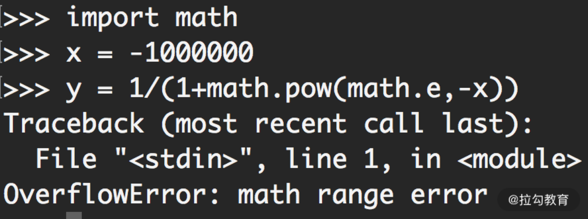
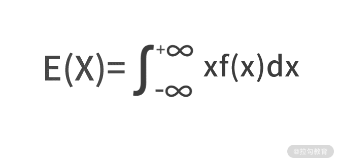
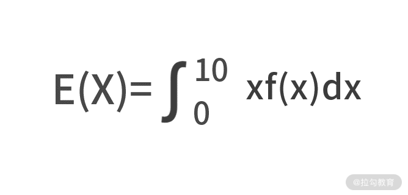

# 22 面试中那些坑了无数人的算法题

前面的课时，我们学习了“代数与统计”“算法与数据结构”，至今这门课程的主体知识已告一段落，下面我们进入彩蛋环节，我会向你介绍两个应用到数学的场景，第一个是求职面试，第二个是做人生规划。

这一讲，我们先聊一聊求职面试时常见的数学题。

毕业后，相信你一定参加过不少的面试吧。在求职面试的时候，即使目标工作岗位很少需要直接使用数学知识，也依然有不少面试官非常注重候选人的数学水平，而这并不是没有依据的。因为绝大多数的岗位，都需要候选人具有逻辑推理能力和解决问题的能力。而这些能力在数学上都能有所体现。

下面，我们通过三个例题，带大家体验一下面试中的数学。

### 例题1 抛硬币问题

假设你和大漂亮在玩抛硬币游戏。硬币的正面朝上可得 1 分，背面朝上则分数不变。如果大漂亮可以抛 51 次硬币，而你只能抛 50 次硬币，那么大漂亮分数比你高的概率是多少？

这个问题如果用计算机进行仿真求解，就会非常容易，我们给出下面的代码。

```plaintext
import random
dapiaoliang = 0
you = 0
win = 0
for _ in range(1000):
    for _ in range(51):
        if random.randint(0,1) == 1:
            dapiaoliang += 1
    for _ in range(50):
        if random.randint(0,1) == 1:
            you += 1
    if dapiaoliang > you:
        win += 1
    dapiaoliang = 0
    you = 0
print win
```

我们对代码进行走读：

- 第 3、4 行，分别定义两个变量来保存大漂亮和你的得分；
- 第 5 行，用 win 变量来记录大漂亮获胜的次数；
- 第 6 行开始，执行一个重复 1000 次的循环；
- 在每次的循环内部，先在第 7～9 行，通过 51 次的循环，模拟出大漂亮的得分；
- 再在第 10～12 行，通过 50 次的循环，模拟出你的得分；
- 在 13、14 行判断，如果大漂亮分数比你高，则大漂亮获胜一局。

最终，打印出大漂亮获胜的局数。我们运行代码的结果如下图。


可见，在 1000 次的游戏中，大漂亮获胜了 502 次。这样，我们可以估算出，大漂亮获胜的概率为 0.502。

#### 【数学角度解答】

我们再从数学的角度重新计算一下这道题。在这里，我们需要通过加乘法则去拆解一下事件。假设 A 事件代表大漂亮抛 51 次硬币的得分，B 事件代表你抛 50 次硬币的得分，要计算的目标是 A 大于 B 的概率 P(A>B)。

每次抛硬币是独立的事件，独立事件共同发生的概率满足乘法法则。因此，可以把大漂亮的得分，拆解为前 50 次抛硬币的得分（M 事件）和最后一次抛硬币的得分（ N 事件）。

> 而其中，最后一次抛硬币，只有正面得 1 分或者背面得 0 分两种情况。

对于一个事件的两个可能的结果分支，可以通过加法法则来求概率，因此有下面的公式。

P(A>B)=P(M+N>B)= P(N=0)·P(M+0>B)+P(N=1)·P(M+1>B)= 0.5·P(M+0>B) + 0.5·P(M+1>B)

对于最后一项 P(M+1>B) 等价于 P(M≥B)。这是因为，如果 M 大于或等于 B，则 M+1 必然是大于 B 的；反过来，M 和 B 是抛硬币正面朝上的次数，所以必然是整数。如果 M+1 比 B 大，那么 M 必然会大于或等于 B。因此，有二者概率相等，即 P(M+1>B) = P(M≥B)。

我们把这个关系带入到 P(A>B) 中，则有 P(A>B)=0.5·P(M>B)+0.5·P(M>=B)

再根据加法法则，则有 P(A>B)=0.5·P(M>B)+0.5·P(M>B)+0.5·P(M=B)

别忘了，M 事件代表“大漂亮前 50 次抛硬币的得分”，而 B 事件是“你抛 50 次硬币的得分”。区别只剩下了抛硬币的人不一样。不管是谁抛硬币，正面朝上的概率始终都是1/2。所以从结果来看，这两个事件是完全等价的，

则有 P(M>B) = P(M\<B)。

因此 P(A>B) = 0.5·P(M>B)+0.5·P(M\<B)+0.5·P(M=B) = 0.5·\[P(M>B)+P(M\<B)+P(M=B)\]

注意：M 和 B 的关系只有大于、小于或者等于，所以 P(M>B)+P(M\<B)+P(M=B) 之和为 1。因此，可以得到结果为 P(A>B) = 0.5·\[P(M>B)+P(M\<B)+P(M=B)\] = 0.5

这与我们用代码仿真计算的结果是一致的。

### 例题2 数据上溢问题

对于一个 Sigmoid 函数，y=1/(1+e-x)。假设输入的自变量 x 很小，为 -1000000。因为要先计算 e-x 的值，即 e1000000，如下图所示，直接计算就会先得到一个非常大的数字而抛出异常。那么在线上代码中，该如何规避这种情况，计算出输出值呢？



其实，这里可以用到一个非常简单的技巧，对公式做个变形就能让程序适应这种情况了。我们知道，Sigmoid 函数的结果是一个在 0~1 之间的连续值。而之所以产生数据溢出是因为要先计算e-x 的值。处理这种情况，我们可以从数学的角度，对分子和分母都乘以 ex 这一项，则有

y = 1/(1+e-x) = ex/(ex+1)。

此时，输入 x=-1000000，则需要计算 ex，得到结果为 0.0。再带入到 Sigmoid 函数中，就可以得到结果啦。

可能你还会问，对公式做了变形之后，如果 x 为很大的正数，如 1000000，岂不是又数据溢出抛异常了吗？如果 x 为很大的正数，我们直接用 Sigmoid 函数的原始形态 y=1/(1+e-x) 就可以了。

综合上面两种情况，我们可将x分正数及非正数分别计算，来避免数据的溢出。即

- 如果 x>0，则 y = 1/(1+e-x)
- 如果 x\<0，则 y = ex/(1+ex)

实现的代码如下：

```python
import math
def sigmoid(x):
    if x < 0:
        y = math.pow(math.e,x) / (1 + math.pow(math.e,x))
    else:
        y = 1 / (1 + math.pow(math.e,-x))
    return y
a = -1000000
b = 1000000
print sigmoid(a)
print sigmoid(b)
```

我们对代码进行走读：

- 在 Sigmoid 函数的代码中，第 4 行，判断 x 和 0 的大小关系；
- 如果 x 为负数，则通过第 5 行的公式计算 y；
- 如果 x 不是负数，则通过第 7 行的公式来计算 y。

我们在主函数中，分别输入了非常小和非常大的两个数字，并顺利得到结果分别为 0.0 和 1.0，如下图所示。


### 例题3 投点距离期望问题

假设在墙上有一个半径为 10 厘米的圆形区域，现在大迷糊用飞镖向这个圆形区域进行均匀随机的投射。假设大迷糊不会“脱靶”，求大迷糊扎到的点到圆形区域圆心距离的期望。

这个题用代码仿真会非常容易，我们给出下面的代码。

```plaintext
import random
import math
inCircle = 0
distance = 0.0
for _ in range(1000):
    x = 1.0 * random.randint(0,1000) / 100
    y = 1.0 * random.randint(0,1000) / 100
    if x * x + y * y > 100:
        continue
    else:
        inCircle += 1
        distance += math.sqrt(x * x + y * y)
print distance / inCircle
```

我们对代码进行走读：

- 第 4 行，保存合法的投射次数变量；
- 第 5 行，是累计的距离之和变量；
- 第 6 行，通过 for 循环执行多次的投射动作；
- 每次投射，第 7 行和第 8 行，随机地生成投射点的坐标变量 x 和 y（在这里，我们精确到小数点后两位）；
- 第 9 行，如果坐标点的平方和超过 100，也就是投射点在 10 厘米的圆形之外；
- 那么第 10 行，执行 continue，继续下一轮循环；
- 否则，说明投射点在圆内，执行第 11 行的代码；
- 第 12 行，合法投射次数加 1；
- 第 13 行，通过本次投射点到圆心的距离，更新累计的距离之和；
- 最后第 14 行，打印累计距离和合法投射次数的比值，得到了平均距离。

这也是投射点到圆心距离的期望，我们运行代码的结果为 6.66 厘米，如下图所示。


接下来，我们再从数学的角度来计算一下这个题目。

#### 【数学角度解答】

题目中，要求解的是一个点到圆心距离这个随机变量的期望。很显然，点到圆心的距离是个连续值。要求某个连续型随机变量的期望，可以用期望的定义式来计算，即



所以，当你在工作中遇到“某连续型变量的期望”时，它一定可以写成上面的积分形式，这是定义式，也是公理。

在我们这个问题中，随机变量 x 是点到圆心的距离。由于投射点不可以在圆形以外，所以这个距离的取值范围是 0～10。因此，我们可以把上面的公式改写为



那么问题来了，这里的概率密度函数 f(x) 的表达式是什么呢？别忘了，概率论告诉我们，概率密度函数是概率分布函数的导数。

我们不妨试着求一下投射问题的概率分布函数。假设在圆内有一个小圆，半径是 x0。那么投射点恰好也在小圆内的概率为 P(x\<x0) = π·x02/π·102 = x02/102。

因此，概率分布函数为 F(x) = x2/102；又因为，概率密度函数是概率分布函数的导数，所以概率密度函数为 f(x) = 2x/102。

我们把这些条件都带入到期望的公式中，则有


这与我们用代码求解的 6.66 厘米是一致的。

### 小结

我们对这一讲进行总结。这一课时的内容是面试中的数学，面试官会通过一个简单的数学题，考察候选人解决问题的思考路径。

数学题的魅力就在于活学活用，你很难遇到同一道题，所以靠死记硬背是不行的。只有深入理解数学原理，才能做到在面试的数学考察中游刃有余。在备考的时候，应该注意在基本功方面多花时间去做到深入理解。对于每个知识点的适用范围，来龙去脉做到掌握。

如果你遇到了一个让你束手无策的题目，不妨试着从下面两个角度寻找突破口。

- 第一个角度，从问题出发去寻找突破口。

例如，本课时的投点距离期望问题。这个题目要计算的是连续型随机变量的期望，那么它一定可以用连续型随机变量期望的定义式表示。接下来，问题就变成了对这个定义式的未知量进行计算求解。

- 第二个角度，从已知条件出发去寻找突破口。

例如，在抛硬币问题中，已知条件是大漂亮抛了 51 次，你抛了 50 次。抛 51 次，可以拆分为抛 50 次和抛 1 次。这样，我们就得到了大漂亮抛 50 次和你抛 50 次，这样等价的两个事件。基于这两个事件，就能推导出大漂亮得分比你高的概率。

这些寻找突破口的方法，是候选人解决问题能力的集中体现；也是数学题、算法题千变万化后，唯一不变的规律。
