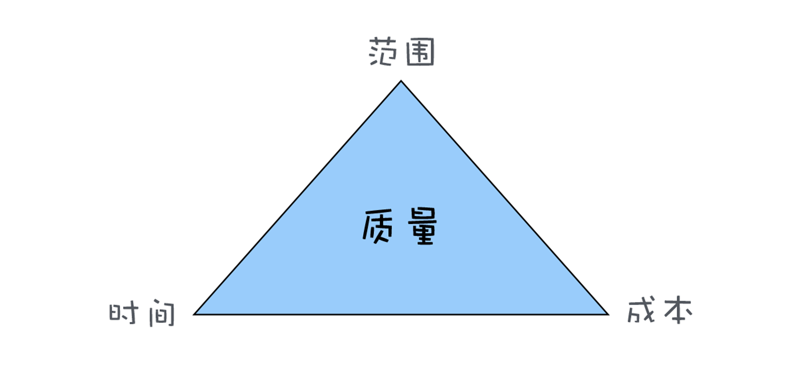
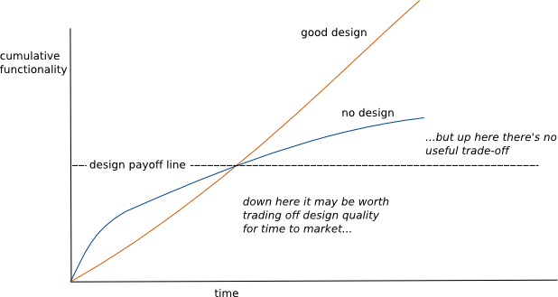

# 24 技术债务：是继续修修补补凑合着用，还是推翻重来？

你好，我是宝玉，今天我想与你讨论一下关于技术债务的问题。

做开发的同学对以下场景应该不会陌生：

- 为了赶项目进度，单元测试代码就来不及写了，打算以后再补；

- 随着需求的变化，原本的架构设计已经不能很好地满足新的需求，但是又不想对架构做改动，于是就绕开架构设计增加了很多代码；

- 一个旧的系统，没有文档没有注释，技术老旧，难以维护。

这些问题，如果没有及时修正，就会导致代码臃肿、系统效率低下，难以维护，也难以新增功能。

有一个很形象的名词叫“技术债务”，用来形容上面这些架构或代码上的质量问题。

所以今天的课程，我将带你一起来了解一下什么是技术债务，它形成的原因是什么，以及怎么来管理技术债务。

## 什么是技术债务？

我们在学项目管理金三角时，有一张表示软件质量与时间、成本、范围关系的三角形图，也特别解释了为什么质量要放在三角形中间，因为质量往往是其他三个因素平衡后结果的体现。

范围不减，成本不增加，还想节约时间走捷径，就会影响到质量。这个“质量”，不只是产品质量，还有架构质量和代码质量。这种对质量的透支，就是一种债务。**而技术债务，就是软件项目中对架构质量和代码质量的透支。**

技术债务确实是个形象生动的比喻，让你意识到它是和成本挂钩的，而且技术债务也有金融债务的一些特点，比如有利息，再比如技术债务也有好的一面。

#### 技术债务是有利息的

债务的“利息”，就是在后面对软件做修改的时候，需要额外的时间成本。

假设我们做一个项目，在刚开始时，架构良好代码整洁，添加一个功能可能需要 4 天时间。随着项目不断维护，因为走捷径积累了一些技术债务，这时候再开发一个同样复杂度的功能就需要 5 天时间了。

这多出来的 1 天，就是技术债务造成的利息。因为你需要时间去梳理现在臃肿的代码，以找到合适的位置添加代码；修改代码后还可能导致原有系统不稳定，需要额外的时间去修复系统不稳定的问题。

#### 技术债务不一定都是坏的

现实中，如果是贷款买辆豪车，一方面要支付利息，一方面车子一直在贬值，这不一定是个良性的债务；但如果你贷款买房子，虽然支付了利息，但如果房子升值，这个债务其实是良性的。

在软件项目中，也经常会刻意的欠一些技术债务，提升短期的开发速度，让软件能尽快推出，从而抢占市场；还有像快速原型开发模型，通过欠技术债务的方式快速开发快速验证，如果验证不可行，甚至这笔技术债务都不需要偿还了。

但技术借债也一样不能是无限制的，因为借债越多，利息越大，当收益抵不过利息时，就会陷入恶性循环，导致开发效率低下，进度难以保障。

所以对于项目中的债务，我们要清楚的知道有哪些技术债务，以及它给项目带来的收益和产生利息，这样才能帮助我们管理好这些债务。

## 技术债务产生的原因

如果现实中有人负债累累，那么多半有几个原因：这人对债务没有规划、生活所迫不得不借债、为了长远利益而临时借债、不知情的情况下欠了债务。

其实技术债务产生的原因也类似，所以《重构》一书的作者 Martin Fowler 把技术债务产生的原因分成了两个维度：

1. 轻率（reckless）还是谨慎（prudent）；
1. 有意（deliberate）还是无意（inadvertent）。

这两个维度正好可以划分成四个象限，如下图所示：

图片来源：Technical Debt Quadrant

- **轻率 / 有意的债务**

这个象限，反映的是团队因为成本、时间的原因，故意走捷径没有设计、不遵守好的开发实践，对于债务没有后续的改进计划的情况。

例如不做设计直接编码，后期也没有打算重构代码。或者是团队成员以新手程序员为主，没有足够的资深程序员指导和审查代码。

这样产生的债务，短期可能还好，但是因为技术债务会一直积累，会导致利息越来越多，最终带来的负面效果会越来越大。

- **谨慎 / 有意的债务**

这个象限，则反映的是团队清楚知道技术债务的收益和后果，并且也制定了后续的计划去完善架构和提升代码质量的情况。

比如说为了尽快发布产品，先采用“快猛糙”的方式开发，后续再对代码进行重构。

这样产生的债务，因为能及时偿还，所以既可以短期有一定时间上的收益，长期也不会造成负面影响。

- **轻率 / 无意的债务**

这个象限，反映了团队不知道技术债务，也不知道要后续要偿还技术债务的情况。

比如说一些开发团队对于什么是架构设计，什么是好的开发实践一无所知，代码一团糟。

这样产生的债务是最危险的，因为既没得到技术债务的收益，还要偿还其产生的利息。

- **谨慎 / 无意的债务** 这个象限反映了团队其实很重视架构设计和技术债务，但因为业务的变化，或者其他客观因素的原因，造成技术债务的产生。

比如说最初设计的时候，无法准确预测后面业务的发展，随着业务的发展，设计无法满足好新的需求。

这样产生的债务难以避免，但如果能及时的对架构升级、重构，就能保证不会造成严重的影响。

以上就是软件项目中的四种技术债务，每一种技术债务产生的原因都不尽相同，对其处理的策略不同，也会造成不同的影响。

## 如何管理技术债务？

既然技术债务有利息也有收益，那么我们怎么能保证软件项目中的收益大于支付的利息呢？

Martin Fowler 画过一张图，来形象的描述了设计、时间和开发速度的关系。没有设计直接写代码，从短期看确实是节约时间的，但是跨过一个临界点后，开发速度会急剧下降。

图片来源：Is it worth the effort to design software well?

技术债务的收益和利息也是类似的道理，最初的时候，利息低收益高，欠一些技术债务是会节约时间的，但是超过一个临界点后，利息高收益低，就会大大降低开发效率。

所以最好能让技术债务控制在临界点之下，这就要求我们能充分了解目前项目中的债务情况，然后才好制定相应的策略，从而达到控制债务的目的。

#### 识别技术债务

如果是现实中的债务，查查银行账户就很容易知道是不是欠债了，而技术债务却没那么直观，但识别技术债务是很关键一步，只有发现系统中的技术债务，才能去找到合适的方案解决它。

你要是细心观察，还是可以通过很多指标来发现软件项目存在的技术债务。比如说： **开发速度降低** ：通常项目正常情况下，在相同的时间间隔下，完成的任务是接近的。尤其是使用敏捷开发的团队，每个任务会评估故事分数，每个 Sprint 能完成的故事分数是接近的。但是如果单位时间内能完成的任务数明显下降，那很可能是技术债务太多导致的。**单元测试代码覆盖率低** ：现在大部分语言都有单元测试覆盖率的检测工具，通过工具可以很容易知道当前项目单元测试覆盖率如何，如果覆盖率太低或者下降厉害，就说明存在技术债务了。**代码规范检查的错误率高** ：现在主流的语言也有各种规范和错误检查工具，也叫 lint 工具，比如 Javascript 就有 eslint，Swift 有 SwiftLint，python 有 pylint。通过各种 lint 工具，可以有效发现代码中潜在的错误和不规范之处，如果错误率高，则说明代码质量不够好。**Bug 数量越来越多** ：正常情况下，如果没有新功能开发，Bug 数量会越来越少。但是如果 Bug 数量下降很慢，甚至有增多的迹象，那说明代码质量或者架构可能存在比较大问题。

除了上面这些指标，其实你还能找到一些其他指标，比如你用的语言或者框架的版本是不是太老，早已无人更新维护了；比如开发人员总是需要加班加点才能赶上进度，如果架构良好、代码质量良好，这些加班本是可以避免的。

#### 选择处理技术债务策略

在识别出来技术债务后，就需要考虑如何来解决这些技术债务了。解决技术债务有三种策略。

- **重写：推翻重来，一次还清**

将老系统推翻重写是很多程序员最热衷干的事情之一了。重写系统是一种优缺点都很明显的策略，这有点像你试图把债务一次性还清。

优点是你可以针对当前的需求和业务发展特点，重新进行良好的设计，精简掉不需要的功能和代码。缺点就是重写通常工作量很大，在新系统还没完成之前，同时还要对旧系统维护增加新功能，压力会非常大；另外新写的系统，重新稳定下来也需要一段时间。

- **维持：修修补补，只还利息**

维持现状，只对严重问题修修补补，这其实是常见的一种策略，就跟还债的时候只还利息一样。

修修补补相对成本低，不用投入太大精力，如果项目不需要新增功能，只需要维护还好，如果项目还持续要新增功能，越到后面，维护的成本就越高了。

- **重构：新旧交替，分期付款** 重构相对是一种比较折中的策略，就跟我们采用分期付款的方式偿还贷款一样。

每次只是改进系统其中一部分功能，在不改变功能的情况下，只对内部结构和代码进行重新整理，不断调整优化系统的结构，最终完全偿还技术债务。这种方式优点很多，例如不会导致系统不稳定，对业务影响很小。缺点就是整个过程耗时相对更久。

这三种策略并没有绝对好坏，需要根据当前项目场景灵活选择。有个简单原则可以帮助你选择，**那就是看哪一种策略投入产出比更好。**

无论选择哪种策略，都是要有投入的，也就是要有人、要花时间，而人和时间就是成本；同样，对于选择的策略，也是有收益的，比如带来开发效率的提升，节约了人和时间，这就是收益。

如果收益高于投入，那这事可以考虑做，否则就要慎重考虑。对一个生命周期不会太久，或者没有什么新功能开发的系统，花大力气去重构、重写是不合算的，不如维持现状。而如果有新技术新产品出现，可以以极低的成本替代原有系统，这样重写就是个好方案。

比如说我们项目中有个很老的自己写的 CMS 系统，问题很多也没法维护，于是最近找了一个开源的 CMS 系统，把原有的数据一导入，马上就很好用了，也没有花多少时间。

通常，如果你纠结于不知道该选择哪一种策略时，那就选择重构的策略，因为这是相对最稳妥有效的。

#### 实施策略

当你选择好用哪种策略处理技术债务之后，就可以实施你的策略了。不同的策略可能实施方式上略有不同。

- 对于重写的策略，要当作一个正式的项目来立项，按照项目流程推进；

- 对于重构的策略，要把整个重构任务拆分成一个个小任务，放到项目计划中，创建成 Ticket，放到任务跟踪系统中跟踪起来；

- 对于维持的策略，也要把需要做的修补工作作为任务，放到计划中，放到任务跟踪系统中。

实施策略的关键就在于要落实成开发任务，作为项目计划的一部分。

#### 预防才是最好的方法

前面说的方法策略，都是针对已经存在的技术债务而言的。其实最好的方法是预防技术债务的产生。像下面这些方法，都是行之有效的预防措施：

- **预先投资** ：好的架构设计、高质量代码就像一种技术投资，能有效减少技术债务的发生；

- **不走捷径** ：大部分技术债务的来源都是因为走捷径，如果日常能做好代码审查、保障单元测试代码覆盖率，这些行之有效的措施都可以帮助你预防技术债务；

- **及时还债** ：有时候项目中，因为进度时间紧等客观原因，导致不得不走捷径，那么就应该把欠下的技术债务记下来，放到任务跟踪系统中，安排在后续的开发任务中，及时还债及时解决，就可以避免债务越来越多。

如果团队能提高对技术债务的认识，防患于未然，就能让技术债务保持在一个合理的水平，不会影响到开发效率。

## 总结

今天，我带你一起了解了软件项目中技术债务的知识。解释了技术债务的概念，技术债务，就是软件项目中架构质量和代码质量的透支。

技术债务，也并不都是坏事，如果合理利用，就可以在短期内缩短时间，但是后期如果不偿还技术债务，也会对项目及个人造成不好的后果。

技术债务产生的原因有四个方面：轻率 / 有意的债务、谨慎 / 有意的债务、轻率 / 无意的债务和谨慎 / 无意的债务。

可以分三个步骤来管理技术债务：识别技术债务、选择处理策略和实施策略。处理策略有三种：推翻重写、修修补补和重构。

对于技术债务，是继续修修补补凑合着用，还是推翻重来？其实取决于哪一种策略的投入产出比更好，如果推翻重来代价太大，那么就应该谨慎考虑，不如先修修补补或者局部重构；如果修修补补难以维持，就要考虑重写或者重构。

对于技术债务，还是要在日常开发中有好的意识，不走捷径，防患未然，预防技术债务的发生。
