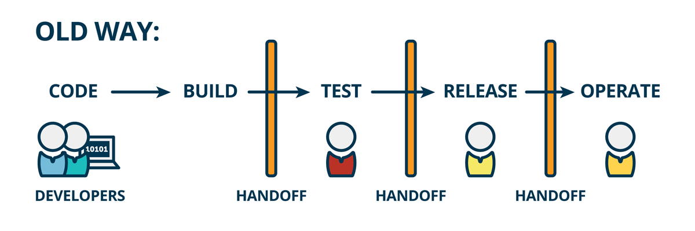

# 36 DevOps工程师到底要做什么事情？

你好，我是宝玉。这些年，有关 DevOps 的概念很火，大家都在讨论 DevOps，有人说 DevOps 就是自动化运维，有人说 DevOps 是流程和管理，还有人说 DevOps 是一种文化。以前的运维工程师也纷纷变成了 DevOps 工程师。

今天，我将带你一起了解一下，究竟什么是 DevOps？DevOps 到底要做什么事情？

## 传统的运维模式以及面临的挑战

在传统的瀑布模型开发中，软件生命周期中的运行维护这部分工作通常是交给运维工程师来完成的。

当开发人员完成编码，测试人员测试验收通过后，到了要发布的时候，就会将程序交给运维人员部署发布到生产环境。

（图片来源：[The Product Managers’ Guide to Continuous Delivery and DevOps](http://www.mindtheproduct.com/2016/02/what-the-hell-are-ci-cd-and-devops-a-cheatsheet-for-the-rest-of-us/)）

除了程序的部署更新，传统运维工程师最重要的职责就是保障线上服务的稳定运行。对服务器 24 小时监控，有意外情况发生时需要及时处理和解决。

除此之外，还有日常的更新维护，比如说安装升级操作系统、安装更新应用软件，更新数据库、配置文件等。

早些年这种运维模式运行的很好，但随着这些年互联网发展，有两个主要的因素对传统的运维模式产生了很大挑战。

第一，服务器规模快速增长和虚拟化技术的高速发展。

早些年，一般的企业服务器数量都不会太多，运维工作以手工为主，自动化为辅。几个人几十台服务器，即使用手动方式管理，也不会太困难。但随着这些年技术的快速发展，大型互联网公司的服务器数量越来越庞大，而中小公司都开始往云服务上迁移，基于 Docker 这样的虚拟化技术来搭建在线服务的基础架构。

服务器规模的增加和虚拟化技术的使用，就意味着以前的手动方式或者半自动的方式难以为继，需要更多的自动化和基于容器技术或者相关工具的二次开发。对于运维的工作来说，运维人员也需要更多的开发能力。

第二，高频的部署发布。

传统的软件部署频率不高，一般几天甚至几个月才部署发布一次，同时每一次的部署发布，也可能会导致系统的不稳定。而敏捷开发和持续交付的概念兴起后，更新的频率越来越高，每周甚至每天都会有若干次的更新部署。

高频部署带来的挑战，首先就是会引起开发和运维之间的冲突，因为开发想要快速更新部署，而对于运维来说，每次更新部署会导致系统不稳定，最好是不更新，可以让系统维持在稳定的状态。另一个挑战就是想要快速的部署发布，也意味着运维要有更高的自动化能力。

为了解决这些挑战，DevOps 出现了，它帮助解决开发和运维之间的沟通协作问题，提升运维开发和自动化能力。

## 什么是 DevOps？

**DevOps 可以理解为一种开发（Development）和运维（Operations）一起紧密协作的工作方式，从而可以更快更可靠的构建、测试和发布软件。**

DevOps 并不意味着开发一定要懂运维技术，运维要懂开发技术，而是说两个工种要更紧密的协作，有共同的目标：更快更可靠的构建、测试和发布软件。

这就意味着，对于运维来说，不再抵触开发的频繁更新部署，会帮助搭建自动化部署平台，提供自动化部署工具；对于开发来说，不再认为运维的工作和开发没关系，开发人员会邀请运维人员参与架构设计，帮助运维实现自动化脚本开发。

那么当你的团队采用 DevOps 的方式工作的话，会带来哪些好处呢？

- **整个软件的构建、测试和发布过程高度自动化**

DevOps 一个很重要的基础就是自动化，通过对自动化的应用，是最简单有效的打破开发和运维之间壁垒的方式。

因为应用自动化后，对于运维人员来说，自动化的交付流程，减少了繁重的手工操作，自动化测试可以有效对产品质量提供很好的保障。对于开发人员来说，可以方便高频率地进行部署。

如果你的团队还没有开始实施自动化，可以先从持续交付开始，具体可以参考我们专栏在《26 持续交付：如何做到随时发布新版本到生产环境？》中的介绍。

- **信息更加透明和易于测量**

在传统的开发和运维合作模式中，开发和运维之间的信息不是那么的透明。对于开发来说，不了解程序在服务器上运行的情况，对于运维来说，程序就是个黑盒子，无法对程序内部进行监控，出现问题只能重启或者回滚。

当采用 DevOps 的工作方式，信息更加透明，通过日志和工具，数据也可以被更好测量。比如说：

可以直观看到开发到部署需要多少时间，哪个环节可以改进？

当前服务运行情况如何，每分钟访问数多少，API 出错率多少？

当前用户数多少，有多少新增用户？

这些数据，不仅可以帮助运维更好地预警，或者是帮助开发更好地优化程序，还可以帮助业务团队更好地了解服务的运营情况。

- **培养跨职能协作的文化** DevOps 的核心文化是不同职能工种之间的紧密协作的文化。其实不仅限于开发和运维之间，就像我们之前在《32 软件测试：什么样的公司需要专职测试？》）中讨论的，开发和测试之间也一样离不开紧密的协作。

如果你的团队是在真正地实践 DevOps 的工作方式，就会积极拥抱这样的跨职能协作的文化，在日常工作中包容错误、对事不对人，能对项目的开发流程持续改进，鼓励创新。

有关 DevOps，也有一些不错的文章，有兴趣的话可以进一步阅读：[DevOps 前世今生 | mPaaS 线上直播 CodeHub #1 回顾](http://juejin.im/post/5c98372c6fb9a070f2377ff6)，[孙宇聪：来自 Google 的 DevOps 理念及实践](https://mp.weixin.qq.com/s?__biz=MzI3MzEzMDI1OQ==&mid=2651819931&idx=1&sn=0a4d940b122f65ac910ef9f0175c5bad&chksm=f0dcd9e7c7ab50f11b0b2395a293e8ac6ee807e843d77fa54ba677c8f0bcf6ab1db2d1110458&scene=0#rd)和[关于 DevOps ，咱们聊的可能不是一回事](https://www.jianshu.com/p/645bb1283a77)。

DevOps 看起来很美好，也许你迫不及待想去实施，但 DevOps 这种工作方式的建立，也不是一下子能完成的，上面提到的这些带来的好处，相应的也是你要去遵守的 DevOps 原则： **自动化、信息透明可测量、构建协作文化。**

这也意味着：

- 你需要去构建自动化部署的系统，从构建、测试到部署实现高度的自动化；

- 建立数据监控的系统，让信息透明可测量；

- 最后要形成跨职能协作的文化。

看起来很难，但也不需要有压力，因为要实践 DevOps，不需要你改变开发模式，瀑布模型或者敏捷开发都可以实施；不需要靠管理层推动；也不一定要让开发人员去学习运维知识或者运维去学习开发知识。而是通过了解 DevOps 的核心价值，也就是跨职能之间紧密协作，更快更可靠地构建、测试和发布软件，一点一点地做出改变。

## DevOps 工程师到底要做什么事情？

在了解了什么是 DevOps 后，我们再来看看基于 DevOps 的实践，DevOps 工程师到底要做什么事情？

对于 DevOps 工程师的定义其实是有争议的，因为有人认为 DevOps 是一种团队工作的方式，而不是一种职业。也有人认为 DevOps 工程师是一种职位，用来帮助团队形成 DevOps 工作方式的职位。

在这里我们没必要陷入这种争论，而是从 DevOps 实践的角度，来看看 DevOps 工程师，要做什么事情，可以帮助团队来实践 DevOps 的工作方式。至于是 Dev 来做这些事情，还是 Ops 来做这些事情，还是一起协作来做这些事情，并不是最重要的。

**首先，DevOps 工程师要帮助团队建立基于持续集成和持续交付工作流程。** 关于持续集成和持续交付，不仅仅是工具的使用，同时还是基于工具之上的一整套的交付工作流程。

这套工作流程已经是业界公认的好的实践，但在很多中小团队普及率还不高，主要的难点之一是搭建比较复杂，可能还涉及二次开发；另一个是不知道该怎么建立这样的流程。

对于这样的工具和流程的建设，最初的时候，就是需要有专门的人，专门的时间去建立，也是 DevOps 工程师首先要去解决的问题。

其次，要建立一套基于日志的监控报警的系统，以及故障响应的流程。

对于线上系统，应急响应非常重要，要在故障发生后，第一时间作出响应，及时恢复生产，避免更大损失。而要做到这一点，同样离不开工具和流程的支持。

需要能建立一套基于日志的监控报警的系统，将应用程序还有运行环境的各项数据监控起来，设置报警的阈值。当数据异常，超出阈值，就马上触发报警，然后进入应急响应的流程。

对于应急响应流程，首先应该能第一时间通知最合适的人去处理，比如负责这个服务值班的开发人员，然后对于怎么第一时间恢复应该有准备，涉及跨部门协作也应该有相应的配合流程；最后对于故障应该有总结，避免类似情况再次发生。

有关监控和日志分析，我还会在我们专栏后续文章《 监控和日志分析：如何借助工具快速发现和定位产品问题 ？》中有更多介绍。 **然后，要构建基于云计算和虚拟化技术的基础设施。** 虽然并非每一个软件项目都是基于云计算或虚拟化技术来搭建的，但云计算和虚拟化技术方面的技术，其实是横跨开发和运维的，可能对于大部分开发和运维来说，都只了解其中一部分知识，这就需要有人能同时懂软件开发和云计算或虚拟化技术，或者一起协作，才能搭建出真正适合云计算或虚拟化技术的架构。

构建出来基于云计算和虚拟化技术的基础设施后，对于开发人员来说，只要通过 API 或脚本即可搭建应用，对于运维来说，也只要通过脚本和工具即可管理。

这其实也是 DevOps 中的[基础设施即代码](https://insights.thoughtworks.cn/nfrastructure-as-code/)的概念。 **最后，要形成 DevOps 的文化。**

DevOps 最核心的本质就是工作方式和协作的文化，而这样的文化需要有人引领，一点点去形成。

DevOps 工程师要帮助开发和运维相互理解对方的工作，帮助开发和运维在一起协作时多沟通，相互学习。出现问题不指责，而是分析原因，共同承担责任，找出改进的方案。

这些就是 DevOps 工程师要做的事情，本质上还是 DevOps 的几条基本原则：自动化、信息透明可测量、构建协作文化。不需要有 DevOps 工程师的头衔，基于 DevOps 的原则去做事情，就可以算的上是 DevOps 工程师。

## 总结

今天我带你一起学习了当前热门的 DevOps 概念，DevOps 可以理解为一种开发和运维一起紧密协作的工作方式，从而可以更快更可靠地构建、测试和发布软件。DevOps 的主要原则就是自动化、信息透明可测量、构建协作文化。

DevOps 工程师，要做的事情就是帮助团队来实践 DevOps 的工作方式。具体可以帮助团队：

- 建立基于持续集成和持续交付工作流程；

- 建立基于日志的监控报警的系统，以及故障响应的流程；

- 构建基于云计算和虚拟化技术的基础设施；

- 形成 DevOps 的文化。

DevOps 工程师做的事情，就是帮助团队基于 DevOps 原则来做事，让团队形成紧密协作的工作方式，更快更可靠的构建、测试和发布软件。
