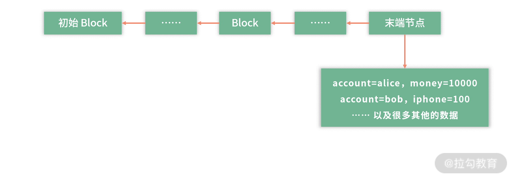
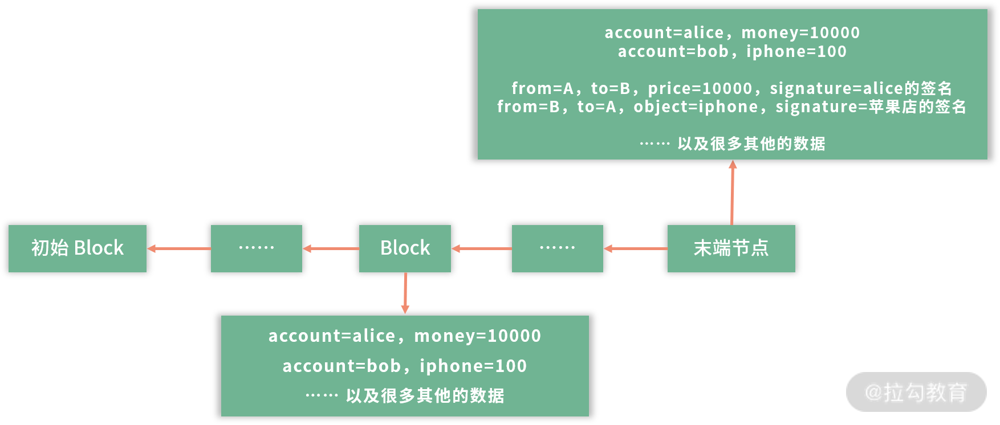
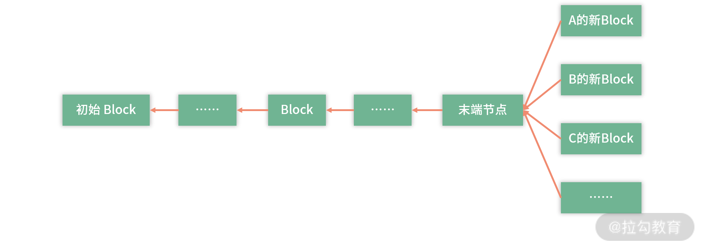

# 19 乐观锁、区块链：除了上锁还有哪些并发控制方法？

**这一讲我带来的面试题是：除了上锁还有哪些并发控制方法** ？

上面这道面试题是在“有哪些并发控制方法？”这个问题的基础上加了一个限制条件。

在我面试候选人的过程中，“上锁”是我听到过回答频次最多的答案，也就是说大多数程序员都可以想到这个并发控制方法。因此，是否能回答出上锁以外的方法，是检验程序员能力的一个分水岭，其实锁以外还有大量优秀的方法。

你掌握的方法越多，那么在解决实际问题的时候，思路就越多。即使你没有做过高并发场景的设计，但是如果脑海中有大量优秀的方法可以使用，那么公司也会考虑培养你，将高并发场景交给你去解决。今天我们就以这道面试题为引，一起探讨下“锁以外的并发控制方法”。

### 悲观锁/乐观锁

说到并发场景，设计系统的目的往往是达到同步（Synchronized）的状态，同步就是大家最终对数据的理解达成了一致。

同步的一种方式，就是让 **临界区** 互斥。 这种方式，每次只有一个线程可以进入临界区。比如多个人修改一篇文章，这意味着必须等一个人编辑完，另一个人才能编辑。但是从实际问题出发，如果多个人编辑的不是文章的同一部分，是可以同时编辑的。因此，让临界区互斥的方法（对临界区上锁），具有强烈的排他性，对修改持保守态度，我们称为 **悲观锁（Pressimistic Lock）** 。

通常意义上，我们说上锁，就是悲观锁，比如说 MySQL 的表锁、行锁、Java 的锁，本质是互斥（mutex）。

和 **悲观锁（PressimisticLock）持相反意见的，是乐观锁（Optimistic Lock）** 。你每天都用的，基于乐观锁的应用就是版本控制工具 Git。Git 允许大家一起编辑，将结果先存在本地，然后都可以向远程仓库提交，如果没有版本冲突，就可以提交上去。这就是一种典型的乐观锁的场景，或者称为基于版本控制的场景。

#### Git 的类比

比如现在代码仓库的版本是 100。Bob 和 Alice 把版本 100 拷贝到本地，Bob 在本地写到了 106 版本，Alice 在本地写到 108 版本。那么如果 Alice 先提交，代码仓库的版本就到了 108。 Bob 再提交的时候，发现版本已经不是 100 了，就需要把最新的代码 fetch 到本地，然后合并冲突，再尝试提交一个更新的版本，比如 110。

这种方式非常类似`cas`指令的形式，就是每次更新的发起方，需要明确地知道想从多少版本更新到多少版本。以 Git 为例，可以写出`cas`的伪代码：

```plaintext
cas(&version, 100, 108); // 成功
cas(&version, 100, 106); // 失败，因为version是108
```

上面代码第二次`cas`操作时因为版本变了，更新失败，这就是一个乐观锁——Alice 和 Bob 可以同时写，先更新的人被采纳，后更新的人负责解决冲突。

#### 购物车的类比

再举个例子，比如说要实现一个购物车。用户可能在移动端、PC 端之间切换，比如他用一会手机累了，然后换成用电脑，当他用电脑累了，再换回手机。

在移动端和 PC 端，用户都在操作购物车。 比如在移动端上，用户增加了商品 A；然后用户打开 PC 端，增加了商品 B；然后用户又换回了移动端，想增加商品 C。

这种时候，如果用悲观锁，用户登录移动端后，一种方案就是把 PC 端下线——当然这个方案显然不合理。 合理的方案是给购物车一个版本号，假设是 MySQL 表，那么购物车表中就会多一个版本字段。这样当用户操作购物车的时候，检查一下当前购物车的版本号是不是最新的，如果是最新的，那么就正常操作。如果不是最新的，就提示用户购物车在其他地方已被更新，需要刷新。

### 去中心化方案：区块链的类比

继续类比，我们可以思考一个更加有趣的方案。在传统的架构中，我们之所以害怕并发，是因为中心化。比如说 DNS 系统，如果全球所有的 DNS 查询都执行一个集群，这个吞吐量是非常恐怖的，因此 DNS 系统用了一个分级缓存的策略。

但是交易数据分布的时候，比如下单、支付、修改库存，如果用分布式处理，就牵扯到分布式锁（分布式事务）。那么，有没有一个去中心化的方案，让业务不需要集中处理呢？比如说双 11 期间你在淘宝上买东西，可不可以直接和商家下单，而不用通过淘宝的中心系统呢？——如果可以，这也就相当于实现了同步，或者说去掉了高并发的同步。

#### 解决最基本的信用问题

考虑购买所有的网购产品，下单不再走中心化的平台。比如阿里、拼多多、 京东、抖音……这些平台用户都不走平台的中心系统下单，而是用户直接和商家签订合同。这个技术现在已经实现了，叫作电子合同。

举例：Alice（A）向苹果店 B 购买了一个 iPhone。那么双方签订电子合同，合同内容 C 是：

```plaintext
from=A, to=B, price=10000, signature=alice的签名
from=B, to=A, object=iphone, signature=苹果店的签名
```

上面两条记录，第 1 条是说 A 同意给 B 转 10000 块钱；第 2 条记录说，B 同意给 A 一个 iPhone。如果 A 收了 iPhone 不给 B 打款，B 可以拿着这个电子合同去法院告 A。因为用 A 的签名，可以确定是 Alice 签署了这份协议。同理，如果苹果店不给 Alice iPhone，Alice 可以去法院告苹果店，因为 Alice 可以用苹果店的签名证明合同是真的。

#### 解决货币和库存的问题

有了上面的例子，最基本的信用问题解决了。接下来，你可能会问，Alice 怎么证明自己有足够的钱买 iPhone？苹果店怎么证明有足够的 iPhone？

比如在某个对公开放的节点中，记录了：

```plaintext
account=alice, money=10000
account=bob, iphone=100
…… 以及很多其他的数据
```

我们假设这里的钱可能是 Alice 用某种手段放进来的。或者我们再简化这个模型，比如全世界所有人的钱，都在这个系统里，这样我们就不用关心钱从哪里来这个问题了。如果是比特币，钱是需要挖矿的。



如图，这个结构也叫作区块链。每个 Block 下面可以存一些数据，每个 Block 知道上一个节点是谁。每个 Block 有上一个节点的摘要签名。也就是说，如果 Block 10 是 Block 11 的上一个节点，那么 Block 11 会知道 Block 10 的存在，且用 Block 11 中 Block 10 的摘要签名，可以证明 Block 10 的数据没有被篡改过。

区块链构成了一个基于历史版本的事实链，前一个版本是后一个版本的历史。Alice 的钱和苹果店的 iPhone 数量，包括全世界所有人的钱，都在这些 Block 里。 **购买转账的过程** 下面请你思考，Alice 购买了 iPhone，需要提交两条新数据到上面的区块链。

```plaintext
from=A, to=B, price=10000, signature=alice的签名
from=B, to=A, object=iphone, signature=苹果店的签名
```

那么我们可以在末端节点上再增加一个区块，代表这次交易，如下图：



比如，Alice 先在本地完成这件事情，本地的区块链就会像上图那样。 假设有一个中心化的服务器，专门接收这些区块数据，Alice 接下来就可以把数据提交到中心化的服务器，苹果店从中心化服务器上看到这条信息，认为交易被 Alice 执行了，就准备发货。

如果世界上有很多人同时在这个末端节点上写新的 Block。那么可以考虑由一个可信任的中心服务帮助合并新增的区块数据。就好像多个人同时编辑了一篇文章，发生了冲突，那就可以考虑由一个人整合大家需要修改和新增的内容，避免同时操作产生混乱。

#### 解决欺诈问题

正常情况下，所有记录都可以直接合并。但是比如Alice在一家店购买了 1 个 iPhone，在另外一家店购买了 2 个 iPhone，这个时候 Alice 的钱就不够付款了。 或者说 Alice 想用 20000 块买 3 个 iPhone，她还想骗一个。

那么 Alice 最终就需要写这样的记录：

```plaintext
from=A, to=B, price=10000, signature=alice的签名
from=B, to=A, object=iphone, signature=一个苹果店的签名
from=A, to=B1, price=20000, signature=alice的签名
from=B1, to=A, object=iphonex2, signature=另一个苹果店的签名
```

无论 Alice 以什么顺序写入这些记录，她的钱都是不够的，因为她只有 20000 的余额。 这样简单地就解决了欺诈问题。

如果 Alice 想要修改自己的余额，那么 Alice 怎么做呢？

Alice 需要新增一个末端的节点，比如她在末端节点上将自己的余额修改为 999999。那么 Alice 的余额，就和之前 Block 中记录的冲突了。简单一查，就知道 Alice 在欺诈。如果 Alice 想要修改之前的某个节点的数据，这个节点的摘要签名就会发生变化了， 那么后面所有的节点就失效了。

比如 Alice 修改了 Block 9 的数据，并把整个区块链拷贝给 Bob。Bob 通过验证签名，就知道 Alice 在骗人。如果 Alice 修改了所有 Block 9 以后的 Block，相当于修改了完整的一个链条，且修改了所有的签名。Bob 只需要核对其中几个版本和其他人，或者和中心服务的签名的区别就知道 Alice 在欺诈。

刚才有一个设计，就是有一个中心平台供 Bob 下载。如果中心平台修改了数据。那么 Bob 会马上发现存在本地的和自己相关的数据与中心平台不一致。这样 Bob 就会联合其他用户一起抵制中心平台。

所以结论是，区块链一旦写入就不能修改，这样可以防止很多欺诈行为。

#### 解决并发问题

假设全球有几十亿人都在下单。那么每次下单，需要创建新的一个 Block。这种情况，会导致最后面的 Block，开很多分支。



这个时候你会发现，这里有同步问题对不对？ 最傻的方案就是用锁解决，比如用一个集中式的办法，去接收所有的请求，这样就又回到中心化的设计。

还有一个高明的办法，就是允许商家开分支。 用户和苹果店订合同，苹果店独立做一个分支，把用户的合同连起来。


这样苹果店自己先维护自己的 Block-Chain，等待合适的时机，再去合并到主分支上。 如果有合同合并不进去，比如余额不足，那再作废这个合同（不发货了）。

这里请你思考这样一种处理方式：如果全世界每天有 1000 亿笔订单要处理，那么可以先拆分成 100 个区域，每个区域是 10W 家店。这样最终每家店的平均并发量在 10000 单。 然后可以考虑每过多长时间，比如 10s，进行一次逐级合并。

这样，整体每个节点的压力就不是很大了。

### 总结

在这一讲，我们主要学习了一些比锁更加有趣的处理方式， 其实还有很多方式，你可以去思考。并发问题也不仅仅是要解决并发问题，并发还伴随着一致性、可用性、欺诈及吞吐量等。一名优秀的架构师是需要储备多个维度的知识，所以还是我常常跟你强调的，知识在于积累，绝非朝夕之功。

另外，我想告诉你的是，其实大厂并不是只招收处理过并发场景的工程师。作为一名资深面试官，我愿意给任何人机会，前提是你的方案打动了我。而设计方案的能力，是可以学习的。你要多思考，多查资料，多整理总结，这样久而久之，就有公司愿意让你做架构了。 **那么通过这节课的学习，你现在可以尝试来回答本节关联的面试题目：除了上锁还有哪些并发控制方法？**  **【解析】** 这个问题比较发散，这一讲我们介绍了基于乐观锁的版本控制，还介绍了区块链技术。另外还有一个名词，并不属于操作系统课程范畴，我也简单给你介绍下。处理并发还可以考虑 Lock-Free 数据结构。比如 Lock-Free 队列，是基于 cas 指令实现的，允许多个线程使用这个队列。再比如 ThreadLocal，让每个线程访问不同的资源，旨在用空间换时间，也是避免锁的一种方案。
