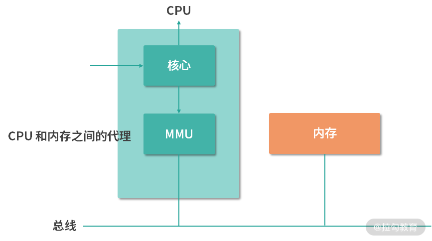
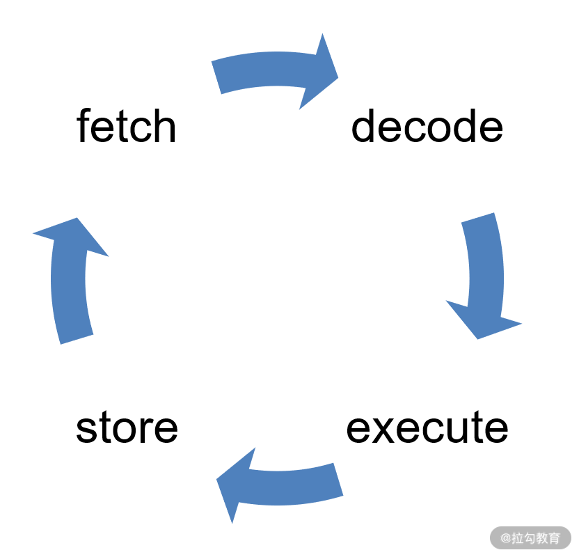
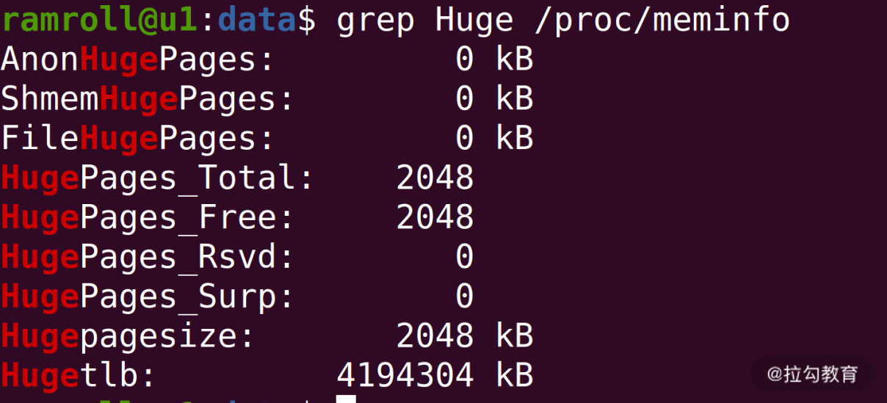
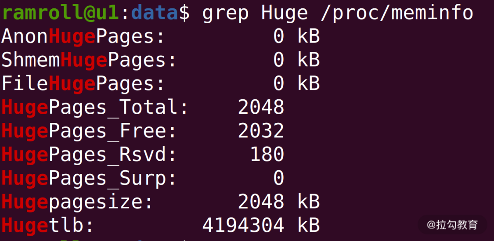

# 25 内存管理单元： 什么情况下使用大内存分页？

今天我们的学习目标是：了解如何通过内存，提升你的程序性能。 **这一讲我带来了一道和内存优化相关的面试题：什么情况下使用大内存分页** ？

这道题目属于一个实用技巧，可以作为你积累高并发处理技能的一个小小的组成部分。要理解和解决这个问题，我们还需要在上一讲的基础上，继续挖掘虚拟内存和内存管理单元更底层的工作原理，以及了解转置检测缓冲区（TLB）的作用。

那么接下来就请你带着这个优化问题，和我一起开始学习今天的内容。

### 内存管理单元

上一讲我们学习了虚拟地址到物理地址的转换过程。如下图所示：


你可以把虚拟地址看成由页号和偏移量组成，把物理地址看成由 Frame Number 和偏移量组成。在 CPU 中有一个完成虚拟地址到物理地址转换的小型设备，叫作内存管理单元（Memory Management Unit(MMU）。

在程序执行的时候，指令中的地址都是虚拟地址，虚拟地址会通过 MMU，MMU 会查询页表，计算出对应的 Frame Number，然后偏移量不变，组装成真实地址。然后 MMU 通过地址总线直接去访问内存。所以 MMU 承担了虚拟地址到物理地址的转换以及 CPU 对内存的操作这两件事情。

如下图所示，从结构上 MMU 在 CPU 内部，并且直接和地址总线连接。因此 MMU 承担了 CPU 和内存之间的代理。对操作系统而言，MMU 是一类设备，有多种型号，就好比显卡有很多型号一样。操作系统需要理解这些型号，会使用 MMU。



### TLB 和 MMU 的性能问题

上面的过程，会产生一个问题：指令的执行速度非常快，而 MMU 还需要从内存中查询页表。最快的内存查询页需要从 CPU 的缓存中读取，假设缓存有 95% 的命中率，比如读取到 L2 缓存，那么每次操作也需要几个 CPU 周期。你可以回顾一下 CPU 的指令周期，如下图所示，有 fetch/decode/execute 和 store。



在 fetch、execute 和 store 这 3 个环节中都有可能发生内存操作，因此内存操作最好能在非常短的时间内完成，尤其是 Page Number 到 Frame Number 的映射，我们希望尽快可以完成，最好不到 0.2 个 CPU 周期，这样就不会因为地址换算而增加指令的 CPU 周期。

因此，在 MMU 中往往还有一个微型的设备，叫作转置检测缓冲区（Translation Lookaside Buffer，TLB）。

缓存的设计，通常是一张表，所以 TLB 也称作快表。TLB 中最主要的信息就是 Page Number到 Frame Number 的映射关系。

Page Number

Frame Number

如上表所示，最简单的表达就是一个二维表格，每一行是一个 Page Number 和一个 Frame Number。我们把这样的每一行称为一个缓存行（Cache Line），或者缓存条目（Entry）。

**TLB 的作用就是根据输入的 Page Number，找到 Frame Numbe** r。TLB 是硬件实现的，因此速度很快。因为用户的局部程序，往往会反复利用相同的内存地址。比如说 for 循环会反复利用循环变量，因此哪怕是只有几十个缓存行的 TLB，也会有非常高的命中率。而且现在的多核 CPU，会为每个核心提供单独的 TLB。这样，相当于减少了 TLB 的冲突。比如酷睿 i7 CPU 当中，每个核心都有自己的 TLB，而且 TLB 还进行了类似 CPU 缓存的分级策略。在 i7 CPU 中，L1 级 TLB 一共 64 个，L2 级 TLB 一共 1024 个。通过这样的设计，绝大多数的页表查询就可以用 TLB 实现了。

#### TLB Miss 问题

如果 Page Number 在 TLB 总没有找到，我们称为 **TLB 失效（Miss）** 。这种情况，分成两种。

一种是 **软失效** （Soft Miss），这种情况 Frame 还在内存中，只不过 TLB 缓存中没有。那么这个时候需要刷新 TLB 缓存。如果 TLB 缓存已经满了，就需要选择一个已经存在的缓存条目进行覆盖。具体选择哪个条目进行覆盖，我们称为缓存置换（缓存不够用了，需要置换）。缓存置换时，通常希望高频使用的数据保留，低频使用的数据被替换。比如常用的 LRU（Least Recently Used）算法就是基于这种考虑，每次置换最早使用的条目。

另一种情况是 **硬失效（Hard Miss)** ，这种情况下对应的 Frame 没有在内存中，需要从磁盘加载。这种情况非常麻烦，首先操作系统要触发一个缺页中断（原有需要读取内存的线程被休眠），然后中断响应程序开始从磁盘读取对应的 Frame 到内存中，读取完成后，再次触发中断通知更新 TLB，并且唤醒被休眠的线程去排队。 **注意，线程不可能从休眠态不排队就进入执行态，因此 Hard Miss 是相对耗时的** 。 **无论是软失效、还是硬失效，都会带来性能损失，这是我们不希望看到的。因此缓存的设计，就非常重要了** 。

#### TLB 缓存的设计

每个缓存行可以看作一个映射，TLB 的缓存行将 Page Number 映射到 Frame Number，通常我们设计这种基于缓存行（Cache Line）的缓存有 3 种映射方案：

- 全相联映射（Fully Associative Mapping）
- 直接映射（Direct Mapping）
- n 路组相联映射（n-way Set-Associative Mapping）

所谓相联（Associative），讲的是缓存条目和缓存数据之间的映射范围。如果是全相联，那么一个数据，可能在任何条目。如果是组相联（Set-Associative），意味对于一个数据，只能在一部分缓存条目中出现（比如前 4 个条目）。

**方案一：全相联映射（Fully Associative Mapping）** 如果 TLB 用全相联映射实现，那么一个 Frame，可能在任何缓存行中。虽然名词有点复杂，但是通常新人设计缓存时，会本能地想到全相联。因为在给定的空间下，最容易想到的就是把缓存数据都放进一个数组里。

对于 TLB 而言，如果是全相联映射，给定一个具体的 Page Number，想要查找 Frame，需要遍历整个缓存。当然作为硬件实现的缓存，如果缓存条目少的情况下，可以并行查找所有行。这种行为在软件设计中是不存在的，软件设计通常需要循环遍历才能查找行，但是利用硬件电路可以实现这种并行查找到过程。可是如果条目过多，比如几百个上千个，硬件查询速度也会下降。所以，全相联映射，有着明显性能上的缺陷。我们不考虑采用。 **方案二：直接映射（Direct Mapping）** 对于水平更高一些的同学，马上会想到直接映射。直接映射类似一种哈希函数的形式，给定一个内存地址，可以通过类似于哈希函数计算的形式，去计算它在哪一个缓存条目。假设我们有 64 个条目，那么可以考虑这个计算方法： **缓存行号 = Page Number % 64** 。

当然在这个方法中，假如实际的虚拟地址空间大小是 1G，页面大小是 4K，那么一共有 1G/4K = 262144 个页，平均每 262144/64 = 4096 个页共享一个条目。这样的共享行为是很正常的，本身缓存大小就不可能太大，之前我们讲过，性能越高的存储离 CPU 越近，成本越高，空间越小。

上面的设计解决了全相联映射的性能缺陷，那么缓存命中率如何呢？

一种最简单的思考就是能不能基于直接映射实现 LRU 缓存。仔细思考，其实是不可能实现的。因为当我们想要置换缓存的时候（新条目进来，需要寻找一个旧条目出去），会发现每次都只有唯一的选择，因为对于一个确定的虚拟地址，它所在的条目也是确定的。这导致直接映射不支持各种缓存置换算法，因此 TLB Miss 肯定会更高。

综上，我们既要解决直接映射的缓存命中率问题，又希望解决全相联映射的性能问题。而核心就是需要能够实现类似 LRU 的算法，让高频使用的缓存留下来——最基本的要求，就是一个被缓存的值，必须可以存在于多个位置——于是人们就发明了 n 路组相联映射。 **方案三：n 路组相联映射（n-way Set-Associative Mapping）** 组相联映射有点像哈希表的开放寻址法，但是又有些差异。组相联映射允许一个虚拟页号（Page Number）映射到固定数量的 n 个位置。举个例子，比如现在有 64 个条目，要查找地址 100 的位置，可以先用一个固定的方法计算，比如 100%64 = 36。这样计算出应该去条目 36 获取 Frame 数据。但是取出条目 36 看到条目 36 的 Page Number 不是 100，这个时候就顺延一个位置，去查找 37,38,39……如果是 4 路组相联，那么就只看 36,37,38,39，如果是8 路组相联，就只看 36-43 位置。

这样的方式，一个 Page Number 可以在 n 个位置出现，这样就解决了 LRU 算法的问题。每次新地址需要置换进来的时候，可以从 n 个位置中选择更新时间最早的条目置换出去。至于具体 n 设置为多少，需要实战的检验。而且缓存是一个模糊、基于概率的方案，本身对 n 的要求不是很大。比如：i7 CPU 的 L1 TLB 采用 4-way 64 条目的设计；L2 TLB 采用 8-way 1024 条目的设计。Intel 选择了这样的设计，背后有大量的数据支撑。这也是缓存设计的一个要点，在做缓存设计的时候，你一定要收集数据实际验证。

以上，我们解决了 TLB 的基本设计问题，最后选择采用 n 路组相联映射。 然后还遗留了一个问题，如果一个应用（进程）对内存的需求比较大，比如 1G，而默认分页 4K 比较小。 这种情况下会有 262144 个页。考虑到 1024 个条目的 TLB，那么 262144/1024 = 256，如果 256 个地址复用 1 个缓存，很容易冲突。这个问题如何解决呢？

### 大内存分页

解决上面的遗留问题，可以考虑采用大内存分页（Large Page 或 Huge Page）。 这里我们先复习一下上一讲学习的多级页表。 多层页面就是进程内部维护一张页表，比如说 4M 一个页表（一级），然后每个一级页表关联 1024 个二级页表。 这样会给 MMU 带来一定的负担，因为 MMU 需要先检查一级页表，再检查二级页表。 但是 MMU 仍然可以利用 TLB 进行加速。因为 TLB 是缓存，所有根据值查找结果的逻辑，都可以用 TLB。

但是这没有解决我们提出的页表太多的问题，最终这种多级页表的设计还是需要查询大小为 4K 的页（这里请你思考上面的例子，如果是 1G 空间有 262144 个页）。如果我们操作系统能够提供大小为 4M 的页，那么是不是就减少了 1024 倍的页数呢？ ——这样就大大提高了 TLB 的查询性能。

因此 Linux 内核 2.6 版之后就开始提供大内存分页（HugeTable），默认是不开启的。如果你有应用需要使用大内存分页，可以考虑用下面的语句开启它：

```plaintext
sudo sysctl -w vm.nr_hugepages=2048
```

`sysctl`其实就是修改一下配置项，上面我们允许应用使用最多 2048 个大内存页。上面语句执行后，你可以按照下方截图的方式去查看自己大内存页表使用的情况。



从上图中你可以看到我总共有 2048 个大内存页，每个大小是 2048KB。具体这个大小是不可以调整的，这个和机器用的 MMU 相关。

打开大内存分页后如果有应用需要使用，就会去申请大内存分页。比如 Java 应用可以用`-XX:+UseLargePages`开启使用大内存分页。 下图是我通过一个 Java 程序加上 UseLargePages 参数的结果。



注意：我的 Java 应用使用的分页数 = Total-Free+Rsvd = 2048-2032+180 = 196。Total 就是总共的分页数，Free 代表空闲的（包含 Rsvd，Reserved 预留的）。因此是上面的计算关系。

### 总结 **那么通过这节课的学习，你现在可以尝试来回答本节关联的面试题目：什么情况下使用大内存分页** ？ **【解析】** 通常应用对内存需求较大时，可以考虑开启大内存分页。比如一个搜索引擎，需要大量在内存中的索引。有时候应用对内存的需求是隐性的。比如有的机器用来抗高并发访问，虽然平时对内存使用不高，但是当高并发到来时，应用对内存的需求自然就上去了。虽然每个并发请求需要的内存都不大， 但是总量上去了，需求总量也会随之提高高。这种情况下，你也可以考虑开启大内存分页
