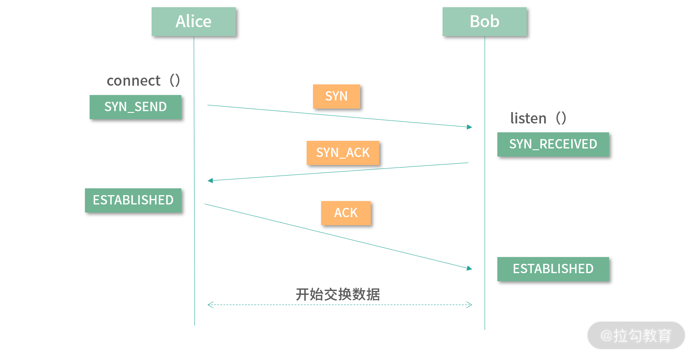
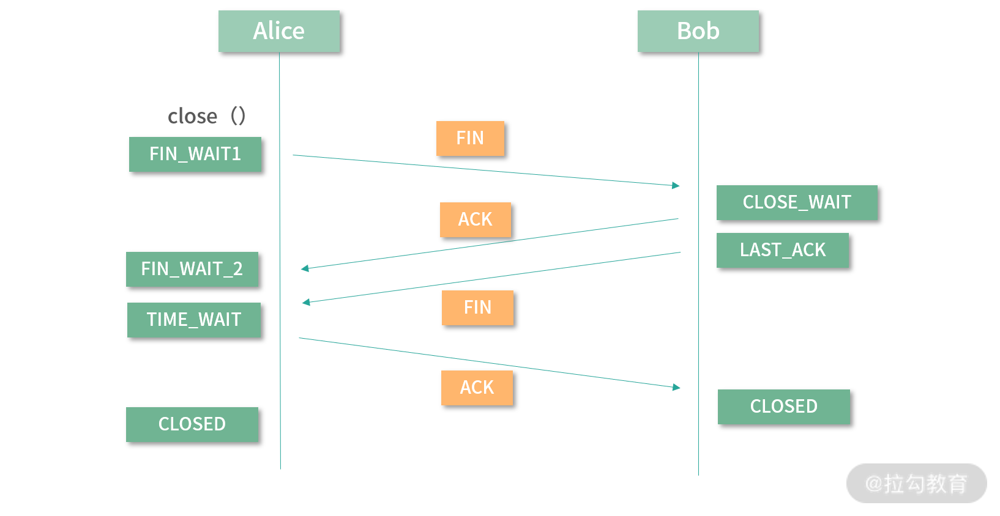

# 34 UDP 协议：UDP 和 TCP 相比快在哪里？

TCP 和 UDP 是目前使用最广泛的两个传输层协议，同时也是面试考察的重点内容。今天我会初步带你认识这两个协议，一起探寻它们之间最大的区别。

在开始本讲的重点内容前，我们先来说说 RFC 文档（Request For Comments，请求评论），互联网的很多基础建设都是以 RFC 的形式文档化，它给用户提供了阅读和学习的权限。在给大家准备《 **计算机网络** 》专栏的时候，我也经常查阅 RFC 文档。

如果你查阅 TCP 和 UDP 的 RFC 文档，会发现一件非常有趣的事情。TCP 协议的 RFC 很长，我足足读了好几天才把它们全部弄明白。UDP 的 RFC 非常短，只有短短的两页，一个小时就能读明白。这让我不禁感叹，如果能穿越到当时那个年代，我就去发明 UDP 协议，因为实在是太简单了。但即使是这个简单协议，也同样主宰着计算机网络协议的半壁江山。

那么这一讲我们就以 TCP 和 UDP 的区别为引，带你了解这两个在工作中使用频率极高、极为重要的传输层协议。

### 可靠性

首先我们比较一下这两个协议在 **可靠性（Reliablility）上的区别。如果一个网络协议是可靠的，那么它能够保证数据被无损** 地传送到目的地。当应用的设计者选择一个具有可靠性的协议时，通常意味着这个应用不能容忍数据在传输过程中被损坏。

如果你是初学者，可能会认为所有的应用都需要可靠性。其实不然，比如说一个视频直播服务。如果在传输过程当中，视频图像发生了一定的损坏，用户看到的只是某几个像素、颜色不准确了，或者某几帧视频丢失了——这对用户来说是可以容忍的。但在观看视频的时候，用户最怕的不是实时数据发生一定的损坏，而是吞吐量得不到保证。比如视频看到一半卡住了，要等很久，或者丢失了一大段视频数据，导致错过精彩的内容。

**TCP 协议，是一个支持可靠性的协议。UDP 协议，是一个不支持可靠性的协议** 。接下来我们讨论几个常见实现可靠性的手段。

#### 校验和（Checksum）

首先我们来说说 **校验和** 。 **这是一种非常常见的可靠性检查手段** 。

尽管 UDP 不支持可靠性，但是像校验和（Checksum）这一类最基本的数据校验，它还是支持的。 **不支持可靠性，并不意味着完全放弃可靠性。TCP 和 UDP 都支持最基本的校验和算法** 。

下面我为你举例 **一种最简单的校验和算法：纵向冗余检查** 。伪代码如下：

```plaintext
byte c = 0;
for(byte x in bytes) {
  c = c xor x;
}
```

`xor`是异或运算。上面的程序在计算字节数组 bytes 的校验和。`c`是最终的结果。你可以看到将所有`bytes`两两异或，最终的结果就是校验和。假设我们要传输 bytes，如果在传输过程中`bytes`发生了变化，校验和有 **很大概率** 也会跟着变化。当然也可能存在`bytes`发生变化，校验和没有变化的特例，不过校验和可以很大程度上帮助我们识别数据是否损坏了。


当要传输数据的时候，数据会被分片，我们把每个分片看作一个字节数组。然后在分片中，预留几个字节去存储校验和。校验和随着数据分片一起传输到目的地，目的地会用同样的算法再次计算校验和。如果二者校验和不一致，代表中途数据发生了损坏。 **对于 TCP 和 UDP，都实现了校验和算法，但二者的区别是，TCP 如果发现校验核对不上，也就是数据损坏，会主动丢失这个封包并且重发。而 UDP 什么都不会处理，UDP 把处理的权利交给使用它的程序员** 。

#### 请求/应答/连接模型

另一种保证可靠性的方法是 **请求响应和连接的模型** 。TCP 实现了请求、响应和连接的模型，UDP 没有实现这个模型。

在通信当中，我们可以把通信双方抽象成两个人用电话通信一样，需要先建立联系（保持连接）。发起会话的人是发送请求，对方需要应答（或者称为响应）。会话双方保持一个连接，直到双方说再见。

在 TCP 协议当中，任何一方向另一方发送信息，另一方都需要给予一个应答。如果发送方在一定的时间内没有获得应答，发送方就会认为自己的信息没有到达目的地，中途发生了损坏或者丢失等，因此发送方会选择重发这条消息。

这样一个模式也造成了 TCP 协议的三次握手和四次挥手，下面我们一起来具体分析一下。 **1. TCP 的三次握手** 在 TCP 协议当中。我们假设 Alice 和 Bob 是两个通信进程。当 Alice 想要和 Bob 建立连接的时候，Alice 需要发送一个请求建立连接的消息给 Bob。这种请求建立连接的消息在 TCP 协议中称为 **同步** （ **Synchronization， SYN** ）。而 Bob 收到 SYN，必须马上给 Alice 一个响应。这个响应在 TCP 协议当中称为 **响应** （ **Acknowledgement，ACK** ）。请你务必记住这两个单词。不仅是 TCP 在用，其他协议也会复用这样的概念，来描述相同的事情。

当 Alice 给 Bob SYN，Bob 给 Alice ACK，这个时候，对 Alice 而言，连接就建立成功了。但是 TCP 是一个双工协议。所谓双工协议，代表数据可以双向传送。虽然对 Alice 而言，连接建立成功了。但是对 Bob 而言，连接还没有建立。为什么这么说呢？你可以这样思考，如果这个时候，Bob 马上给 Alice 发送信息，信息可能先于 Bob 的 ACK 到达 Alice，但这个时候 Alice 还不知道连接建立成功。 所以解决的办法就是 Bob 再给 Alice 发一次 SYN ，Alice 再给 Bob 一个 ACK。以上就是 TCP 的三次握手内容。

你可能会问，这明明是 **四次握手，哪里是三次握手** 呢？这是因为，Bob 给 Alice 的 ACK ，可以和 Bob 向 Alice 发起的 SYN 合并，称为一条 SYN-ACK 消息。TCP 协议以此来减少握手的次数，减少数据的传输，于是 TCP 就变成了三次握手。下图中绿色标签状是 Alice 和 Bob 的状态，完整的 TCP 三次握手的过程如下图所示：

 **2. TCP 的四次挥手**

四次挥手（TCP 断开连接）的原理类似。中断连接的请求我们称为 Finish（用 FIN 表示）；和三次握手过程一样，需要分析成 4 步：

- 第 1 步是 Alice 发送 FIN
- 第 2 步是 Bob 给 ACK
- 第 3 步是 Bob 发送 FIN
- 第 4 步是 Alice 给 ACK

之所以是四次挥手，是因为第 2 步和 第 3 步在挥手的过程中不能合并为 FIN-ACK。原因是在挥手的过程中，Alice 和 Bob 都可能有未完成的工作。比如对 Bob 而言，可能还存在之前发给 Alice 但是还没有收到 ACK 的请求。因此，Bob 收到 Alice 的 FIN 后，就马上给 ACK。但是 Bob 会在自己准备妥当后，再发送 FIN 给 Alice。完整的过程如下图所示：



**3. 连接** 连接是一个虚拟概念，连接的目的是让连接的双方达成默契，倾尽资源，给对方最快的响应。经历了三次握手，Alice 和 Bob 之间就建立了连接。 **连接也是一个很好的编程模型。当连接不稳定的时候，可以中断连接后再重新连接。这种模式极大地增加了两个应用之间的数据传输的可靠性** 。

以上就是 TCP 中存在的，而 UDP 中没有的机制，你可以仔细琢磨琢磨。

#### 封包排序 **可靠性有一个最基本的要求是数据有序发出、无序传输，并且有序组合。TCP 协议保证了这种可靠性，UDP 则没有保证**

在传输之前，数据被拆分成分块。在 TCP 中叫作一个 **TCP Segment** 。在 UDP 中叫作一个 **UDP Datagram** 。Datagram 单词的含义是数据传输的最小单位。在到达目的地之后，尽管所有的数据分块可能是乱序到达的，但为了保证可靠性，乱序到达的数据又需要被重新排序，恢复到原有数据的顺序。 **在这个过程当中，TCP 利用了滑动窗口、快速重传等算法，保证了数据的顺序。而 UDP，仅仅是为每个 Datagram 标注了序号，并没有帮助应用程序进行数据的排序** ， **这也是 TCP 和 UDP 在保证可靠性上一个非常重要的区别。** ### 使用场景

上面的内容中，我们比较了 TCP 和 UDP 在可靠性上的区别，接下来我们看看两个协议的使用场景。 **我们先来看一道面试题：如果客户端和服务器之间的单程平均延迟是 30 毫秒，那么客户端 Ping 服务端需要多少毫秒** ？

【 **分析** 】这个问题最核心的点是需要思考 Ping 服务应该由 TCP 实现还是 UDP 实现？请你思考：Ping 需不需要保持连接呢？答案是不需要，Ping 服务器的时候把数据发送过去即可，并不需要特地建立一个连接。

请你再思考，Ping 需不需要保证可靠性呢？答案依然是不需要，如果发生了丢包， Ping 将丢包计入丢包率即可。所以从这个角度来看，Ping 使用 UDP 即可。

所以这道面试题应该是 Round Trip 最快需要在 60 毫秒左右。一个来回的时间，我们也通常称为 Round Trip 时间。

通过分析上面的例子，我想告诉你，TCP 和 UDP 的使用场景是不同的。 **TCP 适用于需要可靠性，需要连接的场景** 。UDP 因为足够简单，只对数据进行简单加工处理，就调用底层的网络层（IP 协议）传输数据去了。 **因此 UDP 更适合对可靠性要求不高的场景** 。

另外很多需要定制化的场景，非常需要 UDP。以 HTTP 协议为例，在早期的 HTTP 协议的设计当中就选择了 TCP 协议。因为在 HTTP 的设计当中，请求和返回都是需要可靠性的。但是随着 HTTP 协议的发展，到了 HTTP 3.0 的时候，就开始基于 UDP 进行传输。这是因为，在 HTTP 3.0 协议当中，在 UDP 之上有另一个QUIC 协议在负责可靠性。UDP 足够简单，在其上构建自己的协议就很方便。 **你可以再思考一个问题：文件上传应该用 TCP 还是 UDP 呢** ？乍一看肯定是 TCP 协议，因为文件上传当然需要可靠性，防止数据损坏。但是如果你愿意在 UDP 上去实现一套专门上传文件的可靠性协议，性能是可以超越 TCP 协议的。因为你只需要解决文件上传一种需求，不用像 TCP 协议那样解决通用需求。

所以时至今日，到底什么情况应该用 TCP，什么情况用 UDP？这个问题边界的确在模糊化。 **总体来说，需要可靠性，且不希望花太多心思在网络协议的研发上，就使用 TCP 协议** 。

### 总结

最后我们再来总结一下，大而全的协议用起来舒服，比如 TCP；灵活的协议方便定制和扩展，比如 UDP。二者不分伯仲，各有千秋。

这一讲我们深入比较了 TCP 和 UDP 的可靠性及它们的使用场景。关于原理部分，比如具体 TCP 的滑动窗口算法、数据的切割算法、数据重传算法；TCP、UDP 的封包内部究竟有哪些字段，格式如何等。如果你感兴趣，可以来学习我将在拉勾教育推出的《 **计算机网络** 》专栏。 **那么通过这一讲的学习，你现在可以尝试来回答本讲关联的面试题目：UDP 比 TCP 快在哪里** ？

【 **解析** 】使用 UDP 传输数据，不用建立连接，数据直接丢过去即可。至于接收方，有没有在监听？会不会接收？那就是接收方的事情了。UDP 甚至不考虑数据的可靠性。至于发送双方会不会基于 UDP 再去定制研发可靠性协议，那就是开发者的事情了。所以 UDP 快在哪里？UDP 快在它足够简单。因为足够简单，所以 UDP 对计算性能、对网络占用都是比 TCP 少的。
