# 09 树和二叉树：分支关系与层次结构下，如何有效实现增删查？

前面课时我们学习了线性表、栈、队列和数组。栈、队列都是特殊的线性表，数组可以看成是线性表的一种推广。根据学习，我们知道了这几种数据结构，在对数据的增删查操作上各有千秋。这一课时再来学习另一种从形式上看上去差异比较大的数据结构，树，以及如何用树和二叉树实现对数据的增删查的操作。

### 树是什么

树是由结点和边组成的，不存在环的一种数据结构。通过下图，我们就可以更直观的认识树的结构。

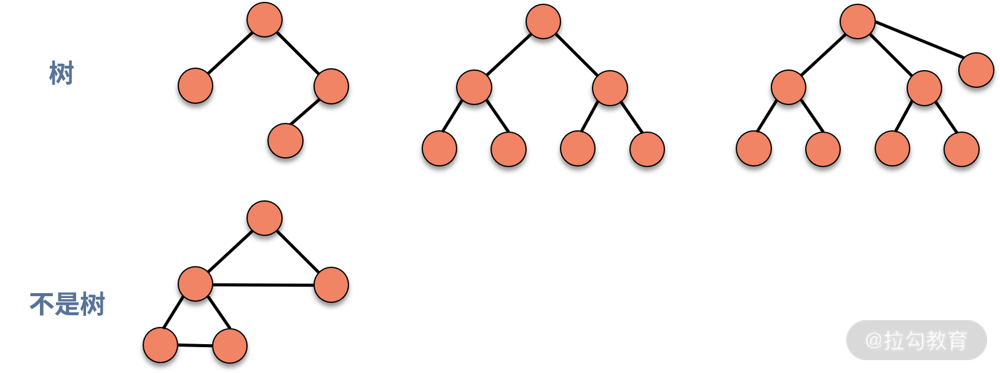

树满足递归定义的特性。也就是说，如果一个数据结构是树结构，那么剔除掉根结点后，得到的若干个子结构也是树，通常称作子树。

在一棵树中，根据结点之间层次关系的不同，对结点的称呼也有所不同。我们来看下面这棵树，如下图所示:

- A 结点是 B 结点和 C 结点的上级，则 A 就是 B 和 C 的父结点，B 和 C 是 A 的子结点。
- B 和 C 同时是 A 的“孩子”，则可以称 B 和 C 互为兄弟结点。
- A 没有父结点，则可以称 A 为根结点。
- G、H、I、F 结点都没有子结点，则称 G、H、I、F 为叶子结点。

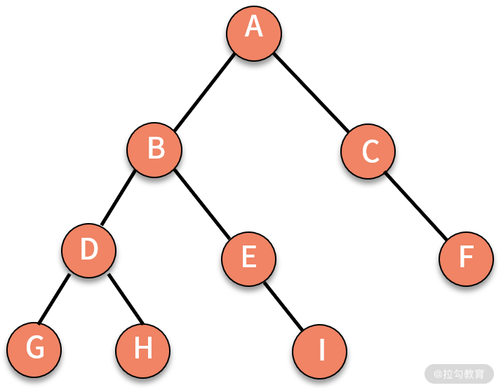

当有了一棵树之后，还需要用深度、层来描述这棵树中结点的位置。结点的层次从根结点算起，根为第一层，根的“孩子”为第二层，根的“孩子”的“孩子”为第三层，依此类推。树中结点的最大层次数，就是这棵树的树深（称为深度，也称为高度）。如下图所示，就是一棵深度为 4 的树。

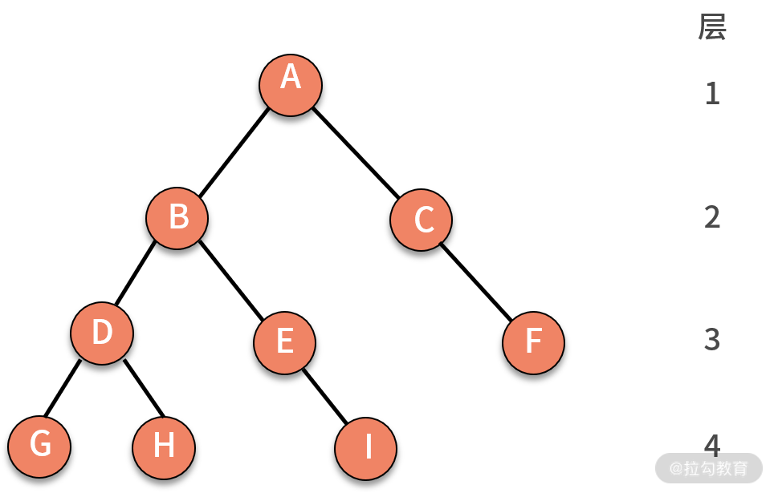

### 二叉树是什么

在树的大家族中，有一种被高频使用的特殊树，它就是二叉树。在二叉树中，每个结点最多有两个分支，即每个结点最多有两个子结点，分别称作左子结点和右子结点。

在二叉树中，有下面两个特殊的类型，如下图所示：

- 满二叉树，定义为除了叶子结点外，所有结点都有 2 个子结点。
- 完全二叉树，定义为除了最后一层以外，其他层的结点个数都达到最大，并且最后一层的叶子结点都靠左排列。


你可能会困惑，完全二叉树看上去并不完全，但为什么这样称呼它呢？这其实和二叉树的存储有关系。存储二叉树有两种办法，一种是基于指针的链式存储法，另一种是基于数组的顺序存储法。

- 链式存储法，也就是像链表一样，每个结点有三个字段，一个存储数据，另外两个分别存放指向左右子结点的指针，如下图所示：

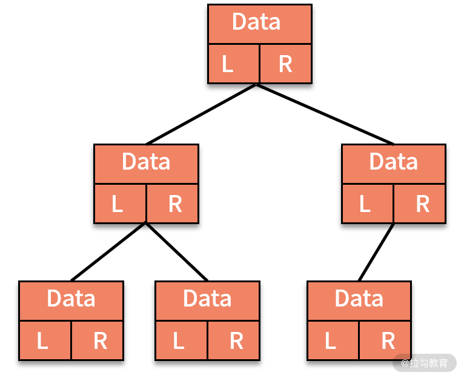

- 顺序存储法，就是按照规律把结点存放在数组里，如下图所示，为了方便计算，我们会约定把根结点放在下标为 1 的位置。随后，B 结点存放在下标为 2 的位置，C 结点存放在下标为 3 的位置，依次类推。

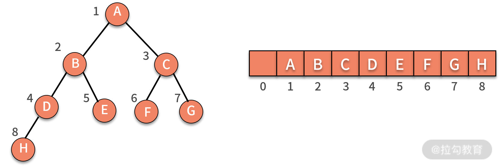

根据这种存储方法，我们可以发现如果结点 X 的下标为 i，那么 X 的左子结点总是存放在 2 *i 的位置，X 的右子结点总是存放在 2* i + 1 的位置。

之所以称为完全二叉树，是从存储空间利用效率的视角来看的。对于一棵完全二叉树而言，仅仅浪费了下标为 0 的存储位置。而如果是一棵非完全二叉树，则会浪费大量的存储空间。

我们来看如下图所示的非完全二叉树，它既需要保留出 5 和 6 的位置。同时，还需要保留 5 的两个子结点 10 和 11 的位置，以及 6 的两个子结点 12 和 13 的位置。这样的二叉树，没有完全利用好数组的存储空间。

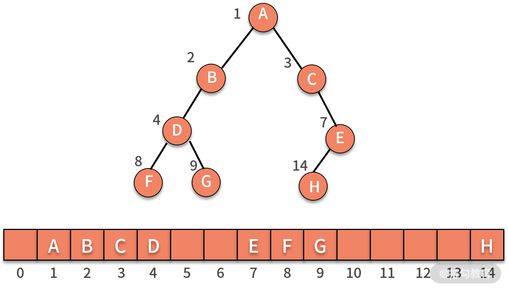

### 树的基本操作

接下来，我们以二叉树为例介绍树的操作，其他类型的树的操作与二叉树基本相似。

可以发现，我们以前学到的数据结构都是“一对一”的关系，即前面的数据只跟下面的一个数据产生了连接关系，例如链表、栈、队列等。而树结构则是“一对多”的关系，即前面的父结点，跟下面若干个子结点产生了连接关系。

在前面的课时中我们提到过，要在数据结构中，查找具有某个数值特性的数据需要遍历每一条数据。这在“一对一”的结构中，直接按顺序访问就好了。可是，树是“一对多”的关系，那么我们该如何进行数据的遍历，才能保证每条数据都会被访问一次且没有遗漏呢？我们只有解决了遍历问题，才能通过树来进行数据的增删查操作。

其实，遍历一棵树，有非常经典的三种方法，分别是前序遍历、中序遍历、后序遍历。这里的序指的是父结点的遍历顺序，前序就是先遍历父结点，中序就是中间遍历父结点，后序就是最后遍历父结点。不管哪种遍历，都是通过递归调用完成的。如下图所示：

- 前序遍历，对树中的任意结点来说，先打印这个结点，然后前序遍历它的左子树，最后前序遍历它的右子树。
- 中序遍历，对树中的任意结点来说，先中序遍历它的左子树，然后打印这个结点，最后中序遍历它的右子树。
- 后序遍历，对树中的任意结点来说，先后序遍历它的左子树，然后后序遍历它的右子树，最后打印它本身。


通过前面的介绍，相信你已经了解了二叉树的三种遍历方式，下面我们再来分析一下代码的实现过程，如下所示：

```java
// 先序遍历
public static void preOrderTraverse(Node node) {
    if (node == null)
        return;
    System.out.print(node.data + " ");
    preOrderTraverse(node.left);
    preOrderTraverse(node.right);
}
// 中序遍历
public static void inOrderTraverse(Node node) {
    if (node == null)
        return;
    inOrderTraverse(node.left);
    System.out.print(node.data + " ");
    inOrderTraverse(node.right);
}
// 后序遍历
public static void postOrderTraverse(Node node) {
    if (node == null)
        return;
    postOrderTraverse(node.left);
    postOrderTraverse(node.right);
    System.out.print(node.data + " ");
}
```

不难发现，二叉树遍历过程中，每个结点都被访问了一次，其时间复杂度是 O(n)。接着，在找到位置后，执行增加和删除数据的操作时，我们只需要通过指针建立连接关系就可以了。对于没有任何特殊性质的二叉树而言，抛开遍历的时间复杂度以外，真正执行增加和删除操作的时间复杂度是 O(1)。树数据的查找操作和链表一样，都需要遍历每一个数据去判断，所以时间复杂度是 O(n)。

我们上面讲到二叉树的增删查操作很普通，时间复杂度与链表并没有太多差别。但当二叉树具备一些特性的时候，则可以利用这些特性实现时间复杂度的降低。接下来，我们详细介绍二叉查找树的特性。

#### 二叉查找树的特性

二叉查找树（也称作二叉搜索树）具备以下几个的特性：

- 在二叉查找树中的任意一个结点，其左子树中的每个结点的值，都要小于这个结点的值。
- 在二叉查找树中的任意一个结点，其右子树中每个结点的值，都要大于这个结点的值。
- 在二叉查找树中，会尽可能规避两个结点数值相等的情况。
- 对二叉查找树进行中序遍历，就可以输出一个从小到大的有序数据队列。如下图所示，中序遍历的结果就是 10、13、15、16、20、21、22、26。

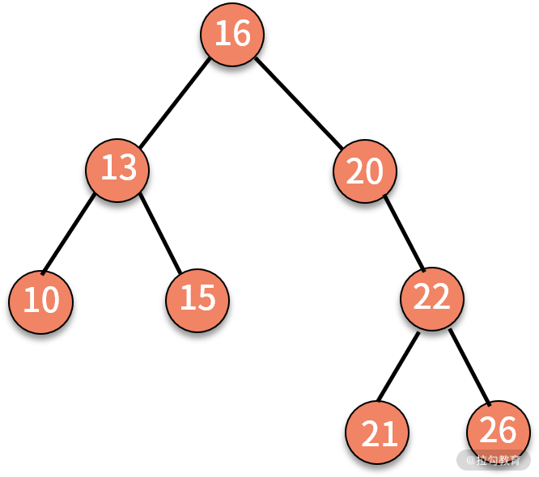

#### 二叉查找树的查找操作

在利用二叉查找树执行查找操作时，我们可以进行以下判断：

- 首先判断根结点是否等于要查找的数据，如果是就返回。
- 如果根结点大于要查找的数据，就在左子树中递归执行查找动作，直到叶子结点。
- 如果根结点小于要查找的数据，就在右子树中递归执行查找动作，直到叶子结点。

这样的“二分查找”所消耗的时间复杂度就可以降低为 O(logn)。关于二分查找，我们会在后续的分治法一讲中详细讲述。

#### 二叉查找树的插入操作

在二叉查找树执行插入操作也很简单。从根结点开始，如果要插入的数据比根结点的数据大，且根结点的右子结点不为空，则在根结点的右子树中继续尝试执行插入操作。直到找到为空的子结点执行插入动作。

如下图所示，如果要插入数据 X 的值为 14，则需要判断 X 与根结点的大小关系：

- 由于 14 小于 16，则聚焦在其左子树，继续判断 X 与 13 的关系。
- 由于 14 大于 13，则聚焦在其右子树，继续判断 X 与15 的关系。
- 由于 14 小于 15，则聚焦在其左子树。

因为此时左子树为空，则直接通过指针建立 15 结点的左指针指向结点 X 的关系，就完成了插入动作。

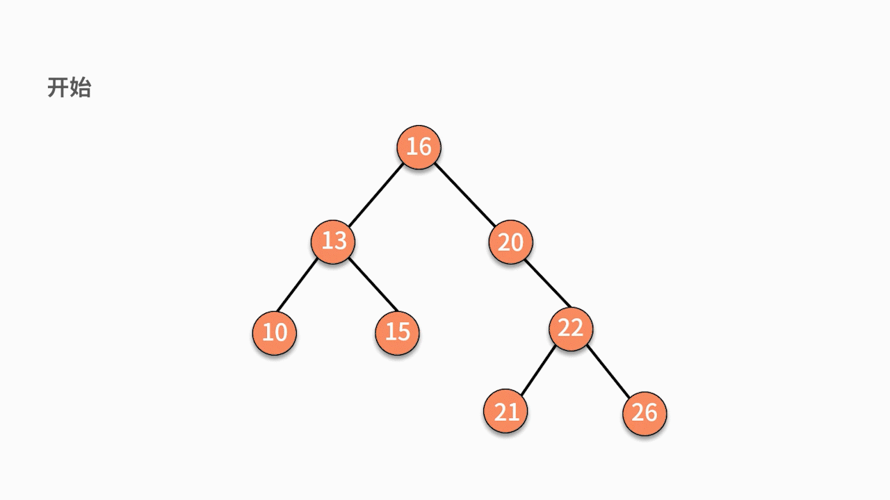

二叉查找树插入数据的时间复杂度是 O(logn)。但这并不意味着它比普通二叉树要复杂。原因在于这里的时间复杂度更多是消耗在了遍历数据去找到查找位置上，真正执行插入动作的时间复杂度仍然是 O(1)。

二叉查找树的删除操作会比较复杂，这是因为删除完某个结点后的树，仍然要满足二叉查找树的性质。我们分为下面三种情况讨论。

- 情况一，如果要删除的结点是某个叶子结点，则直接删除，将其父结点指针指向 null 即可。

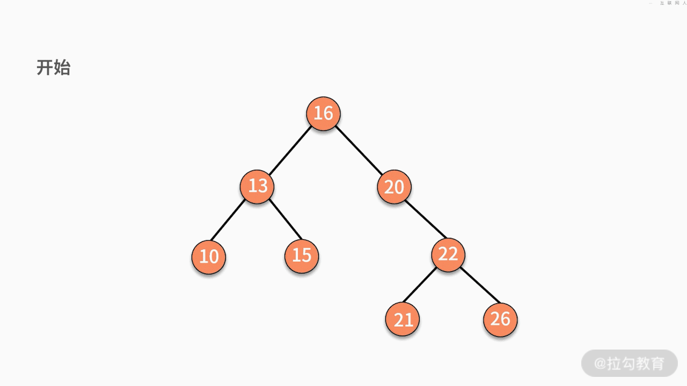

- 情况二，如果要删除的结点只有一个子结点，只需要将其父结点指向的子结点的指针换成其子结点的指针即可。


- 情况三，如果要删除的结点有两个子结点，则有两种可行的操作方式。

第一种，找到这个结点的左子树中最大的结点，替换要删除的结点。


第二种，找到这个结点的右子树中最小的结点，替换要删除的结点。

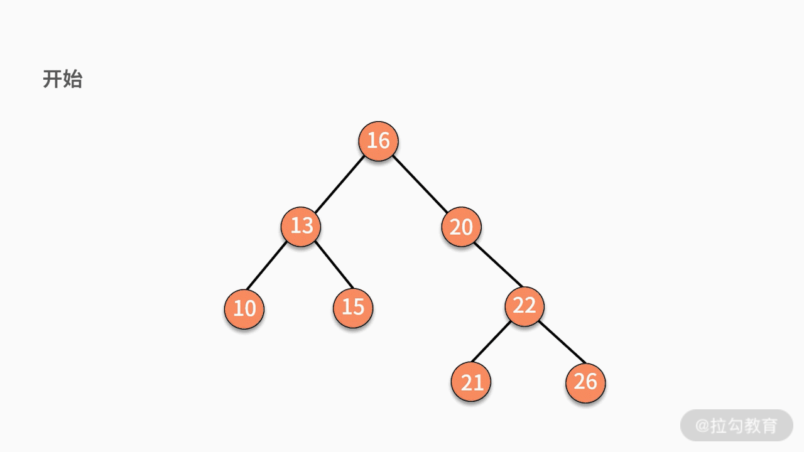

**树的案例**  **我们来看一道例题:**

输入一个字符串，判断它在已有的字符串集合中是否出现过?（假设集合中没有某个字符串与另一个字符串拥有共同前缀且完全包含的特殊情况，例如 deep 和 dee。）如，已有字符串集合包含 6 个字符串分别为，cat, car, city, dog,door, deep。输入 cat，输出 true；输入 home，输出 false。

我们假设采用最暴力的办法，估算一下时间复杂度。假设字符串集合包含了 n 个字符串，其中的字符串平均长度为 m。那么新来的一个字符串，需要与每个字符串的每个字符进行匹配。则时间复杂度为 O(nm)。

但在 nm 的复杂度中，显然存在很多的无效匹配。例如，输入 home 时，6 个字符串都没有 h 开头的，则不需要进行后续的匹配。因此，如果可以通过对字符前缀进行处理，就可以最大限度地减少无谓的字符串比较，从而提高查询效率。这就是“用空间换时间”的思想，再利用共同前缀来提高查询效率。

其实，这个问题利用树结构也可以完成。我们对字符串建立一个的树结构，如下图所示，它将字符串集合的前缀进行合并，每个根结点到叶子结点的链条就是一个字符串。

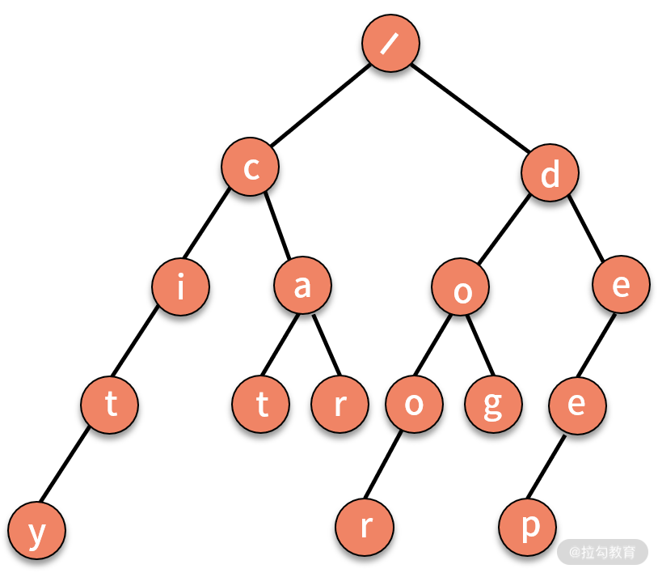

这个树结构也称作 Trie 树，或字典树。它具有三个特点：

- 第一，根结点不包含字符；
- 第二，除根结点外每一个结点都只包含一个字符；
- 第三，从根结点到某一叶子结点，路径上经过的字符连接起来，即为集合中的某个字符串。

这个问题的解法可以拆解为以下两个步骤：

- 第一步，根据候选字符串集合，建立字典树。这需要使用数据插入的动作。
- 第二步，对于一个输入字符串，判断它能否在这个树结构中走到叶子结点。如果能，则出现过。

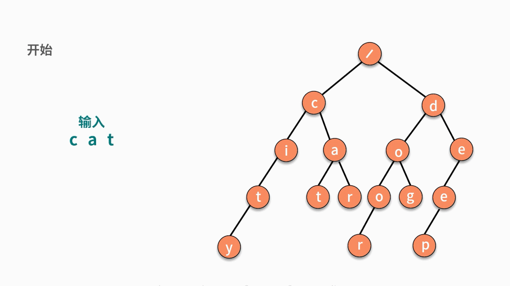

### 总结

本课时的内容围绕着不同种类树的原理、二叉树对于数据的增删查操作展开。要想利用二叉树实现增删查操作，你需要熟练掌握二叉树的三种遍历方式。遍历的时间复杂度是 O(n)。有了遍历方式之后，你可以完成在指定位置的数据增删操作。增删操作的时间复杂度都是 O(1)。

对于查找操作，如果是普通二叉树，则查找的时间复杂度和遍历一样，都是 O(n)。如果是二叉查找树，则可以在 O(logn) 的时间复杂度内完成查找动作。树结构在存在“一对多”的数据关系中，可被高频使用，这也是它区别于链表系列数据结构的关键点。

### 练习题

关于树结构，我们留一道习题。给定一棵树，按照层次顺序遍历并打印这棵树。例如:


则打印 16、13、20、10、15、22、21、26。请注意，这并不是前序遍历。

练习题代码如下：

```java
public static void levelTraverse(Node root) {
    if (root == null) {
        return;
    }
    LinkedList<Node> queue = new LinkedList<Node>();
    Node current = null;
    queue.offer(root); // 根节点入队
    while (!queue.isEmpty()) { // 只要队列中有元素，就可以一直执行，非常巧妙地利用了队列的特性
        current = queue.poll(); // 出队队头元素
        System.out.print("-->" + current.data);
        // 左子树不为空，入队
        if (current.leftChild != null)
            queue.offer(current.leftChild);
        // 右子树不为空，入队
        if (current.rightChild != null)
            queue.offer(current.rightChild);
    }
}
```

