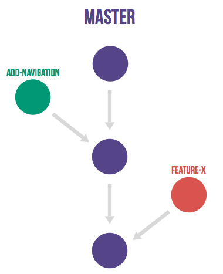
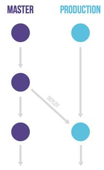
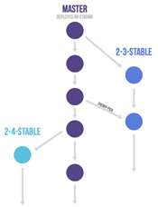

# 04 一切的源头，代码分支策略的选择

记得大概是一年前吧，我与好友老吴喝茶聊天时，讨论到：高效的持续交付体系，必定需要一个合适的代码分支策略。

我告诉老吴：“采用不同的代码分支策略，意味着实施不同的代码集成与上线流程，这会影响整个研发团队每日的协作方式，因此研发团队通常会很认真地选择自己的策略。”

老吴是一名有多年开发经验的资深架构师，当时正好要接手一个框架团队，从个人贡献者向团队管理者转型。他个人对代码管理工具可谓熟之又熟，甚至连“老古董”的 CVS 都可以跟你聊半天。但他在为团队制定代码分支管理策略时，还是慎之又慎，足见其重要性。

最后我们发现，要确定选用哪种代码分支管理策略，需要先假设几个问题，这几个问题有了答案，也就代表你找到了适合的方向。

你需要思考的几个问题如下：

1. Google 和 Facebook 这两个互联网大咖都在用主干开发（Trunk Based Development，简称 TBD），我们是不是也参照它俩，采用主干开发分支策略？
1. 用 Google 搜索一下，会发现有个排名很靠前的分支策略，叫“A successful Git branching model”（简称 Git Flow），它真的好用吗？团队可以直接套用吗？
1. GitHub 和 GitLab 这两个当下最流行的代码管理平台，各自推出了 GitHub Flow 和 GitLab Flow，它们有什么区别？适合我使用吗？
1. 像阿里、携程和美团点评这样国内知名的互联网公司，都在用什么样的分支策略？

今天，我想再沿着当时的思考路径，和你一起回顾和总结一下，希望能够带你全面了解代码分支策略，帮助你做出合适的选择。

## 谈谈主干开发（TBD）

**主干开发是一个源代码控制的分支模型，开发者在一个称为 “trunk” 的分支（Git 称 master） 中对代码进行协作，除了发布分支外没有其他开发分支。** Google 和 Facebook 都是采用“主干开发”的方式，代码一般直接提交到主干的头部，这样可以保证所有用户看到的都是同一份代码的最新版本。**“主干开发”确实避免了合并分支时的麻烦，因此像 Google 这样的公司一般就不采用分支开发，分支只用来发布。** 大多数时候，发布分支是主干某个时点的快照。以后的改 Bug 和功能增强，都是提交到主干，必要时 cherry-pick （选择部分变更集合并到其他分支）到发布分支。与主干长期并行的特性分支极为少见。

由于不采用“特性分支开发”，所有提交的代码都被集成到了主干，为了保证主干上线后的有效性，一般会使用特性切换（feature toggle）。特性切换就像一个开关可以在运行期间隐藏、启用或禁用特定功能，项目团队可以借助这种方式加速开发过程。

特性切换在大型项目持续交付中变得越来越重要，因为它有助于将部署从发布中解耦出来。但据吉姆 · 伯德（Jim Bird）介绍，特性切换会导致代码更脆弱、更难测试、更难理解和维护、更难提供技术支持，而且更不安全。

他的主要论据是，将未经测试的代码引入生产环境是一个糟糕的主意，它们引发的问题可能会在无意间暴露出来。另外，越来越多的特性切换会使得逻辑越来越混乱。**特性切换需要健壮的工程过程、可靠的技术设计和成熟的特性切换生命周期管理**，如果不具备这三个关键的条件，使用特性切换反而会降低生产力。

根据上面的分析，主干开发的分支策略虽然有利于开展持续交付，但是它对开发团队的能力要求也更高。

主干开发的优缺点如表 1 所示。

优点

缺点

1. 频繁集成，每次集成冲突少，集成效率高。 2. 能享受持续交付带来所有的好处。 3. 无需在分支之间做切换。
1. 太多的团队成员同时工作在主干上，到发布的时候就可能出现“一粒老鼠屎坏了一锅粥”这样的灾难。 2. 要借助特性切换等机制来保证线上运行的正确性，这会引入新的问题。

表 1 主干开发的优缺点

## 谈谈特性分支开发

和主干开发相对的是 “特性分支开发” 。在这个大类里面，我会给你分析 Git Flow、GitHub Flow 和 GitLab Flow 这三个常用的模型。

### 第一，Git Flow

我们在 Google 上查关键词“branch model”（也就是“分支模型”），有一篇排名比较靠前的文章“A successful Git branching model”，它介绍了 Git Flow 模型。

Git 刚出来的那些年，可参考的模型不多，所以 Git Flow 模型在 2011 年左右被大家当作了推荐的分支模型，至今也还有项目团队在使用。然而，Git Flow 烦琐的流程也被许多研发团队吐槽，大家普遍认为 hotfix 和 release 分支显得多余，平时都不会去用。

图 1 Git Flow 示意图

### 第二，GitHub Flow

GitHub Flow 是 GitHub 所使用的一种简单流程。该流程只使用 master 和特性分支，并借助 GitHub 的 pull request 功能。

图 2 GitHub Flow 示意图 **在 GitHub Flow 中，master 分支中包含稳定的代码，它已经或即将被部署到生产环境。任何开发人员都不允许把未测试或未审查的代码直接提交到 master 分支。对代码的任何修改，包括 Bug 修复、热修复、新功能开发等都在单独的分支中进行。不管是一行代码的小改动，还是需要几个星期开发的新功能，都采用同样的方式来管理。**

当需要修改时，从 master 分支创建一个新的分支，所有相关的代码修改都在新分支中进行。开发人员可以自由地提交代码和提交到远程仓库。

当新分支中的代码全部完成之后，通过 GitHub 提交一个新的 pull request。团队中的其他人员会对代码进行审查，提出相关的修改意见。由持续集成服务器（如 Jenkins）对新分支进行自动化测试。当代码通过自动化测试和代码审查之后，该分支的代码被合并到 master 分支。再从 master 分支部署到生产环境。

GitHub Flow 的好处在于非常简单实用，开发人员需要注意的事项非常少，很容易形成习惯。当需要修改时，只要从 master 分支创建新分支，完成之后通过 pull request 和相关的代码审查，合并回 master 分支就可以了。

### 第三，GitLab Flow

上面提到的 GitHub Flow，适用于特性分支合入 master 后就能马上部署到线上的这类项目，但并不是所有团队都使用 GitHub 或使用 pull request 功能，而是使用开源平台 GitLab，特别是对于公司级别而言，代码作为资产，不会随意维护在较公开的 GitHub 上（除非采用企业版）。

GitLab Flow 针对不同的发布场景，在 GitHub Flow（特性分支加 master 分支）的基础上做了改良，额外衍生出了三个子类模型，如表 2 所示。

分支模型

说明

图示

带生产分支

1. 无法控制准确的发布时间，但又要求不停集成的。
1. 需要创建一个 production 分支来放置发布的代码。

图 3

带环境分支

1. 要求所有代码都在逐个环境中测试通过。
1. 需要为不同的环境建立不同的分支。

图 4

带发布分支

1. 用于对外界发布软件的项目，同时需要维护多个发布版本。
1. 尽可能晚地从 master 拉取发布分支。
1. Bug 的修改应先合并到 master，然后 cherry pick 到 release 分支 。

图 5

表 2 GitLab Flow 的三个分支

图 3 带生产分支的 GitLab Flow

图 4 带环境分支的 GitLab Flow

图 5 带发布分支的 GitLab Flow

GitLab Flow 的特性分支合入 master 用的是“Merge Request”，功能与 GitHub Flow 的“pull request”相同，这里不再赘述。

通过 Git Flow、GitHub Flow 和 GitLab Flow（3 个衍生类别） 这几个具体模型的介绍，我给你总结一下特性分支开发的优缺点。如表 3 所示。

优点

缺点

1. 不同功能可以在独立的分支上做开发，消除了功能稳定前彼此干扰的问题。 2. 容易保证主干分支的质量：只要不把没开发好的特性分支合入主干分支，那么主干分支就不会带上有问题的功能。

1. 如果不及时做 merge，那么把特性分支合到主干分支会比较麻烦。 2. 如果要做 CI/CD，需要对不同分支配备不同的构建环境。

表 3 特性分支开发的优缺点

## 选出最适合的分支策略

上面我跟你讲到的分支模型，都是 IT 研发领域比较流行的。虽然有些策略带上了代码平台的标识，如 GitHub Flow，但并不意味着该策略仅限于 GitHub 代码平台使用，你完全可以在自己搭建的代码平台上使用这些策略。

接下来，我就总体归纳一下什么情况下应该选择什么样的分支策略。如表 4 所示。

序号

情况

适合的分支策略

1

开发团队系统设计和开发能力强。 有一套有效的特性切换的实施机制，保证上线后无需修改代码就能够修改系统行为。 需要快速迭代，想获得 CI/CD 所有好处。

主干开发

2

不具备主干开发能力。 有预定的发布周期。 需要执行严格的发布流程。

Git Flow

3

不具备主干开发能力。 随时集成随时发布：分支集成后经过代码评审和自动化测试，就可以立即发布的应用。

GitHub Flow

4

不具备主干开发能力。 无法控制准确的发布时间，但又要求不停集成。

GitLab Flow（带生产分支）

5

不具备主干开发能力。 需要逐个通过各个测试环境验证。

GitLab Flow（带环境分支）

6

不具备主干开发能力。 需要对外发布和维护不同版本。

GitLab Flow（带发布分支）

表 4 不同情况适用的代码分支策略

## 国内互联网公司的选择

GitLab 作为最优秀的开源代码平台，被多数互联网大公司（包括阿里、携程和美团点评等）所使用，这些大厂也都采用特性分支开发策略。当然，这些大公司在长期持续交付实践中，会结合各自公司的情况做个性化的定制。

比如，携程公司在 GitHub Flow 的基础上，通过自行研发的集成加速器（Light Merge）和持续交付 Paas 平台，一起完成集成和发布。

再比如，阿里的 AoneFlow，采用的是主干分支、特性分支和发布分支三种分支类型，再加上自行研发的 Aone 协同平台，实现持续交付。

## 总结

今天，我主要给你介绍了各种代码分支策略的特性。

你应该已经比较清晰地理解了“主干开发”和“特性分支开发”两种策略的各自特性：

1. “主干开发”集成效率高，冲突少，但对团队个人的开发能力有较高要求；
1. “特性分支开发”有利于并行开发，需要一定的流程保证，能保证主干代码质量。

相信在没有绝对自信能力的情况下，面对绝大多数的场景，企业还是会选择“特性分支开发”的策略。所以，我给你介绍了几种主流的特性分支方法，并对比了各类策略的优劣，以及它们适用的场景。

接下来，你就可以根据自己所在项目的具体情况，参考今天的内容，裁剪出最适合自己团队的分支策略了。

## 思考题

1. 开源性质的项目，为什么不适合用主干开发的分支策略？
1. 如果你所在的团队只有 5 人，而且迭代周期为 1 周，你会采用什么样的分支策略？
