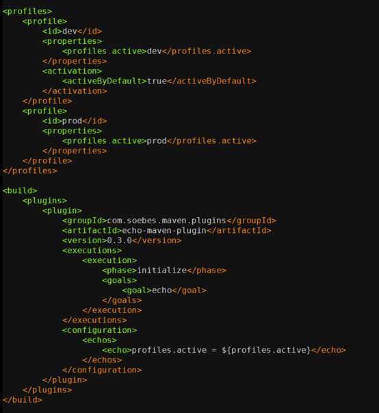
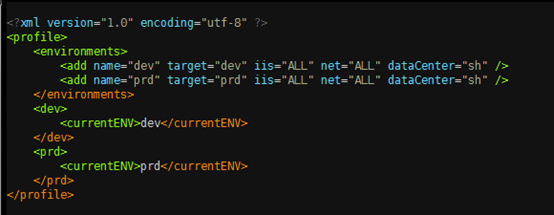
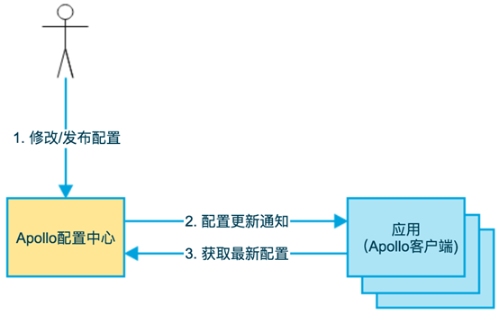

# 11 “配置”是把双刃剑，带你了解各种配置方法

很多人分不清配置和配置管理，但其实它们是完全不同的概念。

**配置管理：** 是通过技术或行政手段对软件产品及其开发过程和生命周期进行控制、规范的一系列措施。 它的目标是记录软件产品的演化过程，确保软件开发者在软件生命周期的各个阶段都能得到精确的产品配置信息。**配置：** 是指独立于程序之外，但又对程序产生作用的可配变量。也就是说，同一份代码在不同的配置下，会产生不同的运行结果。

从上面的定义中，你可以看到配置和配置管理有着本质上的不同：配置管理服务于软件研发过程，而配置则服务于程序本身。

作为一名程序员，开发时经常要面对不同的运行环境：开发环境、测试环境、生产环境、内网环境、外网环境等等。不同的环境，相关的配置一般不一样，比如数据源配置、日志文件配置，以及一些软件运行过程中的基本配置等。

另外，你也会遇到一些业务上的，以及逻辑上的配置。比如，针对不同地域采取不同的计费逻辑，计费逻辑又要根据这些地域的需要随时调整。**如果我们把这些信息都硬编码在代码里，结果就是：每次发布因为环境不同，或者业务逻辑的调整，都要修改代码。而代码一旦被修改，就需要完整的测试，那么变更的代价将是巨大的。** 因此，我们往往会通过“配置”来解决这些问题。

但是，“配置”本身也很讲究。在什么阶段进行配置，采用什么手段进行配置，都将直接影响持续交付的效果。

那么，接下来我就跟你详细聊聊各种配置方法。

## 构建时配置

以 Maven 为例，实现多环境的构建可移植性需要使用 profile。profile 是一组可选的配置，可以用来设置或者覆盖配置默认值。通过不同的环境激活不同的 profile，可以实现构建的可移植性。 我们可以看一个简单使用示例：



这段代码定义了 dev 和 prod 两个 profile（没有定义任何其他配置，实际使用中可按需定义任何配置），并且使用了 echo 插件验证 profile 是否生效，通过运行。

```bash
maven initialize –Pdev
```

或

```bash
maven initialize –Pprod
```

然后，可以看到输出：

```yml
[INFO] profiles.active = dev
```

或

```yml
[INFO] profiles.active = prod
```

其中， dev 是默认激活的，也就是说如果不填写任何 –P 参数，或者 –P 参数不为 dev 或者 prod，都会使用 dev 作为默认的 profile。

这样在代码构建时，你就可以根据具体需要选择对应的 profile 了。

这个方案看起来很简单， 但也有两个缺点：

1. 它依赖于某个特定的构建工具，而且使用方法不统一。 什么意思呢？如果你不使用 Maven 作为构建工具，这个配置功能就失效了；而且对于跨平台、跨语言栈的支持也不友好。
1. 每次都要重新编译，浪费计算资源。 即使你只是替换一些配置文件，并没有改动任何代码，但为了让配置生效，还是需要完成代码的整个构建过程，这就会在编译上花费大量的计算资源。

因此，为了解决这两个问题，通常会把“打包”这个过程拆解出来，并将它插入构建之后，接下来我就介绍一下“打包时配置”。

## 打包时配置

“打包”，是我在多年持续交付实践中总结出的一个非常重要的概念。我把打包过程与构建过程脱离，也就是说构建成功后，并不立即打包。而是把打包安排在发布之前，打包完成之后立即发布，打包就与发布过程形成了一个整体。

为什么要独立分离出打包这个步骤呢？你可能会问，Maven 在构建过程中不是已经完成了 package 步骤吗？

正因为构建时配置，需要针对多个 profile 编译多次，而持续交付有一个核心概念，即： **一次构建多次部署** 。打包就是为了解决这个问题而被发明的。**打包时配置的基本思想是：构建时完全不清楚程序所要部署的环境，因此只完成最基本的默认配置；而发布时清晰地知晓环境信息，因此可根据环境信息，进行相关配置的替换。** 在携程，我们开发了一个叫作 ConfigGen 的工具，用以替换配置文件。 这样，你就不需要每次更改配置时，都重新编译整个代码，大幅缩短了整个发布流程的时间， 而且 ConfigGen 完全基于 XML，适用于任何语言。

ConfigGen 的使用也很简单，只要一个 ConfigProfile.xml 文件即可，dev 和 prd 指两个入参，根据这两个入参分别定义了 currentENV 的具体值，如下图所示。



其中，currentENV 节点便是该环境下的变量，然后在项目下面创建一些 TPL 文件，该文件就是最终生成的配置文件的模板，其中的占位符将根据之前 xml 中配置的值进行替换。比如，Web.config.tpl，如下图所示。


运行 ConfigGen 后，会在当前项目下生成一个 \_\_ConfigTemp 目录，该目录下包含 dev 和 prd 两个目录，如下图所示。


所得到的 dev/Web.config 文件就是 Web.config.tpl 生成的最终配置文件。


从图中可以看出，Web.config 已经正确替换了 currentENV 变量。 \_\_ConfigTemp 里面的配置文件目录结构与项目中 TPL 文件的目录结构是一致的。

利用类似于 ConfigGen 这样的工具，可以在打包阶段很好地解决不同环境的配置问题。但还是会有解决不了的痛点：

> 打包时配置，需要借助发布的力量使配置生效。而实际场景中，只是修改了配置就要发布代码往往是不被接受的。特别是，如果你还不具备很成熟的持续部署能力，那将会是很头痛的事情。

因此，为了更好地解决配置问题，绝大多数的互联网企业会推荐使用“配置中心”。如果你所在的公司还没有成熟的配置中心，那么我推荐尽快使用开源系统来搭建配置中心。下面，我就分享一下，配置中心是如何工作的。

## 运行时配置

随着程序功能的日益复杂，程序的配置日益增多，各种功能的开关，参数的配置，服务器的地址，等等不断增加到系统中。而且应用对程序配置的期望值也越来越高，需要配置系统能够：

1. 修改后实时生效；
1. 支持灰度发布；
1. 能分环境、分集群管理配置；
1. 有完善的权限、审核机制。

在这样的大环境下，传统的配置文件、数据库等方式已经越来越无法满足开发人员对配置的管理需求；另外，对于数据库连接串，各个服务之间的 API Key 等机密配置，如果放在代码里也会引起安全的问题。

针对以上的种种需求和问题，我们采用系统化、服务化的思想，引入了配置中心，尝试彻底解决配置问题。

以携程为例，我们自研了 Apollo 配置中心，（目前[该项目已经在 GitHub 开源](https://github.com/ctripcorp/apollo)）用以满足上述需求。

如下图所示，即是 Apollo 的基础模型：

1. 用户在配置中心对配置进行修改并发布；
1. 配置中心通知 Apollo 客户端有配置更新；
1. Apollo 客户端从配置中心拉取最新的配置，更新到本地配置并通知应用重新载入配置。



Apollo 系统有几个特别突出的能力，能够很好地解决配置的问题：

1. 统一管理不同环境、不同集群的配置，通过一个管理平台可以达到管理多个环境或集群配置的效果，省时省力；
1. 配置修改实时生效（热发布），不再需要重启服务，与应用运行生命周期完全解耦；
1. 版本发布管理，方便配置变更后的比对和追溯，配置变更有迹可循；
1. 支持配置的灰度生效，减少配置错误所带来的故障影响；
1. 客户端配置信息监控，这样有利于管理员进行集中式管理；
1. 提供 Java 和 .Net 原生客户端。

使用配置中心的运行时配置，应该说是现在绝大多数企业选择的解决方案。而且，面对微服务的技术趋势，它也有一定的技术优势。比如，Apollo 就是 Spring Cloud 推荐使用的开源配置中心解决方案。

Apollo 有详尽的文档，其功能基本可以覆盖绝大多数业务对配置的需求，因此，我建议你也可以基于这套开源系统来搭建一套自己的配置中心，解决配置难题。

## 回滚是配置永远的痛

虽然配置中心已经很强大了，但是你也要清晰地认识到，配置中心不是万金油，比如对于版本回滚的情况：

> 当你使用构建配置和打包配置时，配置是随着代码的一起发布的。这样的话，如果代码回滚了，配置自然而然的也会跟着一起回滚，旧版本的代码和旧版本的配置在绝大多数情况下是兼容的。但如果你用了配置中心，配置就不会随着代码回滚，就可能引发意想不到的问题。

此时，**先回滚配置还是先回滚代码就成了一个死循环的问题。最好的办法是保证配置与代码的兼容性，这有点类似于数据库的 schema 变更。** 比如，只增加配置不删减配置、不改变配置的数据类型而是新增一个配置等方法。同时，也要做好代码版本与配置版本的对应管理。

那你可能会问，是不是只要做到代码和配置一起回滚就行了呢？其实不是，配置是一个很复杂的问题，像之前所说，绝大多数情况下，回滚配置能够兼容，但也有不行的时候。

比如，修改了数据库连接串的配置，代码回滚后还是要用最新的配置，如果配置也一起回滚了，反而会出现错误。

所以，对于配置回滚这个复杂问题，没有一劳永逸的办法， 只能根据实际情况选择最适合自己的方案。

但是，**我有一个推荐做法就是，每次回滚时，将可能发生变化的配置进行 diff 操作，由负责回滚的具体人根据结果去做最后的判断。**

## 总结

在这篇文章中，我和你讨论了三种配置方案：

1. 构建时配置：会增加构建成本；
1. 打包时配置：依赖发布生效；
1. 运行时配置：配置中心，便于管理和维护。

我的建议是：业务相关的配置尽量放在运行时的配置中心服务里。

同时，一定要注意配置的回滚问题。因为，无论是回滚还是不回滚，它没有标准答案，这个复杂问题必须按当时情况作出相对应的处理。

## 思考题

在日常开发或者维护的系统中，你还遇到过哪些配置需要管理？你又是如何管理这些配置的呢？
