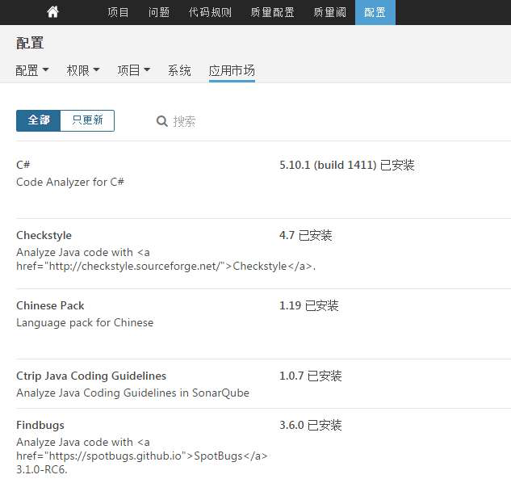
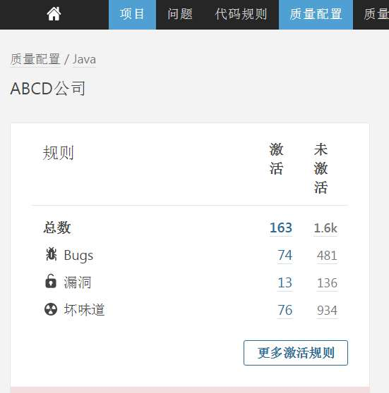
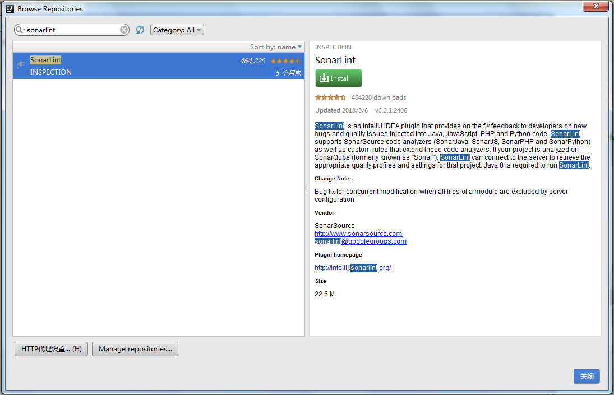
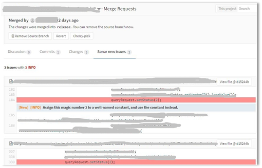
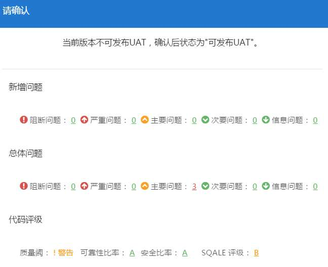

# 25 代码静态检查实践

你好，我是王潇俊，今天我和你分享的主题是：代码静态检查实践。

从这次分享开始，我们要正式开始分享测试管理系列这个主题了。测试管理本身是一个很大的范畴，而且和我们之前聊到过的环境、配置等关系密切。

因为这个专栏我们要解决的最主要的问题是持续交付，所以我在这个测试管理这个系列里面，不会去过多的展开测试本身的内容，而是要把重点放在与持续交付相关的三个重点上：

1. 代码静态检查；
1. 破坏性测试；
1. Mock 与回放。

这三个重点内容，我会分别用一篇文章的篇幅去解释。今天，我们就先从代码静态检查的实践开始吧。

虽然不同编程语言会使用不同的静态检查工具，但这些静态检查工具的工作原理和检查流程很类似。所以，为了更好地聚焦核心内容，我选择互联网公司常用的 Java 语言的静态检查来展开今天的分享。

如果你所在公司采用的是其他编程语言，那也没关系，相信你理解了这篇文章中关于原理、流程的内容后，也可以解决你所用具体语言的代码静态检查。如果在这个过程中，你还遇到了其他问题，欢迎你给我留言，我们一起去解决。

## 为什么需要代码静态检查？

代码静态检查，即静态代码分析，是指不运行被测代码，仅通过分析或检查源程序的语法、结构、过程、接口等检查程序的正确性，并找出代码中隐藏的错误和缺陷（比如参数不匹配、有歧义的嵌套语句、错误的递归、非法计算、可能出现的空指针引用等等）。

在软件开发的过程中，静态代码分析往往在动态测试之前进行，同时也可以作为设计动态测试用例的参考。有统计数据证明，在整个软件开发生命周期中，有 70% 左右的代码逻辑设计和编码缺陷属于重复性错误，完全可以通过静态代码分析发现和修复。

看到这个统计结果，相信你已经蠢蠢欲动，准备好好执行代码静态检查了，这也是为什么我们要做代码静态检查的原因。

但是，代码静态检查规则的建立往往需要大量的时间沉淀和技术积累，因此对初学者来说， **挑选合适的静态代码分析工具，自动化执行代码检查和分析，可以极大地提高代码静态检查的可靠性，节省测试成本。**

## 静态检查工具的优势

总体来说，静态检查工具的优势，主要包括以下三个方面：

1. 帮助软件开发人员自动执行静态代码分析，快速定位代码的隐藏错误和缺陷；
1. 帮助软件设计人员更专注于分析和解决代码设计缺陷；
1. 显著减少在代码逐行检查上花费的时间，提高软件可靠性的同时可以降低软件测试成本。

目前，已经有非常多的、成熟的代码静态检查工具了。其中，SonarQube 是一款目前比较流行的工具，国内很多互联网公司都选择用它来搭建静态检查的平台。

SonarQube 采用的是 B/S 架构，通过插件形式，可以支持对 Java、C、C++、JavaScript 等二十几种编程语言的代码质量管理与检测。

Sonar 通过客户端插件的方式分析源代码，可以采用 IDE 插件、Sonar-Scanner 插件、Ant 插件和 Maven 插件等，并通过不同的分析机制完成对项目源代码的分析和扫描，然后把分析扫描的结果上传到 Sonar 的数据库，之后就可以通过 Sonar Web 界面管理分析结果。

## 静态代码检查近五年的发展状况

既然静态检查工具的优势如此明显，那么我们就一起看看在实际场景下，这些工具的实施情况又如何呢。

自 2013 年以来，国内的大型互联网公司已开始积极地搭建持续交付环境，并如火如荼地开展持续交付的实践。在这个过程中，为了获得更高的投入产出比，实施团队通常会组织各个业务线的负责人，共同确立一套通用的交付流程。

同时，静态代码检查工具发展迅速，加之各大互联网公司全力追求效率的综合作用，于是持续交付流程除了启用代码静态检查工具外，还发生了如下变化：

- 从某些团队开展静态检查到所有团队都开展静态检查；
- 持续交付系统从缺少静态检查到强制静态检查；
- 从借用其他公司的检查规则到形成自己的检查规则。

由此可见，代码静态检查已经从可有可无变得不可或缺了，已经从部分实施进入到了全体实施的阶段。

## 设定科学的检查流程

既然代码静态检查已经变得不可或缺了，那么你自然需要明白一个问题，即如何才能把它全面实施起来。

在持续交付实践中，我们鼓励尽早地发现代码问题。为了达到这样的效果，静态检查相关的流程可设定如下：

1. 鼓励开发人员在开发环境（不管是 IDE 还是编辑器加命令行）下执行静态检查；
1. 不管采用的是主干开发还是特性分支开发的分支策略，都尽可能地在代码合入主干之前，通过静态检查；
1. 没有通过静态检查的产品包，不允许发布到线上或用户验证环境。

整个流程可以用下面这张图来表示。


图 1 静态检查的流程

其中，S2 和 S3 这两个环节，我们可以借助持续交付系统进行强制检查来完成。

这三个环节的检查，我需要特别说明两点：

1. 公司或团队通常会有一个公共检查规则的最小集合（简称 Rules），不管哪个步骤的检查，至少得保证通过这个最小集合的检查。如果采用 SonarQube 作为静态检查的管理平台，那么可以把这个 Rules 配置为一个 Profile。利用这样一个机制，你可以很方便地管理规则配置。
1. 不管是开发环境还是持续交付系统，都需要及时、方便地获取到这个统一的 Rules。这也正是 SonarQube 在努力实现的，它推出的 IDE 插件 SonarLint，只需简单的几步配置就能同步 Sonar 服务最新的 Profile。 虽然，目前 SonarLint 还不能完全替代 FindBugs、PMD 和 Checkstyle 这三个最常用的静态检查工具，但是我们可以预见，类似 SonarLint 这样的 IDE 插件，在开发人员群体中是颇受欢迎的。你只需安装一个插件就能涵盖所有的静态检查规则，而且可以毫不费力地实时获取公司统一的检查标准。

## 跳过检查的几类方式

为持续交付体系搭建好静态检查服务并设置好 Rules 后，你千万不要认为事情结束了，直接等着看检查结果就行了。因为，通常还会有以下问题发生：

1. 代码规则可能不适合程序语言的多个版本；
1. 第三方代码生成器自动产生的代码存在问题，该怎么略过静态检查；
1. 静态检查受客观情况的限制，存在误报的情况；
1. 某些规则对部分情况检查得过于苛刻；
1. 其他尚未归类的不适合做静态检查的问题。

其实，这些问题都有一个共同特点：静态检查时不该报错的地方却报错了，不该报严重问题的地方却报了严重问题。

于是，我们针对这个共性问题的处理策略，可以分为三类：

1. 把某些文件设置为完全不做静态检查；
1. 把某些文件内部的某些类或方法设置为不做某些规则的检查；
1. 调整规则的严重级别，让规则适应语言的多个版本。

这样就可以提高静态检查的准确度了，接下来我们需要考虑的问题就是提高静态检查的效率了。

## 如何提高静态检查的效率？

提高静态检查的效率的重要性，可以概括为以下两个方面：

- 其一，能够缩短代码扫描所消耗的时间，从而提升整个持续交付过程的效率；
- 其二，我们通常会采用异步的方式进行静态检查，如果这个过程耗时特别长的话，会让用户产生困惑，从而质疑执行静态检查的必要性。

那么，怎么才能提升静态检查的效率呢？

**除了提升静态检查平台的处理能力外，在代码合入主干前采用增量形式的静态检查，也可以提升整个静态检查的效率** 。增量静态检查，是指只对本次合入涉及的文件做检查，而不用对整个工程做全量检查。

当然，为了有效保证整个工程项目的代码质量，持续交付系统通常会在版本发布到用户验证环境或者上线之前，对整个工程进行全量检查。

这样做，既能保证产品上线的质量，又可以提高集成过程中的检查效率。

## 如何制定规则？

如果你要在实际工作中制定自己的个性化规则，又该如何进行呢？

在实践中，日常的定制规则往往有两种方式：

1. 从已有的规则集合中挑选团队适用的规则，必要情况下调整规则的严重等级和部分参数；
1. 基于某个规则框架，编写全新的规则。这种方式需要自行编码，难度成本较大，所以我一般不推荐你采用，确实找不到现成的规则时再采用这种方案。

## Sonar 代码静态检查实例

了解了代码静态检查的理论知识，我们现在就来具体实践一下。你可以从中体会，如何搭建一套 Sonar 服务，并把它与实际流程结合起来。

第一步：搭建 Sonar 服务，安装 CheckStyle 等插件。



图 2 Sonar 系统配置

第二步：设置统一的 Java 检查规则。



图 3 Java 规则设置

第三步：在 IDE 中安装 SonarLint 插件后，就可以使用 SonarSource 的自带规则了。



图 4 IDE 插件安装

第四步：如果 SonarLint 的检查规则不能满足开发环境的要求，你可以执行相关的 mvn 命令，把检查结果吐到 Sonar 服务器上再看检查结果，命令如下：

```bash
mvn org.sonarsource.scanner.maven:sonar-maven-plugin:3.2:sonar -f ./pom.xml -Dsonar.host.url=sonar 服务器地址 -Dsonar.login= 账号名称 -Dsonar.password= 账号密码 -Dsonar.profile= 检查规则的集合 -Dsonar.global.exclusions= 排除哪些文件 -Dsonar.branch= 检查的分支
```

第五步：在 GitLab 的 Merge Request 中增加 Sonar 静态检查的环节，包括检查状态和结果等。



图 5 GitLab MR 集成 Sonar 结果

第六步：发布到用户验证环境（UAT）前，先查看静态检查结果。如果没有通过检查，则不允许发布。



图 6 Sonar 检查结果报告

通过上面这六步，一套代码静态检查机制就基本被构建起来了。

## 总结

在分享和你分享代码静态检查实践这个主题时，我分享了近五年国内的大型互联网公司在持续交付实践中摸爬滚打的经验。

从这五年的发展实践中，我们可以清楚地看到，越来越多的研发团队把静态检查作为了一个不可或缺的环节，这也确实帮助研发团队提升了代码质量。

当然，机器是死的，人是活的，我们千万不要过分迷信静态检查的结果，还要时刻擦亮眼睛，看看是否存在误报等问题。

## 思考题

1. 为什么代码静态检查应尽量在开发前期就实施？
1. 在你看来，一款好的静态检查工具或一套好的静态检查系统，应该具备哪些特点？
