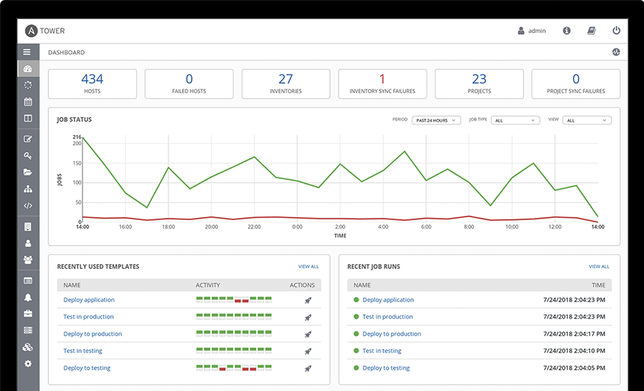
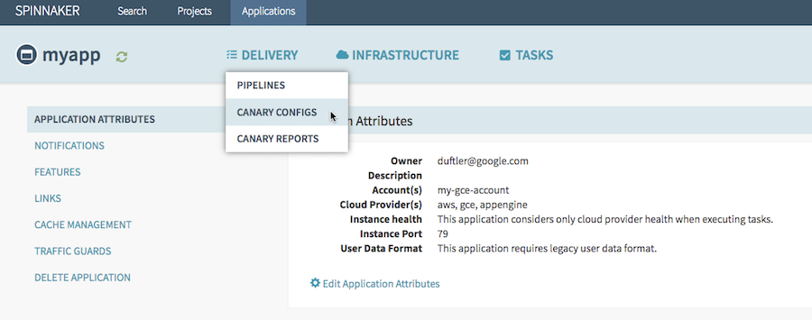

# 37 快速构建持续交付系统（四）：Ansible 解决自动部署问题

今天这篇文章，已经是实践案例系列的最后一篇了。在\[《快速构建持续交付系统（二）：GitLab 解决配置管理问题》\]和\[《快速构建持续交付系统（三）：Jenkins 解决集成打包问题》\]这两篇文章中，我们已经分别基于 GitLab 搭建了代码管理平台、基于 Jenkins 搭建了集成与编译系统，并解决了这两个平台之间的联动、配合问题，从而满足了在代码平台 push 代码时，驱动集成编译系统工作的需求。

算下来，我们已经通过前面这两篇文章，跑完了整个持续交付体系三分之二的路程，剩下的就是解决如何利用开源工具搭建发布平台完成代码发布，跑完持续交付最后一公里的问题了。

## 利用 Ansible 完成部署

Ansible 是一个自动化运维管理工具，支持 Linux/Windows 跨平台的配置管理，任务分发等操作，可以帮我们大大减少在变更环境时所花费的时间。

与其他三大主流的配置管理工具 Chef、Puppet、Salt 相比，Ansible 最大的特点在于“agentless”，即无需在目标机器装安装 agent 进程，即可通过 SSH 或者 PowerShell 对一个环境中的集群进行中心化的管理。

所以，这个“agentless”特性，可以大大减少我们配置管理平台的学习成本，尤其适合于第一次尝试使用此类配置管理工具。

另外，利用 Ansible，我们可以完成虚拟机的初始化，以及 Tomcat Java 程序的发布更新。

现在，我们就先看看如何在我们的机器上安装 Ansible，以及如何用它来搭建我们的代码发布平台。这里，我们再一起回顾下，我在第 34 篇文章\[《快速构建持续交付系统（一）：需求分析》\]中提到的对发布系统的需求：

> 同时支持 Jar、War、Docker 的生产发布，以及统一的部署标准。

对于移动 App，我们只要发布到内部测试集市即可，所以只需要在编译打包之后上传至指定地址，这个操作在 Jenkins Pipeline 里执行就可以了，所以本篇就不累述了。

### Ansible 安装

对于 Ansible 环境的准备，我推荐使用 pip 的方式安装

```bash
sudo pip install Ansible
```

安装完之后, 我们可以简单测试一下：

1. 提交一个 Ansible 的 Inventory 文件 hosts，该文件代表要管理的目标对象：

```bash
 cat hosts
[Jenkinsservers]
10.1.77.79
```

1. 打通本机和测试机的 SSH 访问：

```bash
ssh-copy-id [email protected]
```

1. 尝试远程访问主机 10.1.77.79：

```bash
 Ansible -i hosts  all -u deployer -a "cat /etc/hosts” 
10.1.77.79 | SUCCESS | rc=0 >>
127.0.0.1   localhost localhost.localdomain localhost4 localhost4.localdomain4
::1         localhost localhost.localdomain localhost6 localhost6.localdomain6
```

如果返回 SUCCESS，则表示我们已经可以通过 Ansible 管理该主机了。

接下来，我们再看一下如何使用 Ansible 达到我们的发布目标吧。

### Ansible 使用

现在，我先简单介绍下，在初次接触 Ansible 时，你应该掌握的两个最关键的概念：Inventory 和 PlayBook。

1. **Inventory** 对于被 Ansible 管理的机器清单，我们可以通过 Inventory 文件，分组管理其中一些集群的机器列表分组，并为其设置不同变量。

比如，我们可以通过 Ansible_user ，指定不同机器的 Ansible 用户。

```bash
[Jenkinsservers]
10.1.77.79 Ansible_user=root
10.1.77.80 Ansible_user=deployer
[Gitlabservers]
10.1.77.77
```

1. **PlayBook** PlayBook 是 Ansible 的脚本文件，使用 YAML 语言编写，包含需要远程执行的核心命令、定义任务具体内容，等等。

我们一起看一个 Ansible 官方提供的一个例子吧。

```bash
---
- hosts: webservers
 remote_user: root 
 tasks:
 - name: ensure apache is at the latest version
 yum:
 name: httpd
 state: latest
 - name: write the apache config file
 template:
 src: /srv/httpd.j2
 dest: /etc/httpd.conf
- hosts: databases
 remote_user: root 
 tasks:
 - name: ensure postgresql is at the latest version
 yum:
 name: postgresql
 state: latest
 - name: ensure that postgresql is started
 service:
 name: postgresql
 state: started
```

这段代码的最主要功能是，使用 yum 完成了 Apache 服务器和 PostgreSQL 的安装。其中，包含了编写 Ansible PlayBook 的三个常用模块。

1. yum 调用目标机器上的包管理工具完成软件安装 。Ansible 对于不同的 Linux 操作系统包管理进行了封装，在 CentOS 上相当于 yum， 在 Ubuntu 上相当于 APT。
2.Template 远程文件渲染，可以把本地机器的文件模板渲染后放到远程主机上。
3.Service 服务管理，同样封装了不同 Linux 操作系统实际执行的 Service 命令。**通常情况下，我们用脚本的方式使用 Ansible，只要使用好 Inventory 和 PlayBook 这两个组件就可以了，即：使用 PlayBook 编写 Ansible 脚本，然后用 Inventory 维护好需要管理的机器列表** 。这样，就能解决 90% 以上使用 Ansible 的需求。

但如果你有一些更复杂的需求，比如通过代码调用 Ansible，可能还要用到 API 组件。感兴趣的话，你可以参考 Ansible 的官方文档。

### 使用 Ansible 进行 Java 应用部署

我先来整理下，针对 Java 后端服务部署的需求：

> 完成 Ansible 的 PlayBook 后，在 Jenkins Pipeline 中调用相关的脚本，从而完成 Java Tomcat 应用的发布。**首先，在目标机器上安装 Tomcat，并初始化。** 我们可以通过编写 Ansible PlayBook 完成这个操作。一个最简单的 Tomcat 初始化脚本只要十几行代码，但是如果我们要对 Tomcat 进行更复杂的配置，比如修改 Tomcat 的 CATALINA_OPTS 参数，工作量就相当大了，而且还容易出错。

在这种情况下，一个更简单的做法是，使用开源第三方的 PlayBook 的复用文件 roles。你可以访问[https://galaxy.Ansible.com](https://galaxy.ansible.com/) ，这里有数千个第三方的 roles 可供使用。

在 GitHub 上搜索一下 Ansible-Tomcat，并下载，就可以很方便地使用了。

这里，我和你一起看一个具体 roles 的例子：

```bash
---
- hosts: Tomcat_server
 roles:
 - { role: Ansible-Tomcat }
```

你只需要这简单的三行代码，就可以完成 Tomcat 的安装，以及服务注册。与此同时，你只要添加 Tomcat_default_catalina_opts 参数，就可以修改 CATALINA_OPTS 了。

这样一来，Java 应用所需要的 Web 容器就部署好了。**然后，部署具体的业务代码** 。

这个过程就是指，把编译完后的 War 包推送到目标机器上的指定目录下，供 Tomcat 加载。

完成这个需求，我们只需要通过 Ansible 的 SCP 模块把 War 包从 Jenkins 推送到目标机器上即可。

具体的命令如下：

```bash
- name: Copy a war file to the remote machine 
  copy:
    src: /tmp/waimai-service.war
    dest: /opt/Tomcat/webapps/waimai-service.war
```

但是，这样编写 Ansible 的方式会有一个问题，就是把 Ansible 的发布过程和 Jenkins 的编译耦合了起来。

而在上一篇文章\[《快速构建持续交付系统（三）：Jenkins 解决集成打包问题》\]中，我提到，要在编译之后，把构建产物统一上传到 Nexus 或者 Artifactory 之类的构建产物仓库中。

所以，**此时更好的做法是直接在部署本地从仓库下载 War 包** 。这样，之后我们有独立部署或者回滚的需求时，也可以通过在 Ansible 的脚本中选择版本实现。当然，此处你仍旧可以使用 Ansible 的 SCP 模块复制 War 包，只不过是换成了在部署机上执行而已。**最后，重启 Tomcat 服务，整个应用的部署过程就完成了** 。

## Ansible Tower 简介

通过上面的几个步骤，我们已经使用 Ansible 脚本简单实现了 Tomcat War 包分发的过程。

这样的持续交付工作流，虽然可以工作，但依然存在两个问题。

1. 用户体验问题。 我们一起回顾下第 21 篇文章\[《发布系统一定要注意用户体验》\]中的相关内容，用户体验对发布系统来说是相当重要的。 在上面使用 Ansible 进行部署 Java 应用的方案中，我们采用的 Jenkins Pipeline 和 Ansible 命令行直接集成的方式，就所有的信息都集中到了 Jenkins 的 console log 下面，从而缺少了对发布状态、异常日志的直观展示，整个发布体验很糟糕。
1. 统一管理问题。 Ansible 缺乏集中式管理，需要在每个 Jenkins 节点上进行 Ansible 的初始化，增加了管理成本。

而这两个问题，我们都可以通过 Ansible Tower 解决。



图 1 Ansible Dashboard（ 来源 Ansible 官网）

Ansible Tower 是 Ansible 的中心化管理节点，既提供了 Web 页面以达到可视化能力，也提供了 Rest API 以达到调用 Ansible 的 PlayBook 的目的。

如图 1 所示为 Ansible Tower 的 Dashboard 页面。我们可以看到，这个页面提供了整个 Ansible 集群发布的趋势图，以及每次发布在每台被部署机器上的详细结果。

## 灰度发布的处理

通过上面的内容，我们已经可以通过合理使用 Ansible，顺利地部署一个 Java 应用了，而且还可以通过 Ansible Tower 监控整个发布过程。而对于灰度发布过程的处理，你只需要在 Jenkins Pipeline 中编写相应的脚本，控制具体的发布过程就可以了。

比如，通过 Inventory 定义灰度分批策略，再利用 Pipeline 驱动 PlayBook，就是一个典型的灰度发布的处理过程。其实，这只是将原子化的单机操作批量化了而已。

当然，这个过程中我们还需要考虑其他一些问题。而对于这些问题如何解决，你就可以参考发布及监控系列的六篇文章（即，第 19 篇至第 24 篇）了。

至此，标准的 Java 应用的发布就已经大功告成了。接下来，我再和你说说其他产物（Jar 包、Docker 镜像）的发布方式。

Jar 包的发布
-------- **Jar 包的发布本身就比较简单，执行一条 Maven 命令（即，mvn deploy）就可以完成。但，Jar 包发布的关键在于，如何通过工具提升 Jar 包发布的质量。**

在不引入任何工具和流程辅助时，我们在携程尝试过让开发人员自行通过“mvn deploy”进行发布。但结果可想而知，造成了很多问题。诸如，大量低质量的代码进入仓库；release 版本的 Jar 包被多次覆盖；版本管理混乱，Bug 难以排查等等。

后来，我们初次收紧了发布权限，也就是只把“mvn deploy”的权限下放给每个团队的技术经理（tech leader）。这种方案，虽然在一定程度上解决了 Jar 包质量的问题，但同时也降低了发布效率。这里发布效率的降低，主要体现在两个方面：

- 一方面，每次发布都需要经过技术经理，增加了他的工作负担；
- 另一方面，“mvn deploy”权限需要由 SCM 人员手工完成，增加了发布的沟通成本，降低了整个团队的开发效率。

再后来，为了解决这些问题，我们在 GitLab 上进行了二次开发，即：允许开发人员自主选择某个 pom module 的 Jar 包进行发布，并记录下每次的 Jar 包发布的记录。

在 Jar 包发布的第一步，我们使用 Maven Enforcer 插件进行构建检测，以保证所有进入仓库的 Jar 包是合规的。这部分内容，你可以参考第 15 篇文章\[《构建检测，无规矩不成方圆》\]。

如果你不想通过在 GitLab 上进行二次开发控制 Jar 包发布的话，简单的做法是，通过 Jenkins 任务，参数化创建一个 Jar 包发布的 job。让用户在每次发布前填入所需的代码仓库和 module 名，并在 job 的逻辑中保证 Jar 包编译时已经通过了 Enforcer 检查。

这样，我们就可以顺利解决掉 Jar 包发布的问题了。

## 使用 Spinnaker 处理 Docker

现在，我们再来看一下如何选择开源的 Docker 交付平台。

在携程，我们第一版的 Docker 发布流程，是基于自研发布工具 Tars 和 mesos framework 集成实现的。这个方案成型于 2016 年底，那时容器编排平台的局面还是 Mesos、Swarm,，以及 Kubernetes 的三方大战，三方各有优势和支持者。

时至今日，Kubernetes 基本已经一统容器编排平台。为了更多地获取开源红利，携程也在向 Kubernetes 的全面迁移中。

目前，携程对接 Kubernetes 的方案是，使用 StatefulSet 管理 Pod，并且保持实例的 IP 不会因为发布而产生变化，而负载均衡器依然使用之前的 SLB 中间件，并未使用 Kubernetes 天然支持的 Ingress。这和我在第 23 篇文章\[《业务及系统机构对发布的影响》\]中提到的 markdown、markup 机制有关系，你可以再回顾一下这篇文章的内容。

但，如果今天让我再重新实现一次的话，我更推荐使用 Kubernetes 原生方案作为 Docker 编排平台的第一方案，这样更简单有效。如果你还没有在持续交付平台中支持 Kubernetes 的话，我的建议是：直接考虑搭建持续交付平台 Spinnaker。

Spinnaker 是 Netflix 的开源项目，致力于解除持续交付平台和云平台之间的耦合。这个持续交付平台的优点，主要包括：

1. 发布支持多个云平台，比如 AWS EC2、Microsoft Azure、Kubernetes 等。如果你未来有在多数据中心使用混合云的打算，Spinnaker 可以给你提供很多帮助。
1. 支持集成多个持续集成平台，包括 Jenkins、Travis CI 等。
1. Netflix 是金丝雀发布的早期实践者，Spinnaker 中已经天然集成了蓝绿发布和金丝雀发布这两种发布策略，减少了开发发布系统的工作量。 在此，你可以回顾一下我在第 19 篇文章\[《发布是持续交付的最后一公里\]》中，和你分享的蓝绿发布和金丝雀发布。



图 2 Spinnaker 金丝雀发布配置图（来源 Spinnaker 官网）

虽然，我并未在携程的生产环境中使用过 Spinnaker，但由处于持续交付领域领头羊地位的 Netflix 出品，并且在国内也已经有了小红书的成功案例，Spinnaker 还是值得信任的。你可以放心大胆的用到自己的持续交付体系中。

好了，现在我们已经一起完成了发布平台的搭建。至此，整个持续交付体系，从代码管理到集成编译再到程序发布上线的完整过程，就算是顺利完成了。

## 总结与实践

在今天这篇文章中，我主要基于 Ansible 系统的能力，和你分享了搭建一套部署系统的过程。在搭建过程中，你最需要关注的两部分内容是：

1. 利用 Inventory 做好部署目标的管理；
1. 利用 PlayBook 编写部署过程的具体逻辑。

同时，我还介绍了 Ansible Tower 这样一个可视化工具，可以帮助你更好地管理整个部署过程。

另外，对于 Jar 包的发布，以及 Docker 的处理，我也结合着携程的经验，和你分享了一些方法和建议，希望可以帮到你。

至此，我们要搭建的整个持续交付系统，也算是顺利完成了。
