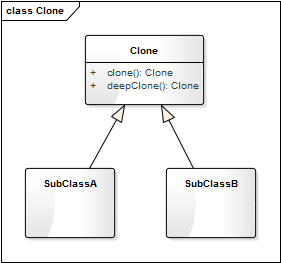

# 13 克隆模式：给你一个分身术

【故事剧情】

> Tony 最近在看一部电视剧《闪电侠》，里面一个人物叫 Danton Black 的超级人类，拥有复制自身的超能力，能够变身出六个自己，男主角第一次与他交锋时还晕了过去。
>
> Tony 也想要有这种超能力，这样就可以同时处理多件事啦：可以一边敲代码、一边看书、还能一边约妹，哈哈！
>
> 当然这是不可能的，虽然现在的克隆技术已经能够克隆羊、克隆狗、克隆猫，但还不能克隆人！就算可以，也不能使克隆出来的自己立刻就变成二十几岁的你，当他长到二十几岁时你已经四十几岁了，他还能理解你的想法吗？


## 用程序来模拟生活

人的克隆是困难的，但程序的克隆是简单的，因为它天生就具有方便复制的特点。在程序设计中，也有一种思想是来源于克隆这一概念，它就是克隆模式。在谈这一模式之前，我们先用程序来模拟一下 Tony 这一 YY 的想法。

源码示例：

```python
from copy import copy, deepcopy
class Person:
    "人"
    def __init__(self, name, age):
        self.__name = name
        self.__age = age
    def showMyself(self):
        print("我是" + self.__name + ",年龄" + str(self.__age) + ".")
    def coding(self):
        print("我是码农，我在Coding改变世界...")
    def reading(self):
        print("阅读使我快乐！知识使我成长！如饥似渴地阅读是生活的一部分...")
    def fallInLove(self):
        print("春风吹，月亮明，花前月下好相约...")
    def clone(self):
        return copy(self)
```

测试代码：

```python
def testProtoType():
    tony = Person("Tony", 26)
    tony.showMyself()
    tony.coding()
    tony1 = tony.clone()
    tony1.showMyself()
    tony1.reading()
    tony2 = tony.clone()
    tony2.showMyself()
    tony2.fallInLove()
```

输出结果：

```plaintext
我是Tony,年龄:26
我是码农，我在Coding改变世界...
我是Tony,年龄:26
阅读使我快乐！知识使我成长！如饥似渴地阅读是生活的一部分...
我是Tony,年龄:26
春风吹，月亮明，花前月下好相约...
```

在上面的例子中，Tony 克隆出了两个自己 tony1 和 tony2，因为是克隆出来的，所有姓名和年龄都一样，这样 Tony 就可以同时去敲代码、读书和约会了。

### 从剧情中思考克隆模式

像上面的 Demo 一样，通过拷贝自身的属性来创建一个新对象的过程叫做 **克隆模式** 。在很多书籍和资料中被称为 **原型模式** ，但我觉得克隆一词更能切中其主旨。

克隆模式的核心就是一个 Clone 方法，Clone 方法的功能就是拷贝父本的所有属性，主要包括两个过程：

- 分配一块新的内存空间给新的对象；
- 拷贝父本对象的所有属性。

### 浅拷贝与深拷贝

要讲清楚这个概念，先来看一个例子，还是基于上面的 Demo，我们稍做一些修改。

```python
class Person:
    "人"
    def __init__(self, name, age):
        self.__name = name
        self.__age = age
        self.__petList = []
    def showMyself(self):
        print("我是" + self.__name + ",年龄" + str(self.__age) + ". 我养了这些宠物：")
        for pet in self.__petList:
            print(pet + "\t", end="")
        print()
    def addPet(self, pet):
        self.__petList.append(pet)
    def clone(self):
        return copy(self)
    def deepClone(self):
        return deepcopy(self)
```

测试代码：

```python
def testProtoType2():
    tony = Person("Tony", 26)
    tony.addPet("小狗Coco")
    print("父本tony：", end="")
    tony.showMyself()
    tony1 = tony.deepClone()
    tony1.addPet("小猫Amy")
    print("副本tony1：", end="")
    tony1.showMyself()
    print("父本tony：", end="")
    tony.showMyself()
    tony2 = tony.clone()
    tony2.addPet("小兔Ricky")
    print("副本tony2：", end="")
    tony2.showMyself()
    print("父本tony：", end="")
    tony.showMyself()
```

输出结果：

```plaintext
父本tony：我是Tony,年龄26. 我养了这些宠物：
小狗Coco    
副本tony1：我是Tony,年龄26. 我养了这些宠物：
小狗Coco        小猫Amy   
父本tony：我是Tony,年龄26. 我养了这些宠物：
小狗Coco    
副本tony2：我是Tony,年龄26. 我养了这些宠物：
小狗Coco        小兔Ricky 
父本tony：我是Tony,年龄26. 我养了这些宠物：
小狗Coco        小兔Ricky
```

在上面这个例子中，我们看到“副本 tony1”是通过深拷贝的方式创建的，我们对 tony1 对象增加宠物，不会影响 tony 对象。而副本 tony2 是通过浅拷贝的方式创建的，我们对 tony2 对象增加宠物时，tony 对象也更着改变。这是因为 Person 类`__petList`成员是一个可变的引用类型， **浅拷贝只拷贝引用类型对象的指针（指向），而不拷贝引用类型对象指向的值；深拷贝到同时拷贝引用类型对象及其指向的值。** 引用类型：对象本身可以修改，Python 中的引用类型有列表（List）、字典（Dictionary）、类对象。Python 在赋值的时候默认是浅拷贝，如

```python
def testList():
    list = [1, 2, 3];
    list1 = list;
    print("list's id:", id(list))
    print("list1's id:", id(list1))
    print("修改之前：")
    print("list:", list)
    print("list1:", list1)
    list1.append(4);
    print("修改之后：")
    print("list:", list)
    print("list1:", list1)
```

结果：

```plaintext
list's id: 56424568
list1's id: 56424568
修改之前：
list: [1, 2, 3]
list1: [1, 2, 3]
修改之后：
list: [1, 2, 3, 4]
list1: [1, 2, 3, 4]
```

通过 Clone 的方式创建对象时，浅拷贝往往是很危险的，因为一个对象的改变另一个对象也同时改变。深拷贝会对一个对象的发生进行完全拷贝，这样两个对象之间就不会相互影响了，你改你的，我改我的。

在使用克隆模式时，除非一些特殊情况（如需求本身就要求两个对象一起改变）， **尽量使用深拷贝的方式** （称其为 **安全模式** ）。

## 克隆模式的模型抽象

### 代码框架

克隆模式非常简单，我们可以对它进行进一步的重构和优化，抽象出克隆模式的框架模型。

```python
from copy import copy, deepcopy
class Clone:
    "克隆的基类"
    def clone(self):
        "浅拷贝的方式克隆对象"
        return copy(self)
    def deepClone(self):
        "深拷贝的方式克隆对象"
        return deepcopy(self)
```

### 类图

上面的代码框架可用类图表示如下：



### 基于框架的实现

有了上面的代码框架之后，我们要实现示例代码的功能就会更简单了。最开始的示例代码我们假设它为 version 1.0，那么再看看基于框架的 version 2.0 吧。

```python
class Person(Clone):
    "人"
    def __init__(self, name, age):
        self.__name = name
        self.__age = age
        self.__petList = []
    def showMyself(self):
        print("我是" + self.__name + ",年龄" + str(self.__age) + ". 我养了这些宠物：")
        for pet in self.__petList:
            print(pet + "\t", end="")
        print()
    def addPet(self, pet):
        self.__petList.append(pet)
    def coding(self):
        print("我是码农，我在Coding改变世界...")
    def reading(self):
        print("阅读使我快乐！知识使我成长！如饥似渴地阅读是生活的一部分...")
    def fallInLove(self):
        print("春风吹，月亮明，花前月下好相约...")
```

测试代码不用变（同 testProtoType2()），自己跑一下，会发现输出结果和之前的是一样的。

### 模型说明

克隆模式也叫原型模式，应用场景非常之广泛。Java 中与基类 Object 融为一体，可以随手就拿来用，只要 implements Cloneabble 接口就默认拥有了克隆的功能。而在 Python 中，克隆模式更是成为了语言本身的部分，因为 Python 中对象的赋值就是一个浅拷贝的过程。

#### 克隆模式的优点

- 克隆模式是通过内存拷贝的方式进行复制，比 new 的方式创建对象性能更好；
- 通过深拷贝的方式，可以方便地创建一个具有相同属性和行为的另一个对象，特别是对于复杂对象，方便性尤为体现。

#### 克隆模式的缺点

通过克隆的方式创建对象， **不会执行类的构造函数** ，这不一定是缺点，但大家使用的时候需要注意这一点

## 应用场景

- 如果创建新对象（如复杂对象）成本较大，我们可以利用已有的对象进行复制来获得。
- 当类的初始化需要消耗非常多的资源时，如需要消耗很多的数据、硬件等资源。
