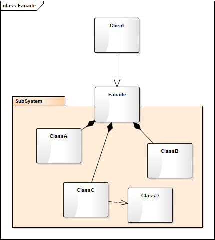
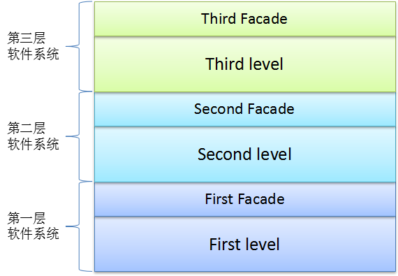
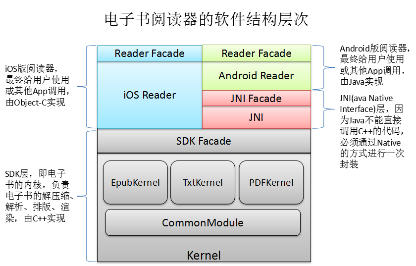

# 18 外观模式：学妹别慌，学长帮你

【故事剧情】

> Tony 有个爱好，喜欢跑步。因为住的离北体（北京体育大学）比较近，便经常去北体跑步，校园里环境优雅、场地开阔。正直金色九月的一天，Tony 一如往常的来到北体的开放田径场，但与往常不同的是 Tony 看到了成群的学生穿着蓝色的军服在参加军训。看着这群活力四射的新生迈着整齐的步伐，忽然有一种熟悉的感觉……是的，Tony 想起了自己的大学生活，想起了自己参加过的军训，更想起了自己刚踏入大学校园的那一天！
>
> 2010 年 9 月 10 日，Tony 拖着一个行旅箱，背着一个背包，独自一人坐上了一辆前往南昌的大巴，开始了自己的大学生涯。路上遇到堵车，一路兜兜转转，到站时已经很晚了，还好赶上了学校在汽车站的最后一趟迎新接送班车，感觉如释重负！到达学校时已是下午六点多了，天色已渐入黄昏！一路舟车劳顿，身心具备的 Tony 一下车有种不知所措的感觉……
>
> 正当 Tony 四处张望寻找该去哪儿报到时，一位热情的志愿者走过来问：“你好！我是新生报到的志愿者，你是报道的新生吧！哪个学院的呢？”
>
> Tony 有点蒙：“什么...学院？”
>
> 志愿者：“你录取通知书上写的是什么专业？”
>
> Tony：“哦，软件工程！”
>
> 志愿者：“那就是软件学院，正好我也是这个专业的，我叫 Frank，是你学长，哈哈！”
>
> Tony：“学长好！”
>
> 志愿者：“你是一个人来的吗？一路坐车累了吧！我帮你拿行李吧！这边走，我带你去报到……”
>
> 在 Frank 的帮助下，Tony 先到活动中心完成了报到登记，然后去缴费窗口缴完学费，之后又到生活中心领了生活用品，最后再到宿舍完成入住。这一系列流程走完，差不多花了一个小时，还是在 Frank 的热心帮助下！如果是 Tony 一个人，面对这陌生的环境和场所，所花的时间更是难以想象。报道流程结束后，Frank 还带 Tony 到食堂，请他吃了顿饭，带他到校园走了半圈……
>
> Tony 读大二、大三时，每一年新生入学时，作为老鸟的他也毅然决然地成为了迎新志愿者的一员，迎接新一届的学弟学妹！加入志愿者后，Tony 发现这里真是有不少“假”志愿者！因为要是学妹来了，一群学长都围过去，抡着去帮忙；虽然学弟也不拒绝，但明显就没了抢的姿势，在理工类学院，学姐抢学弟的事是绝对不可能发生的！

## 用程序来模拟生活

9 月是所有大学的入学季，新生入学报道是学校的一项大工程，每一个学校都有自己的报道流程和方式，但都少不了志愿者这一重要角色！一来，学长学姐带学弟学妹是尊师重教的一种优良传统；二来，轻车熟路的学长学姐作为志愿者为入学新生服务，能给刚入学的新生减少了诸多不必要的麻烦。下面我们用程序来模拟一下新生报到的整个流程。

源码示例：

```python
class Register:
    "入学报到"
    def register(self, name):
        print("活动中心:" + name + "同学报到成功！")
class Payment:
    "缴费"
    def pay(self, name, money):
        print("缴费中心:" + "收到" + name + "同学" + str(money) + "元付款，缴费成功！")
class DormitoryManagementCenter:
    "宿舍管理中心(生活中心)"
    def provideLivingGoods(self, name):
        print("生活中心:" + name + "同学的生活用品已发放。")
class Dormitory:
    "宿舍"
    def meetRoommate(self, name):
        print("宿    舍:" + "大家好！这是刚来的" + name + "同学，是你们未来需要共度四年的室友！相互认识一下……")
class Volunteer:
    "迎新志愿者"
    def __init__(self, name):
        self.__name = name
        self.__register = Register()
        self.__payment = Payment()
        self.__lifeCenter = DormitoryManagementCenter()
        self.__dormintory = Dormitory()
    def welcomeFreshmen(self, name):
        print("你好," + name + "同学! 我是新生报到的志愿者" + self.__name
              + "，我将带你完成整个报到流程。")
        self.__register.register(name)
        self.__payment.pay(name, 10000)
        self.__lifeCenter.provideLivingGoods(name)
        self.__dormintory.meetRoommate(name)
```

测试代码：

```python
def testRegister():
    volunteer = Volunteer("Frank")
    volunteer.welcomeFreshmen("Tony")
```

输出结果：

```plaintext
你好,Tony同学! 我是新生报到的志愿者Frank，我将带你完成整个报到流程。
活动中心:Tony同学报到成功！
缴费中心:收到Tony同学10000元付款，缴费成功！
生活中心:Tony同学的生活用品已发放。
宿    舍:大家好！这是刚来的Tony同学，是你们未来需要共度四年的室友！相互认识一下……
```

## 从剧情中思考外观模式

在上面的示例中，迎新志愿者陪同并帮助入学新生完成报到登记、缴纳学费、领日用品、入住宿舍等一系列的报到流程。新生不用知道具体的报到流程，不用去寻找各个场地；只要跟着志愿者走，到指定的地点，根据志愿者的指导，完成指定的任务即可。志愿者虽然不是直接提供这些报到服务，但也相当于间接提供了报到登记、缴纳学费、领日用品、入住宿舍等一条龙的服务，帮新生减轻了不少麻烦和负担。

在这里志愿者就相当于一个对接人，将复杂的业务通过一个对接人来提供一整套统一的（一条龙式的）服务，让用户不用关心内部复杂的运行机制。这种方式在程序中叫 **外观模式** ，也是门面模式。

### 外观模式

> Provide a unified interface to a set of interfaces in a subsystem. Facade defines a higher-level interface that makes the subsystem easier to use.
>
> 为子系统中的一组接口提供一个一致的界面称为 **外观模式** ，外观模式定义了一个高层接口，这个接口使得这一子系统更容易使用。

外观模式的核心思想：用一个简单的接口来封装一个复杂的系统，使这个系统更容易使用。

## 外观模式的模型抽象

### 类图

外观模式的类图表示如下：



Facade 封装了子系统的复杂实现，给外部提供了一个统一的接口，用户只需要通过 Facade 来访问子系统。

外观模式虽然很简单，但却是非常常用的一种模式，它测为一个复杂的系统提供一个简单可用的的调用接口。如有一个运行多年的老项目 A，现在要开发的新项目 B 要用到项目 A 的部分功能，但由于项目 A 维护的时间太长了（真实的场景很可能是原来的开发人员都离职了，后期的维护人员在原来的系统上随便修修改改），类的结构和关系非常庞杂，调用关系也比较复杂，重新开发一套成本又比较高。这个时候就需要对系统 A 进行封装，提供一个简单可用的接口，方便项目 B 的开发者进行调用。

在软件的层次化结构设计中，可以使用外观模式来定义每一层系统的调用接口，层与层之间不直接产生联系，而通过外观类建立联系，降低层之间的耦合度。这时就会有如下这样的层次结构图：



我曾经开发过的一个电子书阅读器就采用了这样一种层次结构分明的软件结构设计。如下图：



### 模型说明

#### 设计要点

外观模式是最简单的设计模式之一，只有两个角色。 

**外观角色（Facade）：** 为子系统封装统一的对外接口，如同子系统的一个门面。这个类一般不负责具体的业务逻辑，只是一个委托类，具体的业务逻辑由子系统完成。 
**子系统（SubSystem）：** 由多个类组成的具有某一特定功能的子系统。可以是第三方库，也可以是自己的基础库，还可能是一个子服务，为整个系统提供特定的功能或服务

#### 优缺点

优点：

- 实现了子系统与客户端之间的松耦合关系，这使得子系统的变化不会影响到调用它的客户端。
- 简化了客户端对子系统的使用难度，客户端（用户）无须关心子系统的具体实现方式，而只需要和外观进行交互即可。
- 为不同的用户提供了统一的调用接口，方便了系统的管理和维护。

缺点：因为统一了调用的接口，降低了系统功能的灵活性。

## 实战应用

在互联网世界中，文件的压缩与解压是一项非常重要的功能，它不仅能降低文件的存储空间，还能减少网络带宽，现在最常用的压缩文件格式有：ZIP、RAR、7Z 。从压缩率看：ZIP \< RAR \< 7Z（即 7Z 的压缩比最高），从压缩时间看：ZIP \< RAR \< 7Z（即 ZIP 的压缩速度最快）。从普及率上看，ZIP 应该是应用最广泛的，因为出现的时间最早，格式开放且免费；而 7Z 因为其极高的压缩比和开放性，大有赶超之势。

假设我们有一个压缩与解压缩系统专门处理文件的压缩和解压，这个系统有三个模块 ZIPModel、RARModel、ZModel 分别处理 ZIP、RAR、7Z 三种文件格式的压缩与解压。现在这一系统要提供给上层应用程序使用。

为了让这一系统更方便使用，这时就可以用外观模式进行封装，定义一套统一的调用接口，我们用代码实现一下。

**源码示例：**

```python
from os import path

import logging
class ZIPModel:
"ZIP模块，负责ZIP文件的压缩与解压"
def compress(self, srcFilePath, dstFilePath):
    print("ZIP模块正在进行 '" + srcFilePath + "' 文件的压缩......")
    print("文件压缩成功，已保存至 '" + dstFilePath + "'")
def decompress(self, srcFilePath, dstFilePath):
    print("ZIP模块正在进行 '" + srcFilePath + "' 文件的解压......")
    print("文件解压成功，已保存至 '" + dstFilePath+ "'")

class RARModel:
"RAR模块，负责ZIP文件的压缩与解压"
def compress(self, srcFilePath, dstFilePath):
    print("RAR模块正在进行 '" + srcFilePath + "' 文件的压缩......")
    print("文件压缩成功，已保存至 '" + dstFilePath + "'")
def decompress(self, srcFilePath, dstFilePath):
    print("RAR模块正在进行 '" + srcFilePath + "' 文件的解压......")
    print("文件解压成功，已保存至 '" + dstFilePath + "'")

class ZModel:
"7Z模块，负责7Z文件的压缩与解压"
def compress(self, srcFilePath, dstFilePath):
    print("7Z模块正在进行 '" + srcFilePath + "' 文件的压缩......")
    print("文件压缩成功，已保存至 '" + dstFilePath + "'")
def decompress(self, srcFilePath, dstFilePath):
    print("7Z模块正在进行 '" + srcFilePath + "' 文件的解压......")
    print("文件解压成功，已保存至 '" + dstFilePath + "'")

class CompressionFacade:
"压缩系统的外观类"
def __init__(self):
    self.__zipModel = ZIPModel()
    self.__rarModel = RARModel()
    self.__zModel = ZModel()
def compress(self, srcFilePath, dstFilePath, type):
    "根据不同的压缩类型，压缩成不同的格式"
    # 获取新的文件名
    extName = "." + type
    fullName = dstFilePath + extName
    if (type.lower() == "zip") :
        self.__zipModel.compress(srcFilePath, fullName)
    elif(type.lower() == "rar"):
        self.__rarModel.compress(srcFilePath, fullName)
    elif(type.lower() == "7z"):
        self.__zModel.compress(srcFilePath, fullName)
    else:
        logging.error("Not support this format:" + str(type))
        return False
    return True
def decompress(self, srcFilePath, dstFilePath):
    "从srcFilePath中获取后缀，根据不同的后缀名(拓展名)，进行不同格式的解压"
    baseName = path.basename(srcFilePath)
    extName = baseName.split(".")[1]
    if (extName.lower() == "zip") :
        self.__zipModel.decompress(srcFilePath, dstFilePath)
    elif(extName.lower() == "rar"):
        self.__rarModel.decompress(srcFilePath, dstFilePath)
    elif(extName.lower() == "7z"):
        self.__zModel.decompress(srcFilePath, dstFilePath)
    else:
        logging.error("Not support this format:" + str(extName))
        return False
    return True

```

**测试代码：**

```python
def testCompression():
facade = CompressionFacade()
facade.compress("E:\生活中的设计模式\生活中的外观模式——学妹别慌，学长帮你.md",
                "E:\压缩文件\生活中的外观模式——学妹别慌，学长帮你", "zip")
facade.decompress("E:\压缩文件\生活中的外观模式——学妹别慌，学长帮你.zip",
                  "E:\解析文件\生活中的外观模式——学妹别慌，学长帮你.md")
print()
facade.compress("E:\生活中的设计模式\生活中的外观模式——学妹别慌，学长帮你.md",
                "E:\压缩文件\生活中的外观模式——学妹别慌，学长帮你", "rar")
facade.decompress("E:\压缩文件\生活中的外观模式——学妹别慌，学长帮你.rar",
                  "E:\解析文件\生活中的外观模式——学妹别慌，学长帮你.md")
print()
facade.compress("E:\生活中的设计模式\生活中的外观模式——学妹别慌，学长帮你.md",
                "E:\压缩文件\生活中的外观模式——学妹别慌，学长帮你", "7z")
facade.decompress("E:\压缩文件\生活中的外观模式——学妹别慌，学长帮你.7z",
                  "E:\解析文件\生活中的外观模式——学妹别慌，学长帮你.md")
print()
```

**输出结果：**

```plaintext
ZIP模块正在进行 'E:\\生活中的设计模式\\生活中的外观模式——学妹别慌，学长帮你.md' 文件的压缩......

文件压缩成功，已保存至 'E:\\压缩文件\\生活中的外观模式——学妹别慌，学长帮你.zip'

ZIP模块正在进行 'E:\\压缩文件\\生活中的外观模式——学妹别慌，学长帮你.zip' 文件的解压......

文件解压成功，已保存至 'E:\\解析文件\\生活中的外观模式——学妹别慌，学长帮你.md'
RAR模块正在进行 'E:\\生活中的设计模式\\生活中的外观模式——学妹别慌，学长帮你.md' 文件的压缩......

文件压缩成功，已保存至 'E:\\压缩文件\\生活中的外观模式——学妹别慌，学长帮你.rar'

RAR模块正在进行 'E:\\压缩文件\\生活中的外观模式——学妹别慌，学长帮你.rar' 文件的解压......

文件解压成功，已保存至 'E:\\解析文件\\生活中的外观模式——学妹别慌，学长帮你.md'
7Z模块正在进行 'E:\\生活中的设计模式\\生活中的外观模式——学妹别慌，学长帮你.md' 文件的压缩......

文件压缩成功，已保存至 'E:\\压缩文件\\生活中的外观模式——学妹别慌，学长帮你.7z'

7Z模块正在进行 'E:\\压缩文件\\生活中的外观模式——学妹别慌，学长帮你.7z' 文件的解压......

文件解压成功，已保存至 'E:\\解析文件\\生活中的外观模式——学妹别慌，学长帮你.md'
```

在上面的例子中，为了简单起见，我们通过后缀名（拓展名）来区分不同的文件格式，不同的文件格式采用不同的解压方式来进行解压。在实际的项目开发中，不应该通过文件后缀名来区分文件格式，因为用户可能将一个 RAR 格式的文件改成 .zip 的后缀，这会造成解压的错误；而应该通过文件的魔数来判断，每一种格式的文件，在二进制文件的开头都会有一个魔数来说明该文件的类型（可通过二进制文件工具查看，如 WinHex），如 ZIP 的魔数是 PK（50 4B 03 04），RAR 的魔数是 Rar（52 61 72），7z 的魔数是 7z（37 7A）。

## 应用场景

- 当要为一个复杂子系统提供一个简单接口时；
- 客户程序与多个子系统之间存在很大的依赖性，引入外观类将子系统与客户以及其他子系统解耦，可以提高子系统的独立性和可移植性；
- 在层次化结构中，可以使用外观模式定义系统中每一层的入口，层与层之间不直接产生联系，而通过外观类建立联系，降低层之间的耦合度。
