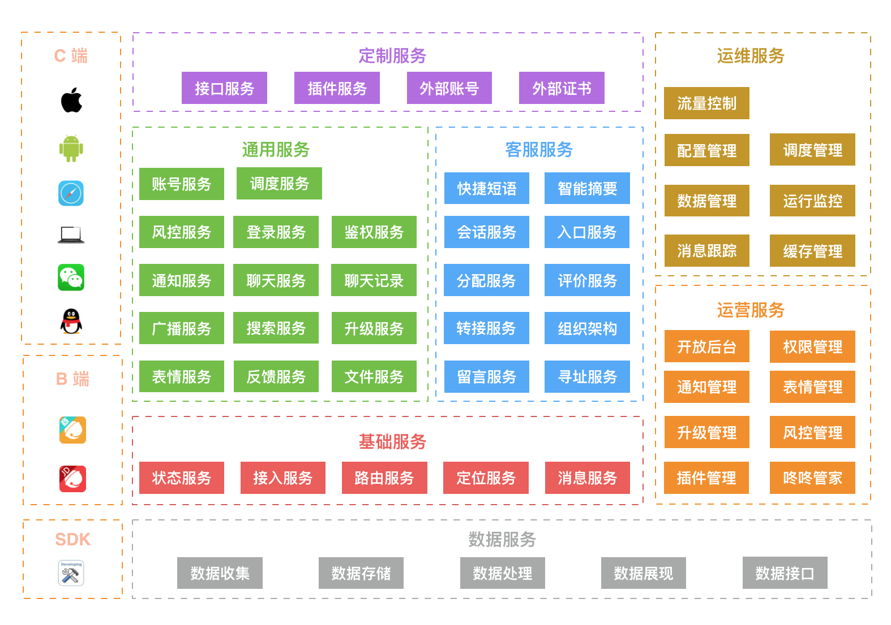
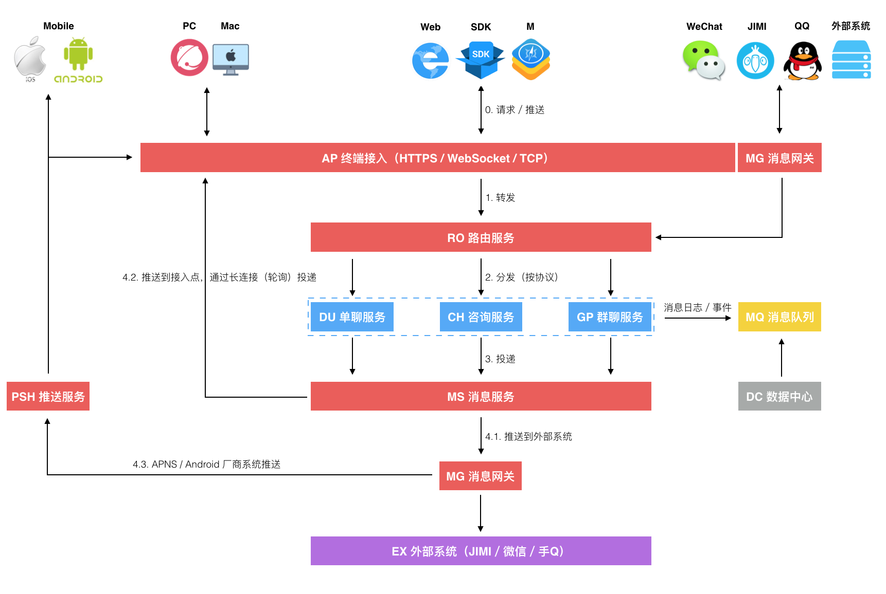
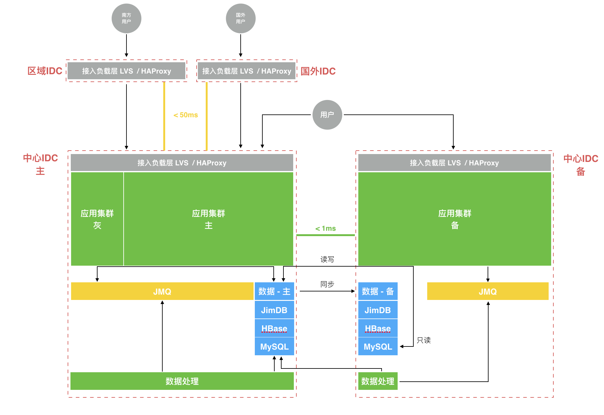
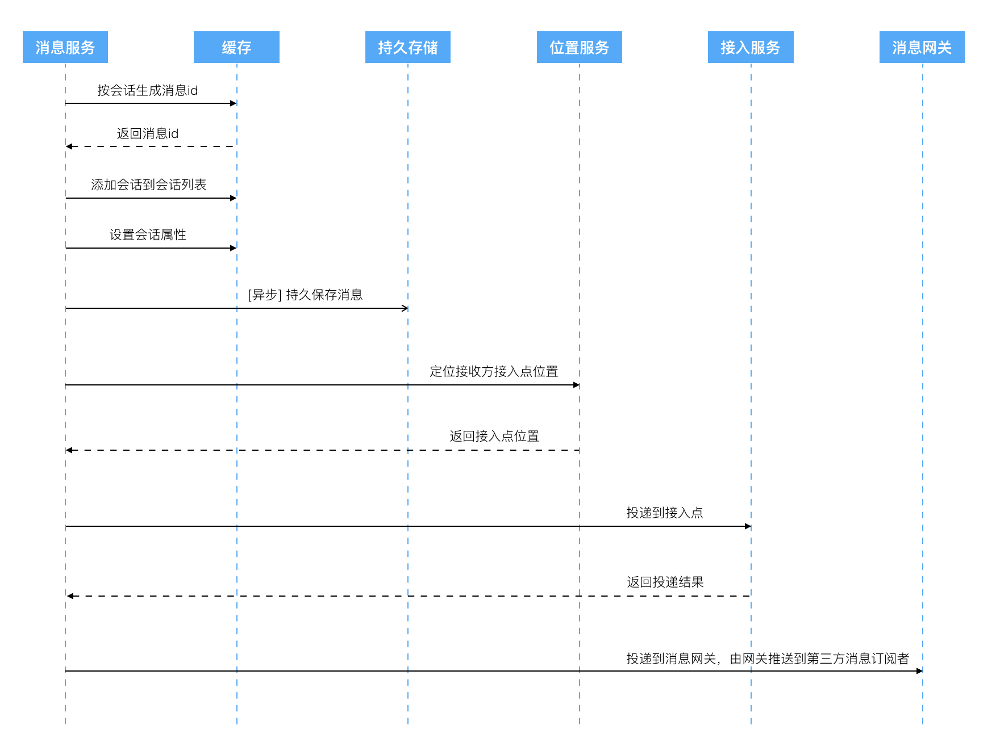
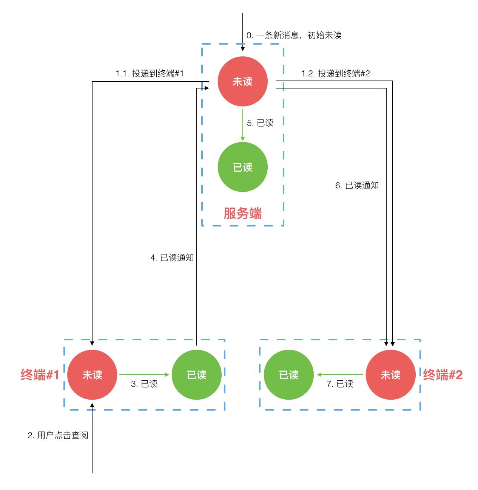

# 07 多维与视图：系统设计的思考维度与展现视图

大学上机械设计课程时学习了 “三视图” 。三视图是观测者从三个不同位置观察同一个空间几何体所画出的图形，是正确反映物体长宽高尺寸正投影的工程图，在工程设计领域十分有用。三视图也是精确的，任何现实世界中的立体物都必然能被 “三视图” 投影到二维的平面，有了这张图就能准确制作出相应的机械零部件。

但在软件设计领域，则有较大的不同，软件系统是抽象的，而且维度更多。20 世纪 90 年代，软件行业诞生了 UML（Unified Modeling Language）： 统一建模语言，一种涵盖软件设计开发所有阶段的模型化与可视化支持的建模语言。

从 UML 的出现中就可以知道，软件先驱们一直在不懈地努力，使软件系统设计从不可直观感受触摸的抽象思维空间向现实空间进行投影。

UML 是一种类似于传统工程设计领域 “三视图” 的尝试，但却又远没有达到 “三视图” 的精准。虽然 UML 没能在工程实施领域内广泛流行起来，但其提供的建模思想给了我启发。让我一直在思考应该需要有哪些维度的视图，才能很好地表达一个软件系统的设计。

而在多年的工程实践中，我逐渐得到了一些维度的视图，下面就以我近些年一直在持续维护、设计、演进的系统（京东咚咚）为例来简单说明下。

## 一、组成视图

组成视图，表达了系统由哪些子系统、服务、组件部分构成。

2015 年，我写过一篇关于咚咚的文章：《京东咚咚架构演进》。当时我们团队对系统进行了一次微服务化的架构升级，而微服务的第一步就是拆分服务，并表达清楚拆分后整个系统到底由哪些服务构成，所以有了下面这张系统服务组成图。

如下图示例，它对服务进行大类划分，图中用了不同的颜色来表达这种分类：

组成视图示例

每一类服务提供逻辑概念上比较相关的功能，而每一个微服务又按照如下两大原则进行了更细的划分：

- 单一化：每个服务提供单一内聚的功能集。
- 正交化：任何一个功能仅由一个服务提供，无提供多个类似功能的服务。

如上，就是我们系统的服务组成视图，用于帮助团队理解整体系统的宏观组成，以及个人的具体工作内容在整个系统中的位置。

了解了服务的组成，进一步自然就需要了解服务之间的关系与交互。

## 二、交互视图

交互视图，表达了系统或服务与外部系统或服务的协作关系，也即：依赖与被依赖。

由于咚咚系统的业务场景繁多，拆分出来的服务种类也比较多，交互关系复杂。所以可以像地图一样通过不同倍率的缩放视角来表达和观察服务之间的交互关系。

如下图，是一张宏观大倍率的整体交互视图示例。它隐藏了内部众多服务的交互细节，强调了终端和服务端，以及服务端内部交互的主要过程。这里依然以地图作类比，它体现了整体系统主干道场景的运动过程。而每一个服务本身，在整体的交互图中，都会有其位置，有些在主干道上，而有些则在支线上。

交互视图示例

如果我们把目光聚焦在一个服务上，以其为中心的表达方式，就体现了该服务的依赖协作关系。所以，可以从不同服务为中心点出发，得到关注点和细节更明确的局部交互细节图，而这样的细节图一般掌握在每个服务开发者的脑中。当我们需要写关于某个服务的设计文档时，这样的局部细节交互图也应该是必不可少的。

在逻辑的层面了解了服务间的协作与交互后，则需要更进一步了解这些服务的部署环境与物理结构。

## 三、部署视图

部署视图，表达系统的部署结构与环境。

部署视图，从不同的人员角色出发，关注点其实不一样，不过从应用开发和架构的角度来看，会更关注应用服务实际部署的主机环境、网络结构和其他一些环境元素依赖。下面是一张强调服务部署的机房结构、网络和依赖元素的部署图示例。

部署视图示例

部署视图本身也可以从不同的视角来画，这取决于你想强调什么元素。上面这张示例图，强调的是应用部署的 IDC 及其之间的网络关系，和一些关键的网络通讯延时指标。因为这些内容可能影响系统的架构设计和开发实现方式。

至此，组成、交互和部署图更多是表达系统的宏观视图：关注系统组合、协作和依存的关系。但还缺乏关于系统设计或实现本身的表达，这就引出了流程和状态两类视图。

## 四、流程视图

流程视图，表达系统内部实现的功能和控制逻辑流程。

可能有人喜欢用常见的流程图来表达系统设计与实现的流程，但我更偏好使用 UML 的序列图，个人感觉更清晰些。

下图是咚咚消息投递的一个功能逻辑流程表达，看起来就像是 UML 的序列图，但并没有完全遵循 UML 的图例语法（主要是我习惯的画图工具不支持）。而且，我想更多人即使是程序员也并不一定会清楚地了解和记得住 UML 的各种图例语法，所以都用文字做了补充说明，也就没必要一定要遵循其语法了，重点还是在于要把逻辑表达清楚。

流程视图示例

逻辑流程一般分两种：业务与控制。有些系统业务逻辑很复杂，而有些系统业务逻辑不复杂但请求并发很高，导致对性能、安全与稳定的要求高，所以控制逻辑就复杂了。这两类复杂的逻辑处理流程都需要表达清楚，而上图就是对业务功能逻辑的表达示例。

除了逻辑流程的复杂性，系统维持的状态变迁很可能也是另一个复杂性之源。

## 五、状态视图

状态视图，表达系统内部管理了哪些状态以及状态的变迁转移路径。

像咚咚这样的 IM 消息系统，就自带一个复杂的状态管理场景：消息的已读 / 未读状态。它的复杂性体现在，它本身就处在一个不可控的分布式场景下，在用户的多个终端和服务端之间，需要保持尽可能的最终一致性。

为什么没法满足绝对严格的最终一致性？如下图所示，IM 的 “已读 / 未读” 状态需要在用户的多个终端和服务端之间进行分布式的同步。按照分布式 CAP 原理，IM 的业务场景限定了 AP 是必须满足的，所以 C 自然就是受限的了。

状态视图示例

所有的业务系统都一定会有状态，因为那就是业务的核心价值，并且这个系统只要有用户使用，用户就会产生行为，行为导致系统状态的变迁。比如，IM 中用户发出的消息，用户的上下线等等都是行为引发的状态变化。

但无状态服务相比有状态的服务和系统要简单很多，一个系统中不是所有的服务都有状态，只会有部分服务需要状态，我们的设计仅仅是围绕在，如何尽可能地把状态限制在系统的有限范围内，控制其复杂性的区域边界。

至此，关于软件系统设计，我感觉通用的维度与视图就这些，但每个具体的系统可能也还有其独特的维度，也会有自己独有的视图。

用更系统化的视图去观察和思考，想必也会让你得到更成体系化的系统设计。

以上就是我关于系统设计的一些通用维度与视图的思考，那么你平时都用怎样的方式来表达程序系统设计呢？
