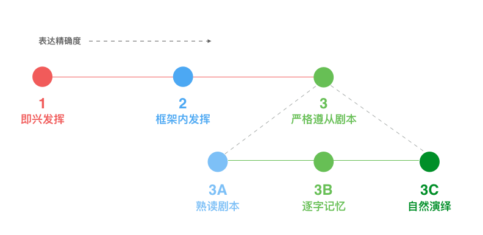

# 32 演讲：表达的技术

展现的另一种形式是： **演讲** 。其实作为程序员出身的我，演讲水平非常有限，但在职业发展与成长的道路上，演讲却是必经之路。所以，我确实有比较系统地思考和琢磨过演讲的价值、效果以及提升的方法，现在我将其分享给你，希望能对你的成长或者职业道路有所帮助。

## 一、价值与效果

写作的展现，是一种广度路线，产生间接、长尾效应；演讲的展现，是一种深度路线，产生直接、深度连接。

为什么说写作是广度而演讲是深度的？过去几年，我读过很多的文章、书，但还能记得住只言片语的都非常少。即使当时一些给我非常多启发与触动的文字，如今也只能记得当时触动的感觉，却忘了触动的内容。但好些年前，我参加过几次行业大会，有那么几场演讲，现在回想起来，不仅记得当时深受启发的触动感，甚至还能记得当时的内容。

这就是演讲带来的深度效应，它的现场感更立体，有助于留下更深刻的记忆，持续发挥影响的时间也超过了文字。

演讲的现场立体感带来的深度效应，也只能留在现场。即使我们把整个演讲过程录制成为视频，观看视频的过程也会损失很大一部分深度影响力，也许这就是为什么有人会去看现场演唱会的原因。

所以，演讲的最大价值就在于这样的深度效应。但现场感并不一定带来深度影响，也可能是把人 “催眠” 了。那如何发挥好演讲的效果呢？这里我就先谈谈我自己的一些经历和感悟。

## 二、经历与感悟

成长路上，终究会遇上演讲；从没遇上演讲的程序员，可能天花板就会比较低。

作为程序员，我的第一次演讲经历，当然是技术分享，团队内部的。如今回想，第一次分享暴露出了很多方面的问题。比如，材料准备时发现 PPT 技能太差，想展现的内容做出来的效果太挫；现场讲的时候容易跑偏或者陷入细节，整体节奏失控；想表达的内容太多，信息量过大。这些问题都导致第一次演讲的效果不尽如人意。

后来再有技术分享的机会时，我已经开始写作了一段时间，发现写作实际对演讲是有帮助的。写作和演讲的共通处在于：内容、观点、信息传递的目标都是要考虑的，只是最终的表达形式不同。而且因为写了不少东西，也反而获得了更多的技术分享机会。

从业这么些年，经历了从线上到线下，从组内到部门，然后再到公司或行业级的不同规模的分享演讲，挑战并不一样，其中最大的区别在于现场感的压力不同。而且除了分享式的演讲，还有另外一种汇报式的演讲，如：晋升述职。

技术分享，一般时间会长一些（一小时左右），而晋升述职，时间则要短很多（十分钟左右）。前者的压力来自对象的规模，后者的压力来自对象的角色。

而不同时长的演讲，准备的方式也不太一样。时间长的演讲，准备的内容就多，要精确地讲好这么多内容是一个挑战；而时间短的演讲，内容不多，但就需要合适地挑选和裁剪，并且精确地传递，这又是另外一种挑战。

那对于不同的演讲类型，有通用的准备方法吗？下面我们尝试梳理下。

## 三、准备与发挥

一场演讲，包括前期准备和现场发挥两个阶段，而前期充分的准备是现场良好发挥的基础。

世界上有一个著名的演讲论坛 TED，它上面的演讲，即使仅仅是视频，很多都给人留下了深刻的印象，而且传播范围也很广。它的演讲者通常是一些知名人士或至少是业内影响力比较大的人物。

我一开始以为他们本身就已经是很好的演讲者了，但后来了解到他们为了参加 TED 短短十来分钟的演讲，需要全力以赴地投入以周为单位的时间。比如，《哈利波特》的作者罗琳去 TED 演讲时，为此全心投入准备了整整六周。

那前期可以准备的内容有哪些？我梳理了有如下维度：

### 1. 框架

演讲的框架和程序的架构有点类似，一般我都从下面几个方面来设计：

- **目标** ：本次演讲需要达成的目标是什么？
- **听众** ：本次演讲的受众是哪些人？
- **重点** ：本次演讲要传递的关键点有哪些？

那么一场技术分享的框架线，可能有如下：

- **引出主题** ：结合目标与听众来确定。

- **自我介绍** ：让听众了解你，证明你有资格讲这个主题。

- 重点结构

  ：每一个关键点的分析、讲解，可以从以下方面来拆解。

  - 问题：这个点上存在什么问题？
  - 历史：这个问题的历史由来是什么？
  - 方法：你是用什么方法解决这个问题的？
  - 原因：为什么要用这个方法，要在这个阶段，以及这样解决问题？

- **细节深入** ：有一定细节深入，更有说服力。

- **总结回顾** ：结束前的再次总结和提炼，以加深印象。

### 2. 材料

在框架线清晰后，就进入了演讲材料的准备阶段。其中的材料包括三类： **第一类是幻灯片** 。到底要准备多少页的幻灯片？这个取决于框架线和演讲时长。但这里幻灯片的最大作用在于：

- 辅助演讲者的结构记忆与信息表达；
- 辅助听众的信息吸收、理解与消化。

也就是说，演讲的主角还是讲，而幻灯片仅仅是配角。

**第二类是演讲稿** 。讲之前你可以先写下来你所要讲的内容，这样会有助于组织信息、梳理逻辑和提炼语言。

TED 的演讲以前多是 18 分钟，而现在分长、短两种：短的约 6 分多钟，长的也缩减到了 12～15 分钟。在信息爆炸的时代，听众的注意力是一种稀缺资源，想要吸引这样的注意力，就需要提供更精确且直击人心的内容，才能收获你想要的深度影响效果。

我们的正常语速大约是每分钟 150～200 个汉字，但在演讲的压力环境下，可能会出现不自觉地加速，无意识地跑偏，甚至语无伦次。如果想要提供更精确的信息传递和表达，那么演讲稿就是必需的。

让演讲的每一个字，都体现它的价值。 **第三类是小故事** 。人是情感动物，故事的影响效应远高于数据和逻辑，即使是在做技术分享时。

以前听过一些技术分享感觉比较枯燥、催眠，就在于技术基本都在讲逻辑、讲数据，听久了自然疲劳。而穿插一些 “小” 故事，则可以加深前面数据和逻辑的影响效应。这一点很多慈善募捐组织早就学会了，再大比例的穷困数据，也比不上一张衣不蔽体的小女孩照片来得有效。

### 3. 节奏

一段持续时间的演讲中，有没有一些关键的时间点呢？当然是有的。 **一个是开场** 。据研究统计，一场演讲给人留下的印象和评价，开场的数秒至关重要。这可能和一开始是否能抓住听众的注意力有关。 **另一个是峰终** 。管理界有一个 “峰终定律（Peak-End Rule）”：在 “峰” 和 “终” 时的体验，主宰了对一段体验好或者不好的感受，而在过程中好或不好体验的比重、时间长短，对记忆的感觉差不多没有影响。也就是说，如果在一段体验的高峰和结尾，你的体验是愉悦的，那么你对整个体验的感受就是愉悦的，即使这次体验总体来看，更多是无聊和乏味的时刻。

峰终定律，在管理上决定了用户体验的资源投入分布，只需要重点投入设计好 “峰终” 体验。而演讲，也是一门体验艺术，它的 “峰” 前面说了一处——开场（抓注意力）；另一处，可能是中间某一处关键点（提供独特的高价值内容或观点）。

### 4. 表演

演讲，包括讲和演，因而还有最后一个准备环节：演。

演，即表演和发挥；表演的准备，有三个层级，如下图（原图来自 Tim Urban’s Memorization Spectrum，翻译后重绘制）：即兴发挥、框架内发挥和严格遵从剧本。

表演准备的三个层级

做了前述准备的演讲，算是在框架内发挥。如果还准备了演讲稿，那么练习熟练后，基本算是接近了 3A 这个层级，但演讲稿，还算不上是剧本，所以只是接近。按 3 这个层级的准备，是把演讲当作了一出舞台剧，有严格的剧本，需要经过反复地排演练习。

这样的准备投入是巨大的，所以你一般需要判断到底多么重要的演讲，才需要用上 3 这个层级的准备。但即使达不到 3 级的标准，按这个标准来准备也有好处，当你非常熟练了你想要精确表达的内容，在现场发挥时，你的大脑就会从记忆负担中腾出空间来应对临场那些很难提前准备的状况。

“演” 需要关注和练习的东西比 “讲” 多得多，而且表演本身就是一种专业，甚至也是一种天赋。这条路上，你可以先有一个清晰的认知，但能做到何种程度，可能因人而异吧。

演讲，本是表达的艺术，但对程序员的要求远没到艺术的层次；先能表达，再求精确，技术达标，足矣。

关于展现的第三种形式：演讲，就分享到这了；而演讲也是很多程序员的一道槛，如今的你遇到这道槛没？欢迎你留言分享。
