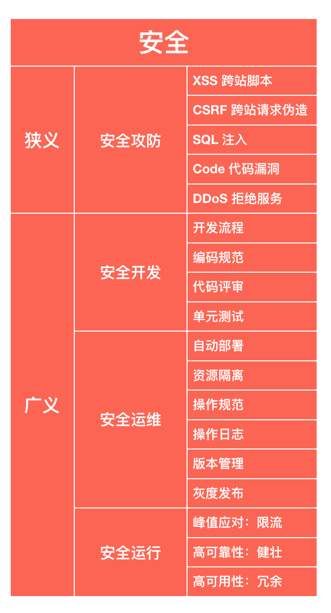

# 36 核心：安全与效率——工程技术的两个核心维度

在“ **修行：由术入道** ”模块的最后一个主题，我们聊聊工程，不是具体的工程的技术，而是抽象的工程之道。

做了很多年的工程，开发了各种各样的系统，写了无数的代码，说起这一切，我们都在谈些什么？

我们谈过程，从需求工程到开发流程，从编码规范到同行评审，从持续集成到自动部署，从敏捷开发到极限编程；我们谈架构，从企业级到互联网，从面向服务架构（SOA）到微服务架构（Microservice）；我们谈复杂性，从高并发到高性能，从高可用到高可靠，从大数据到大容量。

那么对于这一切，你感觉这里面的核心是什么？

## 核心

核心，意味着最重要的，一切复杂的工程技术方案都是围绕着它来运转。

在深入核心之前，我们先讲一个电力行业的故事。虽说电力项目我没做过，但电站大概的工作原理在中学物理课上就已经学过了，原理很简单。虽理论上是这么说，但现实中看到那些大规模的电站后，还是感觉很复杂的。

故事是这样的：记得有个给我们上课的主讲老师是个须发皆白的老先生，进门后掏出一堆零件放在讲台上。一盏酒精灯、一个小水壶、一个叶片、一个铜光闪闪的小电机、一个小灯泡。老先生往壶里倒了些水，点燃酒精灯，不一会儿水开了，从壶嘴里喷出了蒸汽，带动叶片旋转，然后小灯泡就亮了。

老先生说：“这就是电厂。如果烧的是煤炭，这就是燃煤电厂；如果烧的天然气，这就是燃气电厂；如果获得热能的方式是核裂变，这就是核电厂；如果带动叶片的能量来自从高处流向低处的水流，这就是水电厂。”

“你们或许会问：那我们看到的电站怎么这么复杂？答案其实很简单，电站需要复杂系统的目的：一是为了确保安全（Safety），二是为了提高效率（Efficiency）。**安全与效率的平衡，是所有工程技术的核心** 。”

听完这个故事，我觉着所谓 “大道至简” 大概就是这样的感觉了。

## 安全

安全，之于信息工程技术领域，包括了 “狭义” 和 “广义” 两个方面的安全范畴。如下图所示：

工程 “安全“ 的狭义和广义分类

狭义的安全，就是传统信息安全领域的 “安全攻防” 范畴。比如，客户端的跨站脚本攻击（XSS）、服务端数据库的 SQL 注入、代码漏洞以及针对服务可用性的拒绝服务攻击（DDoS）等。这个方面的 “安全” 含义是信息技术行业独有的，但前面电站例子中指的 “安全” 更多是 “广义” 层面的。

在程序技术上的 “广义” 安全范畴，我划分了三个方面：

- 开发
- 运维
- 运行

**安全开发**，就是为了保障交付的程序代码是高质量、低 Bug 率、无漏洞的。从开发流程、编码规范到代码评审、单元测试等，都是为了保障开发过程中的 “安全”。**安全运维**，就是为了保障程序系统在线上的变化过程中不出意外，无故障。但无故障是个理想状态，现实中总会有故障产生，当其发生时最好是对用户无感知或影响范围有限的。

通过自动部署来避免人为的粗心大意，资源隔离保障程序故障影响的局部化；当一定要有人参与操作时，操作规范和日志保证了操作的标准化和可追溯性；线上程序的版本化管理与灰度发布机制，保障了若有代码 Bug 出现时的影响局部化与快速恢复能力。**安全运行**，就是为了应对 “峰值” 等极端或异常运行状态，提供高可靠和高可用的服务能力。

## 效率

效率，从程序系统的角度看，同样也是从 “开发”“运维” 和 “运行” 三个方面来考虑。如下图所示：

“效率”的划分 **开发效率**，可以从 “个体” 和 “群体” 两个方面来看。

个体，就是程序员个人了，其开发效率除了受自身代码设计与编写能力的影响，同时还要看其利用工具的水平。更好的源码管理工具与技巧可以避免无谓的冲突与混乱；代码模板与开发框架能大幅度提升代码产出效率；而持续集成工具体系则能有助于快速推进代码进入可测试状态。

群体，就是一个团队，其开发效率最大的限制经常是架构导致的。如果你在一个工程项目上写过几年代码后，多半会碰到这样一种场景，代码库越来越大，而功能越改越困难。明明感觉是一个小功能变化，也要改上好几天，再测上好几天，这通常都是架构的问题，导致了团队群体开发效率的下降。

以后端服务架构技术演进的变化为例，从单体应用到面向服务架构思想，再到如今已成主流的微服务架构实践，它最大的作用在于有利于大规模开发团队的并行化开发，从而提升了团队整体的效率。理想情况下，每个微服务的代码库都不大，变化锁闭在每个服务内部，不会影响其他服务。

微服务化一方面提升了整体的开发效率，但因为服务多了，部署就变复杂了，所以降低了部署的效率。但部署效率可以通过自动化的手段来得到弥补，而开发则没法自动化。另一方面，每个微服务都是一个独立的进程，从而在应用进程层面隔离了资源冲突，提升了程序运行的 “安全” 性。**运维效率**，可以从 “检查”“诊断” 和 “处理” 三个方面来看。

一个运行的系统，是一个有生命力的系统，并有其生命周期。在其生命周期内，我们需要定期去做检查，以得到系统的 “生命体征” 的多维度信息数据汇总，以供后续的诊断分析。

运行系统的 “体征” 数据是在实时变化的，而且数据来源是多层次的，从底层的网络、操作系统、容器到运行平台（如：JVM）、服务框架与应用服务。当异常 “体征” 指标出现时，很难简单地判断到底哪里才是根本原因，这就需要关联的因果性分析来得出结论，最后智能地发出告警，而不是被告警所淹没。

准确地诊断之后，才能进行合适地处理。和治病不同，大部分的故障都可以通过常见的处理手段解决，极少存在所谓的 “不治之症”。而常见的线上处理手段有如下三类。

- 恢复：重启或隔离来清除故障、恢复服务；
- 变更：修改配置或回滚程序版本；
- 限制：故障断路或过载限流。

**运行效率**，关键就是提高程序的 “响应性”，若是服务还包括其 “吞吐量”。

程序运行的高效率，也即高响应、高吞吐能力，所有的优化手段都可以从下面两个维度来分类：

- 更多
- 更快

负载均衡器让更多的机器或进程参与服务，并行算法策略让更多的线程同步执行。异步化、无锁化和非阻塞的算法策略让程序执行得更快，缓存与缓冲让数据的读写更快。

有时在某些方面 “安全” 和 “效率” 之间是相互冲突的，但工程技术的艺术性就恰恰体现在这冲突中的平衡上。

打个比方，如果你的程序就跑在你开的车上，那么“安全” 特性会让你开得更放心，“效率” 特性会让你开得更带劲。

做了多年程序工程的你，是如何看待工程的核心本质的呢？欢迎留言，一起探讨。
