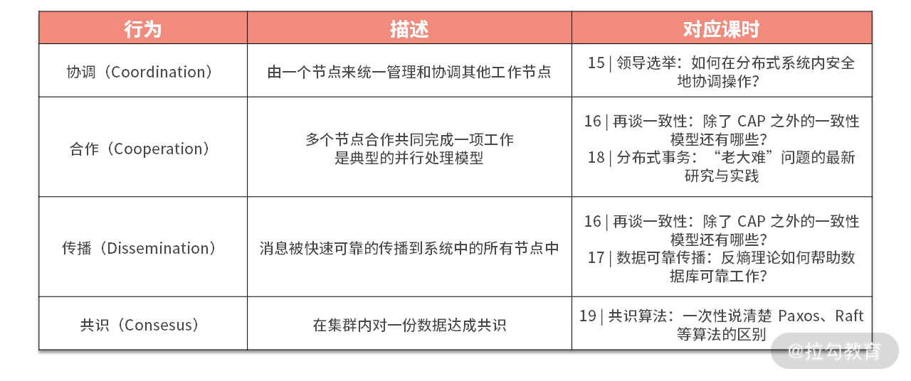

# 13 概要：分布式系统都要解决哪些问题？

在学习了存储引擎相关内容之后，从这一讲开始，我们就进入新的模块—— **分布式数据库最核心的部分，那就是分布式系统** 。

分布式数据库区别于传统数据库的一个重要特性就是其分布式的特点，这些特点来源于分布式理论的发展，特别是数据分布相关理论的发展。相比于无状态分布式系统，有状态的数据库在分布式领域中将会面对更多的挑战。

本讲内容作为整个模块三的引子，我将会向你提出一系列问题，而在后续的课程中，我会逐一回答这些问题。那么现在让我们从失败模型开始，讨论分布式模式下的数据库吧。

## 失败模型

分布式系统是由多个节点参与其中的，它们直接通过网络进行互联。每个节点会保存本地的状态，通过网络来互相同步这些状态；同时节点需要访问时间组件来获取当前时间。对于分布式系统来说，时间分为逻辑时间与物理时间。逻辑时间一般被实现为一个单调递增的计数器，而物理时间对应的是一个真实世界的时间，一般由操作系统提供。

以上就是分布式系统所涉及的各种概念，看起很简单，实际上业界对分布式系统的共识就是上述所有环节没有一点是可靠的，**“不可靠”贯穿了分布式系统的整个生命周期** 。而总结这些不可靠就成为失败模型所解决的问题。

在介绍失败模型的具体内容之前，让我们打开思路，看看有哪些具体的原因引起了分布式系统的可靠性问题。

### 引起失败的原因

当讨论分布式系统内的不稳定因素的时候，人们首先会想到网络问题，但是一个最容易让大家忽略的地方就是远程节点处理请求时也可能发生故障。一个比较常见的误区就是认为远程执行会马上返回结果，但这种假设是非常不可靠的。因为远程节点的处理能力、运行环境其实是未知的，我们不能认为它们会一直按照固定的模式去响应我们的请求。

而另一种情况是，请求到达远程节点后很可能不会被马上处理，而是放在了一个队列里面进行缓冲。这对于远程节点的吞吐量改善是有好处的，但是这在一定程度上带来了延迟，从而深刻地影响了交互模式。处理以上问题的方式就是需要引入故障检测（我会在下一讲介绍），来观察远程节点的运行情况，从而针对不同的问题采取不同的应对手段。

第二种常见的误解是所有节点时间是一致的，这种误解是非常普遍并且危险的。虽然可以使用工具去同步集群内的时间，但是要保持系统内时间一致是非常困难的。而如果我们使用不同节点产生的物理时间来进行一致性计算或排序，那么结果会非常不靠谱。所以大部分分布式数据库会用一个单独的节点来生成全局唯一的逻辑时间以解决上面的问题。而有些分布式数据库，如 Spanner 会使用原子钟这种精密服务来解决时间一致的问题。

本地物理时间的另一个问题是会产生回溯，也就是获取一个时间并执行若干步骤后，再去获取当前时间，而这个时间有可能比之前的时间还要早。也就是说我们不能认为系统的物理时间是单调递增的，这就是为什么要使用逻辑时间的另一个重要的原因。

但是本地物理时间在分布式系统中某些部分依然扮演着重要的作用，如判断远程节点超时等。但是基于以上两点，我们在实现分布式算法时应将时间因素考虑进去，从而避免潜在的问题。

以上谈到的分布式问题集中在节点层面，而另一大类问题就是网络造成的了。其中最为经典的问题就是网络分区，它指的是分布式系统的节点被网络故障分割为不同的小块。而最棘手的是，这些小块内的节点依然可以提供服务。但它们由于不能很好地感知彼此的存在，会产生不一致的问题，这个我们在模块一“\<05 | 一致性与 CAP 模型：为什么需要分布式一致性>”有过比较详细的论述。

这里需要注意的是，网络分区带来的问题难以解决，因为它是非常难发现的。这是由于网络环境复杂的拓扑和参与者众多共同左右而导致的。故我们需要设计复杂的算法，并使用诸如混沌工程的方式来解决此类问题。

最后需要强调的一点是，一个单一读故障可能会引起大规模级联反映，从而放大故障的影响面，也就是著名的雪崩现象。这里你要注意，这种故障放大现象很可能来源于一个为了稳定系统而设计的机制。比如，当系统出现瓶颈后，一个新节点被加入进来，但它需要同步数据才能对外提供服务，而大规模同步数据很可能造成其他节点资源紧张，特别是网络带宽，从而导致整个系统都无法对外提供服务。**解决级联故障的方式有退避算法和断路** 。退避算法大量应用在 API 的设计中，由于上文提到远程节点会存在暂时性故障，故需要进行重试来使访问尽可能成功地完成。而频繁地重试会造成远程节点资源耗尽而崩溃，退避算法正是依靠客户端来保证服务端高可用的一种手段。而从服务端角度进行直接保护的方式就是断路，如果对服务端的访问超过阈值，那么系统会中断该服务的请求，从而缓解系统压力。

以上就是分布式系统比较常见的故障。虽然你可能会觉得这些故障很直观，但是如果要去解决它们思路会比较分散。还好前人已经帮我们总结了一些模型来对这些故障进行分级，从而有的放矢地解决这些问题。接下来我就要为你介绍三种典型的失败模型。

### 崩溃失败

当遭遇故障后，进程完全停止工作被称为崩溃失败。这是最简单的一种失败情况，同时结果也非常好预测。这种失败模式也称为崩溃停止失败，特别强调失败节点不需要再参与回分布式系统内部了。我们说这种模式是最容易预测的，是因为失败节点退出后，其他节点感知到之后可以继续提供服务，而不用考虑它重新回归所带来的复杂问题。

虽然失败停止模式有以上的优点，但实际的分布式系统很少会采用。因为它非常明显地会造成资源浪费，所以我们一般采用崩溃恢复模式，从而重复利用资源。提到崩溃节点恢复，一般都会想到将崩溃节点进行重启，而后经过一定的恢复步骤再加入网络中。虽然这是一种主流模式，但其实通过数据复制从而生成备份节点，而后进行快速热切换才是最为主流的模式。

崩溃失败可以被认为是遗漏失败的一种特殊情况。因为从其他节点看，他们很难分清一个节点服务响应是由于崩溃还是由于遗漏消息而产生的。那究竟什么是遗漏失败呢？

### 遗漏失败

遗漏失败相比于崩溃失败来说更为不可预测，这种模式强调的是消息有没有被远程节点所执行。

这其中的故障可能发生在：

1. 消息发送后没有送达远程节点；
1. 远程节点跳过消息的处理或根本无法执行（一种特例就是崩溃失败，节点无法处理消息）；
1. 后者处理的结果无法发送给其他节点。

总之，从其他节点的角度看，发送给该节点的消息石沉大海，没有任何响应了。

上文提到的网络分区是遗漏失败的典型案例，其中一部分节点间消息是能正常收发的，但是部分节点之间消息发送存在困难。而如果崩溃失败出现，集群中所有节点都将无法与其进行通讯。

另一种典型情况就是一个节点的处理速度远远慢于系统的平均水平，从而导致它的数据总是旧的，而此时它没有崩溃，依然会将这些旧数据发送给集群内的其他节点。

当远程节点遗漏消息时，我们是可以通过重发等可靠连接手段来缓解该问题的。但是如果最终还是无法将消息传递出去，同时当前节点依然在继续提供服务，那么此时遗漏失败才会产生。除了以上两种产生该失败的场景，遗漏失败还会发生在网络过载、消息队列满等场景中。

下面为你介绍最后一种失败模型，即拜占庭失败。

### 拜占庭失败

拜占庭失败又称为任意失败，它相比于上述两种失败是最不好预测的。所谓任意失败是，参与的节点对请求产生不一致的响应，一个说当前数据是 A，而另一个却说它是 B。

这个故障往往是程序 Bug 导致的，可以通过严格软件开发流程管理来尽可能规避。但我们都清楚，Bug 在生产系统中是很难避免的，特别是系统版本差异带来的问题是极其常见的。故在运行态，一部分系统并不信任直接从远程节点获得的数据，而是采用交叉检测的方式来尽可能得到正确的结果。

另一种任意失败是一些节点故意发送错误消息，目的是想破坏系统的正常运行，从而牟利。采用区块链技术的数字货币系统则是使用正面奖励的模式（BFT），来保证系统内大部分节点不“作恶”（做正确事的收益明显高于作恶）。

以上就是三种比较常见的失败模型。模块三的绝大部分内容主要是面向崩溃恢复的场景的。那么下面我们来梳理一下本模块接下来内容的讲解脉络。

## 错误侦测与领导选举

要想解决失败问题，首先就是要进行侦测。在本模块的开始部分，我们会研究使用什么手段来发现系统中的故障。目前，业界有众多方式来检测故障的产生，他们是在易用性、精确性和性能之间做平衡。

而 **错误侦测一个重要应用领域就是领导选举** 。使用错误侦测技术来检测领导节点的健康状态，从而决定是否选择一个新节点来替代已经故障的领导节点。领导节点的一个主要作用就是缓解系统发生失败的可能。我们知道系统中如果进行对等同步状态的代价是很高昂的，如果能选择一个领导节点来统一进行协调，那么会大大降低系统负载，从而避免一些失败的产生。

而一旦侦测到失败的产生，如何解决它就是我们需要考虑的内容啦。

## 复制与一致性

故障容忍系统（Fault-tolerant）一般使用复制技术产生多个副本，来提供系统的可用性。这样可以保证当系统总部分节点发生故障后，仍然可以提供正常响应。而多个副本会产生数据同步的需求，一致性就是保证数据同步的前提。就像我在模块一中描述的那样，没有复制技术，一致性与同步就根本不存在。

模块一我们讨论的是 CAP 理论和强一致性模型，它们都是数据一致的范畴。本模块我们会接着讨论客户端一致，或称为会话一致。同时会讨论最终一致这种弱一致模型，最终一致模型允许系统中存在状态不一致的情况，但我们希望尽可能使系统保持一致，这时候会引入反熵手段来解决副本之间不一致的问题。

而后我们会接着讨论分布式事务，它与一致性存在着联系但又有很明显的区别。同时相比于模块二中的经典事务，分布式事务由于需要解决上文表述的各种失败情况，其处理是比较特殊的，比如需要进行事务协调来处理脑裂问题。

## 共识

最后我们将介绍分布式系统的精华：共识算法。以上介绍的很多内容，包括错误侦测、领导选举、一致性和分布式事务都涵盖在共识算法内，它是现代分布式数据库重要的组件。

共识算法是为了解决拜占庭将军问题而产生的。简单来说，在从前，拜占庭将军问题被认为是一个逻辑上的困境，它说明了一群拜占庭将军在试图就下一步行动达成统一意见时，可能存在的沟通问题。

该困境假设每个将军都有自己的军队，每支军队都位于他们打算攻击的城市周围的不同位置，这些将军需要就攻击或撤退达成一致。只要所有将军达成共识，即协调后决定共同执行，无论是攻击还是撤退都无关紧要。

基于著名的 FLP 不可能问题的研究，拜占庭将军们面临三种困境：

1. 将军们没有统一的时间（没法对表）；
1. 无法知道别的将军是否被击败；
1. 将军们之间的通讯是完全异步的。

由于以上的困境，我们是没有任何办法使将军们最终在特定时间内达成一致性意见的，也就是说共识算法在上述困境下是完全不可能的。

但是共识算法使用逻辑时钟来提供统一时间，并引入错误侦测技术来确定参与节点的情况，从而在完全异步的通讯情况下可以实现分布式系统的共识。本模块最后一部分，我会介绍几种经典的共识算法，并介绍它们的使用案例。

共识可以解决遗漏失败，因为只要系统内大部分节点达成共识，剩下的节点即使遗漏该消息，也能对外提供正确的数据。

## 总结

这一讲是模块三的引导课，我首先为你介绍了失败模型的概念，它是描述分布式数据库内各种可能行为的一个准则；而后根据失败模型为你梳理了本模块的讲解思路。

分布式算法根据目标不同可能分为下面几种行为模式，这些模式与对应的课时如下表所示。

