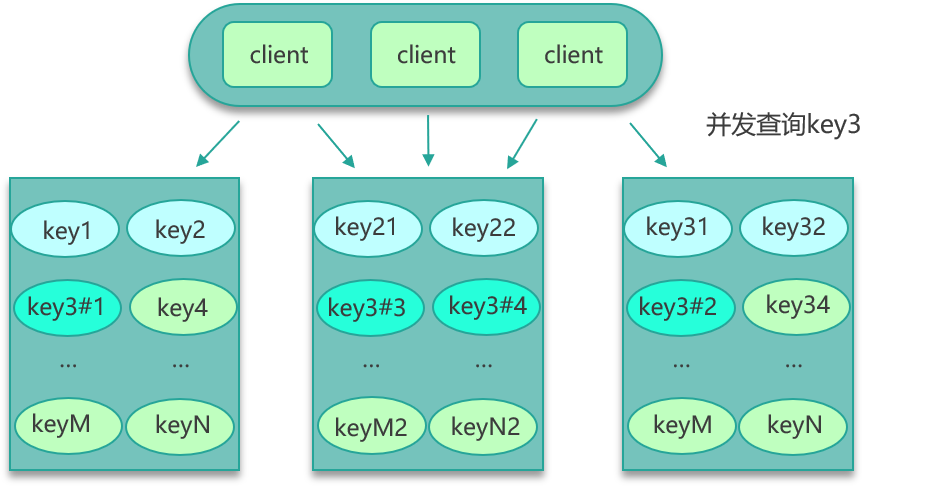
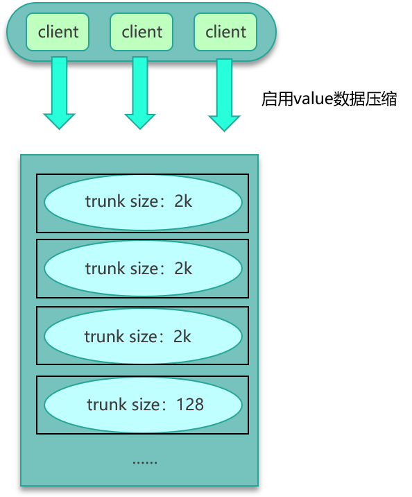

# 06 Hot Key和Big Key引发的问题怎么应对？

你好，我是你的缓存老师陈波，欢迎进入第6课时“缓存特殊 key 相关的经典问题”。

###### Hot key

###### 问题描述

第六个经典问题是 Hot key。对于大多数互联网系统，数据是分冷热的。比如最近的新闻、新发表的微博被访问的频率最高，而比较久远的之前的新闻、微博被访问的频率就会小很多。而在突发事件发生时，大量用户同时去访问这个突发热点信息，访问这个 Hot key，这个突发热点信息所在的缓存节点就很容易出现过载和卡顿现象，甚至会被 Crash。

###### 原因分析

Hot key 引发缓存系统异常，主要是因为突发热门事件发生时，超大量的请求访问热点事件对应的 key，比如微博中数十万、数百万的用户同时去吃一个新瓜。数十万的访问请求同一个 key，流量集中打在一个缓存节点机器，这个缓存机器很容易被打到物理网卡、带宽、CPU 的极限，从而导致缓存访问变慢、卡顿。

###### 业务场景

引发 Hot key 的业务场景很多，比如明星结婚、离婚、出轨这种特殊突发事件，比如奥运、春节这些重大活动或节日，还比如秒杀、双12、618 等线上促销活动，都很容易出现 Hot key 的情况。

###### 解决方案

要解决这种极热 key 的问题，首先要找出这些 Hot key 来。对于重要节假日、线上促销活动、集中推送这些提前已知的事情，可以提前评估出可能的热 key 来。而对于突发事件，无法提前评估，可以通过 Spark，对应流任务进行实时分析，及时发现新发布的热点 key。而对于之前已发出的事情，逐步发酵成为热 key 的，则可以通过 Hadoop 对批处理任务离线计算，找出最近历史数据中的高频热 key。

找到热 key 后，就有很多解决办法了。首先可以将这些热 key 进行分散处理，比如一个热 key 名字叫 hotkey，可以被分散为 hotkey#1、hotkey#2、hotkey#3，……hotkey#n，这 n 个 key 分散存在多个缓存节点，然后 client 端请求时，随机访问其中某个后缀的 hotkey，这样就可以把热 key 的请求打散，避免一个缓存节点过载，如下图所示。

其次，也可以 key 的名字不变，对缓存提前进行多副本+多级结合的缓存架构设计。

再次，如果热 key 较多，还可以通过监控体系对缓存的 SLA 实时监控，通过快速扩容来减少热 key 的冲击。

最后，业务端还可以使用本地缓存，将这些热 key 记录在本地缓存，来减少对远程缓存的冲击。

###### Big key

###### 问题描述

最后一个经典问题是 Big key，也就是大 Key 的问题。大 key，是指在缓存访问时，部分 Key 的 Value 过大，读写、加载易超时的现象。

###### 原因分析

造成这些大 key 慢查询的原因很多。如果这些大 key 占总体数据的比例很小，存 Mc，对应的 slab 较少，导致很容易被频繁剔除，DB 反复加载，从而导致查询较慢。如果业务中这种大 key 很多，而这种 key 被大量访问，缓存组件的网卡、带宽很容易被打满，也会导致较多的大 key 慢查询。另外，如果大 key 缓存的字段较多，每个字段的变更都会引发对这个缓存数据的变更，同时这些 key 也会被频繁地读取，读写相互影响，也会导致慢查现象。最后，大 key 一旦被缓存淘汰，DB 加载可能需要花费很多时间，这也会导致大 key 查询慢的问题。

###### 业务场景

大 key 的业务场景也比较常见。比如互联网系统中需要保存用户最新 1万 个粉丝的业务，比如一个用户个人信息缓存，包括基本资料、关系图谱计数、发 feed 统计等。微博的 feed 内容缓存也很容易出现，一般用户微博在 140 字以内，但很多用户也会发表 1千 字甚至更长的微博内容，这些长微博也就成了大 key，如下图。

###### 解决方案

对于大 key，给出 3 种解决方案。

- 第一种方案，如果数据存在 Mc 中，可以设计一个缓存阀值，当 value 的长度超过阀值，则对内容启用压缩，让 KV 尽量保持小的 size，其次评估大 key 所占的比例，在 Mc 启动之初，就立即预写足够数据的大 key，让 Mc 预先分配足够多的 trunk size 较大的 slab。确保后面系统运行时，大 key 有足够的空间来进行缓存。

- 第二种方案，如果数据存在 Redis 中，比如业务数据存 set 格式，大 key 对应的 set 结构有几千几万个元素，这种写入 Redis 时会消耗很长的时间，导致 Redis 卡顿。此时，可以扩展新的数据结构，同时让 client 在这些大 key 写缓存之前，进行序列化构建，然后通过 restore 一次性写入，如下图所示。

- 第三种方案时，如下图所示，将大 key 分拆为多个 key，尽量减少大 key 的存在。同时由于大 key 一旦穿透到 DB，加载耗时很大，所以可以对这些大 key 进行特殊照顾，比如设置较长的过期时间，比如缓存内部在淘汰 key 时，同等条件下，尽量不淘汰这些大 key。

至此，本课时缓存的 7 大经典问题全部讲完。

我们要认识到，对于互联网系统，由于实际业务场景复杂，数据量、访问量巨大，需要提前规避缓存使用中的各种坑。你可以通过提前熟悉 Cache 的经典问题，提前构建防御措施， 避免大量 key 同时失效，避免不存在 key 访问的穿透，减少大 key、热 key 的缓存失效，对热 key 进行分流。你可以采取一系列措施，让访问尽量命中缓存，同时保持数据的一致性。另外，你还可以结合业务模型，提前规划 cache 系统的 SLA，如 QPS、响应分布、平均耗时等，实施监控，以方便运维及时应对。在遇到部分节点异常，或者遇到突发流量、极端事件时，也能通过分池分层策略、key 分拆等策略，避免故障发生。

最终，你能在各种复杂场景下，面对高并发、海量访问，面对突发事件和洪峰流量，面对各种网络或机器硬件故障，都能保持服务的高性能和高可用。
