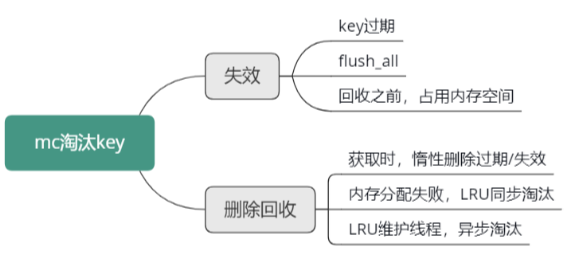
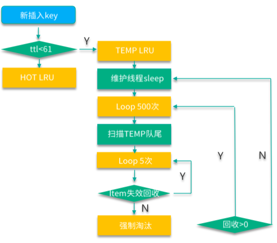
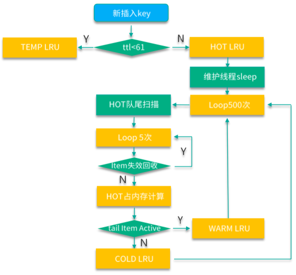
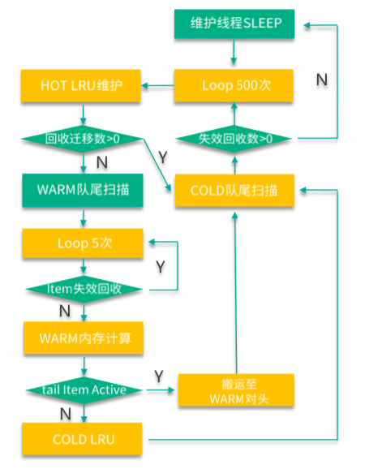
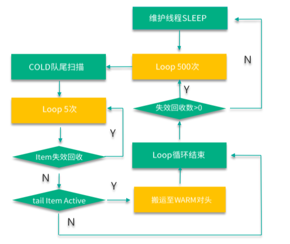

# 11 MC如何淘汰冷key和失效key

你好，我是你的缓存课老师陈波，欢迎进入第 11 课时“Memcached 淘汰策略”的学习。

###### 淘汰策略

Mc 作为缓存组件，意味着 Mc 中只能存储访问最频繁的热数据，一旦存入数据超过内存限制，就需要对 Mc 中的冷 key 进行淘汰工作。Mc 中的 key 基本都会有过期时间，在 key 过期后，出于性能考虑，Mc 并不会立即删除过期的 key，而是由维护线程逐步清理，同时，只有这个失效的 key 被访问时，才会进行删除，从而回收存储空间。所以 Mc 对 key 生命周期的管理，即 Mc 对 key 的淘汰，包括失效和删除回收两个纬度，知识结构如下图所示。

key 的失效，包括 key 在 expire 时间之后的过期，以及用户在 flush_all 之后对所有 key 的过期 2 种方式。

而 Mc 对 key/value 的删除回收，则有 3 种方式。

1. 第一种是获取时的惰性删除，即 key 在失效后，不立即删除淘汰，而在获取时，检测 key 的状态，如果失效，才进行真正的删除并回收存储空间。
1. 第二种方式是在需要对 Item 进行内存分配申请时，如果内存已全部用完，且该 Item 对应的slabclass 没有空闲的 chunk 可用，申请失败，则会对 LRU 队尾进行同步扫描，回收过期失效的 key，如果没有失效的 key，则会强制删除一个 key。
1. 第三种方式是 LRU 维护线程，不定期扫描 4 个 LRU 队列，对过期 key/value 进行异步淘汰。

###### flush_all

Mc 中，key 失效除了常规的到达过期时间之外，还有一种用 flush_all 的方式进行全部过期。如果缓存数据写入异常，出现大量脏数据，而又没有简单的办法快速找出所有的脏数据，可以用 flush_all 立即让所有数据失效，通过 key 重新从 DB 加载的方式来保证数据的正确性。flush_all 可以让 Mc 节点的所有 key 立即失效，不过，在某些场景下，需要让多个 Mc 节点的数据在某个时间同时失效，这时就可以用 flush_all 的延迟失效指令了。该指令通过 flush_all 指令后面加一个 expiretime 参数，可以让多个 Mc 在某个时间同时失效所有的 key。

flush_all 后面没有任何参数，等价于 flush_all 0，即立即失效所有的 key。当 Mc 收到 flush_all 指令后，如果是延迟失效，会将全局 setting 中的 oldest_live 设为指定 N 秒后的时间戳，即 N 秒后失效；如果是立即失效，则将全局 setting 中的 oldest_cas 设为当前最大的全局 cas 值。设置完这个全局变量值后，立即返回。因此，在 Mc 通过 flush_all 失效所有 key 时，实际不做任何 key 的删除操作，这些 key ，后续会通过用户请求同步删除，或 LRU 维护线程的异步删除，来完成真正的删除动作。

###### 惰性删除

Mc 中，过期失效 key 的惰性主动删除，是指在 touch、get、gets 等指令处理时，首先需要查询 key，找到 key 所在的 Item，然后校验 key 是否过期，是否被 flush，如果过期或被 flush，则直接进行真正的删除回收操作。

对于校验 key 过期很容易，直接判断过期时间即可。对于检查 key 是否被 flush，处理逻辑是首先检查 key 的最近访问时间是否小于全局设置中的 oldest_live，如果小于则说明 key 被 flush 了；否则，再检查 key 的 cas 唯一 id 值，如果小于全局设置中的 oldest_cas，说明也被 flush 了。

###### 内存分配失败，LRU 同步淘汰

Mc 在插入或变更 key 时，首先会在适合的 slabclass 为新的 key/value 分配一个空闲的 Item 空间，如果分配失败，会同步对该 slabclass 的 COLD LRU 进行队尾元素淘汰，如果淘汰回收成功，则 slabclass 会多一个空闲的 Item，这个 Item 就可以被前面那个 key 来使用。如果 COLD LRU 队列没有 Item 数据，则淘汰失败，此时会对 HOT LRU 进行队尾轮询，如果 key 过期失效则进行淘汰回收，否则进行迁移。

###### LRU 维护线程，异步淘汰

在 key 进行读取、插入或变更时，同步进行 key 淘汰回收，并不是一种高效的办法，因为淘汰回收操作相比请求处理，也是一个重量级操作，会导致 Mc 性能大幅下降。因此 Mc 额外增加了一个 LRU 维护线程，对过期失效 key 进行回收，在不增加请求负担的情况下，尽快回收失效 key 锁占用的空间。

前面讲到，Mc 有 64 个 slabclass，其中 1~63 号 slabclass 用于存取 Item 数据。实际上，为了管理过期失效数据，1~63 号 slabclass 还分别对应了 4 个 LRU，分布是 TEMP、HOT、WARM、COLD LRU。所以这就总共有 63\*4 = 252 个 LRU。LRU 维护线程，会按策略间断 sleep，待 sleep 结束，就开始对 4 个 LRU 进行队尾清理工作。

Mc 在新写入 key 时，如果 key 的过期时间小于 61s，就会直接插入到 TEMP LRU 中，如下图所示。TEMP LRU 没有长度限制，可以一直插入，同时因为过期时间短，TEMP LRU 不进行队列内部的搬运和队列间的迁移，确保处理性能最佳。LRU 维护线程在 sleep 完毕后，首先会对 TEMP LRU 队尾进行 500 次轮询，然后在每次轮询时，会进行 5 次小循环。小循环时，首先检查 key是否过期失效，如果失效则进行回收淘汰，然后继续小循环；如果遇到一个没失效的 key，则回收该 key 并退出 TEMP LRU 的清理工作。如果 TEMP LRU 队尾 key 全部失效，维护线程一次可以回收 500\*5 共 2500 个失效的 key。

如下图，MC 在新写入 key 时，如果 key 的过期时间超过 61s，就会直接插入到 HOT LRU。HOT LRU 会有内存限制，每个 HOT LRU 所占内存不得超过所在 slabclass 总实际使用内存的 20%。LRU 维护线程在执行日常维护工作时，首先对 TEMP LRU 进行清理，接下来就会对 HOT LRU 进行维护。HOT LRU 的维护，也是首先轮询 500 次，每次轮询进行 5 次小循环，小循环时，首先检查 key 是否过期失效，如果失效则进行回收淘汰，然后继续小循环。直到遇到没失效的 key。如果这个 key 的状态是 ACTIVE，则迁移到 WARM LRU。对于非 ACTIVE 状态的 key，如果 HOT LRU 内存占用超过限制，则迁移到 COLD LRU，否则进行纾困性清理掉该 key，注意这种纾困性清理操作一般不会发生，一旦发生时，虽然会清理掉该 key，但操作函数此时也认定本次操作回收和清理 keys 数仍然为 0。

如下图，如果 HOT LRU 中回收和迁移的 keys 数为 0，LRU 维护线程会对 WARM LRU 进行轮询。WARM LRU 也有内存限制，每个 WARM LRU 所占内存不得超过所在 slabclass 总实际使用内存的 40%。WARM LRU 的维护，也是首先轮询 500 次，每次轮询进行 5 次小循环，小循环时，首先检查 key 是否过期失效，如果失效则进行回收淘汰，然后继续小循环。直到遇到没失效的 key。如果这个 key 的状态是 ACTIVE，则内部搬运到 LRU 队列头部。对于非 ACTIVE 状态的 key，如果 WARM LRU 内存占用超过限制，则迁移到 COLD LRU，否则进行纾困性清理掉该 key。注意这种纾困性清理操作一般不会发生，一旦发生时，虽然会清理掉该 key，但操作函数此时也认定本次操作回收和清理 keys 数仍然为 0。

LRU 维护线程最后会对 COLD LRU 进行维护，如下图。与 TEMP LRU 相同，COLD LRU 也没有长度限制，可以持续存放数据。COLD LRU 的维护，也是首先轮询 500 次，每次轮询进行 5 次小循环，小循环时，首先检查 key 是否过期失效，如果失效则进行回收淘汰，然后继续小循环。直到遇到没失效的 key。如果这个 key 的状态是 ACTIVE，则会迁移到 WARM LRU 队列头部，否则不处理直接返回。

LRU 维护线程处理时，TEMP LRU 是在独立循环中进行，其他三个 LRU 在另外一个循环中进行，如果 HOT、WARM、COLD LRU 清理或移动的 keys 数为 0，则那个 500 次的大循环就立即停止。
