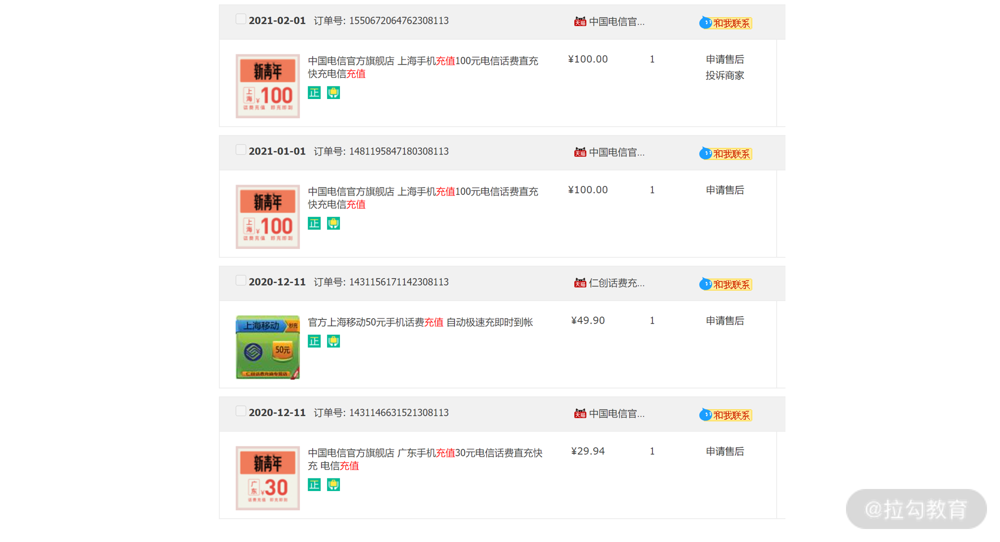

# 05 表结构设计：忘记范式准则

前面几讲我虽然带你了解了数字类型、字符串、日期类型，以及非结构化的 JSON 类型，但也只是每条记录每个字段的选择。

而我们在对一张表进行设计时，还要遵守一些基本的原则，比如你经常听见的“范式准则”。但范式准则过于理论，在真实业务中，你不必严格遵守三范式的要求。而且有时为了性能考虑，你还可以进行反范式的设计，比如在数据仓库领域。这一讲我就会带你了解这些内容，希望你学完这一讲之后，能从更高一层的维度来看待 MySQL 数据库的表结构设计。

### 忘记范式准则

相信你在大学学习《数据库系统概论》时，肯定学习过关系数据库的设计规范，比如第一范式、第二范式、第三范式，BC 范式等，它们是《数据库系统概论》考试中重要的考点。

范式设计是非常重要的理论，是通过数学集合概念来推导范式的过程，在理论上，要求表结构设计必须至少满足三范式的要求。

由于完全是数据推导过程，范式理论非常枯燥， **但你只要记住几个要点就能抓住其中的精髓：**

- 一范式要求所有属性都是不可分的基本数据项；
- 二范式解决部分依赖；
- 三范式解决传递依赖。

虽然我已经提炼了范式设计的精髓，但要想真正理解范式设计，就要抛弃纯理论的范式设计准则， **从业务角度出发，设计出符合范式准则要求的表结构。**

### 工程上的表结构设计实战

真实的业务场景是工程实现，表结构设计做好以下几点就已经足够：

- 每张表一定要有一个主键（方法有自增主键设计、UUID 主键设计、业务自定义生成主键）；
- 消除冗余数据存在的可能。

我想再次强调一下，你不用过于追求所谓的数据库范式准则，甚至有些时候，我们还会进行反范式的设计。

#### 自增主键设计

主键用于唯一标识一行数据，所以一张表有主键，就已经直接满足一范式的要求了。在 01 讲的整型类型中，我提及可以使用 BIGINT 的自增类型作为主键，同时由于整型的自增性，数据库插入也是顺序的，性能较好。

但你要注意，使用 BIGINT 的自增类型作为主键的设计仅仅适合 **非核心业务表** ，比如告警表、日志表等。 **真正的核心业务表，一定不要用自增键做主键** ，主要有 6 个原因：

- 自增存在回溯问题；
- 自增值在服务器端产生，存在并发性能问题；
- 自增值做主键，只能在当前实例中保证唯一， **不能保证全局唯一** ；
- 公开数据值，容易引发安全问题，例如知道地址[http://www.example.com/User/10/](http://www.example.com/customers/10/?fileGuid=xxQTRXtVcqtHK6j8)，很容猜出 User 有 11、12 依次类推的值，容易引发数据泄露；
- MGR（MySQL Group Replication） 可能引起的性能问题；
- 分布式架构设计问题。

自增存在回溯问题，我在 01 讲中已经讲到，如果你想让核心业务表用自增作为主键，MySQL 数据库版本应该尽可能升级到 8.0 版本。

又因为自增值是在 MySQL 服务端产生的值，需要有一把自增的 AI 锁保护，若这时有大量的插入请求，就可能存在自增引起的性能瓶颈。比如在 MySQL 数据库中，参数 innodb_autoinc_lock_mode 用于控制自增锁持有的时间。假设有一 SQL 语句，同时插入 3 条带有自增值的记录：

```sql
INSERT INTO ... VALUES (NULL,...),(NULL,...),(NULL,...);
```

则参数 innodb_autoinc_lock_mode 的影响如下所示：


从表格中你可以看到，一条 SQL 语句插入 3 条记录，参数 innodb_autoinc_lock_mode 设置为 1，自增锁在这一条 SQL 执行完成后才释放。

如果参数 innodb_autoinc_lock_mode 设置为2，自增锁需要持有 3 次，每插入一条记录获取一次自增锁。

- **这样设计好处是：** 当前插入不影响其他自增主键的插入，可以获得最大的自增并发插入性能。
- **缺点是：** 一条 SQL 插入的多条记录并不是连续的，如结果可能是 1、3、5 这样单调递增但非连续的情况。 **所以，如果你想获得自增值的最大并发性能，把参数 innodb_autoinc_lock_mode 设置为2。** 虽然，我们可以调整参数 innodb_autoinc_lock_mode获得自增的最大性能，但是由于其还存在上述 5 个问题。因此，在互联网海量并发架构实战中， **我更推荐 UUID 做主键或业务自定义生成主键。** #### UUID主键设计

UUID（Universally Unique Identifier）代表全局唯一标识 ID。显然，由于全局唯一性，你可以把它用来作为数据库的主键。

MySQL 数据库遵循 [DRFC 4122](https://tools.ietf.org/html/rfc4122?fileGuid=xxQTRXtVcqtHK6j8) 命名空间版本定义的 Version 1规范，可以通过函数 UUID自动生成36字节字符。如：

```sql
mysql> SELECT UUID();
+--------------------------------------+
| UUID()                               |
+--------------------------------------+
| e0ea12d4-6473-11eb-943c-00155dbaa39d |
+--------------------------------------+
```

根据 Version 1的规范，MySQL中的 UUID 由以下几个部分组成：

```plaintext
UUID = 时间低（4字节）- 时间中高+版本（4字节）- 时钟序列 - MAC地址
```

前 8 个字节中，60 位用于存储时间，4 位用于 UUID 的版本号，其中时间是从 1582-10-15 00：00：00.00 到现在的 **100ns 的计数。**

60 位的时间存储中，其存储分为：

- 时间低位（time-low），占用 12 位；
- 时间中位（time-mid），占用 2 字节，16 位；
- 时间高位（time-high），占用 4 字节，32 位；

**需要特别注意的是，在存储时间时，UUID 是根据时间位逆序存储，** 也就是低时间低位存放在最前面，高时间位在最后，即 UUID 的前 4 个字节会随着时间的变化而不断“随机”变化，并非单调递增。而非随机值在插入时会产生离散 IO，从而产生性能瓶颈。这也是 UUID 对比自增值最大的弊端。

为了解决这个问题，MySQL 8.0 推出了函数 UUID_TO_BIN，它可以把 UUID 字符串：

- 通过参数将时间高位放在最前，解决了 UUID 插入时乱序问题；
- 去掉了无用的字符串"-"，精简存储空间；
- 将字符串其转换为二进制值存储，空间最终从之前的 36 个字节缩短为了 16 字节。

下面我们将之前的 UUID 字符串 e0ea12d4-6473-11eb-943c-00155dbaa39d 通过函数 UUID_TO_BIN 进行转换，得到二进制值如下所示：

```sql
SELECT UUID_TO_BIN('e0ea12d4-6473-11eb-943c-00155dbaa39d',TRUE) as UUID_BIN;
+------------------------------------+
| UUID_BIN                           |
+------------------------------------+
| 0x11EB6473E0EA12D4943C00155DBAA39D |
+------------------------------------+
1 row in set (0.00 sec)
```

除此之外，MySQL 8.0 也提供了函数 BIN_TO_UUID，支持将二进制值反转为 UUID 字符串。

当然了，MySQL 8.0版本之前没有函数 UUID_TO_BIN/BIN_TO_UUID，但是你还是可以通过用户义函数（UDF）的方式解决，如创建下面的函数：

```plaintext
CREATE FUNCTION MY_UUID_TO_BIN(_uuid BINARY(36))
    RETURNS BINARY(16)
    LANGUAGE SQL  DETERMINISTIC  CONTAINS SQL  SQL SECURITY INVOKER
    RETURN
        UNHEX(CONCAT(
            SUBSTR(_uuid, 15, 4),
            SUBSTR(_uuid, 10, 4),
            SUBSTR(_uuid,  1, 8),
            SUBSTR(_uuid, 20, 4),
            SUBSTR(_uuid, 25) ));
CREATE FUNCTION MY_BIN_TO_UUID(_bin BINARY(16))
    RETURNS  CHAR(36)
    LANGUAGE SQL  DETERMINISTIC  CONTAINS SQL  SQL SECURITY INVOKER
    RETURN
        LCASE(CONCAT_WS('-',
            HEX(SUBSTR(_bin,  5, 4)),
            HEX(SUBSTR(_bin,  3, 2)),
            HEX(SUBSTR(_bin,  1, 2)),
            HEX(SUBSTR(_bin,  9, 2)),
            HEX(SUBSTR(_bin, 11)) ));
```

因此，对于 04 讲创建的表 User，可以将其主键修改为 BINARY(16)，用于存储排序后的 16 字节的 UUID 值。其表结构修如下：

```sql
CREATE TABLE User (
    id  BINARY(16) NOT NULL,
    name VARCHAR(255) NOT NULL,
    sex CHAR(1) NOT NULL,
    password VARCHAR(1024) NOT NULL,
    money INT NOT NULL DEFAULT 0,
    register_date DATETIME(6) NOT NULL DEFAULT CURRENT_TIMESTAMP(6),
    last_modify_date DATETIME(6) NOT NULL DEFAULT CURRENT_TIMESTAMP(6) ON UPDATE CURRENT_TIMESTAMP(6),
    uuid CHAR(36) AS (BIN_TO_UUID(id)),
    CONSTRAINT chk_sex CHECK (sex = 'M' OR sex = 'F'),
    PRIMARY KEY(id)
);
```

现在，你可以在客户端通过以下 SQL 命令插入数据，如：

```sql
INSERT INTO User VALUES (UUID_TO_BIN(UUID(),TRUE),......);
```

当然，很多同学也担心 UUID 的性能和存储占用的空间问题，这里我也做了相关的插入性能测试，结果如下表所示：


可以看到，MySQL 8.0 提供的排序 UUID 性能最好，甚至比自增ID还要好。此外，由于UUID_TO_BIN转换为的结果是16 字节，仅比自增 ID 增加 8 个字节，最后存储占用的空间也仅比自增大了 3G。

而且由于 UUID 能保证全局唯一，因此使用 UUID 的收益远远大于自增ID。可能你已经习惯了用自增做主键，但在海量并发的互联网业务场景下，更推荐 UUID 这样的全局唯一值做主键。

比如，我特别推荐游戏行业的用户表结构设计，使用 UUID 作为主键，而不是用自增 ID。因为当发生合服操作时，由于 UUID 全局唯一，用户相关数据可直接进行数据的合并，而自增 ID 却需要额外程序整合两个服务器 ID 相同的数据，这个工作是相当巨大且容易出错的。

#### 业务自定义生成主键

当然了，UUID 虽好，但是在分布式数据库场景下，主键还需要加入一些额外的信息，这样才能保证后续二级索引的查询效率（具体这部分内容将在后面的分布式章节中进行介绍）。 **现在你只需要牢记：分布式数据库架构，仅用 UUID 做主键依然是不够的。** 所以，对于分布式架构的核心业务表，我推荐类似如下的设计，比如：

```plaintext
PK = 时间字段 + 随机码（可选） + 业务信息1 + 业务信息2 ......
```

电商业务中，订单表是其最为核心的表之一，你可以先打开淘宝 App，查询下自己的订单号，可以查到类似如下的订单信息：



上图是我自己的淘宝订单信息（第一个订单的订单号为1550672064762308113）。

订单号显然是订单表的主键，但如果你以为订单号是自增整型，那就大错特错了。因为如果你仔细观察的话，可以发现图中所有订单号的后 6 位都是相同的，都为 **308113** ：

```1550672064762308113
1481195847180308113
1431156171142308113
1431146631521308113
```

所以，我认为淘宝订单号的最后 6 位是用户 ID 相关信息，前 14 位是时间相关字段，这样能保证插入的自增性，又能同时保留业务的相关信息作为后期的分布式查询。

#### 消除冗余

消除冗余也是范式的要求，解决部分依赖和传递依赖，本质就是尽可能减少冗余数据。

所以，在进行表结构设计时，数据只需存放在一个地方，其他表要使用，通过主键关联存储即可。比如订单表中需要存放订单对应的用户信息，则保存用户 ID 即可：

```sql
CREATE TABLE Orders (
  order_id VARCHRA(20),
  user_id  BINARY(16),
  order_date datetime,
  last_modify_date datetime
  ...
  PRIMARY KEY(order_id),
  KEY(user_id,order_date)
  KEY(order_date),
  KEY(last_modify_date)
)
```

当然了，无论是自增主键设计、UUID主键设计、业务自定义生成主键、还是消除冗余，本质上都是遵循了范式准则。但是在一些其他业务场景下，也存在反范式设计的情况。

#### 反范式设计

通常我们会在 OLAP 数据分析场景中使用反范式设计，但随着 JSON 数据类型的普及，MySQL 在线业务也可以进行反范式的设计。

在 04 讲中我讲了表 UserTag，就是通过 JSON 数据类型进行了反范式的设计，如果通过范式设计，则表 UserTag 应该设计为：

```sql
CREATE TABLE UserTag (
    userId BIGINT NOT NULL,
    userTag INT NOT NULL,
    PRIMARY KEY(userId,userTag)
);
SELECT * FROM UserTag;
+--------+---------+
| userId | userTag |
+--------+---------+
|      1 |   2     |
|      1 |   6     |
|      1 |   8     |
|      1 |  10     |
|      2 |   3     |
|      2 |  10     |
|      2 |  12     |
+--------+---------+
```

你对比后可以发现，范式设计并没有使用 JSON 数据类型来得更为有效，使用 JSON 数据类型，userID 只需保存一次，从一定程度上减少了数据的冗余：

```plaintext
+--------+---------------+
| userId | userTags      |
+--------+---------------+
|      1 | [2, 6, 8, 10] |
|      2 | [3, 10, 12]   |
+--------+---------------
```

### 总结

总的来说，范式是偏数据库理论范畴的表结构设计准则，在实际的工程实践上没有必要严格遵循三范式要求， **在 MySQL 海量并发的工程实践上，表结构设计应遵循这样几个规范：**

- 每张表一定要有一个主键；
- 自增主键只推荐用在非核心业务表，甚至应避免使用；
- 核心业务表推荐使用 UUID 或业务自定义主键；
- 一份数据应尽可能保留一份，通过主键关联进行查询，避免冗余数据；
- 在一些场景下，可以通过 JSON 数据类型进行反范式设计，提升存储效率；
