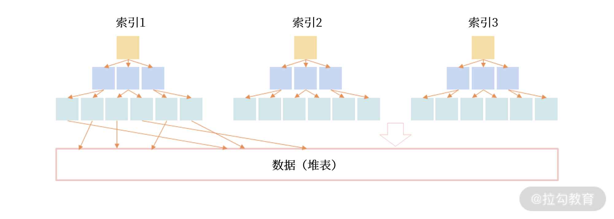
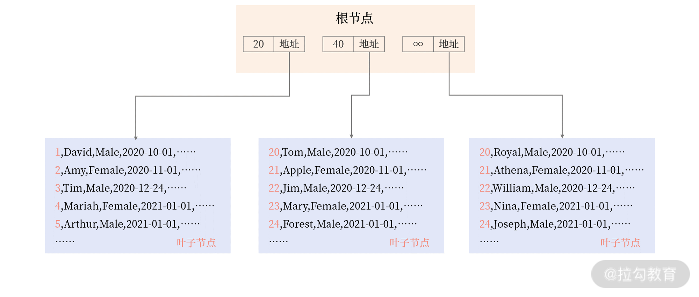

# 09 索引组织表：万物皆索引

上一讲，我已经带你了解了 B+ 树索引的基本概念，以及 MySQL 中怎么对 B+ 树索引进行基本的管理。为了让你进一步深入了解 MySQL 的 B+ 树索引的具体使用，这一讲我想和你聊一聊 MySQL InnoDB 存储引擎的索引结构。

InnoDB 存储引擎是 MySQL 数据库中使用最为广泛的引擎，在海量大并发的 OLTP 业务中，InnoDB 必选。它在数据存储方面有一个非常大的特点：索引组织表（Index Organized Table）。

接下来我就带你了解最为核心的概念：索引组织表。希望你学完今天的内容之后能理解 MySQL 是怎么存储数据和索引对象的。

### 索引组织表

数据存储有 **堆表和索引组织表** 两种方式。

**堆表中的数据无序存放，** 数据的排序完全依赖于索引（Oracle、Microsoft SQL Server、PostgreSQL 早期默认支持的数据存储都是堆表结构）。



从图中你能看到，堆表的组织结构中，数据和索引分开存储。索引是排序后的数据，而堆表中的数据是无序的，索引的叶子节点存放了数据在堆表中的地址，当堆表的数据发生改变，且位置发生了变更，所有索引中的地址都要更新，这非常影响性能，特别是对于 OLTP 业务。**而索引组织表，数据根据主键排序存放在索引中**，主键索引也叫聚集索引（Clustered Index）。在索引组织表中，数据即索引，索引即数据。

MySQL InnoDB 存储引擎就是这样的数据组织方式；Oracle、Microsoft SQL Server 后期也推出了支持索引组织表的存储方式。

但是，PostgreSQL 数据库因为只支持堆表存储，不适合 OLTP 的访问特性，虽然它后期对堆表有一定的优化，但本质是通过空间换时间，对海量并发的 OLTP 业务支持依然存在局限性。

回看 08 讲中的 User 表，其就是索引组织表的方式：



表 User 的主键是 id，所以表中的数据根据 id 排序存储，叶子节点存放了表中完整的记录，可以看到表中的数据存放在索引中，即表就是索引，索引就是表。

在了解完 MySQL InnoDB 的主键索引存储方式之后，接下来我们继续了解二级索引。

### 二级索引

InnoDB 存储引擎的数据是根据主键索引排序存储的，除了主键索引外，**其他的索引都称之为二级索引（Secondeary Index），** 或非聚集索引（None Clustered Index）。

二级索引也是一颗 B+ 树索引，但它和主键索引不同的是叶子节点存放的是索引键值、主键值。对于 08 讲创建的表 User，假设在列 name 上还创建了索引 idx_name，该索引就是二级索引：

```sql
CREATE TABLE User (
    id BIGINT AUTO_INCREMENT,
    name VARCHAR(128) NOT NULL,
    sex CHAR(6) NOT NULL,
    registerDate DATETIME NOT NULL,
    ...
    PRIMARY KEY(id), -- 主键索引
    KEY idx_name(name) -- 二级索引
)
```

如果用户通过列 name 进行查询，比如下面的 SQL：

```sql
SELECT * FROM User WHERE name = 'David'，
```

通过二级索引 idx_name 只能定位主键值，需要额外再通过主键索引进行查询，才能得到最终的结果。**这种“二级索引通过主键索引进行再一次查询”的操作叫作“回表”**，你可以通过下图理解二级索引的查询：


索引组织表这样的二级索引设计有一个非常大的好处：若记录发生了修改，则其他索引无须进行维护，除非记录的主键发生了修改。

与堆表的索引实现对比着看，你会发现索引组织表在存在大量变更的场景下，性能优势会非常明显，因为大部分情况下都不需要维护其他二级索引。

前面我强调“索引组织表，数据即索引，索引即数据”。那么为了便于理解二级索引，你可以将二级索引按照一张表来进行理解，比如索引 idx_name 可以理解成一张表，如下所示：

```sql
CREATE TABLE idx_name (
    name VARCHAR(128) NOT NULL,
    id BIGINT NOT NULL,
    PRIAMRY KEY(name,id)
)
```

根据 name 进行查询的 SQL 可以理解为拆分成了两个步骤：

```sql
SELECT id FROM idx_name WHERE name = ?
SELECT * FROM User WHERE id = _id; -- 回表
```

当插入数据时，你可以理解为对主键索引表、二级索引表进行了一个事务操作，要么都成功，要么都不成功：

```sql
START TRANSATION;
INSERT INTO User VALUES (...) -- 主键索引
INSERT INTO idx_name VALUES (...) -- 二级索引
COMMIT;
```

当然，对于索引，还可以加入唯一的约束，具有唯一约束的索引称之为唯一索引，也是二级索引。

对于表 User，列 name 应该具有唯一约束，因为通常用户注册通常要求昵称唯一，所以表User 定义更新为：

```sql
CREATE TABLE User (
    id BIGINT AUTO_INCREMENT,
    name VARCHAR(128) NOT NULL,
    sex CHAR(6) NOT NULL,
    registerDate DATETIME NOT NULL,
    ...
    PRIMARY KEY(id), -- 主键索引
    UNIQUE KEY idx_name(name) -- 二级索引
)
```

**那么对于唯一索引又该如何理解为表呢？** 其实我们可以将约束理解成一张表或一个索引，故唯一索引 idx_name 应该理解为：

```sql
CREATE TABLE idx_name (
    name VARCHAR(128) NOT NULL,
    id BIGINT NOT NULL,
    PRIAMRY KEY(name,id)
) -- 二级索引
CREATE TABLE check_idx_name (
    name VARCHAR(128),
    PRIMARY KEY(name)，
) -- 唯一约束
```

讲到这儿，你应该理解了吧？**在索引组织表中，万物皆索引，索引就是数据，数据就是索引** 。**最后，为了加深你对于索引组织表的理解**，我们再来回顾一下堆表的实现。

堆表中的索引都是二级索引，哪怕是主键索引也是二级索引，也就是说它没有聚集索引，每次索引查询都要回表。同时，堆表中的记录全部存放在数据文件中，并且无序存放，这对互联网海量并发的 OLTP 业务来说，堆表的实现的确“过时”了。

以上就是二级索引的内容。

有的同学会提问：感觉二级索引与主键索引并没有太大的差别，所以为了进一步理解二级索引的开销，接下来我们一起学习二级索引的性能评估。

希望学完这部分内容之后，你能明白，**为什么通常二级索引会比主键索引慢一些** 。

### 二级索引的性能评估

主键在设计时可以选择比较顺序的方式，比如自增整型，自增的 UUID 等，所以主键索引的排序效率和插入性能相对较高。二级索引就不一样了，它可能是比较顺序插入，也可能是完全随机的插入，**具体如何呢？来看一下比较接近业务的表 User：** 

```sql
CREATE TABLE User (
```

id  BINARY(16) NOT NULL,
name VARCHAR(255) NOT NULL,
sex CHAR(1) NOT NULL,
password VARCHAR(1024) NOT NULL,
money BIG INT NOT NULL DEFAULT 0,
register_date DATETIME(6) NOT NULL DEFAULT CURRENT_TIMESTAMP(6),
last_modify_date DATETIME(6) NOT NULL DEFAULT CURRENT_TIMESTAMP(6) ON UPDATE CURRENT_TIMESTAMP(6),
uuid CHAR(36) AS (BIN_TO_UUID(id)),
CHECK (sex = 'M' OR sex = 'F'),
CHECK (IS_UUID(UUID)),
PRIMARY KEY(id),
UNIQUE KEY idx_name(name),
KEY idx_register_date(register_date),
KEY idx_last_modify_date(last_modify_date)

```plaintext
);
```

可以看到，表 User 有三个二级索引 idx\_name、idx\_register\_date、idx\_last\_modify\_date。**通常业务是无法要求用户注册的昵称是顺序的，所以索引 idx_name 的插入是随机的，** 性能开销相对较大；另外用户昵称通常可更新，但业务为了性能考虑，可以限制单个用户每天、甚至是每年昵称更新的次数，比如每天更新一次，每年更新三次。**而用户注册时间是比较顺序的，所以索引 idx_register_date 的性能开销相对较小，** 另外用户注册时间一旦插入后也不会更新，只是用于标识一个注册时间。**而关于 idx_last_modify_date ，** 我在 03 讲就强调过，在真实业务的表结构设计中，你必须对每个核心业务表创建一个列 last\_modify\_date，标识每条记录的修改时间。
这时索引 idx\_last\_modify\_date 的插入和 idx\_register\_date 类似，是比较顺序的，但不同的是，索引 idx\_last\_modify\_date 会存在比较频繁的更新操作，比如用户消费导致余额修改、money 字段更新，这会导致二级索引的更新。
由于每个二级索引都包含了主键值，查询通过主键值进行回表，所以在设计表结构时让主键值尽可能的紧凑，为的就是能提升二级索引的性能，**我在 05 讲推荐过 16 字节顺序 UUID 的列设计，这是性能和存储的最佳实践** 。
除此之外，在实际核心业务中，开发同学还有很大可能会设计带有业务属性的主键，但请牢记以下两点设计原则：
*   要比较顺序，对聚集索引性能友好；
*   尽可能紧凑，对二级索引的性能和存储友好；
### 函数索引
到目前为止，我们的索引都是创建在列上，从 MySQL 5.7 版本开始，MySQL 就开始支持创建函数索引 **（即索引键是一个函数表达式）。** 函数索引有两大用处：
*   优化业务 SQL 性能；
*   配合虚拟列（Generated Column）。**先来看第一个好处，优化业务 SQL 性能。** 我们知道，不是每个开发人员都能比较深入地了解索引的原理，有时他们的表结构设计和编写 SQL 语句会存在“错误”，比如对于上面的表 User，要查询 2021 年1 月注册的用户，有些开发同学会错误地写成如下所示的 SQL：

```sql
SELECT * FROM User

WHERE DATE_FORMAT(register_date,'%Y-%m') = '2021-01'
```

或许开发同学认为在 register\_date 创建了索引，所以所有的 SQL 都可以使用该索引。**但索引的本质是排序，** 索引 idx\_register\_date 只对 register\_date 的数据排序，又没有对DATE\_FORMAT(register\_date) 排序，因此上述 SQL 无法使用二级索引idx\_register\_date。**数据库规范要求查询条件中函数写在等式右边，而不能写在左边**，就是这个原因。
我们通过命令 EXPLAIN 查看上述 SQL 的执行计划，会更为直观地发现索引 idx\_register\_date没有被使用到：

```sql
EXPLAIN SELECT * FROM User

WHERE DATE_FORMAT(register_date,'%Y-%m') = '2021-01'

****  ****  ****  ****  ****  ****  ***1. row**  ****  ****  ****  ****  ****  **** *
```

id: 1

```plaintext
select_type: SIMPLE
```

table: User

```plaintext
partitions: NULL
```

type: ALL

```plaintext
possible_keys: NULL
```

key: NULL
  key_len: NULL
      ref: NULL
     rows: 1
 filtered: 100.00
    Extra: Using where

```plaintext
```
上述需求正确的 SQL 写法应该是，其中变化在第 2 行，主要将函数 DATE\_FORMAT 插接为了一个范围查询：
```

EXPLAIN SELECT * FROM User

WHERE register_date > '2021-01-01'

AND register_date \< '2021-02-01'

****  ****  ****  ****  ****  ****  ***1. row**  ****  ****  ****  ****  ****  **** *id: 1

select_type: SIMPLE

```plaintext
    table: User
```

partitions: NULL

```plaintext
     type: range
```

possible_keys: idx_register_date

```plaintext
      key: idx_register_date
  key_len: 8
      ref: NULL
     rows: 1
 filtered: 100.00
    Extra: Using index condition
```


```plaintext
如果线上业务真的没有按正确的 SQL 编写，那么可能造成数据库存在很多慢查询 SQL，导致业务缓慢甚至发生雪崩的场景。**要尽快解决这个问题，可以使用函数索引，** 创建一个DATE\_FORMAT(register\_date) 的索引，这样就能利用排序数据快速定位了：
```

ALTER TABLE User

ADD INDEX

idx_func_register_date((DATE_FORMAT(register_date,'%Y-%m')));

```plaintext
接着用命令 EXPLAIN 查看执行计划，就会发现 SQL 可以使用到新建的索引idx\_func\_register\_date：
```

EXPLAIN SELECT * FROM User

WHERE DATE_FORMAT(register_date,'%Y-%m') = '2021-01'

****  ****  ****  ****  ****  ****  ***1. row**  ****  ****  ****  ****  ****  **** *id: 1

select_type: SIMPLE

```plaintext
    table: User
```

partitions: NULL

```plaintext
     type: ref
```

possible_keys: idx_func_register_date

```plaintext
      key: idx_func_register_date
  key_len: 31
      ref: const
     rows: 1
 filtered: 100.00
    Extra: NULL
```


```plaintext
上述创建的函数索引可以解决业务线上的燃眉之急，但强烈建议业务开发同学在下一个版本中优化 SQL，否则这会导致对同一份数据做了两份索引，索引需要排序，排序多了就会影响性能。**函数索引第二大用处是结合虚拟列使用。** 在前面的 JSON 小节中，我们已经创建了表 UserLogin：
```

CREATE TABLE UserLogin (

```plaintext
userId BIGINT,
loginInfo JSON,
cellphone VARCHAR(255) AS (loginInfo->>"$.cellphone"),
PRIMARY KEY(userId),
UNIQUE KEY idx_cellphone(cellphone)
```

);

```plaintext
其中的列 cellphone 就是一个虚拟列，它是由后面的函数表达式计算而成，本身这个列不占用任何的存储空间，而索引 idx\_cellphone 实质是一个函数索引。这样做得好处是在写 SQL 时可以直接使用这个虚拟列，而不用写冗长的函数：
```

-- 不用虚拟列

SELECT  *  FROM UserLogin

WHERE loginInfo->>"$.cellphone" = '13918888888'

-- 使用虚拟列

SELECT  *  FROM UserLogin

WHERE cellphone = '13918888888'

```plaintext
对于爬虫类的业务，我们会从网上先爬取很多数据，其中有些是我们关心的数据，有些是不关心的数据。通过虚拟列技术，可以展示我们想要的那部分数据，再通过虚拟列上创建索引，就是对爬取的数据进行快速的访问和搜索。
### 总结
这一讲，我们对上一节索引的部分做了更为深入的介绍，你应该了解到 **MySQL InnoDB 存储引擎是索引组织表，以及索引组织表和堆表之间的区别。** 总结来看：
*   索引组织表主键是聚集索引，索引的叶子节点存放表中一整行完整记录；
*   除主键索引外的索引都是二级索引，索引的叶子节点存放的是（索引键值，主键值）；
*   由于二级索引不存放完整记录，因此需要通过主键值再进行一次回表才能定位到完整数据；
*   索引组织表对比堆表，在海量并发的OLTP业务中能有更好的性能表现；
*   每种不同数据，对二级索引的性能开销影响是不一样的；
*   有时通过函数索引可以快速解决线上SQL的性能问题；
*   虚拟列不占用实际存储空间，在虚拟列上创建索引本质就是函数索引。
```

