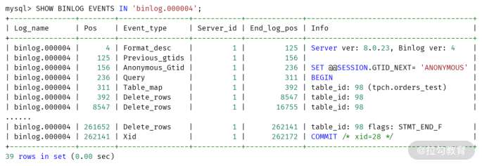
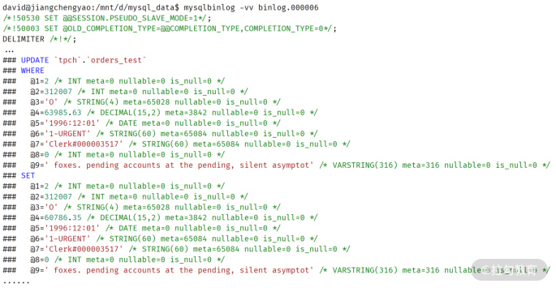
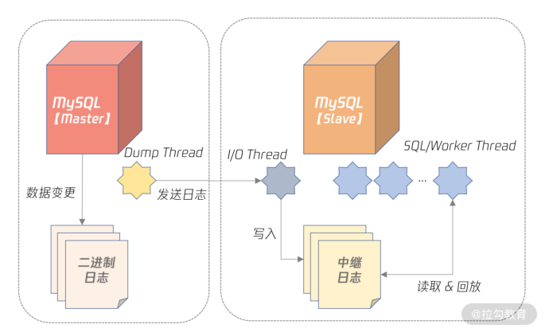
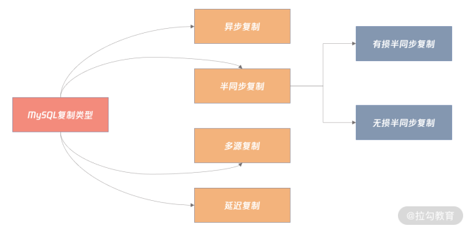
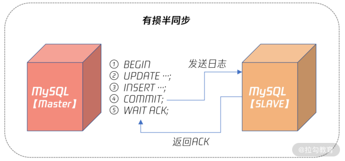
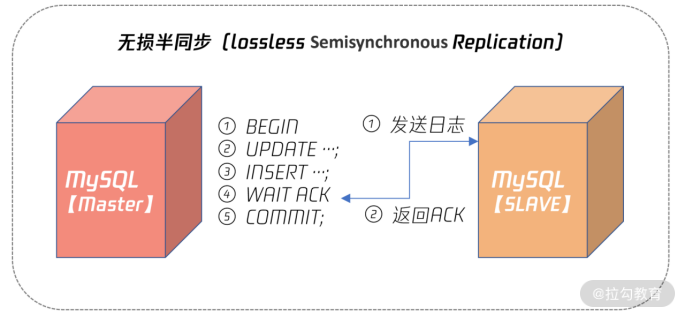
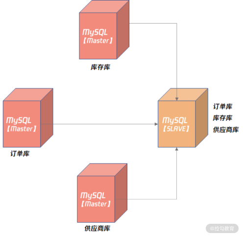

# 15 MySQL 复制：最简单也最容易配置出错

从今天开始，我们正式进入高可用架构的设计环节。

在前两个模块中，我们学习了 MySQL 架构中的表结构设计、索引设计。对业务开发的同学来说，掌握这些内容已经能很好地面向业务逻辑进行编码工作了。

但是业务需要上线，所以除了表和索引的结构设计之外，你还要做好高可用的设计。因为在真实的生产环境下，如果发生物理硬件故障，没有搭建高可用架构，会导致业务完全不可用。

而这在海量并发访问的互联网业务中完全不敢想象。所以除了业务架构，还要做好可用性的架构设计。

这一讲，我们就来学习 MySQL 高可用架构中最基础、最为核心的内容：MySQL 复制（Replication）。

### MySQL 复制架构

数据库复制本质上就是数据同步。MySQL 数据库是基于二进制日志（binary log）进行数据增量同步，而二进制日志记录了所有对于 MySQL 数据库的修改操作。

在默认 ROW 格式二进制日志中，一条 SQL 操作影响的记录会被全部记录下来，比如一条 SQL语句更新了三行记录，在二进制日志中会记录被修改的这三条记录的前项（before image）和后项（after image）。

对于 INSERT 或 DELETE 操作，则会记录这条被插入或删除记录所有列的信息，我们来看一个例子：

```sql
DELETE FROM orders_test 
WHERE o_orderdate = '1997-12-31';
Query OK, 2482 rows affected (0.07 sec)
```

可以看到，上面这条 SQL 执行的是删除操作，一共删除了有 2482 行记录。可以在 mysql 命令行下使用命令 SHOW BINLOG EVENTS 查看某个二进制日志文件的内容，比如上述删除操作发生在二进制日志文件 binlog.000004 中，你可以看到：



通过 MySQL 数据库自带的命令 mysqlbinlog，可以解析二进制日志，观察到更为详细的每条记录的信息，比如：


从图中，你可以通过二进制日志记录看到被删除记录的完整信息，还有每个列的属性，比如列的类型，是否允许为 NULL 值等。

如果是 UPDATE 操作，二进制日志中还记录了被修改记录完整的前项和后项，比如：



在有二进制日志的基础上，MySQL 数据库就可以通过数据复制技术实现数据同步了。而数据复制的本质就是把一台 MySQL 数据库上的变更同步到另一台 MySQL 数据库上。**下面这张图显示了当前 MySQL 数据库的复制架构** ：



可以看到，在 MySQL 复制中，一台是数据库的角色是 Master（也叫 Primary），剩下的服务器角色是 Slave（也叫 Standby）：

- Master 服务器会把数据变更产生的二进制日志通过 Dump 线程发送给 Slave 服务器；
- Slave 服务器中的 I/O 线程负责接受二进制日志，并保存为中继日志；
- SQL/Worker 线程负责并行执行中继日志，即在 Slave 服务器上回放 Master 产生的日志。

得益于二进制日志，MySQL 的复制相比其他数据库，如 Oracle、PostgreSQL 等，非常灵活，用户可以根据自己的需要构建所需要的复制拓扑结构，比如：


在上图中，Slave1、Slave2、Slave3 都是 Master 的从服务器，而 Slave11 是 Slave1 的从服务器，Slave1 服务器既是 Master 的从机，又是 Slave11 的主机，所以 Slave1 是个级联的从机。同理，Slave3 也是台级联的从机。

在了解完复制的基本概念后，我们继续看如何配置 MySQL 的复制吧。

### MySQL 复制配置

搭建 MySQL 复制实现非常简单，基本步骤如下：

1. 创建复制所需的账号和权限；
1. 从 Master 服务器拷贝一份数据，可以使用逻辑备份工具 mysqldump、mysqlpump，或物理备份工具 Clone Plugin；
1. 通过命令 CHANGE MASTER TO 搭建复制关系；
1. 通过命令 SHOW SLAVE STATUS 观察复制状态。

虽然 MySQL 复制原理和实施非常简单，但在配置时却容易出错，请你务必在配置文件中设置如下配置：

```plaintext
gtid_mode = on
enforce_gtid_consistency = 1
binlog_gtid_simple_recovery = 1
relay_log_recovery = ON
master_info_repository = TABLE 
relay_log_info_repository = TABLE
```

上述设置都是用于保证 crash safe，即无论 Master 还是 Slave 宕机，当它们恢复后，连上主机后，主从数据依然一致，不会产生任何不一致的问题。

我经常听有同学反馈：MySQL会存在主从数据不一致的情况，**请确认上述参数都已配置，否则任何的不一致都不是 MySQL 的问题，而是你使用 MySQL 的错误姿势所致** 。

了解完复制的配置后，我们接下来看一下 MySQL 支持的复制类型。

### MySQL复制类型及应用选项

MySQL 复制可以分为以下几种类型：



默认的复制是异步复制，而很多新同学因为不了解 MySQL 除了异步复制还有其他复制的类型，所以错误地在业务中使用了异步复制。为了解决这个问题，我们一起详细了解一下每种复制类型，以及它们在业务中的选型，方便你在业务做正确的选型。

#### 异步复制

在异步复制（async replication）中，Master 不用关心 Slave 是否接收到二进制日志，所以 Master 与 Slave 没有任何的依赖关系。你可以认为 Master 和 Slave 是分别独自工作的两台服务器，数据最终会通过二进制日志达到一致。

异步复制的性能最好，因为它对数据库本身几乎没有任何开销，除非主从延迟非常大，Dump Thread 需要读取大量二进制日志文件。

如果业务对于数据一致性要求不高，当发生故障时，能容忍数据的丢失，甚至大量的丢失，推荐用异步复制，这样性能最好（比如像微博这样的业务，虽然它对性能的要求极高，但对于数据丢失，通常可以容忍）。但往往核心业务系统最关心的就是数据安全，比如监控业务、告警系统。

#### 半同步复制

半同步复制要求 Master 事务提交过程中，至少有 N 个 Slave 接收到二进制日志，这样就能保证当 Master 发生宕机，至少有 N 台 Slave 服务器中的数据是完整的。

半同步复制并不是 MySQL 内置的功能，而是要安装半同步插件，并启用半同步复制功能，设置 N 个 Slave 接受二进制日志成功，比如：

```plaintext
plugin-load="rpl_semi_sync_master=semisync_master.so;rpl_semi_sync_slave=semisync_slave.so"
rpl-semi-sync-master-enabled = 1
rpl-semi-sync-slave-enabled = 1
rpl_semi_sync_master_wait_no_slave = 1
```

上面的配置中：

- 第 1 行要求数据库启动时安装半同步插件；
- 第 2、3 行表示分别启用半同步 Master 和半同步 Slave 插件；
- 第 4 行表示半同步复制过程中，提交的事务必须至少有一个 Slave 接收到二进制日志。

在半同步复制中，有损半同步复制是 MySQL 5.7 版本前的半同步复制机制，这种半同步复制在Master 发生宕机时，**Slave 会丢失最后一批提交的数据**，若这时 Slave 提升（Failover）为Master，可能会发生已经提交的事情不见了，发生了回滚的情况。

有损半同步复制原理如下图所示：



可以看到，有损半同步是在 Master 事务提交后，即步骤 4 后，等待 Slave 返回 ACK，表示至少有 Slave 接收到了二进制日志，如果这时二进制日志还未发送到 Slave，Master 就发生宕机，则此时 Slave 就会丢失 Master 已经提交的数据。

而 MySQL 5.7 的无损半同步复制解决了这个问题，其原理如下图所示：



从上图可以看到，无损半同步复制 WAIT ACK 发生在事务提交之前，这样即便 Slave 没有收到二进制日志，但是 Master 宕机了，由于最后一个事务还没有提交，所以本身这个数据对外也不可见，不存在丢失的问题。

所以，对于任何有数据一致性要求的业务，如电商的核心订单业务、银行、保险、证券等与资金密切相关的业务，务必使用无损半同步复制。这样数据才是安全的、有保障的、即使发生宕机，从机也有一份完整的数据。

#### 多源复制

无论是异步复制还是半同步复制，都是 1 个 Master 对应 N 个 Slave。其实 MySQL 也支持 N 个 Master 对应 1 个 Slave，这种架构就称之为多源复制。

多源复制允许在不同 MySQL 实例上的数据同步到 1 台 MySQL 实例上，方便在 1 台 Slave 服务器上进行一些统计查询，如常见的 OLAP 业务查询。

多源复制的架构如下所示：



上图显示了订单库、库存库、供应商库，通过多源复制同步到了一台 MySQL 实例上，接着就可以通过 MySQL 8.0 提供的复杂 SQL 能力，对业务进行深度的数据分析和挖掘。

#### 延迟复制

前面介绍的复制架构，Slave 在接收二进制日志后会尽可能快地回放日志，这样是为了避免主从之间出现延迟。而延迟复制却允许Slave 延迟回放接收到的二进制日志，为了避免主服务器上的误操作，马上又同步到了从服务器，导致数据完全丢失。

我们可以通过以下命令设置延迟复制：

```plaintext
CHANGE MASTER TO master_delay = 3600
```

这样就人为设置了 Slave 落后 Master 服务器1个小时。

延迟复制在数据库的备份架构设计中非常常见，比如可以设置一个延迟一天的延迟备机，这样本质上说，用户可以有 1 份 24 小时前的快照。

那么当线上发生误操作，如 DROP TABLE、DROP DATABASE 这样灾难性的命令时，用户有一个 24 小时前的快照，数据可以快速恢复。

对金融行业来说，延迟复制是你备份设计中，必须考虑的一个架构部分。

### 总结

相信学完今天的内容，你一定会对 MySQL 复制技术有一个清晰的了解，认识到 **复制是数据同步的基础，而二进制日志就是复制的基石** 。我总结一下今天的重点：

1. 二进制日志记录了所有对于 MySQL 变更的操作；
1. 可以通过命令 SHOW BINLOG EVENTS IN ... FROM ... 查看二进制日志的基本信息；
1. 可以通过工具 mysqlbinlog 查看二进制日志的详细内容；
1. **复制搭建虽然简单，但别忘记配置 crash safe 相关参数**，否则可能导致主从数据不一致；
1. 异步复制用于非核心业务场景，不要求数据一致性；
1. 无损半同步复制用于核心业务场景，如银行、保险、证券等核心业务，需要严格保障数据一致性；
1. 多源复制可将多个 Master 数据汇总到一个数据库示例进行分析；
1. 延迟复制主要用于误操作防范，金融行业要特别考虑这样的场景。
