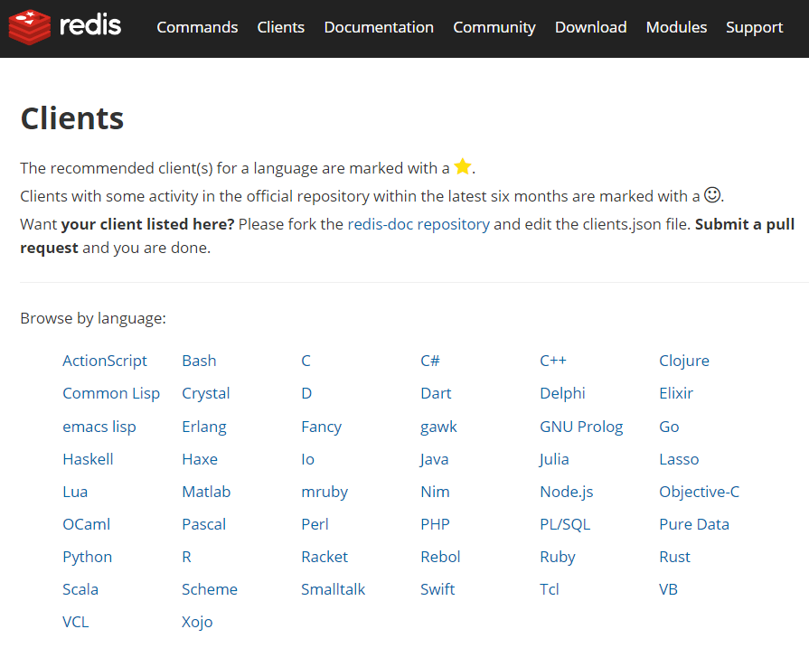
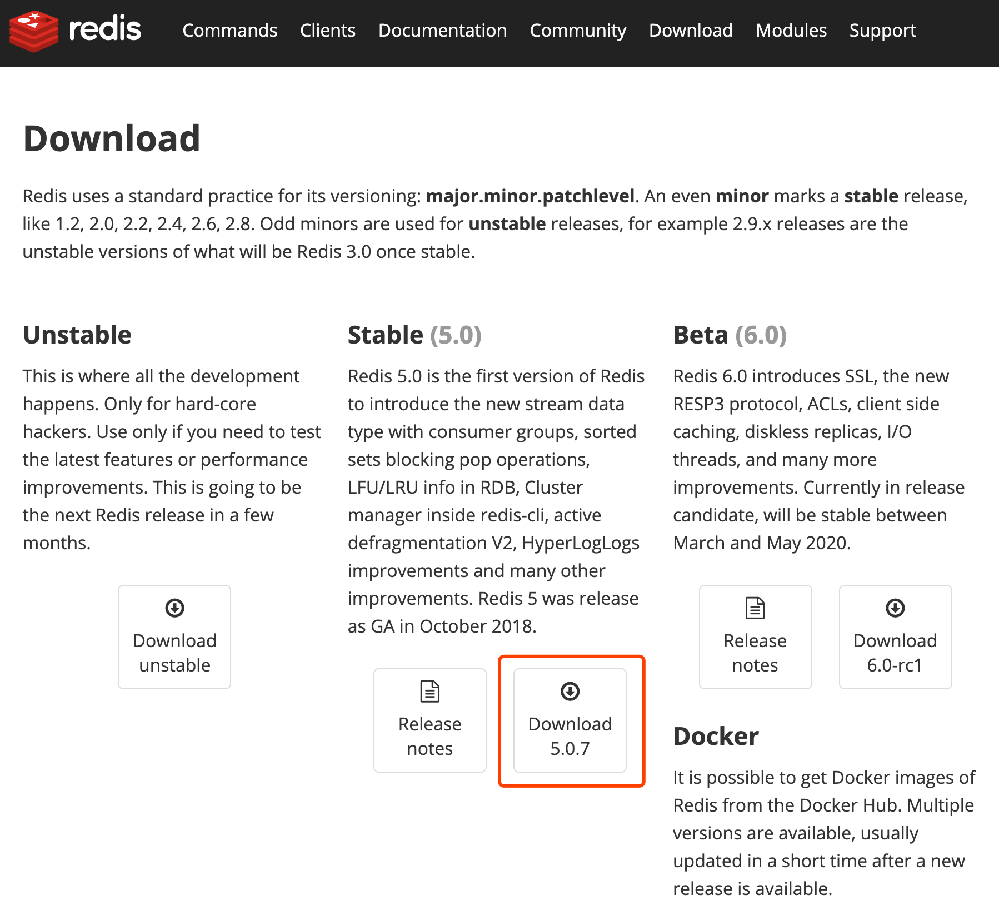
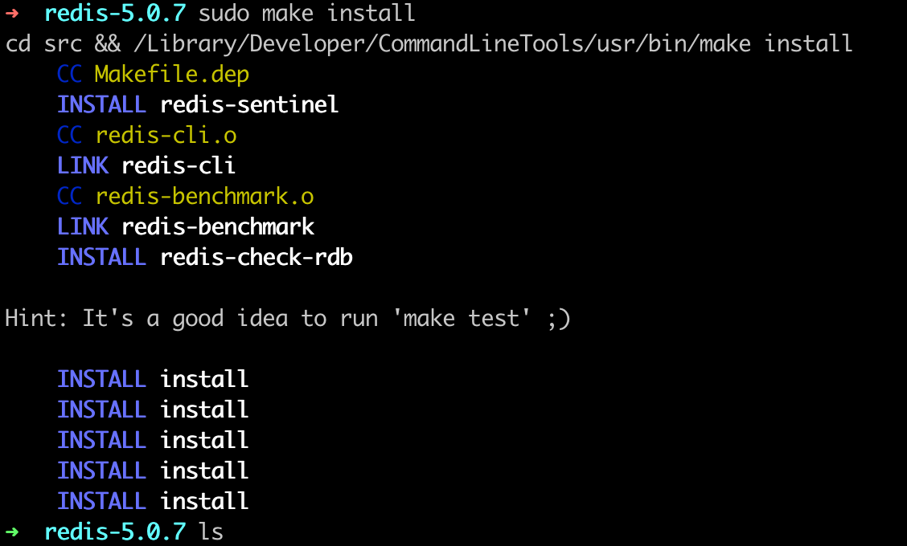
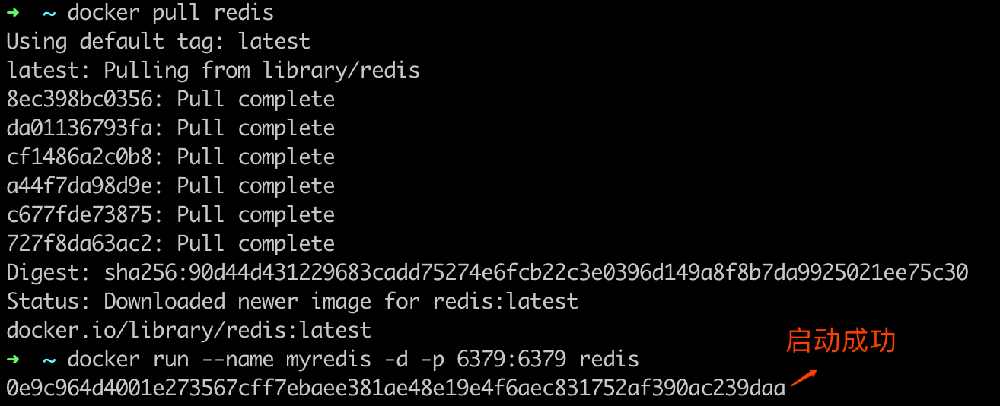
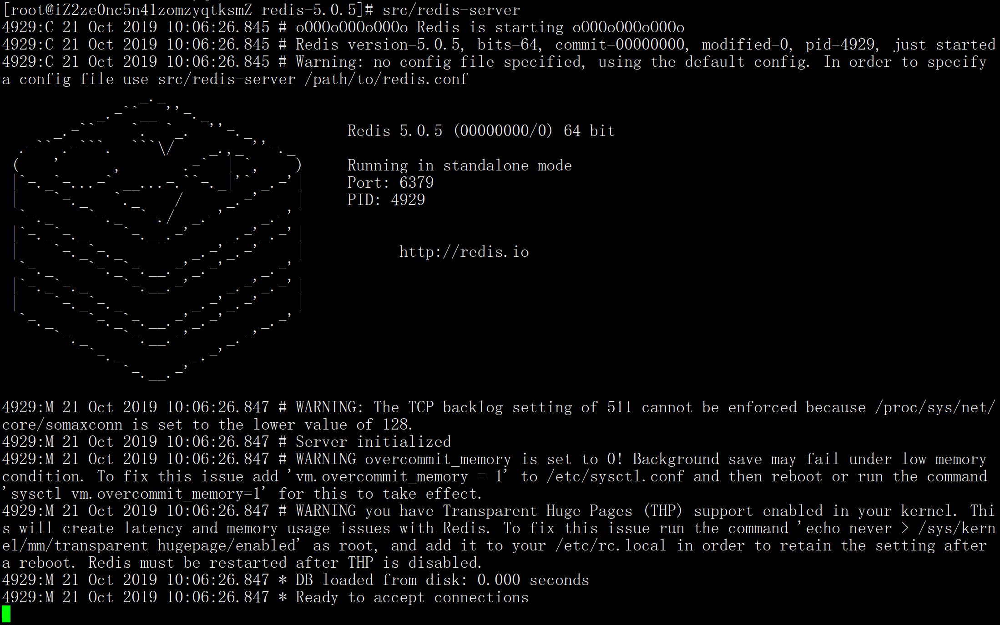
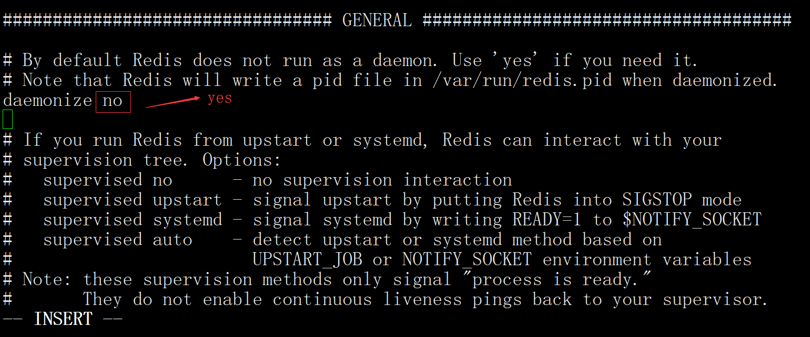
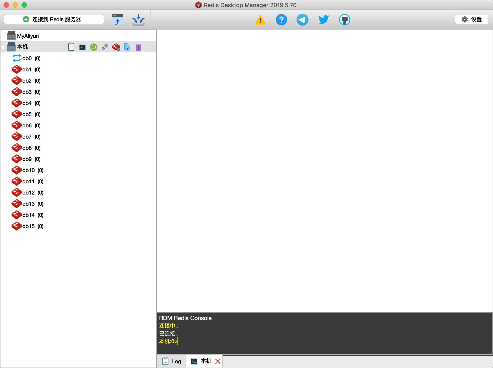

# 02 Redis 快速搭建与使用

Redis 是由 C 语言开发的开源内存数据存储器，经常被用作数据库、缓存以及消息队列等。 Redis 因为其强大的功能和简洁的设计，深受广大开发者和公司的喜爱，几乎占领了内存数据库市场的所有份额。

### 1 Redis 特性

Redis 有很多优秀的特性，这也是它最受欢迎的原因。

#### 1）多种数据类型支持

Redis 支持多种数据类型，例如字符串、散列、列表、集合、有序集合、HyperLogLog、流、地理坐标等，每种类型都有对应的使用场景，同时也满足了所有开发者的需要。

#### 2）功能完善

Redis 提供了很多的功能，例如消息队列、自动过期删除、事务、数据持久化、分布式锁、附近的人、慢查询分析、Sentinel 和集群等多项功能。

#### 3）高性能

Redis 是一款内存型数据库，因此在性能方面有天生的优势(内存操作比磁盘操作要快很多)，并且 Redis 在底层使用了更加高效的算法和数据结构，以最大限度的提高了 Redis 的性能。

#### 4）广泛的编程语言支持

Redis 客户端有众多的开发者提供了相应的支持，这些客户端可以在 <https://redis.io/clients> 上找到，支持是编程语言，如下图所示：  可以看出几乎所有的编程语言，都有相应的客户端支持。

#### 5）使用简单

Redis 的 API 虽然比较丰富，但操作的方法都非常的简便，并且需要传递的参数也不多，这样开发者就能更快的上手使用，而且 Redis 官方也提供了比较完整的说明文档。

#### 6）活跃性高/版本迭代快

Redis 活跃度很高，这点可以在 Redis 的开源项目 [https://github.com/antirez/redis](https://github.com/antirez/redis) 中发现，并且 Redis 的版本迭代也很快，到目前为止 Redis 的发布版本就已经有二百多个了。

#### 7）I/O 多路复用模型

Redis 使用了多路 I/O 复用模型，“多路”指的是多个网络连接，“复用”指的是复用同一个线程，采用多路 I/O 复用技术可以让单个线程高效的处理多个连接请求，这样就减少了创建和销毁线程所带来的时间消耗，从而到达高效处理大量并发请求的目的。

### 2 Redis 发展历程

Redis 的发展大概经过了以下几个过程：

- 2009 年 5 月发布 Redis 初始版本；
- 2012 年发布 Redis 2.6，重构了大量的核心代码，去掉了所有和集群相关的代码；
- 2013 年 11 月发布 Redis 2.8，增加了部分主从复制功能；
- 2015 年 4 月发布 Redis 3.0，增加了集群功能；
- 2017 年 7 月发布 Redis 4.0 ，优化了复制功能和新增了混合持久化；
- 2018 年 10 月发布 Redis 5.0，增加了 Stream 数据类型；
- 2020 年 3-5 月计划发布 Redis 6.0 稳定版。

### 3 Redis 安装

Redis 官方提供了 Linux 和 MacOS 服务端安装包，对于 Windows 还有提供正式的支持，之所以不支持 Windows 平台是因为目前 Linux 版本已经很稳定，并且也有大量的用户，如果开发 Windows 版本可能会带来很多的兼容性问题，但 Windows 平台还是有很多种方法可以安装 Redis 的，本文的下半部分会说到，我们先来看 Redis 在 Linux 和 MacOS 平台的安装。

#### 1）源码安装

##### ① 下载源码包

进入网址：[https://redis.io/download](https://redis.io/download) 选择需要安装的版本，点击 `Download` 按钮，如下图所示： 

##### ② 解压安装包

使用命令：tar zxvf redis-5.0.7.tar.gz

##### ③ 切换到 Redis 目录

使用命令：cd /usr/local/redis-5.0.7/

##### ④ 编译安装

使用命令：sudo make install 安装完成，如下图所示：  如果没有异常信息输出，向上图所示，则表示 Redis 已经安装成功。

#### 2）Docker 安装

Docker 的使用前提是必须先有 Docker，如果本机没有安装 Docker，对于 Linux 用户来说，可使用命令 `yum -y install docker` 在线安装 docker，如果是非 Linux 平台需要在官网下载并安装 Docker Desker，下载地址：[https://docs.docker.com/get-started/](https://docs.docker.com/get-started/) 如下图所示：  选择相应的平台，下载安装即可。 有了 Docker 之后，就可以在 Docker 上安装 Redis 服务端了，具体步骤如下：

##### ① 拉取 Reids 镜像

使用命令：

> docker pull redis

如果要安装其他版本的 Redis，可使用 `docker pull redis:版本号` 的方式来安装。

##### ② 运行 Redis 容器

使用命令：

> docker run --name myredis -d -p 6379:6379 redis

其中：

- --name：设置别名
- -p：映射宿主端口到容器端口
- -d：表示后台运行

执行完成后截图如下：  如图所示，则证明 Redis 已经正常启动了。 如果要查询 Redis 的安装版本，可遵循下图的执行流程，先进入容器，在进入 Redis 的安装目录，执行 `redis-server -v` 命令，如图如下： 

##### ③ 执行命令

Docker 版的 Redis 命令执行和其他方式安装的 Redis 不太一样，所以这里需要单独讲一下，我们要使用 redis-cli 工具，需要执行以下命令：

> docker exec -it myredis redis-cli

其中“myredis”指的是容器中 Redis 服务端的别名。

#### 3）在线安装

在线安装的执行步骤最简单，只需要执行 `xxx install redis` 命令即可直接安装，例如 MacOS 使用 `brew install redis` 、Ubuntu 使用 `apt-get install redis` 、CentOS 使用 `yum install redis` 等。

### 3 Windows 系统安装 Redis

上面我们提到了，官方并没有提供 Windows 的支持版本，但 Windows 平台依旧有很多种方法，可以用来安装 Redis 服务端，例如 Docker 方式、虚拟机方式、Windows 10 子系统方式和第三方提供的 Redis 版本等。

其中 Docker 方式和本文上半部分介绍的安装方式相同，这里就不再赘述，当然你也可以使用虚拟机安装 Linux 的方式，或者是使用 Windows 10 下的自带的 Linux 子系统的方式进行安装。

如果你还想要更简单的方式，就可以使用第三方提供的 Redis 安装包进行安装，例如可以使用微软官方支持并维护的一个 Win64 的 Redis 开源项目，目前支持的最新版本为 3.2，项目地址：<https://github.com/MicrosoftArchive/redis/releases> 下载 .msi 和 .zip 文件安装即可。

### 4 Redis 使用

Redis 安装完之后，在 src 目录和 /usr/local/bin 目录下有几个很重要的可执行文件，这些可执行文件可以做很多事，如下表所示：

可执行文件

功能

redis-server

启动 Redis

redis-cli

Redis 命令行工具

redis-benchmark

基准测试工具

redis-check-aof

AOF 持久化文件检测工具和修复工具

redis-check-dump

RDB 持久化文件检测工具和修复工具

redis-sentinel

启动 redis-sentinel

#### 1）启动 Redis

下面我们就用可执行文件 `redis-server` 来启动 Redis 服务器，我们在 Redis 的安装目录执行 `src/redis-server` 命令就可以启动 Redis 服务了，如下图所示：  可以看出 Redis 已经正常启动了，但这种启动方式，会使得 Redis 服务随着控制台的关闭而退出，因为 Redis 服务默认是非后台启动的，我们需要修改配置文件(redis.conf)，找到 `daemonize no` 改为 `daemonize yes` ，然后重启服务，此时 Redis 就是以后台运行方式启动了，并且不会随着控制台的关闭而退出。

daemonize 配置如下： 

#### 2）使用可视化工具操作 Redis

Redis 启动之后就可以使用一些客户端工具进行链接和操作，如下图所示：  (注：我们本文使用的是 Redis Desktop Manager 工具链接的，更多 Redis 可视化工具，在本课程的后面有介绍。) 可以看出 Redis 服务器默认有 16 个数据库实例，从 db0 到 db15，但这个数据库实例和传统的关系型数据库实例是不一样的。传统型数据库实例是通过连接字符串配置的，而 Redis 数据库连接字符串只有一个，并不能指定要使用的数据库实例。

在 Redis 中如果要切换数据库实例，只需要执行 `select n` 命令即可，例如需要连接 db1 ，使用 `select 1` 命令选择即可，默认连接的数据库实例是 db0。

> 小贴士：当使用了 `flushall` 清空 Redis 数据库时，此数据库下的所有数据都会被清除。

Redis 数据库的实例个数也可以通过配置文件更改，在 redis.conf 中找到 `databases 16` ，修改后面的数字重启 Redis 服务就会生效。

#### 3）使用 redis-cli 操作 Redis

redis-cli 是官方自带的客户端链接工具，它可以配合命令行来对 Redis 进行操作，在 Redis 的安装目录使用 `src/redis-cli` 命令即可链接并操作 Redis，如下图所示： 

### 5 小结

本文介绍了 Redis 的特性及其发展历程，以及 Redis 在 Windows、Linux、MacOS 下的安装，其中 Docker 安装方式，对所有平台都是通用的，在 Linux、MacOS 平台下可以在线安装或者使用源码安装，Windows 平台可以使用虚拟机或子系统以及第三方提供的 Redis 安装包进行安装。安装成功之后可以使用 redis-server 来启动 Redis 服务，并使用 redis-cli 来链接和操作 Redis 服务器，redis-server 默认是非后台运行 Redis，需要修改配置 daemonize yes 来设置 Redis 为后台运行模式，这样就可以快速上手使用 Redis 了。
