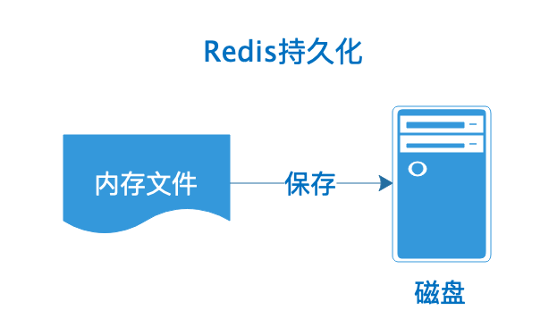
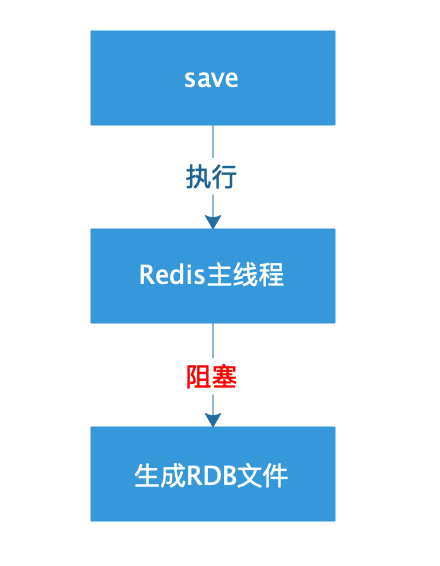
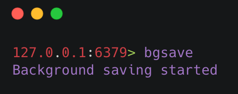
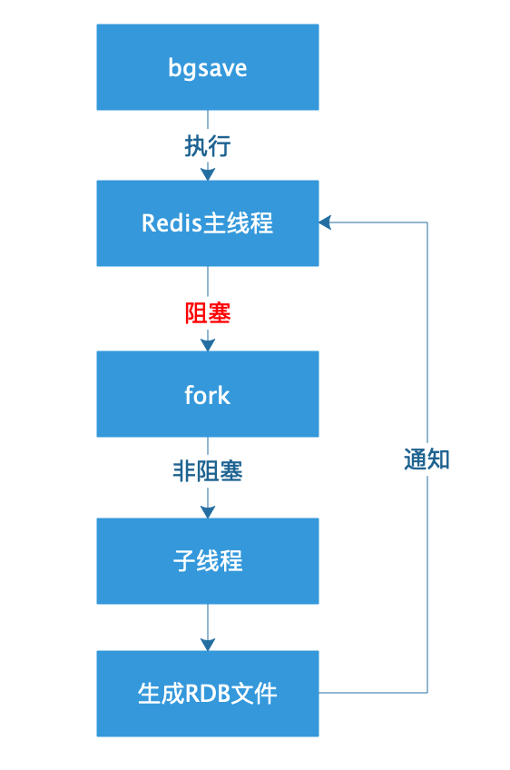
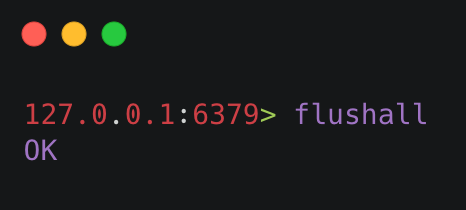
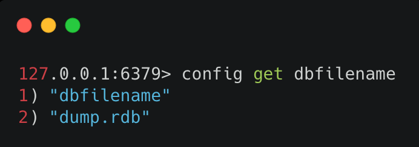
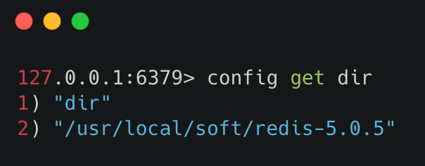

# 03 Redis 持久化——RDB

> Redis 的读写都是在内存中，所以它的性能较高，但在内存中的数据会随着服务器的重启而丢失，为了保证数据不丢失，我们需要将内存中的数据存储到磁盘，以便 Redis 重启时能够从磁盘中恢复原有的数据，而整个过程就叫做 Redis 持久化。

 Redis 持久化也是 Redis 和 Memcached 的主要区别之一，因为 Memcached 不具备持久化功能。

### 1 持久化的几种方式

Redis 持久化拥有以下三种方式：

- **快照方式** （RDB, Redis DataBase）将某一个时刻的内存数据，以二进制的方式写入磁盘；
- **文件追加方式** （AOF, Append Only File），记录所有的操作命令，并以文本的形式追加到文件中；
- **混合持久化方式**，Redis 4.0 之后新增的方式，混合持久化是结合了 RDB 和 AOF 的优点，在写入的时候，先把当前的数据以 RDB 的形式写入文件的开头，再将后续的操作命令以 AOF 的格式存入文件，这样既能保证 Redis 重启时的速度，又能减低数据丢失的风险。

因为每种持久化方案，都有特定的使用场景，让我们先从 RDB 持久化说起吧。

### 2 RDB简介

RDB（Redis DataBase）是将某一个时刻的内存快照（Snapshot），以二进制的方式写入磁盘的过程。

### 3 持久化触发

RDB 的持久化触发方式有两类：一类是手动触发，另一类是自动触发。

#### 1）手动触发

手动触发持久化的操作有两个： `save` 和 `bgsave` ，它们主要区别体现在：是否阻塞 Redis 主线程的执行。

##### ① save 命令

在客户端中执行 `save` 命令，就会触发 Redis 的持久化，但同时也是使 Redis 处于阻塞状态，直到 RDB 持久化完成，才会响应其他客户端发来的命令，所以 **在生产环境一定要慎用** 。

`save` 命令使用如下：  从图片可以看出，当执行完 `save` 命令之后，持久化文件 `dump.rdb` 的修改时间就变了，这就表示 `save` 成功的触发了 RDB 持久化。 `save` 命令执行流程，如下图所示： 

##### ② bgsave 命令

bgsave（background save）既后台保存的意思， 它和 `save` 命令最大的区别就是 `bgsave` 会 fork() 一个子进程来执行持久化，整个过程中只有在 fork() 子进程时有短暂的阻塞，当子进程被创建之后，Redis 的主进程就可以响应其他客户端的请求了，相对于整个流程都阻塞的 `save` 命令来说，显然 `bgsave` 命令更适合我们使用。 `bgsave` 命令使用，如下图所示：  `bgsave` 执行流程，如下图所示： 

#### 2）自动触发

说完了 RDB 的手动触发方式，下面来看如何自动触发 RDB 持久化？ RDB 自动持久化主要来源于以下几种情况。

##### ① save m n

`save m n` 是指在 m 秒内，如果有 n 个键发生改变，则自动触发持久化。 参数 m 和 n 可以在 Redis 的配置文件中找到，例如，`save 60 1` 则表明在 60 秒内，至少有一个键发生改变，就会触发 RDB 持久化。 自动触发持久化，本质是 Redis 通过判断，如果满足设置的触发条件，自动执行一次 `bgsave` 命令。 注意：当设置多个 save m n 命令时，满足任意一个条件都会触发持久化。 例如，我们设置了以下两个 save m n 命令：

- save 60 10
- save 600 1

当 60s 内如果有 10 次 Redis 键值发生改变，就会触发持久化；如果 60s 内 Redis 的键值改变次数少于 10 次，那么 Redis 就会判断 600s 内，Redis 的键值是否至少被修改了一次，如果满足则会触发持久化。

##### ② flushall

`flushall` 命令用于清空 Redis 数据库，在生产环境下一定慎用，当 Redis 执行了 `flushall` 命令之后，则会触发自动持久化，把 RDB 文件清空。 执行结果如下图所示： 

##### ③ 主从同步触发

在 Redis 主从复制中，当从节点执行全量复制操作时，主节点会执行 `bgsave` 命令，并将 RDB 文件发送给从节点，该过程会自动触发 Redis 持久化。

### 4 配置说明

合理的设置 RDB 的配置，可以保障 Redis 高效且稳定的运行，下面一起来看 RDB 的配置项都有哪些？

RDB 配置参数可以在 Redis 的配置文件中找见，具体内容如下：

```plaintext
# RDB 保存的条件
save 900 1
save 300 10
save 60 10000
# bgsave 失败之后，是否停止持久化数据到磁盘，yes 表示停止持久化，no 表示忽略错误继续写文件。
stop-writes-on-bgsave-error yes
# RDB 文件压缩
rdbcompression yes
# 写入文件和读取文件时是否开启 RDB 文件检查，检查是否有无损坏，如果在启动是检查发现损坏，则停止启动。
rdbchecksum yes
# RDB 文件名
dbfilename dump.rdb
# RDB 文件目录
dir ./
```

其中比较重要的参数如下列表： **① save 参数** 它是用来配置触发 RDB 持久化条件的参数，满足保存条件时将会把数据持久化到硬盘。 默认配置说明如下：

- save 900 1：表示 900 秒内如果至少有 1 个 key 值变化，则把数据持久化到硬盘；
- save 300 10：表示 300 秒内如果至少有 10 个 key 值变化，则把数据持久化到硬盘；
- save 60 10000：表示 60 秒内如果至少有 10000 个 key 值变化，则把数据持久化到硬盘。

**② rdbcompression 参数** 它的默认值是 `yes` 表示开启 RDB 文件压缩，Redis 会采用 LZF 算法进行压缩。如果不想消耗 CPU 性能来进行文件压缩的话，可以设置为关闭此功能，这样的缺点是需要更多的磁盘空间来保存文件。**③ rdbchecksum 参数** 它的默认值为 `yes` 表示写入文件和读取文件时是否开启 RDB 文件检查，检查是否有无损坏，如果在启动是检查发现损坏，则停止启动。

### 5 配置查询

Redis 中可以使用命令查询当前配置参数。查询命令的格式为：`config get xxx` ，例如，想要获取 RDB 文件的存储名称设置，可以使用 `config get dbfilename` ，执行效果如下图所示：  查询 RDB 的文件目录，可使用命令 `config get dir` ，执行效果如下图所示： 

### 6 配置设置

设置 RDB 的配置，可以通过以下两种方式：

- 手动修改 Redis 配置文件；
- 使用命令行设置，例如，使用 `config set dir "/usr/data"` 就是用于修改 RDB 的存储目录。

**注意** ：手动修改 Redis 配置文件的方式是全局生效的，即重启 Redis 服务器设置参数也不会丢失，而使用命令修改的方式，在 Redis 重启之后就会丢失。但手动修改 Redis 配置文件，想要立即生效需要重启 Redis 服务器，而命令的方式则不需要重启 Redis 服务器。

> 小贴士：Redis 的配置文件位于 Redis 安装目录的根路径下，默认名称为 redis.conf。

### 7 RDB 文件恢复

当 Redis 服务器启动时，如果 Redis 根目录存在 RDB 文件 dump.rdb，Redis 就会自动加载 RDB 文件恢复持久化数据。 如果根目录没有 dump.rdb 文件，请先将 dump.rdb 文件移动到 Redis 的根目录。**验证 RDB 文件是否被加载** Redis 在启动时有日志信息，会显示是否加载了 RDB 文件，我们执行 Redis 启动命令：`src/redis-server redis.conf` ，如下图所示：  从日志上可以看出， Redis 服务在启动时已经正常加载了 RDB 文件。

> 小贴士：Redis 服务器在载入 RDB 文件期间，会一直处于阻塞状态，直到载入工作完成为止。

### 8 RDB 优缺点

#### 1）RDB 优点

- RDB 的内容为二进制的数据，占用内存更小，更紧凑，更适合做为备份文件；
- RDB 对灾难恢复非常有用，它是一个紧凑的文件，可以更快的传输到远程服务器进行 Redis 服务恢复；
- RDB 可以更大程度的提高 Redis 的运行速度，因为每次持久化时 Redis 主进程都会 fork() 一个子进程，进行数据持久化到磁盘，Redis 主进程并不会执行磁盘 I/O 等操作；
- 与 AOF 格式的文件相比，RDB 文件可以更快的重启。

#### 2）RDB 缺点

- 因为 RDB 只能保存某个时间间隔的数据，如果中途 Redis 服务被意外终止了，则会丢失一段时间内的 Redis 数据；
- RDB 需要经常 fork() 才能使用子进程将其持久化在磁盘上。如果数据集很大，fork() 可能很耗时，并且如果数据集很大且 CPU 性能不佳，则可能导致 Redis 停止为客户端服务几毫秒甚至一秒钟。

### 9 禁用持久化

禁用持久化可以提高 Redis 的执行效率，如果对数据丢失不敏感的情况下，可以在连接客户端的情况下，执行 `config set save ""` 命令即可禁用 Redis 的持久化，如下图所示： 

### 10 小结

通过本文我们可以得知，RDB 持久化分为手动触发和自动触发两种方式，它的优点是存储文件小，Redis 启动 时恢复数据比较快，缺点是有丢失数据的风险。RDB 文件的恢复也很简单，只需要把 RDB 文件放到 Redis 的根目录，在 Redis 启动时就会自动加载并恢复数据。 最后给大家留一个思考题：如果 Redis 服务器 CPU 占用过高，可能是什么原因导致的？欢迎各位在评论区，写下你们的答案。

**参考&鸣谢** [https://redis.io/topics/persistence](https://redis.io/topics/persistence) [https://blog.csdn.net/qq_36318234/article/details/79994133](https://blog.csdn.net/qq_36318234/article/details/79994133) [https://www.cnblogs.com/ysocean/p/9114268.html](https://www.cnblogs.com/ysocean/p/9114268.html) [https://www.cnblogs.com/wdliu/p/9377278.html](https://www.cnblogs.com/wdliu/p/9377278.html)
