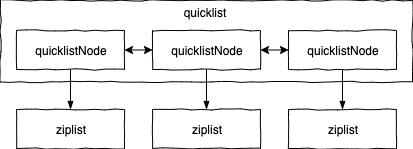
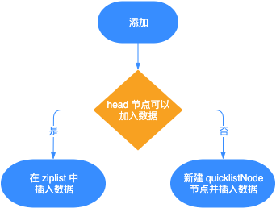

# 10 列表使用与内部实现原理

列表类型 (List) 是一个使用链表结构存储的有序结构，它的元素插入会按照先后顺序存储到链表结构中，因此它的元素操作 (插入\\删除) 时间复杂度为 O(1)，所以相对来说速度还是比较快的，但它的查询时间复杂度为 O(n)，因此查询可能会比较慢。

### 1 基础使用

列表类型的使用相对来说比较简单，对它的操作就相当操作一个没有任何 key 值的 value 集合，如下图所示： 

#### 1）给列表添加一个或多个元素

语法：lpush key value \[value …\] 示例：

```shell
127.0.0.1:6379> lpush list 1 2 3
(integer) 3
```

#### 2）给列表尾部添加一个或多个元素

语法：rpush key value \[value …\] 示例：

```shell
127.0.0.1:6379> rpush list2 1 2 3
(integer) 3
```

#### 3）返回列表指定区间内的元素

语法：lrange key start stop 示例：

```shell
127.0.0.1:6379> lrange list 0 -1
"3"
"2"
"1"
127.0.0.1:6379> lrange list2 0 -1
"1"
"2"
"3"
```

其中 -1 代表列表中的最后一个元素。

#### 4）获取并删除列表的第一个元素

语法：lpop key 示例：

```shell
127.0.0.1:6379> lrange list 0 -1
1) "d"
2) "c"
3) "b"
4) "a"
127.0.0.1:6379> lpop list
"d"
127.0.0.1:6379> lrange list 0 -1
1) "c"
2) "b"
3) "a"
```

#### 5）获取并删除列表的最后一个元素

语法：rpop key 示例：

```shell
127.0.0.1:6379> lrange list 0 -1
1) "c"
2) "b"
3) "a"
127.0.0.1:6379> rpop list
"a"
127.0.0.1:6379> lrange list 0 -1
1) "c"
2) "b"
```

#### 6）根据下标获取对应的元素

语法：lindex key index 示例：

```shell
127.0.0.1:6379> rpush list3 a b c
(integer) 3
127.0.0.1:6379> lindex list3 0
"a"
```

更多操作命令，详见附录部分。

### 2 代码实战

下面来看列表类型在 Java 中的使用，同样先添加 Jedis 框架，使用代码如下：

```java
public class ListExample {
    public static void main(String[] args) {
        Jedis jedis = new Jedis("127.0.0.1", 6379);
        // 声明 Redis key
        final String REDISKEY = "list";
        // 在头部插入一个或多个元素
        Long lpushResult = jedis.lpush(REDISKEY, "Java", "Sql");
        System.out.println(lpushResult); // 输出：2
        // 获取第 0 个元素的值
        String idValue = jedis.lindex(REDISKEY, 0);
        System.out.println(idValue); // 输出：Sql
        // 查询指定区间的元素
        List<String> list = jedis.lrange(REDISKEY, 0, -1);
        System.out.println(list); // 输出：[Sql, Java]
        // 在元素 Java 前面添加 MySQL 元素
        jedis.linsert(REDISKEY, ListPosition.BEFORE, "Java", "MySQL");
        System.out.println(jedis.lrange(REDISKEY, 0, -1)); // 输出：[Sql, MySQL, Java]
        jedis.close();
    }
}
```

程序运行结果如下：

> 2 Sql \[Sql, Java\] \[Sql, MySQL, Java\]

### 3 内部实现

我们先用 `debug encoding key` 来查看列表类型的内部存储类型，如下所示：

```shell
127.0.0.1:6379> object encoding list
"quicklist"
```

从结果可以看出，列表类型的底层数据类型是 quicklist。

quicklist (快速列表) 是 Redis 3.2 引入的数据类型，早期的列表类型使用的是ziplist (压缩列表) 和双向链表组成的，Redis 3.2 改为用 quicklist 来存储列表元素。

我们来看下 quicklist 的实现源码：

```c
typedef struct quicklist { // src/quicklist.h
    quicklistNode *head;
    quicklistNode *tail;
    unsigned long count;        /* ziplist 的个数 */
    unsigned long len;          /* quicklist 的节点数 */
    unsigned int compress : 16; /* LZF 压缩算法深度 */
    //...
} quicklist;
typedef struct quicklistNode {
    struct quicklistNode *prev;
    struct quicklistNode *next;
    unsigned char *zl;           /* 对应的 ziplist */
    unsigned int sz;             /* ziplist 字节数 */
    unsigned int count : 16;     /* ziplist 个数 */
    unsigned int encoding : 2;   /* RAW==1 or LZF==2 */
    unsigned int container : 2;  /* NONE==1 or ZIPLIST==2 */
    unsigned int recompress : 1; /* 该节点先前是否被压缩 */
    unsigned int attempted_compress : 1; /* 节点太小无法压缩 */
    //...
} quicklistNode;
typedef struct quicklistLZF {
    unsigned int sz; 
    char compressed[];
} quicklistLZF;
```

从以上源码可以看出 quicklist 是一个双向链表，链表中的每个节点实际上是一个 ziplist，它们的结构如下图所示： 

ziplist 作为 quicklist 的实际存储结构，它本质是一个字节数组，ziplist 数据结构如下图所示：


其中的字段含义如下：

- zlbytes：压缩列表字节长度，占 4 字节；
- zltail：压缩列表尾元素相对于起始元素地址的偏移量，占 4 字节；
- zllen：压缩列表的元素个数；
- entryX：压缩列表存储的所有元素，可以是字节数组或者是整数；
- zlend：压缩列表的结尾，占 1 字节。

### 4 源码解析

下面我们来看一下更多关于列表类型的源码实现。

#### 1）添加功能源码分析

quicklist 添加操作对应函数是 quicklistPush，源码如下：

```c
void quicklistPush(quicklist *quicklist, void *value, const size_t sz,
                   int where) {
    if (where == QUICKLIST_HEAD) {
        // 在列表头部添加元素
        quicklistPushHead(quicklist, value, sz);
    } else if (where == QUICKLIST_TAIL) {
        // 在列表尾部添加元素
        quicklistPushTail(quicklist, value, sz);
    }
}
```

以 quicklistPushHead 为例，源码如下：

```c
int quicklistPushHead(quicklist *quicklist, void *value, size_t sz) {
    quicklistNode *orig_head = quicklist->head;
    if (likely(
            _quicklistNodeAllowInsert(quicklist->head, quicklist->fill, sz))) {
        // 在头部节点插入元素
        quicklist->head->zl =
            ziplistPush(quicklist->head->zl, value, sz, ZIPLIST_HEAD);
        quicklistNodeUpdateSz(quicklist->head);
    } else {
        // 头部节点不能继续插入，需要新建 quicklistNode、ziplist 进行插入
        quicklistNode *node = quicklistCreateNode();
        node->zl = ziplistPush(ziplistNew(), value, sz, ZIPLIST_HEAD);
        quicklistNodeUpdateSz(node);
        // 将新建的 quicklistNode 插入到 quicklist 结构中
        _quicklistInsertNodeBefore(quicklist, quicklist->head, node);
    }
    quicklist->count++;
    quicklist->head->count++;
    return (orig_head != quicklist->head);
}
```

quicklistPushHead 函数的执行流程，先判断 quicklist 的 head 节点是否可以插入数据，如果可以插入则使用 ziplist 的接口进行插入，否则就新建 quicklistNode 节点进行插入。

函数的入参是待插入的 quicklist，还有需要插入的值 value 以及他的大小 sz。

函数的返回值为 int，0 表示没有新建 head，1 表示新建了 head。 quicklistPushHead 执行流程，如下图所示：



#### 2）删除功能源码分析

quicklist 元素删除分为两种情况：单一元素删除和区间元素删除，它们都位于 src/quicklist.c 文件中。

##### ① 单一元素删除

单一元素的删除函数是 quicklistDelEntry，源码如下：

```c
void quicklistDelEntry(quicklistIter *iter, quicklistEntry *entry) {
    quicklistNode *prev = entry->node->prev;
    quicklistNode *next = entry->node->next;
    // 删除指定位置的元素
    int deleted_node = quicklistDelIndex((quicklist *)entry->quicklist,
                                         entry->node, &entry->zi);
    //...
}
```

可以看出 quicklistDelEntry 函数的底层，依赖 quicklistDelIndex 函数进行元素删除。

##### ② 区间元素删除

区间元素删除的函数是 quicklistDelRange，源码如下：

```c
// start 表示开始删除的下标，count 表示要删除的个数
int quicklistDelRange(quicklist *quicklist, const long start,
                      const long count) {
    if (count <= 0)
        return 0;
    unsigned long extent = count; 
    if (start >= 0 && extent > (quicklist->count - start)) {
        // 删除的元素个数大于已有元素
        extent = quicklist->count - start;
    } else if (start < 0 && extent > (unsigned long)(-start)) {
        // 删除指定的元素个数
        extent = -start; /* c.f. LREM -29 29; just delete until end. */
    }
    //...
    // extent 为剩余需要删除的元素个数，
    while (extent) {
        // 保存下个 quicklistNode，因为本节点可能会被删除
        quicklistNode *next = node->next;
        unsigned long del;
        int delete_entire_node = 0;
        if (entry.offset == 0 && extent >= node->count) {
            // 删除整个 quicklistNode
            delete_entire_node = 1;
            del = node->count;
        } else if (entry.offset >= 0 && extent >= node->count) {
           // 删除本节点的所有元素
            del = node->count - entry.offset;
        } else if (entry.offset < 0) {
            // entry.offset<0 表示从后向前，相反则表示从前向后剩余的元素个数
            del = -entry.offset;
            if (del > extent)
                del = extent;
        } else {
            // 删除本节点部分元素
            del = extent;
        }
        D("[%ld]: asking to del: %ld because offset: %d; (ENTIRE NODE: %d), "
          "node count: %u",
          extent, del, entry.offset, delete_entire_node, node->count);
        if (delete_entire_node) {
            __quicklistDelNode(quicklist, node);
        } else {
            quicklistDecompressNodeForUse(node);
            node->zl = ziplistDeleteRange(node->zl, entry.offset, del);
            quicklistNodeUpdateSz(node);
            node->count -= del;
            quicklist->count -= del;
            quicklistDeleteIfEmpty(quicklist, node);
            if (node)
                quicklistRecompressOnly(quicklist, node);
        }
        // 剩余待删除元素的个数
        extent -= del;
        // 下个 quicklistNode
        node = next;
        // 从下个 quicklistNode 起始位置开始删除
        entry.offset = 0;
    }
    return 1;
}
```

从上面代码可以看出，quicklist 在区间删除时，会先找到 start 所在的 quicklistNode，计算删除的元素是否小于要删除的 count，如果不满足删除的个数，则会移动至下一个 quicklistNode 继续删除，依次循环直到删除完成为止。

quicklistDelRange 函数的返回值为 int 类型，当返回 1 时表示成功的删除了指定区间的元素，返回 0 时表示没有删除任何元素。

#### 3）更多源码

除了上面介绍的几个常用函数之外，还有一些更多的函数，例如：

- quicklistCreate：创建 quicklist；
- quicklistInsertAfter：在某个元素的后面添加数据；
- quicklistInsertBefore：在某个元素的前面添加数据；
- quicklistPop：取出并删除列表的第一个或最后一个元素；
- quicklistReplaceAtIndex：替换某个元素。

### 5 使用场景

列表的典型使用场景有以下两个：

- 消息队列：列表类型可以使用 rpush 实现先进先出的功能，同时又可以使用 lpop 轻松的弹出（查询并删除）第一个元素，所以列表类型可以用来实现消息队列；
- 文章列表：对于博客站点来说，当用户和文章都越来越多时，为了加快程序的响应速度，我们可以把用户自己的文章存入到 List 中，因为 List 是有序的结构，所以这样又可以完美的实现分页功能，从而加速了程序的响应速度。

### 6 小结

通过本文我们可以知道列表类型并不是简单的双向链表，而是采用了 quicklist 的数据结构对数据进行存取，quicklist 是 Redis 3.2 新增的数据类型，它的底层采取的是压缩列表加双向链表的存储结构，quicklist 为了存储更多的数据，会对每个 quicklistNode 节点进行压缩，这样就可以有效的存储更多的消息队列或者文章的数据了。
