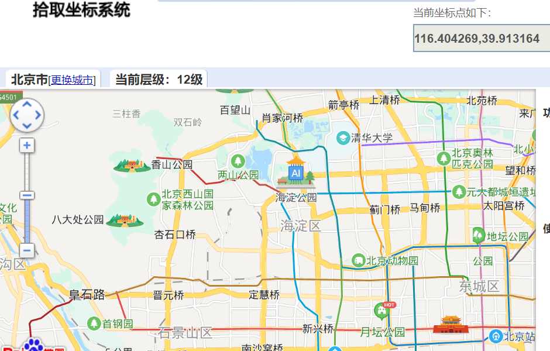
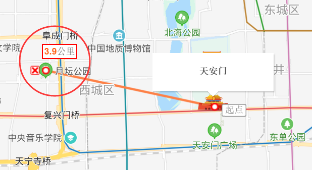

# 20 查询附近的人——GEO

受过高等教育的我们都知道，我们所处的任何位置都可以用经度和纬度来标识，经度的范围 -180 到 180，纬度的范围为 -90 到 90。纬度以赤道为界，赤道以南为负数，赤道以北为正数；经度以本初子午线（英国格林尼治天文台）为界，东边为正数，西边为负数。

Redis 在 3.2 版本中增加了 GEO 类型用于存储和查询地理位置，关于 GEO 的命令不多，主要包含以下 6 个：

1. geoadd：添加地理位置
1. geopos：查询位置信息
1. geodist：距离统计
1. georadius：查询某位置内的其他成员信息
1. geohash：查询位置的哈希值
1. zrem：删除地理位置

下面我们分别来看这些命令的使用。

### 基础使用

#### **添加地理位置**

我们先用百度地图提供的经纬度查询工具，地址：

> [http://api.map.baidu.com/lbsapi/getpoint/index.html](https://api.map.baidu.com/lbsapi/getpoint/index.html)

如下图所示：



找了以下 4 个地点，添加到 Redis 中：

1. 天安门：116.404269,39.913164
1. 月坛公园：116.36,39.922461
1. 北京欢乐谷：116.499705,39.874635
1. 香山公园：116.193275,39.996348

代码如下：

```shell
127.0.0.1:6379> geoadd site 116.404269 39.913164 tianan
(integer) 1
127.0.0.1:6379> geoadd site 116.36 39.922461 yuetan
(integer) 1
127.0.0.1:6379> geoadd site 116.499705 39.874635 huanle
(integer) 1
127.0.0.1:6379> geoadd site 116.193275 39.996348 xiangshan
(integer) 1
```

相关语法：

```plaintext
geoadd key longitude latitude member [longitude latitude member ...]
```

重点参数说明如下：

- longitude 表示经度
- latitude 表示纬度
- member 是为此经纬度起的名字

此命令支持一次添加一个或多个位置信息。

#### **查询位置信息** 

```shell
127.0.0.1:6379> geopos site tianan

1. 1. "116.40541702508926392"

   1. "39.91316289865137179"
```

相关语法：

```plaintext
geopos key member \[member ...\]
```

此命令支持查看一个或多个位置信息。
#### **距离统计** 

```shell
127.0.0.1:6379> geodist site tianan yuetan km

"3.9153"
```

可以看出天安门距离月坛公园的直线距离大概是 3.9 km，我们打开地图使用工具测试一下咱们的统计结果是否准确，如下图所示：

可以看出 Redis 的统计和使用地图工具统计的距离是完全吻合的。

> 注意：此命令统计的距离为两个位置的直线距离。
> 相关语法：

```plaintext
geodist key member1 member2 [unit]
```

unit 参数表示统计单位，它可以设置以下值：

- m：以米为单位，默认单位；
- km：以千米为单位；
- mi：以英里为单位；
- ft：以英尺为单位。

#### **查询某位置内的其他成员信息** 

```shell
127.0.0.1:6379> georadius site 116.405419 39.913164 5 km

1. "tianan"
1. "yuetan"
```

此命令的意思是查询天安门（116.405419,39.913164）附近 5 公里范围内的成员列表。

相关语法：

```plaintext
georadius key longitude latitude radius m|km|ft|mi \[WITHCOORD\] \[WITHDIST\] \[WITHHASH\] \[COUNT count\] \[ASC|DESC\]
```

可选参数说明如下。 **1. WITHCOORD** 说明：返回满足条件位置的经纬度信息。

示例代码：

```shell
127.0.0.1:6379> georadius site 116.405419 39.913164 5 km withcoord
1) 1) "tianan"
   2) 1) "116.40426903963088989"
      2) "39.91316289865137179"
2) 1) "yuetan"
   2) 1) "116.36000186204910278"
      2) "39.92246025586381819"
```

**2. WITHDIST** 说明：返回满足条件位置与查询位置的直线距离。

示例代码：

```shell
127.0.0.1:6379> georadius site 116.405419 39.913164 5 km withdist
1) 1) "tianan"
   2) "0.0981"
2) 1) "yuetan"
   2) "4.0100"
```

**3. WITHHASH** 说明：返回满足条件位置的哈希信息。

示例代码：

```shell
127.0.0.1:6379> georadius site 116.405419 39.913164 5 km withhash
1) 1) "tianan"
   2) (integer) 4069885552230465
2) 1) "yuetan"
   2) (integer) 4069879797297521
```

**4. COUNT count** 说明：指定返回满足条件位置的个数。

例如，指定返回一条满足条件的信息，代码如下：

```shell
127.0.0.1:6379> georadius site 116.405419 39.913164 5 km count 1
1) "tianan"
```

**5. ASC|DESC** 说明：从近到远|从远到近排序返回。

示例代码：

```shell
127.0.0.1:6379> georadius site 116.405419 39.913164 5 km desc
1) "yuetan"
2) "tianan"
127.0.0.1:6379> georadius site 116.405419 39.913164 5 km asc
1) "tianan"
2) "yuetan"
```

当然以上这些可选参数也可以一起使用，例如以下代码：

```shell
127.0.0.1:6379> georadius site 116.405419 39.913164 5 km withdist desc
1) 1) "yuetan"
   2) "4.0100"
2) 1) "tianan"
   2) "0.0981"
```

**5. 查询哈希值** 

```shell
127.0.0.1:6379> geohash site tianan
1) "wx4g0cgp000"
```

相关语法：

```plaintext
geohash key member [member ...]
```

此命令支持查询一个或多个地址的哈希值。 **6. 删除地理位置**

```shell
127.0.0.1:6379> zrem site xiaoming
(integer) 1
```

相关语法：

```plaintext
zrem key member [member ...]
```

此命令支持删除一个或多个位置信息。

### 代码实战

下面我们用 Java 代码，来实现查询附近的人，完整代码如下：

```java
import redis.clients.jedis.GeoCoordinate;
import redis.clients.jedis.GeoRadiusResponse;
import redis.clients.jedis.GeoUnit;
import redis.clients.jedis.Jedis;
import java.util.HashMap;
import java.util.List;
import java.util.Map;
public class GeoHashExample {
    public static void main(String[] args) {
        Jedis jedis = new Jedis("127.0.0.1", 6379);
        Map<String, GeoCoordinate> map = new HashMap<>();
        // 添加小明的位置
        map.put("xiaoming", new GeoCoordinate(116.404269, 39.913164));
        // 添加小红的位置
        map.put("xiaohong", new GeoCoordinate(116.36, 39.922461));
        // 添加小美的位置
        map.put("xiaomei", new GeoCoordinate(116.499705, 39.874635));
        // 添加小二
        map.put("xiaoer", new GeoCoordinate(116.193275, 39.996348));
        jedis.geoadd("person", map);
        // 查询小明和小红的直线距离
        System.out.println("小明和小红相距：" + jedis.geodist("person", "xiaoming",
                "xiaohong", GeoUnit.KM) + " KM");
        // 查询小明附近 5 公里的人
        List<GeoRadiusResponse> res = jedis.georadiusByMemberReadonly("person", "xiaoming",
                5, GeoUnit.KM);
        for (int i = 1; i < res.size(); i++) {
            System.out.println("小明附近的人：" + res.get(i).getMemberByString());
        }
    }
}
```

以上程序执行的结果如下：

```plaintext
小明和小红相距：3.9153 KM
小明附近的人：xiaohong
```

### 应用场景

Redis 中的 GEO 经典使用场景如下：

1. 查询附近的人、附近的地点等；
1. 计算相关的距离信息。

### 小结

GEO 是 Redis 3.2 版本中新增的功能，只有升级到 3.2+ 才能使用，GEO 本质上是基于 ZSet 实现的，这点在 Redis 源码找到相关信息，我们可以 GEO 使用实现查找附近的人或者附近的地点，还可以用它来计算两个位置相隔的直线距离。
