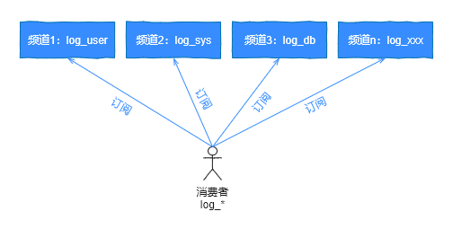

# 24 消息队列——发布订阅模式

在 Redis 中提供了专门的类型：Publisher（发布者）和 Subscriber（订阅者）来实现消息队列。

在文章开始之前，先来介绍消息队列中有几个基础概念，以便大家更好的理解本文的内容。

首先，发布消息的叫做发布方或发布者，也就是消息的生产者，而接收消息的叫做消息的订阅方或订阅者，也就是消费者，用来处理生产者发布的消息。


除了发布和和订阅者，在消息队列中还有一个重要的概念：channel 意为频道或通道，可以理解为某个消息队列的名称，首先消费者先要订阅某个 channel，然后当生产者把消息发送到这个 channel 中时，消费者就可以正常接收到消息了，如下图所示：


### 普通订阅与发布

消息队列有两个重要的角色，一个是发送者，另一个就是订阅者，对应的命令如下：

- 发布消息：publish channel "message"
- 订阅消息：subscribe channel

下面我们来看具体的命令实现。

#### **订阅消息** 

```shell
127.0.0.1:6379> subscribe channel #订阅消息channel

Reading messages...

1. "subscribe"

1. "channel"

1. (integer) 1
```

相关语法：

```plaintext
subscribe channel \[channel ...\]
```

此命令支持订阅一个或多个频道的命令，也就是说一个订阅者可以订阅多个频道。例如，某个客户端订阅了两个频道 channel 和 channel2，当两个发布者分别推送消息后，订阅者的信息输出如下：

```shell
127.0.0.1:6379> subscribe channel channel2 #订阅 channel 和 channel2

Reading messages... (press Ctrl-C to quit)

1) "subscribe"

2) "channel"

3) (integer) 1

1) "subscribe"

2) "channel2"

3) (integer) 2

1) "message"

2) "channel" # 收到 channel 消息

3) "message 1."

1) "message"

2) "channel2" # 收到 channel2 消息

3) "message 2."
```

可以看出此订阅者可以收到来自两个频道的消息推送。

#### **发送消息**

```shell
127.0.0.1:6379> publish channel "hello,redis." #发布消息

(integer) 1
```

相关语法：

```plaintext
publish channel message
```

最后的返回值表示成功发送给几个订阅方，1 表示成功发给了一个订阅者，这个数字可以是 0~n，这是由订阅者的数量决定的。
例如，当有两个订阅者时，推送的结果为 2，如下代码所示。
订阅者一：

```shell
127.0.0.1:6379> subscribe channel

Reading messages... (press Ctrl-C to quit)

1) "subscribe"

2) "channel"

3) (integer) 1
```

订阅者二：

```shell
127.0.0.1:6379> subscribe channel

Reading messages... (press Ctrl-C to quit)

1) "subscribe"

2) "channel"

3) (integer) 1
```

发送消息：

```shell
127.0.0.1:6379> publish channel "message"

(integer) 2
```

可以看出，此消息已成功发给两个订阅者，结果也变成 2 了。

### 主题订阅

上面介绍了普通的订阅与发布模式，但如果我要订阅某一个类型的消息就不适用了，例如我要订阅日志类的消息队列，它们的命名都是 logXXX，这个时候就需要使用 Redis 提供的另一个功能 Pattern Subscribe 主题订阅，这种方式可以使用 `*` 来匹配多个频道，如下图所示：

主题模式的具体实现代码如下，订阅者：

```shell
127.0.0.1:6379> psubscribe log_* #主题订阅 log_*

1) "psubscribe"

2) "log_*"

3) (integer) 1

1) "pmessage"

2) "log_*"

3) "log_user" #接收到频道 log_user 的消息推送

4) "user message."

1) "pmessage"

2) "log_*"

3) "log_sys" #接收到频道 log_sys 的消息推送

4) "sys message."

1) "pmessage"

2) "log_*"

3) "log_db" #接收到频道 log_db 的消息推送

4) "db message"
```

从上面的运行结果，可以看出使用命令 `psubscribe log_*` 可以接收到所有频道包含 log_XXX 的消息。
相关语法：

```plaintext
psubscribe pattern [pattern ...]
```

生产者的代码如下：

```shell
127.0.0.1:6379> publish log_user "user message."

(integer) 1

127.0.0.1:6379> publish log_sys "sys message."

(integer) 1

127.0.0.1:6379> publish log_db "db message"

(integer) 1
```

### 代码实战

下面我们使用 Jedis 实现普通的发布订阅模式和主题订阅的功能。

#### **普通模式**

消费者代码如下：

```java
/**

 * 消费者

 */

public static void consumer() {

    Jedis jedis = new Jedis("127.0.0.1", 6379);

    // 接收并处理消息

    jedis.subscribe(new JedisPubSub() {

        @Override

        public void onMessage(String channel, String message) {

            // 接收消息，业务处理

            System.out.println("频道 " + channel + " 收到消息：" + message);

        }

    }, "channel");

}
```

生产者代码如下：

```java
/**

 * 生产者

 */

public static void producer() {

    Jedis jedis = new Jedis("127.0.0.1", 6379);

    // 推送消息

    jedis.publish("channel", "Hello, channel.");

}
```

发布者和订阅者模式运行：

```java
public static void main(String[] args) throws InterruptedException {

    // 创建一个新线程作为消费者

    new Thread(() -> consumer()).start();

    // 暂停 0.5s 等待消费者初始化

    Thread.sleep(500);

    // 生产者发送消息

    producer();

}
```

以上代码运行结果如下：

```plaintext
频道 channel 收到消息：Hello, channel.
```

#### **主题订阅模式**

主题订阅模式的生产者的代码是一样，只有消费者的代码是不同的，如下所示：

```java
/**

 * 主题订阅

 */

public static void pConsumer() {

    Jedis jedis = new Jedis("127.0.0.1", 6379);

    // 主题订阅

    jedis.psubscribe(new JedisPubSub() {

        @Override

        public void onPMessage(String pattern, String channel, String message) {

            // 接收消息，业务处理

            System.out.println(pattern + " 主题 | 频道 " + channel + " 收到消息：" + message);

        }

    }, "channel*");

}
```

主题模式运行代码如下：

```java
public static void main(String[] args) throws InterruptedException {

    // 主题订阅

    new Thread(() -> pConsumer()).start();

    // 暂停 0.5s 等待消费者初始化

    Thread.sleep(500);

    // 生产者发送消息

    producer();

}
```

以上代码运行结果如下：

```plaintext
channel* 主题 | 频道 channel 收到消息：Hello, channel.
```

### 注意事项

发布订阅模式存在以下两个缺点：

1. 无法持久化保存消息，如果 Redis 服务器宕机或重启，那么所有的消息将会丢失；
1. 发布订阅模式是“发后既忘”的工作模式，如果有订阅者离线重连之后不能消费之前的历史消息。

然而这些缺点在 Redis 5.0 添加了 Stream 类型之后会被彻底的解决。

除了以上缺点外，发布订阅模式还有另一个需要注意问题：当消费端有一定的消息积压时，也就是生产者发送的消息，消费者消费不过来时，如果超过 32M 或者是 60s 内持续保持在 8M 以上，消费端会被强行断开，这个参数是在配置文件中设置的，默认值是 `client-output-buffer-limit pubsub 32mb 8mb 60`。

### 小结

本文介绍了消息队列的几个名词，生产者、消费者对应的就是消息的发送者和接收者，也介绍了发布订阅模式的三个命令：

- subscribe channel 普通订阅
- publish channel message 消息推送
- psubscribe pattern 主题订阅

使用它们之后就可以完成单个频道和多个频道的消息收发，但发送与订阅模式也有一些缺点，比如“发后既忘”和不能持久化等问题，然而这些问题会等到 Stream 类型的出现而得到解决，关于更多 Stream 的内容后面文章会详细介绍。
