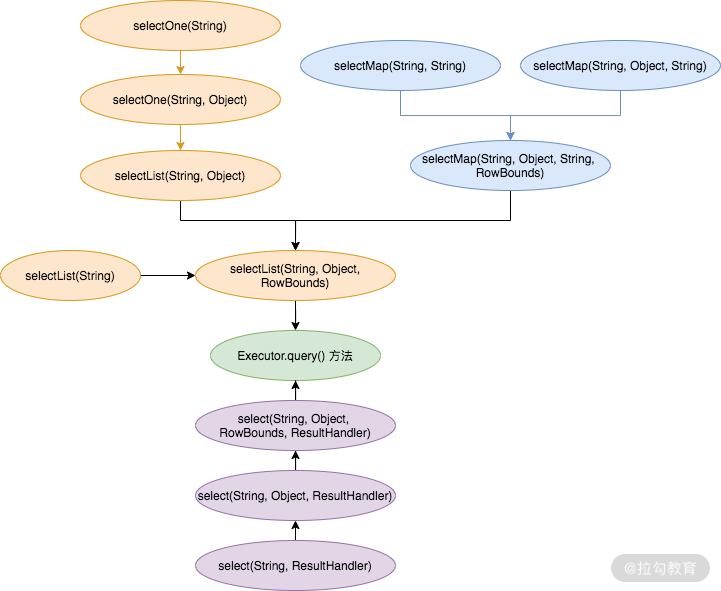

# 19 深入 MyBatis 内核与业务逻辑的桥梁——接口层

在前面的课时中，我们已经详细介绍了 MyBatis 的内核，其中涉及了 MyBatis 的初始化、SQL 参数的绑定、SQL 语句的执行、各类结果集的映射等，MyBatis 为了简化业务代码调用内核功能的成本，就为我们封装了一个接口层。

这一讲我们就来重点看一下 MyBatis 接口层的实现以及其中涉及的设计模式。

### 策略模式

在 MyBatis 接口层中用到了经典设计模式中的策略模式，所以这里我们就先来介绍一下策略模式相关的知识点。

我们在编写业务逻辑的时候，可能有很多方式都可以实现某个具体的功能。例如，按照购买次数对一个用户购买的全部商品进行排序，从而粗略地得知该用户复购率最高的商品，我们可以使用多种排序算法来实现这个功能，例如，归并排序、插入排序、选择排序等。在不同的场景中，我们需要根据不同的输入条件、数据量以及运行时环境，选择不同的排序算法来完成这一个功能。很多同学可能在实现这个逻辑的时候，会用 if...else... 的硬编码方式来选择不同的算法，但这显然是不符合“开放-封闭”原则的，当需要添加新的算法时，只能修改这个 if...else...代码块，添加新的分支，这就破坏了代码原有的稳定性。

在策略模式中，我们会 **将每个算法单独封装成不同的算法实现类** （这些算法实现类都实现了相同的接口），每个算法实现类就可以被认为是一种策略实现，我们只需选择不同的策略实现来解决业务问题即可，这样每种算法相对独立，算法内的变化边界也就明确了，新增或减少算法实现也不会影响其他算法。

如下是策略模式的核心类图，其中 StrategyUser 是算法的调用方，维护了一个 Strategy 对象的引用，用来选择具体的算法实现。


策略模式的核心类图

### SqlSession

**SqlSession是MyBatis对外提供的一个 API 接口，整个MyBatis 接口层也是围绕 SqlSession接口展开的** ，SqlSession 接口中定义了下面几类方法。

- select\*() 方法：用来执行查询操作的方法，SqlSession 会将结果集映射成不同类型的结果对象，例如，selectOne() 方法返回单个 Java 对象，selectList()、selectMap() 方法返回集合对象。
- insert()、update()、delete() 方法：用来执行 DML 语句。
- commit()、rollback() 方法：用来控制事务。
- getMapper()、getConnection()、getConfiguration() 方法：分别用来获取接口对应的 Mapper 对象、底层的数据库连接和全局的 Configuration 配置对象。

如下图所示，MyBatis 提供了两个 SqlSession接口的实现类，同时提供了SqlSessionFactory 工厂类来创建 SqlSession 对象。


SqlSessionFactory 接口与 SqlSession 接口的实现类

默认情况下， **我们在使用 MyBatis 的时候用的都是 DefaultSqlSession 这个默认的 SqlSession 实现** 。DefaultSqlSession 中维护了一个 Executor 对象，通过它来完成数据库操作以及事务管理。DefaultSqlSession 在选择使用哪种 Executor 实现的时候，使用到了策略模式：DefaultSqlSession 扮演了策略模式中的 StrategyUser 角色，Executor 接口扮演的是 Strategy 角色，Executor 接口的不同实现则对应 StrategyImpl 的角色。

另外，DefaultSqlSession 还维护了一个 dirty 字段来标识缓存中是否有脏数据，它在执行 update() 方法修改数据时会被设置为 true，并在后续参与事务控制，决定当前事务是否需要提交或回滚。

下面接着来看 DefaultSqlSession 对 SqlSession 接口的实现。DefaultSqlSession 为每一类数据操作方法提供了多个重载，尤其是 select\*() 操作，而且这些 select\*() 方法的重载之间有相互依赖的关系，如下图所示：



select() 方法之间的调用关系

通过上图我们可以清晰地看到，所有 select\*() 方法最终都是通过调用 Executor.query() 方法执行 select 语句、完成数据查询操作的，之所以有不同的 select\*() 重载，主要是对结果对象的需求不同。例如，我们使用 selectList() 重载时，希望返回的结果对象是一个 List集合；使用 selectMap() 重载时，希望查询到的结果集被转换成 Map 类型集合返回；至于select() 重载，则会由 ResultHandler 来处理结果对象。

DefaultSqlSession 中的 insert()、update()、delete() 等修改数据的方法以及 commit()、rollback() 等事务管理的方法，同样也有多个重载，它们最终也是委托到Executor 中的同名方法，完成数据修改操作以及事务管理操作的。

在事务管理的相关方法中，DefaultSqlSession 会根据 dirty 字段以及 autoCommit 字段（是否自动提交事务）、用户传入的 force参数（是否强制提交事务）共同决定是否提交/回滚事务，这部分逻辑位于 isCommitOrRollbackRequired() 方法中，具体实现如下：

```plaintext
private boolean isCommitOrRollbackRequired(boolean force) {
    return (!autoCommit && dirty) || force;
}
```

### DefaultSqlSessionFactory

**DefaultSqlSessionFactory 是MyBatis中用来创建DefaultSqlSession 的具体工厂实现** 。通过 DefaultSqlSessionFactory 工厂类，我们可以有两种方式拿到 DefaultSqlSession对象。

第一种方式是通过数据源获取数据库连接，然后在其基础上创建 DefaultSqlSession 对象，其核心实现位于 openSessionFromDataSource() 方法，具体实现如下：

```java
// 获取Environment对象
final Environment environment = configuration.getEnvironment();
// 获取TransactionFactory对象
final TransactionFactory transactionFactory = getTransactionFactoryFromEnvironment(environment);
// 从数据源中创建Transaction
tx = transactionFactory.newTransaction(environment.getDataSource(), level, autoCommit);
// 根据配置创建Executor对象
final Executor executor = configuration.newExecutor(tx, execType);
// 在Executor的基础上创建DefaultSqlSession对象
return new DefaultSqlSession(configuration, executor, autoCommit);
```

第二种方式是上层调用方直接提供数据库连接，并在该数据库连接之上创建 DefaultSqlSession 对象，这种创建方式的核心逻辑位于 openSessionFromConnection() 方法中，核心实现如下：

```java
boolean autoCommit;
try {
    // 获取事务提交方式
    autoCommit = connection.getAutoCommit();
} catch (SQLException e) {
    autoCommit = true;
}
// 获取Environment对象、TransactionFactory
final Environment environment = configuration.getEnvironment();
final TransactionFactory transactionFactory = getTransactionFactoryFromEnvironment(environment);
// 通过Connection对象创建Transaction
final Transaction tx = transactionFactory.newTransaction(connection);
// 创建Executor对象
final Executor executor = configuration.newExecutor(tx, execType);
// 创建DefaultSqlSession对象
return new DefaultSqlSession(configuration, executor, autoCommit);
```

### SqlSessionManager

通过前面的 SqlSession 继承关系图我们可以看到，SqlSessionManager 同时实现了 SqlSession 和 SqlSessionFactory 两个接口，也就是说，它 **同时具备操作数据库的能力和创建SqlSession的能力** 。

首先来看 SqlSessionManager **创建SqlSession的实现** 。它与 DefaultSqlSessionFactory 的主要区别是：DefaultSqlSessionFactory 在一个线程多次获取 SqlSession 的时候，都会创建不同的 SqlSession对象；SqlSessionManager 则有 **两种模式** ，一种模式与 DefaultSqlSessionFactory 相同，另一种模式是 SqlSessionManager 在内部维护了一个 ThreadLocal 类型的字段（localSqlSession）来记录与当前线程绑定的 SqlSession 对象，同一线程从 SqlSessionManager 中获取的 SqlSession 对象始终是同一个，这样就减少了创建 SqlSession 对象的开销。

无论哪种模式，SqlSessionManager 都可以看作是 SqlSessionFactory 的装饰器，我们可以在 SqlSessionManager 的构造方法中看到，其中会传入一个 SqlSessionFactory 对象。

如果使用第一种模式，我们可以直接调用 SqlSessionManager.openSession() 方法，其底层直接调用被装饰的 SqlSessionFactory 对象创建 SqlSession 对象并返回。如果使用第二种模式，则需要调用 startManagedSession() 方法为当前线程绑定 SqlSession 对象，这里的 SqlSession 对象也是由被装饰的SqlSessionFactory 创建的，该模式的核心实现位于 startManagedSession() 方法中，具体实现如下：

```java
public void startManagedSession() {
    // 调用底层被装饰的SqlSessionFactory创建SqlSession对象，并绑定到localSqlSession字段中
    localSqlSession.set(openSession());
}
```

与当前线程绑定完成之后，我们就可以 **通过SqlSessionManager实现的SqlSession接口方法进行数据库操作** 了，这些数据操作底层都是调用 sqlSessionProxy 这个 SqlSession 代理实现的。

SqlSessionManager 中的 sqlSessionProxy 字段指向了一个通过 JDK 动态代理创建的代理类，其中使用的 InvocationHandler 实现是 SqlSessionManager 的内部类 SqlSessionInterceptor。SqlSessionInterceptor 在成功拦截目标方法之后，会首先通过 localSqlSession 字段检查当前线程是否已经绑定了 SqlSession，如果绑定了，则直接使用绑定的 SqlSession；如果没有绑定，则通过 openSession() 方法创建新 SqlSession 完成数据库操作。具体实现如下：

```plaintext
public Object invoke(Object proxy, Method method, Object[] args) throws Throwable {
    // 尝试从localSqlSession变量中获取当前线程绑定的SqlSession对象
    final SqlSession sqlSession = SqlSessionManager.this.localSqlSession.get();
    if (sqlSession != null) {
        try {
            // 当前线程已经绑定了SqlSession，直接使用即可
            return method.invoke(sqlSession, args);
        } catch (Throwable t) {
            throw ExceptionUtil.unwrapThrowable(t);
        }
    } else {
        // 通过openSession()方法创建新SqlSession对象
        try (SqlSession autoSqlSession = openSession()) {
            try {
                // 通过新建的SqlSession对象完成数据库操作
                final Object result = method.invoke(autoSqlSession, args);
                autoSqlSession.commit();
                return result;
            } catch (Throwable t) {
                autoSqlSession.rollback();
                throw ExceptionUtil.unwrapThrowable(t);
            }
        }
    }
}
```

SqlSessionManager中的 select\*()、insert()、update() 等数据操作都依赖于 sqlSessionProxy 代理对象，而 commit()、rollback()、close() 方法等事务相关的操作，都是直接通过 localSqlSession 字段判断当前线程使用哪个 SqlSession。这里以 commit() 方法简单说明一下：

```java
public void commit() {
  // 获取当前线程绑定的SqlSession对象
  final SqlSession sqlSession = localSqlSession.get();
  if (sqlSession == null) { // 如果当前未绑定SqlSession对象，则不能用SqlSessionManager来控制事务
      throw new SqlSessionException("Error:  Cannot commit.  No managed session is started.");
  }
  // 如果当前线程绑定了SqlSession，则可以通过SqlSessionManager来提交事务
  sqlSession.commit();
}
```

### 总结

这一讲我们重点介绍了 MyBatis 中接口层的核心实现。MyBatis 接口层是基于前面课时介绍的核心处理层和基础支撑层对使用方提供的 API 接口，也就是我们在生产中最直接、最常用的接口。

这里我们首先介绍了 MyBatis 接口层使用到的策略模式这一经典设计模式的知识点，然后讲解了 SqlSession 接口的核心定义以及它的默认实现—— DefaultSqlSession，接下来还分析了用于创建 DefaultSqlSession 对象的工厂类——DefaultSqlSessionFactory，最后阐述了同时实现了 SqlSession 接口和 SqlSessionFactory 接口的 SqlSessionManager 实现类的核心原理。
