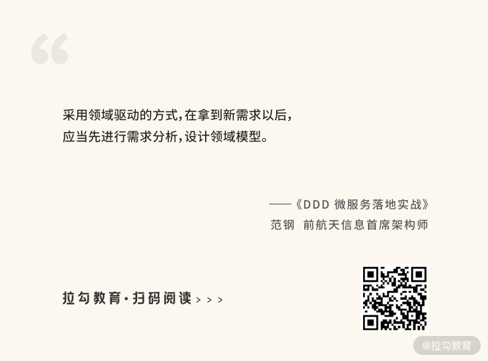
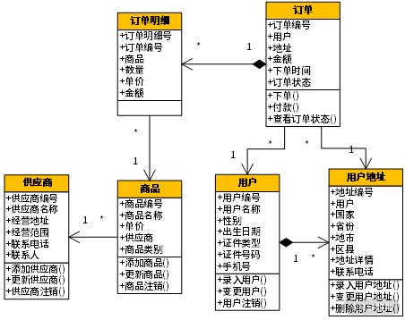
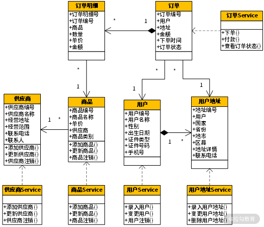
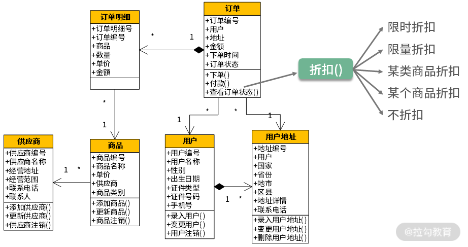
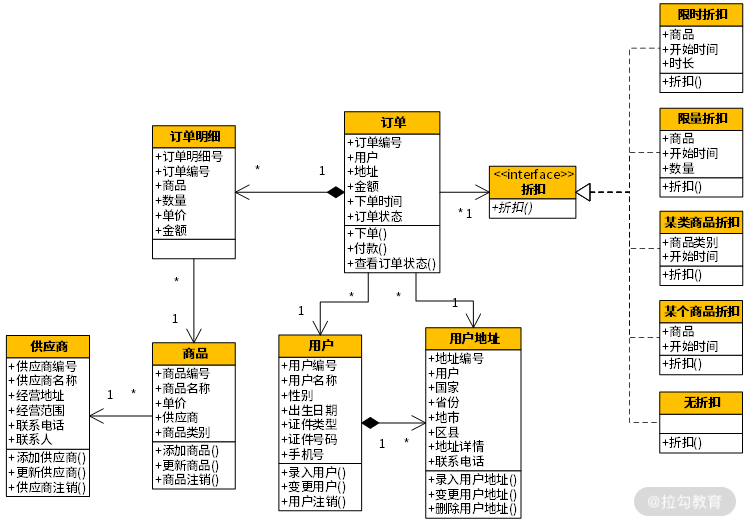
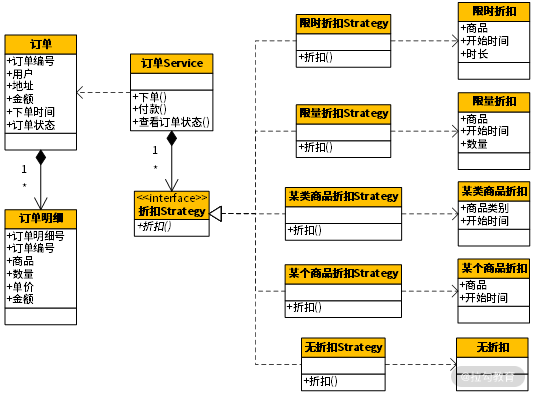
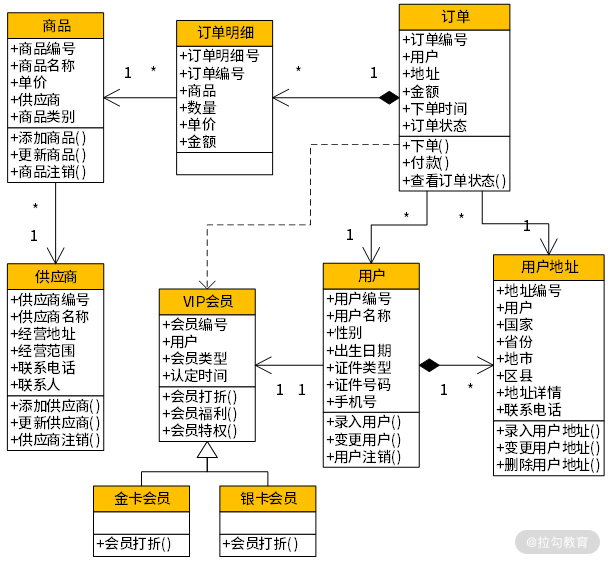
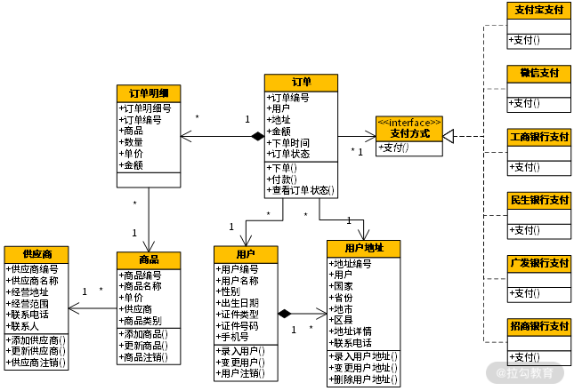
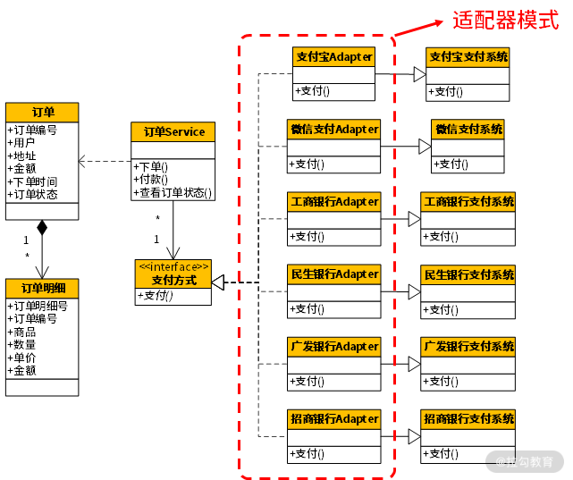

# 02 以电商支付功能为例演练 DDD

上一讲我们花了不少篇幅讲解了软件退化的根源，以及 DDD 如何解决软件退化的问题。现在，我们以电商网站的支付功能为例，来重新演练一下基于 DDD 的软件设计及其变更的过程。

### 运用 DDD 进行软件设计

开发人员在最开始收到的关于用户付款功能的需求描述是这样的：

- 在用户下单以后，经过下单流程进入付款功能；
- 通过用户档案获得用户名称、地址等信息；
- 记录商品及其数量，并汇总付款金额；
- 保存订单；
- 通过远程调用支付接口进行支付。

以往当拿到这个需求时，开发人员往往草草设计以后就开始编码，设计质量也就不高。

而 **采用领域驱动的方式，在拿到新需求以后，应当先进行需求分析，设计领域模型。** 按照以上业务场景，可以分析出：

- 该场景中有“订单”，每个订单都对应一个用户；
- 一个用户可以有多个用户地址，但每个订单只能有一个用户地址；
- 此外，一个订单对应多个订单明细，每个订单明细对应一个商品，每个商品对应一个供应商。

最后，我们对订单可以进行“下单”“付款”“查看订单状态”等操作。因此形成了以下领域模型图：

有了这样的领域模型，就可以通过该模型进行以下程序设计：

通过领域模型的指导，将“订单”分为订单 Service 与值对象，将“用户”分为用户 Service 与值对象，将“商品”分为商品 Service 与值对象……然后，在此基础上实现各自的方法。

### 商品折扣的需求变更

当电商网站的付款功能按照领域模型完成了第一个版本的设计后，很快就迎来了 **第一次需求变更，即增加折扣功能** ，并且该折扣功能分为限时折扣、限量折扣、某类商品的折扣、某个商品的折扣与不折扣。当我们拿到这个需求时应当怎样设计呢？很显然，在 payoff() 方法中去插入 if 语句是不 OK 的。这时，按照领域驱动设计的思想，应当将需求变更还原到领域模型中进行分析，进而根据领域模型背后的真实世界进行变更。

这是上一个版本的领域模型，现在我们要在这个模型的基础上增加折扣功能，并且还要分为限时折扣、限量折扣、某类商品的折扣等不同类型。这时，我们应当怎么分析设计呢？

**首先要分析付款与折扣的关系。** 付款与折扣是什么关系呢？你可能会认为折扣是在付款的过程中进行的折扣，因此就应当将折扣写到付款中。这样思考对吗？我们应当基于什么样的思想与原则来设计呢？这时，另外一个重量级的设计原则应该出场了，那就是“单一职责原则”。 **单一职责原则** ：软件系统中的每个元素只完成自己职责范围内的事，而将其他的事交给别人去做，我只是去调用。

单一职责原则是软件设计中一个非常重要的原则，但如何正确地理解它成为一个非常关键的问题。在这句话中，准确理解的关键就在于“ **职责** ”二字，即自己职责的范围到底在哪里。以往，我们错误地理解这个“职责”就是做某一个事，与这个事情相关的所有事情都是它的职责，正因为这个错误的理解，带来了许多错误的设计，而将折扣写到付款功能中。那么，怎样才是对“职责”正确的理解呢？

“一个职责就是软件变化的一个原因”是著名的软件大师 Bob 大叔在他的《敏捷软件开发：原则、模式与实践》中的表述。但这个表述过于精简，很难深刻地理解其中的内涵，从而不能有效地提高我们的设计质量。这里我好好解读一下这句话。

先思考一下什么是高质量的代码。你可能立即会想到“低耦合、高内聚”，以及各种设计原则，但这些评价标准都太“虚”。 **最直接、最落地的评价标准就是，当用户提出一个需求变更时，为了实现这个变更而修改软件的成本越低，那么软件的设计质量就越高。** 当来了一个需求变更时，怎样才能让修改软件的成本降低呢？如果为了实现这个需求，需要修改 3 个模块的代码，完后这 3 个模块都需要测试，其维护成本必然是“高”。那么怎样才能降到最低呢？维护 0 个模块的代码？那显然是不可能的，因此最现实的方案就是只修改 1 个模块，维护成本最低。

那么，怎样才能在每次变更的时候都只修改一个模块就能实现新需求呢？那就需要我们在平时就不断地整理代码，将那些因同一个原因而变更的代码都放在一起，而将因不同原因而变更的代码分开放，放在不同的模块、不同的类中。这样，当因为这个原因而需要修改代码时，需要修改的代码都在这个模块、这个类中，修改范围就缩小了，维护成本降低了，自然设计质量就提高了。 **总之，单一职责原则要求我们在维护软件的过程中需要不断地进行整理，将软件变化同一个原因的代码放在一起，将软件变化不同原因的代码分开放。** 按照这样的设计原则，回到前面那个案例中，那么应当怎样去分析“付款”与“折扣”之间的关系呢？只需要回答两个问题：

- 当“付款”发生变更时，“折扣”是不是一定要变？
- 当“折扣”发生变更时，“付款”是不是一定要变？

当这两个问题的答案是否定时，就说明“付款”与“折扣”是软件变化的两个不同的原因，那么把它们放在一起，放在同一个类、同一个方法中，合适吗？不合适，就应当将“折扣”从“付款”中提取出来，单独放在一个类中。

同样的道理：

- 当“限时折扣”发生变更的时候，“限量折扣”是不是一定要变？
- 当“限量折扣”发生变更的时候，“某类商品的折扣”是不是一定要变？
- ……

最后发现，不同类型的折扣也是软件变化不同的原因。将它们放在同一个类、同一个方法中，合适吗？通过以上分析，我们做出了如下设计：

在该设计中，将折扣功能从付款功能中独立出去，做出了一个接口，然后以此为基础设计了各种类型的折扣实现类。这样的设计，当付款功能发生变更时不会影响折扣，而折扣发生变更的时候不会影响付款。同样，当“限时折扣”发生变更时只与“限时折扣”有关，“限量折扣”发生变更时也只与“限量折扣”有关，与其他折扣类型无关。变更的范围缩小了，维护成本就降低了，设计质量提高了。这样的设计就是“单一职责原则”的真谛。

接着，在这个版本的领域模型的基础上进行程序设计，在设计时还可以加入一些设计模式的内容，因此我们进行了如下的设计：

显然，在该设计中加入了“策略模式”的内容，将折扣功能做成了一个折扣策略接口与各种折扣策略的实现类。当哪个折扣类型发生变更时就修改哪个折扣策略实现类；当要增加新的类型的折扣时就再写一个折扣策略实现类，设计质量得到了提高。

### VIP 会员的需求变更

在第一次变更的基础上，很快迎来了第二次变更，这次是要 **增加 VIP 会员** ，业务需求如下。

增加 VIP 会员功能：

- 对不同类型的 VIP 会员（金卡会员、银卡会员）进行不同的折扣；
- 在支付时，为 VIP 会员发放福利（积分、返券等）；
- VIP 会员可以享受某些特权。

我们拿到这样的需求又应当怎样设计呢？同样，先回到领域模型，分析“用户”与“VIP 会员”的关系，“付款”与“VIP 会员”的关系。在分析的时候，还是回答那两个问题。

- “用户”发生变更时，“VIP 会员”是否要变？
- “VIP 会员”发生变更时，“用户”是否要变？

通过分析发现，“用户”与“VIP 会员”是两个完全不同的事物。

- “用户”要做的是用户的注册、变更、注销等操作；
- “VIP 会员”要做的是会员折扣、会员福利与会员特权；
- 而“付款”与“VIP 会员”的关系是在付款的过程中去调用会员折扣、会员福利与会员特权。

通过以上的分析，我们做出了以下版本的领域模型：

**有了这些领域模型的变更，然后就可以以此作为基础，指导后面程序代码的变更了。** ### 支付方式的需求变更

同样，第三次变更是 **增加更多的支付方式** ，我们在领域模型中分析“付款”与“支付方式”之间的关系，发现它们也是软件变化不同的原因。因此，我们果断做出了这样的设计：

而在设计实现时，因为要与各个第三方的支付系统对接，也就是要与外部系统对接。为了使第三方的外部系统的变更对我们的影响最小化，在它们中间果断加入了“适配器模式”，设计如下：

通过加入适配器模式，订单 Service 在进行支付时调用的不再是外部的支付接口，而是“支付方式”接口，与外部系统解耦。只要保证“支付方式”接口是稳定的，那么订单 Service 就是稳定的。比如：

- 当支付宝支付接口发生变更时，影响的只限于支付宝 Adapter；
- 当微信支付接口发生变更时，影响的只限于微信支付 Adapter；
- 当要增加一个新的支付方式时，只需要再写一个新的 Adapter。

**日后不论哪种变更，要修改的代码范围缩小了，维护成本自然降低了，代码质量就提高了。**

### 总结

这一讲通过以上的过程，我们演练了如何运用 DDD 进行软件的设计与变更，以及在设计与变更的过程中如何分析思考、如何评估代码、如何实现高质量。后面，我们将演练如何将领域模型的设计进一步落实到软件系统的微服务设计与数据库设计。
