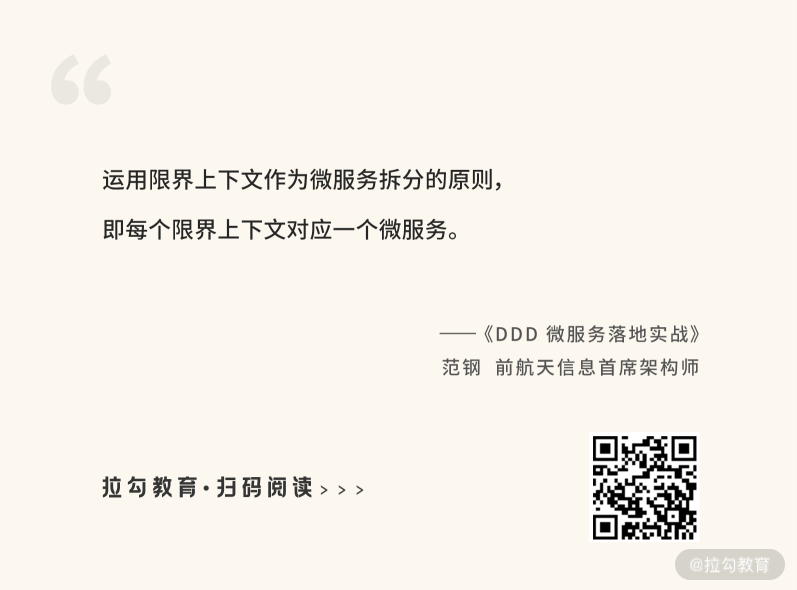
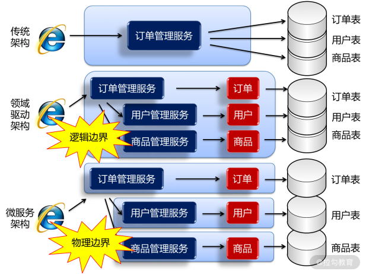
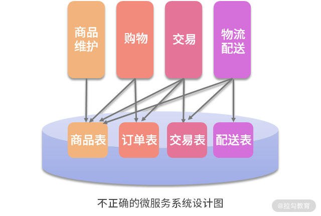

# 06 限界上下文：冲破微服务设计困局的利器

上一讲我们以用户下单这个场景，讲解了领域驱动设计的建模、分析与设计的过程，然而，站在更大的电商网站的角度，用户下单只是其中一个很小的场景。

那么，如果要对整个电商网站进行领域驱动设计，应当怎么做呢？它包含那么多场景，每个场景都要包含那么多的领域对象，进而会形成很多的领域对象，并且每个领域对象之间还有那么多复杂的关联关系。这时候，怎样通过领域驱动来设计这个系统呢？怎么去绘制领域模型呢？是绘制一张密密麻麻的大图，还是绘制成一张一张的小图呢？学完本讲后，将能解决这些问题。

## 问题域和限界上下文

假如将整个系统中那么多的场景、涉及的那么多领域对象，全部绘制在一张大图上，可以想象这张大图需要绘制出密密麻麻的领域对象，以及它们之间纷繁复杂的对象间关系。绘制这样的图，绘制的人非常费劲，看这张图的人也非常费劲，这样的图也不利于我们理清思路、交流思想及提高设计质量。

正确的做法就是 **将整个系统划分成许多相对独立的业务场景**，在一个一个的业务场景中进行领域分析与建模，这样的业务场景称为 **“问题子域”**，简称“子域”。 **领域驱动核心的设计思想，就是将对软件的分析与设计还原到真实世界中**，那么就要先分析和理解真实世界的业务与问题。而真实世界的业务与问题叫作 **“问题域”**，这里面的业务规则与知识叫 **“业务领域知识”**，譬如：

- **电商网站** 的“问题域”是人们如何进行在线购物，购物的流程是怎样的；
- **在线订餐系统** 的“问题域”是人们如何在线订餐，饭店如何在线接单，系统又是如何派送骑士去配送的。

然而，不论是电商网站还是在线购物系统，都有一个非常庞大而复杂的问题域。要一次性分析清楚这个问题域对我们来说是有难度的，因此需要采用 **“分而治之”的策略**，将这个问题域划分成许多个问题子域。比如：

- **电商网站** 包含了用户选购、下单、支付、物流等多个子域；
- **在线订餐系统** 包含了用户下单、饭店接单、骑士派送等子域。

如果某个子域比较复杂，在子域的基础上还可以进一步划分子域。

因此，一个复杂系统的领域驱动设计，就是以子域为中心进行领域建模，绘制出一张一张的领域模型设计，然后以此作为基础指导程序设计。这一张一张的领域模型设计，称为“ **限界上下文** ”（Context Bounds，CB）。

DDD 中限界上下文的设计，很好地体现了高质量软件设计中 **“单一职责原则”** 的要求，即每个限界上下文中实现的都是软件变化同一个原因的业务。比如，“用户下单”这个限界上下文都是实现用户下单的相关业务。这样，当“用户下单”的相关业务发生变更的时候，只与“用户下单”这个限界上下文有关，只需要对它进行修改就行了，与其他限界上下文无关。这样，需求变更的代码 **修改范围缩小了，维护成本也就降低了。** 在用户下单的过程中，对用户信息的读取是否也应该在“用户下单”这个限界上下文中实现呢？答案是否定的，因为读取用户信息不是用户下单的职责，当用户下单业务发生变更的时候，用户信息不一定变；用户信息变更的时候，用户下单也不一定变，它们是软件变化的两个原因。

因此，应当将读取 **用户信息** 的操作交给“ **用户信息管理** ”限界上下文，“用户下单”限界上下文只是对它的接口进行调用。通过这样的划分，实现了 **限界上下文内的高内聚和限界上下文间的低耦合**，可以很好地降低日后代码变更的成本、提高软件设计质量。而限界上下文之间的这种相互关系，称为“ **上下文地图** ”（Context Map）。

## 限界上下文与微服务

**所谓“限界上下文内的高内聚”，也就是每个限界上下文内实现的功能，都是软件变化的同一个原因的代码**。因为这个原因的变化才需要修改这个限界上下文，而不是这个原因的变化就不需要修改这个限界上下文，修改与它无关。正是因为限界上下文有如此好的特性，才使得现在很多微服务团队， **运用限界上下文作为微服务拆分的原则**，即每个限界上下文对应一个微服务

按照这样的原则拆分出来的微服务系统，在今后变更维护时，可以很好地将每次的需求变更，快速落到某个微服务中变更。这样，变更这个微服务就实现了该需求，升级该服务后就可以交付用户使用了。这样的设计，使得越来越多的规划开发团队，今后可以实现 **低成本维护与快速交付**，进而快速适应市场变化而提升企业竞争力。

譬如，在电商网站的购物过程中，购物、下单、支付、物流，都是软件变化不同的原因，因此，按照不同的业务场景划分限界上下文，然后以此拆分微服务。那么，当购物变更时就修改购物微服务，下单变更就修改下单微服务，但它们在业务处理过程中都需要读取商品信息，因此调用“商品管理”微服务来获取商品信息。这样，一旦商品信息发生变更，只与“商品管理”微服务有关，与其他微服务无关，那么维护成本将得到降低，交付速度得到提升。 **所谓“限界上下文间的低耦合”，就是限界上下文通过上下文地图相互调用时，通过接口进行调用**。如下图所示，模块 A 需要调用模块 B，那么它就与模块 B 形成了一种耦合，这时：

- 如果需要复用模块 A，那么所有有模块 A 的地方都必须有模块 B，否则模块 A 就会报错；
- 如果模块 B 还要依赖模块 C，模块 C 还要依赖模块 D，那么所有使用模块 A 的地方都必须有模块 B、C、D，使用模块 A 的成本就会非常高昂。

然而，如果模块 A 不是依赖模块 B，而是依赖接口 B'，那么所有需要模块 A 的地方就不一定需要模块 B；如果模块 F 实现了接口 B'，那么模块 A 调用模块 F 就可以了。这样，调用方和被调用方的耦合就被解开。

在代码实现时，可以 **通过微服务来实现“限界上下文间”的“低耦合”**。比如，“下单”微服务要去调用“支付”微服务。在设计时：

- 首先在“下单”微服务中增加一个“支付”接口，这样在“下单”微服务中所有对支付的调用，都是对该接口的调用；
- 接着，在其他“支付”微服务中实现支付，比如，现在设计了 A、 B 两个“支付”微服务，在系统运行时配置的是 A 服务，那么“下单”微服务调用的就是 A；如果配置的是 B 服务，调用的就是 B。

这样，“下单”微服务与“支付”微服务之间的耦合就被解开，使得系统可以通过修改配置，去应对各种不同的用户环境与需求。

**有了限界上下文的设计，使得系统在应对复杂应用时，设计质量提高、变更成本降低。**

- 过去，每个模块在读取用户信息时，都是直接读取数据库中的用户信息表，那么一旦用户信息表发生变更，各个模块都要变更，变更成本就会越来越高。
- 现在，采用领域驱动设计，读取用户信息的职责交给了“用户管理”限界上下文，其他模块都是调用它的接口，这样，当用户信息表发生变更时，只与“用户管理”限界上下文有关，与其他模块无关，变更维护成本就降低了。通过限界上下文将整个系统按照逻辑进行了划分，但从物理上它们都还是一个项目、运行在一个 JVM 中，这种 **限界上下文只是“逻辑边界”**。
- 今后，将单体应用转型成微服务架构以后，各个限界上下文都是运行在各自不同的微服务中，是不同的项目、不同的 JVM。不仅如此，进行微服务拆分的同时，数据库也进行了拆分，每个微服务都是使用不同的数据库。这样，当各个微服务要访问用户信息时，它们没有访问用户数据库的权限，就只能通过远程接口去调用“用户”微服务开放的相关接口。这时，这种 **限界上下文就真正变成了“物理边界”**，如下图所示：

## 微服务拆分的困局

现如今，许多软件团队都在加入微服务转型的行列，将原有的越来越复杂的单体应用，拆分为一个一个简单明了的微服务，以降低系统微服务的复杂性，这是没有问题的。然而，现在最大的问题是 **微服务应当如何拆分**。

如上图所示，以往许多的系统是这样设计的。现在，如果还按照这样的设计思路简单粗暴地拆分为多个微服务以后，对系统日后的维护将是灾难性的。

- 当多个模块都要读取商品信息表时，是直接通过 JDBC（Java Database Connectivity）去读取这个表。
- 接着，按照这样的思路拆分微服务，多个微服务都要读取商品信息表。
- 这样，一旦商品信息表发生变更，多个微服务都需要变更。不仅多个团队都要为了维护这个需求修改代码，而且他们的微服务需要同时修改、同时发布、同时升级。

如果每次的维护都是这样进行， **不仅微服务的优势不能发挥出来，还会使得维护的成本更高**。如果微服务被设计成这样，还真不如不用微服务。

这里的关键问题在于，当多个微服务都要读取同一个表时，也就意味着同一个软件变化原因（因商品信息而变更）的代码被分散到多个微服务中。这时，当系统因该原因而变化时，代码的修改自然就会分散到多个微服务上。也就是说，以上设计问题的根源 **违反了“单一职责原则”，使微服务的设计不再高内聚**。微服务该怎样设计、怎样拆分？ **关键就在于“小而专”**，这里的“专”就是高内聚。

因此，微服务设计不是简单的拆分，而是对设计提出了更高的要求，即要做到“ **高内聚** ”。只有这样，才能让日后的变更能尽量落到某个微服务上维护，从而降低维护成本。唯有这样才能将微服务的优势发挥出来，才是微服务正确的打开方式。

为了让微服务设计做到高内聚，最佳的实践则是 DDD：

- 先从 DDD 开始 **需求分析、领域建模**，逐渐建立起多个问题子域；
- 再将 **问题子域落实到限界上下文**，它们之间的关联形成上下文地图；
- 最后，各子域落实到微服务中贫血模型或充血模型的设计，从而在微服务之间依据上下文地图形成接口。

唯有这样的设计，才能很好地做到“微服务之间低耦合，微服务之内高内聚”的设计目标。

## 总结

总而言之，微服务设计的困局就是拆分，拆分的核心就是“小而专”“高内聚”。因此，破解微服务困局的关键就是 DDD。有了 DDD，就使得微服务团队在面对软件越来越复杂的业务时，能够分析清楚业务，能够想明白设计，从而提高微服务的设计质量。
